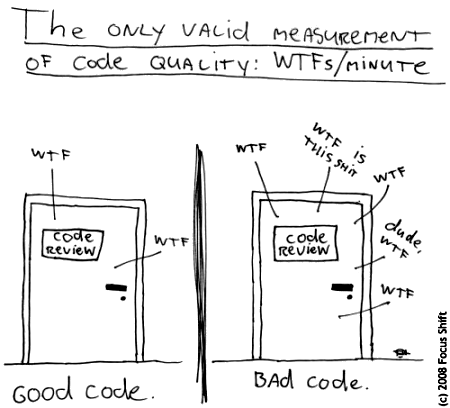

Title: About
Tags: thoughts
Slug: about
Author: Feng Xia
Modified: 2018-10-06 10:40

<figure class="col l6 m6 s12">
  
</figure>

I started PY Consulting in 2015, hoping to advocate the value of POC
(proof-of-concept). I have done quite a few projects, both in my
leisure and as a real product, with satisfactory results measured by a
view point of technology. Yet, I have not found the sweet spot to
convince its business value.

It has been a crusade to preach the important of POC, and why every
project, every business, every application, should have, will have,
and must have. There is no doubt in my mind, and I'm speaking this as
a practitioner, that technologies are so complex these days that
seeing a pretty web UI gives non-programmer an illusion that these can
be had in a matter of days, weeks, if not hours, or even, instantly.

On the one hand, this illusion is true, justified. Toolsets have been
developed in thousands to facilitate numerous path of
implementation. Anything, any use case, one can think of, has a
solution, readily canned solution, out there. How convenient!
Therefore, it is no surprise that business side takes technology _for
granted_ as if it is commodity one buys off the shelf. And indeed the
technologies promote such a perception that not only technology and
its product, but the worker (aka. IT people) are nothing but a product
ready to buy at the expanse of a sum on credit card or payroll &rarr;
just slide, violla, it's done.

But on the other, this is completly untrue. Not only it is not true, I
would even argue that this is exactly the wrong approach, wrong
attitude, wrong perception of technology. What you see on shelf is a
shrink wrapped product implemented by engineers who designed, wrote
code, tested, and delivered, as a canned solution of, some
problem. But it will be completly false to think that by using a
credit card is an easy, quick, taking-a-minute-only to solve your
problem, whatever it is. This isn't a shopping experience like others
you do in life. The gap lies in a hidden fact that when you shop, say,
grocery, you have an understanding of your problem, and a knowledge of
your solution &larr; you know you want to eat cereal, and you
have knowledge what cereal is, and you have even preference of which
cereal you want (flavor, brand, degree of crunchiness). These are the
actual foundation to make your solution, in this example buying
grocery, so effective. This pattern applies to all other shoppings you
do. It is this hidden knowledge that you have (but not necessarily
communicated to anyone else) is making buying off the shelf product a
valid solution. 

Now imagine you don't know these. There are zillion tools, products
you can buy, but it will futile to state that any can satisfy you,
because, the problem is not defined. This is exactly the gap when
business approaches technology while not analyzing its own problem
first, or not communicating this list of attributes (brand, flavor,
crunchiness of a cereal) to your evaluation. Then, what to buy!? These
tools and products will never replace the analysis and the matrix of
attributes. 

Here comes in the value of POC. POC is a technique to manifest
attributes and capture your preference in as short an iteration as
possible. Nothing beats have the capability to visualize, to interact
(even in an emulator), your own thoughts mapped right in front of
you. However the manifest might be further from ideal, it gives you a
starting point to criticize, to correct, and to progressively
summarize the business objective, assumptions, and the characteristics
that matter to the user and stakeholders. POC is not solution; rather,
it is a method, like methods adopted in science research, to give you
a path to remove noise, identify fallacy, and moving inches by inches
towards, facts and truth. 

In this process, therefore, developer is the one who understands the
tools and the process, and is a translator to map a knowledge from
your mind, from business lingual, from other artifacts, into a clearly
defined abstract (aka. models), that is traceable, ready for review,
ready for test, ready for change, while maintaining a hold of
consistency that is only achievable by means of technology. Such
capacity of consistency and clarity is exactly the value that a POC
offers. So either yourself is a scientist and has figured out (and
better written out so others can understand), or you adopt a method
that can get to the bottom of it, there is no third option exist.

I have listed some [demo showcases][1] which I built over the last
couple years while talking to various entrepreneurs who held a good
idea and eager to bring it forward. I had the pleasure to understand
their business case, and put them together using a technology stack I
feel confident to take them further if they choose. All these have
been written in a matter of 24 hours when the first iteration was
complete, in which the UI you see, and the data models standing behind
to support the case, have mostly done. It will be an exaggeration that
24 hour is all you need; but it is close. 

Again, it is the process, and the capability to understand the problem
and to map them into a technical solution that I'm advocating, not a
product or a technology that I'm investing in. If you like this idea,
then we should talk; if not, good luck.

[1]: /category/demo.html
