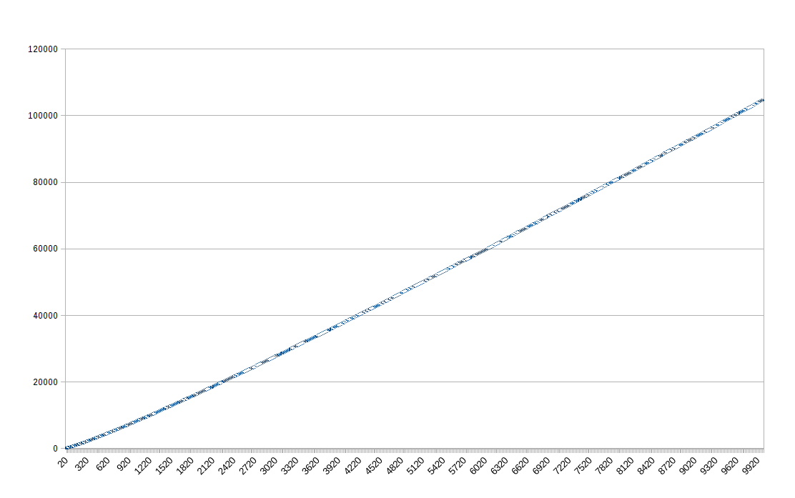
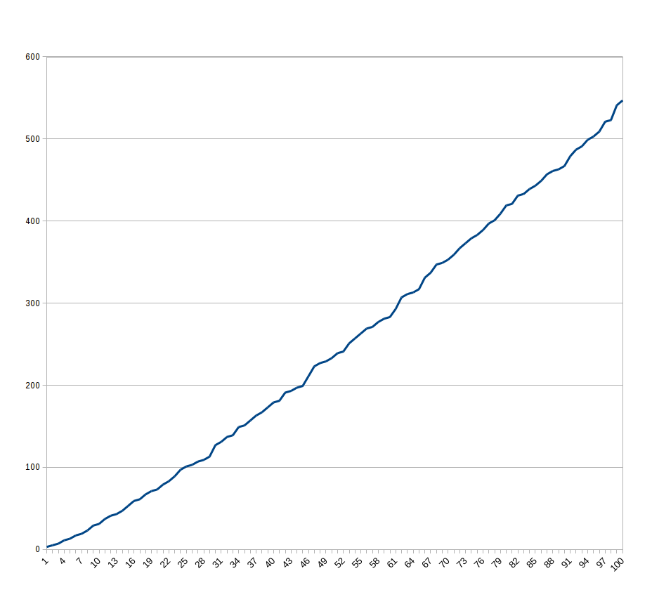
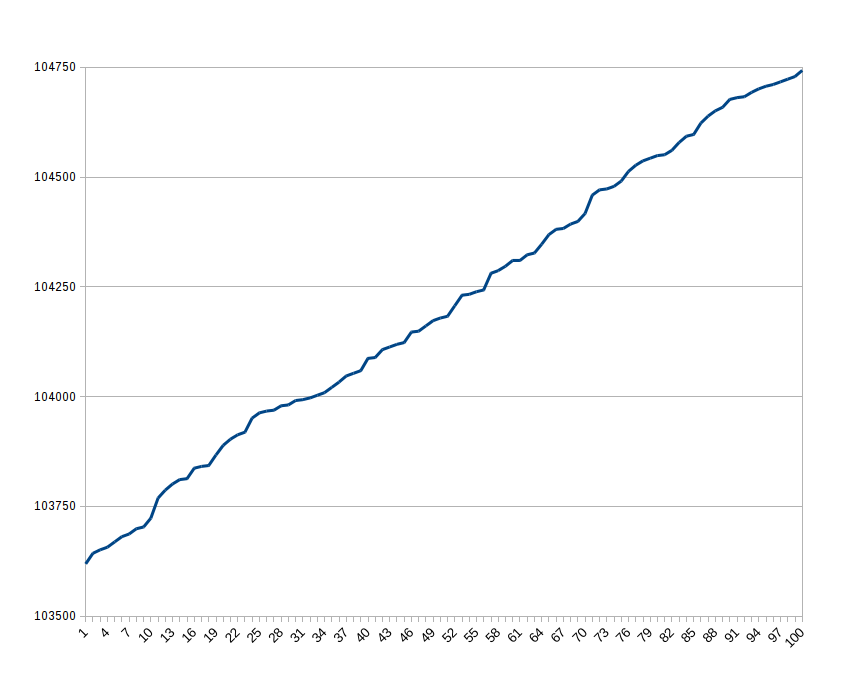

Title: Project Euler
Date: 2016-07-30 21:03
Slug: project euler
Author: Feng Xia
Modified: 2018-07-29 21:00

---
# Code

[1]({static}/downloads/euler/p1.py)
[2]({static}/downloads/euler/p2.py)
[3]({static}/downloads/euler/p3.py)
[4]({static}/downloads/euler/p4.py)
[5]({static}/downloads/euler/p5.py)
[6]({static}/downloads/euler/p6.py)
[7]({static}/downloads/euler/p7.py)
[8]({static}/downloads/euler/p8.py)
[9]({static}/downloads/euler/p9.py)
[10]({static}/downloads/euler/p10.py)
[11]({static}/downloads/euler/p11.py)
[12]({static}/downloads/euler/p12.py)
[13]({static}/downloads/euler/p13.py)
[14]({static}/downloads/euler/p14.py)
[15]({static}/downloads/euler/p15.py)
[16]({static}/downloads/euler/p16.py)
[17]({static}/downloads/euler/p17.py)
[18]({static}/downloads/euler/p18.py)
[19]({static}/downloads/euler/p19.py)
[20]({static}/downloads/euler/p20.py)
[21]({static}/downloads/euler/p21.py)
[22]({static}/downloads/euler/p22.py)
[23]({static}/downloads/euler/p23.py)
[24]({static}/downloads/euler/p24.py)
[25]({static}/downloads/euler/p25.py)
[26]({static}/downloads/euler/p26.py)
[27]({static}/downloads/euler/p27.py)
[28]({static}/downloads/euler/p28.py)
[29]({static}/downloads/euler/p29.py)
[30]({static}/downloads/euler/p30.py)
[31]({static}/downloads/euler/p31.py)
[32]({static}/downloads/euler/p32.py)
[33]({static}/downloads/euler/p33.py)
[34]({static}/downloads/euler/p34.py)
[35]({static}/downloads/euler/p35.py)
[36]({static}/downloads/euler/p36.py)
[37]({static}/downloads/euler/p37.py)
[38]({static}/downloads/euler/p38.py)
[39]({static}/downloads/euler/p39.py)
[40]({static}/downloads/euler/p40.py)
[41]({static}/downloads/euler/p41.py)
[42]({static}/downloads/euler/p42.py)
[43]({static}/downloads/euler/p43.py)
[44]({static}/downloads/euler/p44.py)
[45]({static}/downloads/euler/p45.py)
[46]({static}/downloads/euler/p46.py)
[47]({static}/downloads/euler/p47.py)
[48]({static}/downloads/euler/p48.py)
[49]({static}/downloads/euler/p49.py)
[50]({static}/downloads/euler/p50.py)
[51]({static}/downloads/euler/p51.py)
[52]({static}/downloads/euler/p52.py)
[53]({static}/downloads/euler/p53.py)
[54]({static}/downloads/euler/p54.py)
[55]({static}/downloads/euler/p55.py)
[56]({static}/downloads/euler/p56.py)
[57]({static}/downloads/euler/p57.py)
[58]({static}/downloads/euler/p58.py)
[59]({static}/downloads/euler/p59.py)
[60]({static}/downloads/euler/p60.py)
[61]({static}/downloads/euler/p61.py)

---
# problem 1 {#problem1}

[Question](https://projecteuler.net/problem=1):

> If we list all the natural numbers below 10 that are multiples of 3 or
> 5, we get 3, 5, 6 and 9. The sum of these multiples is 23.
> 
> Find the sum of all the multiples of 3 or 5 below 1000.
> 


I'm forming a pattern on strategy:

- **problem space**: how many numbers we are to search through if
  using brute force &rarr; what is the value of '''n''' in
  ''range(n)''? In this one, problem space ''n=1000''.
- **test criteria**: what type of number we are interested in? &rarr;
  divisible by 3 or 5.

Once you have this, another question usually surfaces is that it is
may not be a good idea or even feasible to search through the entire
problem space, eg. multiplication of two super large numbers &rarr;
this can overwhelm the computer to the point that result is not
reliable anymore. But anyway, it is not the case here. But keep that
in mind.

So once we have determined the summary above, the key is to define
**test criteria**:

```python
def natural_number_divisible(n, d):
    '''Find natural number between [1,n] that is
    divisible by "d".
    '''
    num = 0
    while num < n:
        if num and not num % d:  # num%d=0
            yield num
        num += d
```

With that, the rest is simply a main function wrap:

```python
def main():
    n = 1000

    result = 0
    for d in [3, 5]:
        for c in natural_number_divisible(n, d):
            result += c

    # multiple of 3*5 has been counted twice
    for c in natural_number_divisible(n, 3 * 5):
        result -= c

    # final result
    print result
```

---

# problem 2 {#problem2}

[Question](https://projecteuler.net/problem=2):

> Each new term in the Fibonacci sequence is generated by adding the
> previous two terms. By starting with 1 and 2, the first 10 terms
> will be:
> 
> 1, 2, 3, 5, 8, 13, 21, 34, 55, 89, ...
> 
> By considering the terms in the Fibonacci sequence whose values do
> not exceed four million, find the sum of the even-valued terms.


The key is to learn and understand [fibonacci sequence](https://en.wikipedia.org/wiki/Fibonacci_number).

- **problem space**: < 4000,000
- **test criteria**:
    1. is fibonacci number
    2. is even number

```python
def fibonacci(N):
    '''Generate Fibonacci number less than N
    '''
    p1 = 1
    p2 = 2
    while p1 <= N:
        yield p1
        p1, p2 = p2, p1 + p2

def main():
    bound = 4000000
    results = filter(lambda x: not x % 2, fibonacci(bound))
    print sum(results)
```

**Note**: we are using `filter` which will actually build a list in
memory. This works when problem space is not overwhelmingly
large. What if ``bound=4*10^100000000000`` (hypothetically speaking)?
Generator can run iterate up to that bound, but building in memory
list would be disastrous. So here we are being cheap. A proper
approach is simply counting the ``sum`` value as we go &rarr; `count
+= next number`.

---

# problem 3 {#problem3}

[Question](https://projecteuler.net/problem=3):

> The prime factors of 13195 are 5, 7, 13 and 29.
> 
> What is the largest prime factor of the number 600851475143 ?

I certainly learned a lot from this seemingly simple question!

- **problem space**: `int < 600851475143`
- **test criteria**: is prime?

First of all, how to determine a number is a prime? [primality
test](https://en.wikipedia.org/wiki/Primality_test).  The easiest
[trial division](https://en.wikipedia.org/wiki/Trial_division) is the
only one I was able to grasp after reading all the others.

Further, problem space is not what seems &larr; it can be reduced to
`sqrt(n)` when searching for prime factor of `n`! The [Sieve of
Eratosthenes](https://en.wikipedia.org/wiki/Sieve_of_Eratosthenes)
looks really cool, but I couldn't quite yet figure out how to
implement this in code (well, I'm sure there are code snippet out
there that has done this. But I want to come up one myself. Therefore,
it requires me to fully understand this method in order to translate
this into code I can write.)

Here goes the trial division primality test:

```python

def is_prime(n):
    if n <= 1
        return False
    elif n <= 3:
        return True
    elif n % 2 == 0 or n % 3 == 0:
        return False

    i = 5
    while i * i <= n:
        if n % i == 0 or n % (i + 2) == 0:
            return False
        i += 6
    return True
```

## method 1

So we then search for the next prime one and one until we find all
of them, then `max(list of primes)`?

```python
def next_prime(max_prime):
    i = max_prime + 2
    while not is_prime(i):
        i += 2
    return i

def method_1(n):
    """Method 1 is searching for the largest prime factor from bottom
    up. Starting with the smallest prime number, 2, we divide target
    as much as possible to reduce it, then move on to the next prime
    number and repeat. The remainder, if is a prime, is the result.
    """
    primes = [2, 3]

    while n > 3 and not is_prime(n):
        if n >= primes[-1]:
            primes.append(next_prime(primes[-1]))

        for p in primes:
            if n % p == 0:
                while n > p and n % p == 0:
                    n = n / p

    print 'max prime', n

```

## method 2

That's a waste! There is a smarter way to this problem.

1. max problem space is `< sqrt(n)`
2. What is **n's prime factor y**?  &rarr; `n` is divisible by `y`! So
   if we ever find a `y`, we can reduce `n` by `n /= y`. This
   will shrink problem space each step we take.
3. next, instead finding prime factors, we are to **eliminate** all
   non-prime factors! If given a divisible prime, say `2`, we can
   keep looping `n /= 2` until it is not divisible by 2 any
   further. 
   
This would have eliminated all factors that are multiple of 2. By this
point, `n` has probably been reduced quite a bit.

Next, search for the next divisible, 3. If we search starting with 2,
we are guaranteed that next divisible, if exist, would be a prime!
&rarr; therefore, the problem reduces to looping in this fashion until
`y` is not divisible by reduced `n` anymore. What's left of `n` is the
largest prime factor!

```python
def method_2(n):
    """Method 2 follows the same logic as method 1's. But its
    implementation is much simpler. We simply searching from 2 and up
    until we find the result. In between, we don't search for the next
    prime as method 1 does. Instead, we step by +1. Since the search
    is from bottom up, only the next prime will possibly yield a %==0
    anyway, so it's the same as method 1's.
    """
    i = 2
    while i * i < n:
        while n % i == 0:
            n = n / i
        i = i + 1

    print (n)
```

## performance

* Method 1: **2.97s**
* Method 2: **0.056s**

---

# problem 4 {#problem4}

[Question](https://projecteuler.net/problem=4):

> A palindromic number reads the same both ways. The largest
> palindrome made from the product of two 2-digit numbers is 9009 = 91
> × 99.
> 
> Find the largest palindrome made from the product of two 3-digit
> numbers.

- **problem space**: `100*100 &mdash; 999*999`
- **test criteria**: is
  [palindromic](https://en.wikipedia.org/wiki/Palindromic_number)?
  (see [problem 36](#problem36) for a cool trick on palindromic test).


Take the brute force way:

```python
import itertools


def is_palindromic(n):
    """Test n to be palindromic number.

    The easiest way, I think, is to convert "n" to
    string and test its reverse == itself.
    """
    string_version = str(n)
    return ''.join(reversed(string_version)) == string_version


def main():
    matrix = set(itertools.imap(
        lambda (x, y): x * y, itertools.combinations(range(100, 999), 2)))
    results = filter(lambda x: is_palindromic(x), matrix)
    print max(results)
```

A couple thoughts for improvement:

1. this will build an in memory `set` with all possible combinations
   of 2 numbers in `range(100,999)`. This is ok when problem space is
   limited. What if the upper bound is 1 million times greater?
2. Another thought is that product of the two numbers specified in the
   problem range will generate quite some redundant results,
   eg. `100*300 = 150*200`.

---

# problem 5 {#problem5}

[Question](https://projecteuler.net/problem=5):

> 2520 is the smallest number that can be divided by each of the
> numbers from 1 to 10 without any remainder.
> 
> What is the smallest positive number that is evenly divisible by all
> of the numbers from 1 to 20?

- **problem space**: < 20!
- **test criteria**: divisible by all numbers between 1-20 without
  redundancy, eg. `%4==0 includes %2==0`.

## method 1

Don't know what I was thinking. Definitely an example of overthinking
and over engineering.

```python

import itertools


def method_1(target):
    """Method 1 is a bit over complex.  We are to turn all target values
    into a list of prime factors.  Then we compare each factor list to
    compute how many 2s, 3s.. and so on each list represents. We then
    take the max count of 2s, 3s... and so on to form a master list.
    This master list will be able to derive all target values.
    """
    results = {}

    # find prime factors
    for i in range(1, target):
        factors = []

        j = 2
        while j * j <= i:
            while i % j == 0 and i > j:
                i = i / j
                factors.append(j)
            j += 1

        factors.append(i)
        for key, g in itertools.groupby(factors):
            if key in results:
                results[key] = max(len(list(g)), results[key])
            else:
                results[key] = len(list(g))

    multiple = []
    for key, count in results.iteritems():
        multiple += [key] * count

    print reduce(lambda x, y: x * y, multiple)
```

## method 2

Much better. Build a minimum factor list of a given target.

```python
def method_2(target):
    """Method 2 uses a base factor list
    to iterate. The idea is to divide target as much
    as possible using all factors on the list. If there is
    still a remainder, add that to factor list. This way,
    we are searching the minimum factor list that represents
    a target value.
    """
    factors = [2, ]
    for i in range(1, target):
        for f in factors:
            if i % f == 0:
                i = i / f
        factors.append(i)
    print reduce(lambda x, y: x * y, factors)
```

---

# problem 6 {#problem6}

[Question](https://projecteuler.net/problem=6):

> The sum of the squares of the first ten natural numbers is,
> 
> 1<sup>2</sup> + 2<sup>2</sup> + ... + 10<sup>2</sup> = 385
> 
> The square of the sum of the first ten natural numbers is,
> 
> (1 + 2 + ... + 10)<sup>2</sup> = 55<sup>2</sup> = 3025
> 
> Hence the difference between the sum of the squares of the first ten
> natural numbers and the square of the sum is 3025 − 385 = 2640.
> 
> Find the difference between the sum of the squares of the first one
> hundred natural numbers and the square of the sum.
> 

* **problem space**: `int < 100`
* **test criteria**: none

This problem involves nothing but math computation. Consider that
problem space is so small, I didnot bother with anything else but went
with brute force:

```python
def main():
    n = 100
    a = sum([i*i for i in range(1,n+1)])
    b = sum(range(1,n+1))
    b = b*b

    print b-a
```

---

# problem 7 {#problem7}

[Question](https://projecteuler.net/problem=7)

> By listing the first six prime numbers: 2, 3, 5, 7, 11, and 13, we can
> see that the 6th prime is 13.
> 
> What is the 10 001st prime number?
> 

Another prime number problem.

* **problem space**: much greater than 10001. I would think prime
  numbers are spaced out further and further when moving away from 2.
* **test criteria**:
    1. is prime?
    2. is the 10001st one?

Since we have done primality test in [problem 3](#problem3), the
easiest way is simply counting how many primes we got:

```python
def main():
    n = 10001
    count = 1
    i = 3
    while count < n:
        if is_prime(i):
            count += 1
        i += 2

    print '%dth prime is' % n, i - 2
```

Note that we start with `i=3` so we have skipped counting `2` and `3`
&rarr; thus the correct counter is `i-2`.

## analysis

How (un)linear are prime numbers found within natural numbers? Using
the first 10,000 of them for a quick analysis surprisingly reveals
that they are quite `linear` with small jigzags but not much.

<figure class="col s12 center">
  
  <figcaption>First 10,000 primes</figcaption>
</figure>
<figure class="col s12 center">
  
  <figcaption>First 100 primes</figcaption>
</figure>
<figure class="col s12 center">
  
  <figcaption>9,900th-10,000th primes</figcaption>
</figure>

---

# problem 8 {#problem8}

[Question](https://projecteuler.net/problem=8):

> The four adjacent digits in the 1000-digit number that have the
> greatest product are `9 × 9 × 8 × 9 = 5832`.
>
> ```
> 73167176531330624919225119674426574742355349194934
> 96983520312774506326239578318016984801869478851843
> 85861560789112949495459501737958331952853208805511
> 12540698747158523863050715693290963295227443043557
> 66896648950445244523161731856403098711121722383113
> 62229893423380308135336276614282806444486645238749
> 30358907296290491560440772390713810515859307960866
> 70172427121883998797908792274921901699720888093776
> 65727333001053367881220235421809751254540594752243
> 52584907711670556013604839586446706324415722155397
> 53697817977846174064955149290862569321978468622482
> 83972241375657056057490261407972968652414535100474
> 82166370484403199890008895243450658541227588666881
> 16427171479924442928230863465674813919123162824586
> 17866458359124566529476545682848912883142607690042
> 24219022671055626321111109370544217506941658960408
> 07198403850962455444362981230987879927244284909188
> 84580156166097919133875499200524063689912560717606
> 05886116467109405077541002256983155200055935729725
> 71636269561882670428252483600823257530420752963450
> ```

> Find the thirteen adjacent digits in the 1000-digit number that have
> the greatest product. What is the value of this product?

My thought was to treat this l000-digit number as a list first. Then
the problem becomes max product of 13 adjacent items.

* **problem space**: `len([int.....]) = 1000`
* **test** criteria: find product of 13 consecutive items, and max(all products)

```python
def main():
    matrix = '''
73167176531330624919225119674426574742355349194934
96983520312774506326239578318016984801869478851843
85861560789112949495459501737958331952853208805511
12540698747158523863050715693290963295227443043557
66896648950445244523161731856403098711121722383113
62229893423380308135336276614282806444486645238749
30358907296290491560440772390713810515859307960866
70172427121883998797908792274921901699720888093776
65727333001053367881220235421809751254540594752243
52584907711670556013604839586446706324415722155397
53697817977846174064955149290862569321978468622482
83972241375657056057490261407972968652414535100474
82166370484403199890008895243450658541227588666881
16427171479924442928230863465674813919123162824586
17866458359124566529476545682848912883142607690042
24219022671055626321111109370544217506941658960408
07198403850962455444362981230987879927244284909188
84580156166097919133875499200524063689912560717606
05886116467109405077541002256983155200055935729725
71636269561882670428252483600823257530420752963450
    '''

    matrix = [int(x) for x in matrix.replace('\n','').strip()]
    n = 13

    products = []
    for i in range(len(matrix)-n):
        products.append(reduce(lambda x,y:x*y, matrix[i:i+n]))

    print max(products)
```


One small thing after reading discussion threads was to replace
`lambda x,y: x*y` with `from operator import mul`.  See [Python
operator](https://docs.python.org/2/library/operator.html) manual for
more.

---

# problem 9

[Question](https://projecteuler.net/problem=9):

> A Pythagorean triplet is a set of three natural numbers, `a>b>c`, for
> which, a<sup>2</sup> + b<sup>2</sup> = c<sup>2</sup>.
> 
> For example, 3<sup>2</sup> + 4<sup>2</sup> = 9 + 16 = 25 = 5<sup>2</sup>.
> There exists exactly one Pythagorean triplet for which `a+b+c = 1000`.
> Find the product `abc`.

* **problem space**: combo of any 3 integers where `int < 1000`
* **test criteria**:
    1. `a != b != c`
    2. `a + b + c = 1000`
    3. `a^2 + b^2 = c^2`

## method 1

Iterate all combo of 3 integers and test by criteria:

```python

import itertools

def method_1(n):
    tmp_sum = 0
    for a, b, c in itertools.combinations(range(1, n), 3):
        tmp_sum = a + b + c
        if tmp_sum != n:
            continue

        if c * c - a * a - b * b == 0:
            print '%d^2+%d^2=%d^2' % (a, b, c)
            print a * b * c
            break
```

## method 2

We can reduce ''problem space'' dramatically if iterating combo of 2
which, a<sup>2</sup> + b<sup>2</sup> = c<sup>2</sup> numbers instead
of 3! Since a,b,c are bound by a criteria that sum of them = 1000, we
can derive c if given a and b.

```python
def method_2(n):
    for a, b in itertools.combinations(range(1, n), 2):
        c = n - b - a
        if c in [a, b]:
            continue
        a, b, c = sorted([a, b, c])

        if c * c - a * a - b * b == 0:
            print '%d^2+%d^2=%d^2' % (a, b, c)
            print a * b * c
            break

```

## performance

* method 1: **109.4s**
* method 2: **2.31s**

---

# problem 10 {#problem10}

[Question](https://projecteuler.net/problem=10):

> The sum of the primes below 10 is 2 + 3 + 5 + 7 = 17.
> 
> Find the sum of all the primes below two million.

* **problem space**: `int < 2000,000`
* **test criteria**: is prime?

Easiest approach is to find all primes under `2,000,000` and add them
up.

```python
def get_primes(n):
    i = 1
    while i <= n:
        if is_prime(i):
            yield i
        i += 1

def main():
    n = 2000000
    print sum(get_primes(n))
```

## primality test

This topic is not easy. My implementation is so called **naive**
version because it is simple to understand but does not scale well
when testing large number.

```python
def is_prime(n):
    """Test function if a given number is prime.

    Argument:
    :n: number to test

    Return:
    :Boolean: true if n is prime
    """
    if n <= 1:
        return False
    elif n <= 3:
        return True
    elif n % 2 == 0 or n % 3 == 0:
        return False

    i = 5
    while i * i <= n:
        if n % i == 0 or n % (i + 2) == 0:
            return False
        i += 6
    return True

```

## get primes up to N

My implementation is, well, not creative nor fast. This version, found
in [here][4], is a much nicer version, even though I don't fully
understand this yet.

```python
from itertools import ifilter
from math import sqrt


def primes_up_to(n):
    """Generates all primes less than n."""
    if n <= 2:
        return
    yield 2
    F = [True] * n
    seq1 = xrange(3, int(sqrt(n)) + 1, 2)
    seq2 = xrange(seq1[-1] + 2, n, 2)
    for p in ifilter(F.__getitem__, seq1):
        yield p
        for q in xrange(p * p, n, 2 * p):
            F[q] = False
    for p in ifilter(F.__getitem__, seq2):
        yield p
```

To find all primes under `1,000,000`, performance comparison:

1. my naive version: 3.1s
2. this version: 0.14s

However, this version suffers by using `F` to maintain the sieve. For
a large `n` (> long long in C), Python will complain with an error!

## see also

From
[here](http://www.macdevcenter.com/pub/a/python/excerpt/pythonckbk_chap1/index1.html?page=2),
I got a couple nice ones.

### a one liner to get primes under N

```python
def primes_oneliner(N):
    aux = {  }
    return [aux.setdefault(p, p) for p in range(2, N)
            if 0 not in [p%d for d in aux if p>=d+d]]
```

### prime generator

```python
import itertools
def erat2( ):
    D = {  }
    yield 2
    for q in itertools.islice(itertools.count(3), 0, None, 2):
        p = D.pop(q, None)
        if p is None:
            D[q*q] = q
            yield q
        else:
            x = p + q
            while x in D or not (x&1):
                x += p
            D[x] = p
```

### get primes up to N

```python
def primes_less_than(N):
    # make `primes' a list of known primes < N
    primes = [x for x in (2, 3, 5, 7, 11, 13) if x < N]
    if N <= 17: return primes
    # candidate primes are all odd numbers less than N and over 15,
    # not divisible by the first few known primes, in descending order
    candidates = [x for x in xrange((N-2)|1, 15, -2)
                  if x % 3 and x % 5 and x % 7 and x % 11 and x % 13]
    # make `top' the biggest number that we must check for compositeness
    top = int(N ** 0.5)
    while (top+1)*(top+1) <= N:
        top += 1
    # main loop, weeding out non-primes among the remaining candidates
    while True:
        # get the smallest candidate: it must be a prime
        p = candidates.pop( )
        primes.append(p)
        if p > top:
            break
        # remove all candidates which are divisible by the newfound prime
        candidates = filter(p._ _rmod_ _, candidates)
    # all remaining candidates are prime, add them (in ascending order)
    candidates.reverse( )
    primes.extend(candidates)
    return primes
```

---

# problem 11

[Question](https://projecteuler.net/problem=11):

> <p>In the 20×20 grid below, four numbers along a diagonal line have
> been marked in red.</p>
> <p style="font-family:'courier new';text-align:center;font-size:10pt;">
> 08 02 22 97 38 15 00 40 00 75 04 05 07 78 52 12 50 77 91 08<br>
> 49 49 99 40 17 81 18 57 60 87 17 40 98 43 69 48 04 56 62 00<br>
> 81 49 31 73 55 79 14 29 93 71 40 67 53 88 30 03 49 13 36 65<br>
> 52 70 95 23 04 60 11 42 69 24 68 56 01 32 56 71 37 02 36 91<br>
> 22 31 16 71 51 67 63 89 41 92 36 54 22 40 40 28 66 33 13 80<br>
> 24 47 32 60 99 03 45 02 44 75 33 53 78 36 84 20 35 17 12 50<br>
> 32 98 81 28 64 23 67 10 <span style="color:#ff0000;"><b>26</b></span> 38 40 67 59 54 70 66 18 38 64 70<br>
> 67 26 20 68 02 62 12 20 95 <span style="color:#ff0000;"><b>63</b></span> 94 39 63 08 40 91 66 49 94 21<br>
> 24 55 58 05 66 73 99 26 97 17 <span style="color:#ff0000;"><b>78</b></span> 78 96 83 14 88 34 89 63 72<br>
> 21 36 23 09 75 00 76 44 20 45 35 <span style="color:#ff0000;"><b>14</b></span> 00 61 33 97 34 31 33 95<br>
> 78 17 53 28 22 75 31 67 15 94 03 80 04 62 16 14 09 53 56 92<br>
> 16 39 05 42 96 35 31 47 55 58 88 24 00 17 54 24 36 29 85 57<br>
> 86 56 00 48 35 71 89 07 05 44 44 37 44 60 21 58 51 54 17 58<br>
> 19 80 81 68 05 94 47 69 28 73 92 13 86 52 17 77 04 89 55 40<br>
> 04 52 08 83 97 35 99 16 07 97 57 32 16 26 26 79 33 27 98 66<br>
> 88 36 68 87 57 62 20 72 03 46 33 67 46 55 12 32 63 93 53 69<br>
> 04 42 16 73 38 25 39 11 24 94 72 18 08 46 29 32 40 62 76 36<br>
> 20 69 36 41 72 30 23 88 34 62 99 69 82 67 59 85 74 04 36 16<br>
> 20 73 35 29 78 31 90 01 74 31 49 71 48 86 81 16 23 57 05 54<br>
> 01 70 54 71 83 51 54 69 16 92 33 48 61 43 52 01 89 19 67 48<br></p>
> <p>The product of these numbers is 26 × 63 × 78 × 14 = 1788696.</p>

> <p>What is the greatest product of four adjacent numbers in the same
> direction (up, down, left, right, or diagonally) in the 20×20
> grid?</p>


* **problem space**: 20x20 int matrix
* **test criteria**: 4 numbers are selected by proper indexing, and
  find `max([sums])`.

The challenge is how to select four numbers in the same pattern as the
example shown above.

Note that requirement is to count both horizontally and vertically
adjacent numbers, but also diagonally adjacent ones &rarr; this
includes diagonal numbers in both directions &larr; from left to right
and from right to left.

For example, diagonally left to right, first number's index is `i`, if
the first index is `i`, next index is `i+20*1+1`, then `i+20*2+2`,
then `i+20*3+3`.  Not bad.

First, we **flatten** the matrix into a list of integer.

```python
def main():
    matrix = '''
08 02 22 97 38 15 00 40 00 75 04 05 07 78 52 12 50 77 91 08
49 49 99 40 17 81 18 57 60 87 17 40 98 43 69 48 04 56 62 00
81 49 31 73 55 79 14 29 93 71 40 67 53 88 30 03 49 13 36 65
52 70 95 23 04 60 11 42 69 24 68 56 01 32 56 71 37 02 36 91
22 31 16 71 51 67 63 89 41 92 36 54 22 40 40 28 66 33 13 80
24 47 32 60 99 03 45 02 44 75 33 53 78 36 84 20 35 17 12 50
32 98 81 28 64 23 67 10 26 38 40 67 59 54 70 66 18 38 64 70
67 26 20 68 02 62 12 20 95 63 94 39 63 08 40 91 66 49 94 21
24 55 58 05 66 73 99 26 97 17 78 78 96 83 14 88 34 89 63 72
21 36 23 09 75 00 76 44 20 45 35 14 00 61 33 97 34 31 33 95
78 17 53 28 22 75 31 67 15 94 03 80 04 62 16 14 09 53 56 92
16 39 05 42 96 35 31 47 55 58 88 24 00 17 54 24 36 29 85 57
86 56 00 48 35 71 89 07 05 44 44 37 44 60 21 58 51 54 17 58
19 80 81 68 05 94 47 69 28 73 92 13 86 52 17 77 04 89 55 40
04 52 08 83 97 35 99 16 07 97 57 32 16 26 26 79 33 27 98 66
88 36 68 87 57 62 20 72 03 46 33 67 46 55 12 32 63 93 53 69
04 42 16 73 38 25 39 11 24 94 72 18 08 46 29 32 40 62 76 36
20 69 36 41 72 30 23 88 34 62 99 69 82 67 59 85 74 04 36 16
20 73 35 29 78 31 90 01 74 31 49 71 48 86 81 16 23 57 05 54
01 70 54 71 83 51 54 69 16 92 33 48 61 43 52 01 89 19 67 48
    '''
    matrix = [int(x) for x in matrix.replace('\n', ' ').strip().split(' ')]
    row_size = 20
    col_size = 20
    n = 4
```

## method 1

In this method, we count index in a brute force fashion &rarr; 4
directions to count: 

1. horizontal
2. vertical
3. diagonal from left to right
4. and diagonal from right to left

### horizontal

Horizontal selection is a moving window of a size `n (n=4)`. By
iterating through rows and columns, selection is
`row[col_index:col_index+n]`:

```python
def horizontal(self):
    results = []
    for r in range(self.row_size):
        for c in range(self.col_size - self.n + 1):
            num = self.matrix[r * self.row_size +
                              c:r * self.row_size + c + self.n]
            results.append(num)
    return results
```

### vertical

Vertical is straightforward: column index is fixed, we are to select
`row_index` &rarr; `row_index+4`:

```python
def vertical(self):
    results = []
    for r in range(self.row_size - self.n + 1):
        for c in range(self.col_size):
            num = []
            for j in range(self.n):
                index = (r + j) * self.row_size + c
                num.append(self.matrix[index])
            results.append(num)
    return results
```

### diagonal left to right

Similar to counting vertically, we also shift column index by 1 per
row iteration:

```python
def diagonal_right(self):
    '''Find diagonal adjacent numbers per requirement.
    The one counts from left to right.
    '''
    results = []

    # iterate row
    for r in range(self.row_size - self.n + 1):
        # iterate col
        for c in range(self.col_size - self.n + 1):
            num = []
            # iterate adjacent per requirement
            for j in range(self.n):
                index = (r + j) * self.row_size + c + j
                if index >= len(self.matrix):
                    break
                else:
                    num.append(self.matrix[index])

            results.append(num)
    return results
```

### diagonal right to left

Basically the opposite of diagonal selection from left to right &rarr;
by reducing column index by 1 per row iteration:

```python
def diagonal_left(self):
    '''Find diagonal adjacent numbers per requirement.
    This one counts from right to left.
    '''
    results = []

    # iterate row
    for r in range(self.row_size - self.n + 1):
        # iterate col
        for c in range(self.n, self.col_size):
            num = []
            # iterate adjacent per requirement
            for j in list(reversed(range(self.n))):
                index = (r + j) * self.row_size + c - j
                if index >= len(self.matrix):
                    break
                else:
                    num.append(self.matrix[index])

            results.append(num)

    return results
```

## method 2

Apparently finding index as above is tedious and error prone. Instead
of moving indexes, how about moving the matrix itself instead? Among
all four selections, horizontal moving window is the easiest. So how
about moving matrix in a way that counting vertical and diagonal
becoming horizontal? The clue lies in:

* vertical &rarr; horizontal: transpose
* left & right and right&rarr;left: reverse a list

### moving window

Moving window is to select 4 rows each time from the entire matrix:

```python
def moving_window(self, data, window_size):
    combo = []
    for i in range(len(data) - window_size + 1):
        combo.append(data[i:i + window_size])
    return combo
```

### horizontal

Horizontal selection is easy:

```python
def horizontal(self, matrix, window_size):
    results = [self.moving_window(row, window_size) for row in matrix]
    return reduce(lambda x, y: x + y, results)
```


### vertical

This is a neat trick on how to transpose a matrix: `zip(*self.matrix)`
where `self.matrix` is a list of list mimicing a matrix.

Once matrix has been turned 90 degrees, vertical counting becomes
horizontal!

```python
# transpose matrix and count verticals
results += self.horizontal(zip(*self.matrix), self.n)
```

### diagonal left to right

The idea is to first take a subset of matrix (`moving_window()`),
assuming that first row is fixed, shifting the other 3 lines to the
left &rarr; 2nd line shifted by 1, 3rd line shifted by 2, 4th line
shifted by 4 &rarr; so the selection is actually lining up
**vertically**. Well, then we know how to select **vertical**, don't
we :)

How to shift? by using list's `pop` method (popping from left) and
append 0s to the right.

Note that because shifting will be in place, meaning the original list
will change, it is necessary to make a `deepcopy` of the picked
subset so the original matrix is intact.

```python
def diagonal(self, matrix, window_size):
    tmp = self.moving_window(matrix, window_size)

    results = []
    for sub_set in tmp:
        # we need to make a copy since we are to shift
        # rows in place. Since sub_set is a list[list],
        # deepcopy is needed!
        sub_set_copy = deepcopy(sub_set)

        # shift rows so diagnoal numbers will then be aligned
        # vertically.
        for idx, sub in enumerate(sub_set_copy):
            for i in range(idx):
                sub.pop(0)
                sub.append(0)

        # transpose vertical to horizontal, and done :)
        results += self.horizontal(zip(*sub_set_copy), window_size)
    return results
```

### diagonal right to left

This is the mirror action of diagonal left to right &rarr; we can
flip the matrix:

```python
# diagonal right to left
# first we reverse the matrix, then treat it as left -> right
reversed_matrix = [list(reversed(m)) for m in self.matrix]
results += self.diagonal(reversed_matrix, self.n)
```

---

# problem 12 {#problem12}

[Question](https://projecteuler.net/problem=12):

> <p>The sequence of triangle numbers is generated by adding the
> natural numbers. So the 7<sup>th</sup> triangle number would be 1 +
> 2 + 3 + 4 + 5 + 6 + 7 = 28. The first ten terms would be:</p> <p
> style="text-align:center;">1, 3, 6, 10, 15, 21, 28, 36, 45, 55,
> ...</p> <p>Let us list the factors of the first seven triangle
> numbers:</p> <blockquote style="font-family:'courier
> new';"><b>&nbsp;1</b>: 1<br><b>&nbsp;3</b>: 1,3<br><b>&nbsp;6</b>:
> 1,2,3,6<br><b>10</b>: 1,2,5,10<br><b>15</b>: 1,3,5,15<br><b>21</b>:
> 1,3,7,21<br><b>28</b>: 1,2,4,7,14,28</blockquote> <p>We can see that
> 28 is the first triangle number to have over five divisors.</p>
> <p>What is the value of the first triangle number to have over five
> hundred divisors?</p>


* **problem space**: `< 500!`, but this is too much to iterate
* **test criteria**:
    1. is divisor of `n`?
    2. `> 500` divisors in total?

## find divisors

The dummy way to search for divisors of a number `n`. **Note** the
problem space of this is `sqrt` of `n`.

```python
def divisors(n):
    """Find all divisors given number "n".

    Note that problem space is sqrt(n) since factors
    will repeat themselves passing that point. This greatly reduced
    number of iteration needed.
    """
    i = 1
    while i * i <= n:
        if n % i == 0:
            yield [i, n / i]
        i += 1
```

## method 1

Brute force. One thing to note is the starting point. Knowing the
result is 12374, we could potentially see how we can manipulate the
starting value of `m` in order to reduce searching time &larr; this is
an after thought.

```python
def method_1(n):
    max_count = 0
    m = 10000 # we can guess this starting point by trial and error
    num = 0
    while max_count <= n:
        num = m * (m + 1) / 2
        all_divisors = reduce(lambda x, y: x + y, divisors(num))
        max_count = max(max_count, len(all_divisors))

        # test criteria
        if max_count > n:
            break

        # move on
        m += 1

    # print result
    print num, m - 1, max_count
```

---

# problem 13

[Question](https://projecteuler.net/problem=13):

> <p>Work out the first ten digits of the sum of the following
> one-hundred 50-digit numbers.</p> 
> <div style="font-family:'courier new';font-size:10pt;text-align:center;">
> 37107287533902102798797998220837590246510135740250<br>
> 46376937677490009712648124896970078050417018260538<br>
> 74324986199524741059474233309513058123726617309629<br>
> 91942213363574161572522430563301811072406154908250<br>
> 23067588207539346171171980310421047513778063246676<br>
> 89261670696623633820136378418383684178734361726757<br>
> 28112879812849979408065481931592621691275889832738<br>
> 44274228917432520321923589422876796487670272189318<br>
> 47451445736001306439091167216856844588711603153276<br>
> 70386486105843025439939619828917593665686757934951<br>
> 62176457141856560629502157223196586755079324193331<br>
> 64906352462741904929101432445813822663347944758178<br>
> 92575867718337217661963751590579239728245598838407<br>
> 58203565325359399008402633568948830189458628227828<br>
> 80181199384826282014278194139940567587151170094390<br>
> 35398664372827112653829987240784473053190104293586<br>
> 86515506006295864861532075273371959191420517255829<br>
> 71693888707715466499115593487603532921714970056938<br>
> 54370070576826684624621495650076471787294438377604<br>
> 53282654108756828443191190634694037855217779295145<br>
> 36123272525000296071075082563815656710885258350721<br>
> 45876576172410976447339110607218265236877223636045<br>
> 17423706905851860660448207621209813287860733969412<br>
> 81142660418086830619328460811191061556940512689692<br>
> 51934325451728388641918047049293215058642563049483<br>
> 62467221648435076201727918039944693004732956340691<br>
> 15732444386908125794514089057706229429197107928209<br>
> 55037687525678773091862540744969844508330393682126<br>
> 18336384825330154686196124348767681297534375946515<br>
> 80386287592878490201521685554828717201219257766954<br>
> 78182833757993103614740356856449095527097864797581<br>
> 16726320100436897842553539920931837441497806860984<br>
> 48403098129077791799088218795327364475675590848030<br>
> 87086987551392711854517078544161852424320693150332<br>
> 59959406895756536782107074926966537676326235447210<br>
> 69793950679652694742597709739166693763042633987085<br>
> 41052684708299085211399427365734116182760315001271<br>
> 65378607361501080857009149939512557028198746004375<br>
> 35829035317434717326932123578154982629742552737307<br>
> 94953759765105305946966067683156574377167401875275<br>
> 88902802571733229619176668713819931811048770190271<br>
> 25267680276078003013678680992525463401061632866526<br>
> 36270218540497705585629946580636237993140746255962<br>
> 24074486908231174977792365466257246923322810917141<br>
> 91430288197103288597806669760892938638285025333403<br>
> 34413065578016127815921815005561868836468420090470<br>
> 23053081172816430487623791969842487255036638784583<br>
> 11487696932154902810424020138335124462181441773470<br>
> 63783299490636259666498587618221225225512486764533<br>
> 67720186971698544312419572409913959008952310058822<br>
> 95548255300263520781532296796249481641953868218774<br>
> 76085327132285723110424803456124867697064507995236<br>
> 37774242535411291684276865538926205024910326572967<br>
> 23701913275725675285653248258265463092207058596522<br>
> 29798860272258331913126375147341994889534765745501<br>
> 18495701454879288984856827726077713721403798879715<br>
> 38298203783031473527721580348144513491373226651381<br>
> 34829543829199918180278916522431027392251122869539<br>
> 40957953066405232632538044100059654939159879593635<br>
> 29746152185502371307642255121183693803580388584903<br>
> 41698116222072977186158236678424689157993532961922<br>
> 62467957194401269043877107275048102390895523597457<br>
> 23189706772547915061505504953922979530901129967519<br>
> 86188088225875314529584099251203829009407770775672<br>
> 11306739708304724483816533873502340845647058077308<br>
> 82959174767140363198008187129011875491310547126581<br>
> 97623331044818386269515456334926366572897563400500<br>
> 42846280183517070527831839425882145521227251250327<br>
> 55121603546981200581762165212827652751691296897789<br>
> 32238195734329339946437501907836945765883352399886<br>
> 75506164965184775180738168837861091527357929701337<br>
> 62177842752192623401942399639168044983993173312731<br>
> 32924185707147349566916674687634660915035914677504<br>
> 99518671430235219628894890102423325116913619626622<br>
> 73267460800591547471830798392868535206946944540724<br>
> 76841822524674417161514036427982273348055556214818<br>
> 97142617910342598647204516893989422179826088076852<br>
> 87783646182799346313767754307809363333018982642090<br>
> 10848802521674670883215120185883543223812876952786<br>
> 71329612474782464538636993009049310363619763878039<br>
> 62184073572399794223406235393808339651327408011116<br>
> 66627891981488087797941876876144230030984490851411<br>
> 60661826293682836764744779239180335110989069790714<br>
> 85786944089552990653640447425576083659976645795096<br>
> 66024396409905389607120198219976047599490197230297<br>
> 64913982680032973156037120041377903785566085089252<br>
> 16730939319872750275468906903707539413042652315011<br>
> 94809377245048795150954100921645863754710598436791<br>
> 78639167021187492431995700641917969777599028300699<br>
> 15368713711936614952811305876380278410754449733078<br>
> 40789923115535562561142322423255033685442488917353<br>
> 44889911501440648020369068063960672322193204149535<br>
> 41503128880339536053299340368006977710650566631954<br>
> 81234880673210146739058568557934581403627822703280<br>
> 82616570773948327592232845941706525094512325230608<br>
> 22918802058777319719839450180888072429661980811197<br>
> 77158542502016545090413245809786882778948721859617<br>
> 72107838435069186155435662884062257473692284509516<br>
> 20849603980134001723930671666823555245252804609722<br>
> 53503534226472524250874054075591789781264330331690<br></div>

* **problem space**: given 100 50-digit numbers
* **test criteria**: none given. The challenge is how to keep track of
  sum result.

How to count the most significant 10 digits of this sum? Don't brute
force this one. Instead, we are back to the basics of summing two
numbers &rarr; add least significant digits, and carry over overflow
&rarr; this reduced math to adding at most 100 single digit numbers
plus a carry over value (which is bound to be `< 100*9`!) each time,
how wonderful!

Trick to add single digits is to transpose matrix so it turns from
visually vertical to horizontal:

```python
def main():
    n = '''......''' # <-- that matrix

    m = 10
    matrix = n.strip().split('\n')

    # flip and transpose 
    # flip: start computing from lower digit and
    # up, like human does 
    #
    # transpose: computing as a horizontal list
    # instead of visually vertical
    matrix = [list(reversed(x)) for x in matrix]
    matrix = zip(*matrix)

    overflow = 0      
    result = []
    for l in matrix:
        total = sum([int(x) for x in l]) + overflow

        # this is the digit residual
        result.append(total - total/10*10)

        # next overflow
        overflow = total/10

    # flip back so lower digit is on the right most
    result = list(reversed(result))

    print [overflow]+result[:10-len(str(overflow))]
```

---

# problem 14

[Question](https://projecteuler.net/problem=14):

> <p>The following iterative sequence is defined for the set of
> positive integers:</p> <p style="margin-left:50px;"><var>n</var> →
> <var>n</var>/2 (<var>n</var> is even)<br><var>n</var> →
> 3<var>n</var> + 1 (<var>n</var> is odd)</p> <p>Using the rule above
> and starting with 13, we generate the following sequence:</p> <div
> style="text-align:center;">13 → 40 → 20 → 10 → 5 → 16 → 8 → 4 → 2 →
> 1</div> <p>It can be seen that this sequence (starting at 13 and
> finishing at 1) contains 10 terms. Although it has not been proved
> yet (Collatz Problem), it is thought that all starting numbers
> finish at 1.</p> <p>Which starting number, under one million,
> produces the longest chain?</p> <p class="note"><b>NOTE:</b> Once
> the chain starts the terms are allowed to go above one million.</p>

* **problem space**: `int < 1000,000`
* **test criteria**: max length of chain, chain is created based on
  the rule given

```python
def main():
    n = 1000000
    max_len = 0
    for i in range(n, 1, -1):
        chain_len = len(list(chain(i)))
        max_len = max(max_len, chain_len)

        print i, chain_len
```

## chain

Nothing fancy here. Go by the rules:

```python
def chain(n):
    while n > 1:
        yield n
        if n % 2:
            n = 3 * n + 1
        else:
            n = n / 2
```

---

# problem 15

[Question](https://projecteuler.net/problem=15):

> Starting in the top left corner of a 2×2 grid, and only being able to
> move to the right and down, there are exactly 6 routes to the bottom
> right corner.
> 
> <figure class="col s12 center">
>           class="responsive-image">
> </figure>
> 
> How many such routes are there through a 20×20 grid?
> 

This is a typical [dynamic
programming](https://en.wikipedia.org/wiki/Dynamic_programming)
problem (and my first time encounter this concept).

```python
def main():
    n = 21  # number of nodes, not legs, per side
    grid = [0] * n * n

    for i in range(1, n):
        grid[i * n] = 1
        grid[i] = 1

    for x in range(n):
        for y in range(n):
            if not grid[x * n + y]:
                grid[x * n + y] = grid[(x - 1) * n + y] + grid[x * n + y - 1]

    print grid, max(grid)
```

Well, it turned out, this does **not** need computing even! Answer
is `40!/(20!*20!)`, what!!!!?

> Consider an example solution to the problem. It would be a list of 40
> moves. The heart of this method lies in realizing that every single
> path will consist of exactly 20 downward movements and 20 rightward
> movements. As there are only two possible movements (down, right) we
> can represent these paths as binary strings with a 0 indicating a down
> move and a 1 for a right.
> 
> Consider two sets, P and B. P will be the set of all paths from the
> starting position to the finish position consisting of only downward
> and rightward movements (shortest paths). B will be the set of all
> binary strings of length 40 consisting of exactly 20 0's and 20
> 1's. Clearly the cardinality of P is the solution to the problem. If
> we can establish a bijection from P to B, then we can say, by the
> bijective principle, that |B| = |P|.
> 
> Consider an arbitrary path, p, in P. We can clearly create a binary
> string representation of p using the rules mentioned above. Therefore
> our map M:P -> B is surjective. And the fact that every binary string
> representation represents a unique path implies that M is
> injective. Therefore M is bijective.
> 
> We can calculate the cardinality of B, |B|, by labeling each digit in
> a given string with an index. The question is then simplified into
> "How many ways can 20 digits, identified by their indices, of a binary
> string of length 40 be chosen to be 0 (or 1)?" In other words, how
> many ways can we scatter the 20 downward (or rightward) movements
> throughout the path? The answer to which is 40 choose 20,
> or 137846528820.
> 

and someone mentioned [Pascal's triangle](https://en.wikipedia.org/wiki/Pascal%27s_triangle), but I don't get this.

---

# problem 16

[Question](https://projecteuler.net/problem=16):

> 2<sup>15</sup> = 32768 and the sum of its digits is `3 + 2 + 7 + 6 +
> 8 = 26`.  What is the sum of the digits of the number
> 2<sup>1000</sup>?

Didn't even bother with analysis because this problem is easy. The
only concern is whether Python math can handle large number such as
''2**100'' &rarr; it does, but I would consider this to be '''not
scalable'''. How about 2 to the power of 1000,000? I need to rethink
this one.

```python
def main():
    print sum(map(int, str(2 ** 1000)))
```

Going through posts in [discussion
thread](https://projecteuler.net/thread=16;page=4), only one person
raised this question. Others went with computing `2**100` first and
convert it to string. However, it did confirm with my concern that
some language, eg. EMACScript, can only handle `2**53`, and java has
to use `BitInt` package. So the concern is valid but no one offers a
clean solution.

---

# problem 17

[Question](https://projecteuler.net/problem=17):

>   <p>If the numbers 1 to 5 are written out in words: one, two,
>   three, four, five, then there are 3 + 3 + 5 + 4 + 4 = 19 letters
>   used in total.</p> <p>If all the numbers from 1 to 1000 (one
>   thousand) inclusive were written out in words, how many letters
>   would be used? </p> <br><p class="note"><b>NOTE:</b> Do not count
>   spaces or hyphens. For example, 342 (three hundred and forty-two)
>   contains 23 letters and 115 (one hundred and fifteen) contains 20
>   letters. The use of "and" when writing out numbers is in
>   compliance with British usage.</p>

* **problem space**: `int in [1, 1000]` inclusive
* **test criteria**: none really. we are to turn digits into ordinal
  representation.

I don't see there is a shortcut to this problem. Just build a mapping
between digit to its english name, and **strip off all white spaces**
when counting.

```python
def main():
    n = 1000
    ordinals = {
        0: '',
        1: 'one',
        2: 'two',
        3: 'three',
        4: 'four',
        5: 'five',
        6: 'six',
        7: 'seven',
        8: 'eight',
        9: 'nine',
        10: 'ten',
        11: 'eleven',
        12: 'twelve',
        13: 'thirteen',
        14: 'fourteen',
        15: 'fifteen',
        16: 'sixteen',
        17: 'seventeen',
        18: 'eighteen',
        19: 'nineteen',
        20: 'twenty',
        30: 'thirty',
        40: 'forty',
        50: 'fifty',
        60: 'sixty',
        70: 'seventy',
        80: 'eighty',
        90: 'ninety',
        100: 'hundred',
        1000: 'thousand',
    }
    results = []
    for x in range(1, n + 1):
        tmp = ''

        if x in ordinals and x not in [100, 1000]:
            tmp = ordinals[x]
        else:
            if x / 1000:
                thousand = x / 1000
                tmp = ordinals[thousand] + ordinals[1000]
                x = x - x / 1000 * 1000
            if x / 100:
                # 3-digit numbers
                hundred = x / 100
                tmp += ordinals[hundred] + ordinals[100]
                x = x - x / 100 * 100
                if x:
                    tmp += 'and'
            if x not in ordinals and x / 10:
                # 2-digit numbers
                ten = x / 10 * 10
                tmp += ordinals[ten]
                x = x - ten
            tmp += ordinals[x]
        results.append(tmp)

    print results
    print sum([len(x) for x in results])
```

---

# problem 18

[Question](https://projecteuler.net/problem=18):

> <div class="problem_content" role="problem">
>   <p>
>     By starting at the top of the triangle below and moving to adjacent numbers on
>     the row below, the maximum total from top to bottom is 23.
>   </p>
>   <p style="text-align:center;font-family:'courier new';font-size:12pt;">
>     <span style="color:#ff0000;"><b>3</b></span><br><span style="color:#ff0000;"><b>7</b></span> 4<br>
>     2 <span style="color:#ff0000;"><b>4</b></span> 6<br>
>     8 5 <span style="color:#ff0000;"><b>9</b></span> 3</p>
>   <p>That is, 3 + 7 + 4 + 9 = 23.</p>
>   <p>Find the maximum total from top to bottom of the triangle below:</p>
>   <p style="text-align:center;font-family:'courier new';">75<br>
>     95 64<br>
>     17 47 82<br>
>     18 35 87 10<br>
>     20 04 82 47 65<br>
>     19 01 23 75 03 34<br>
>     88 02 77 73 07 63 67<br>
>     99 65 04 28 06 16 70 92<br>
>     41 41 26 56 83 40 80 70 33<br>
>     41 48 72 33 47 32 37 16 94 29<br>
>     53 71 44 65 25 43 91 52 97 51 14<br>
>     70 11 33 28 77 73 17 78 39 68 17 57<br>
>     91 71 52 38 17 14 91 43 58 50 27 29 48<br>
>     63 66 04 68 89 53 67 30 73 16 69 87 40 31<br>
>     04 62 98 27 23 09 70 98 73 93 38 53 60 04 23</p>
> </div>
> 
> **NOTE**: As there are only 16384 routes, it is possible to solve this
> problem by trying every route. However, Problem 67 is the same
> challenge with a triangle containing one-hundred rows; it cannot be
> solved by brute force, and requires a clever method! ;o)

* **problem space**: given matrix
* **test criteria**: max of sum of picked route

But, as indicated by the problem, do not use `route` as computation
base. We are moving from top of the pyramid to bottom. So option is
the 1st row is **deterministic**! It has to be 75.

What about 2nd row? If we are to **maximize** sum, we of course want
to pick the max of the two &rarr; 95? But wait a minute! The 3rd row
also plays a role in this decision. There are 4 possible sums:

1. 95+17
2. 95+47
3. 64+47
4. 64+82

So we are to use this to determine which one to take. In other words,
the next decision always present 4 possible combinations. We are to
pick the one that yields the max. So this means we want to ''peek
ahead'' 1 row beyond the next one. Once we hit the bottom of the
pyramid, decision reduces to 2 options. Well, then pick the largest
sum &larr; this is also the break condition, isn't it!?

```python
def main():
    """
    The catch of this problem is you can only select the adjacent
    number of the next row.
    """
    data = '''
75
95 64
17 47 82
18 35 87 10
20 04 82 47 65
19 01 23 75 03 34
88 02 77 73 07 63 67
99 65 04 28 06 16 70 92
41 41 26 56 83 40 80 70 33
41 48 72 33 47 32 37 16 94 29
53 71 44 65 25 43 91 52 97 51 14
70 11 33 28 77 73 17 78 39 68 17 57
91 71 52 38 17 14 91 43 58 50 27 29 48
63 66 04 68 89 53 67 30 73 16 69 87 40 31
04 62 98 27 23 09 70 98 73 93 38 53 60 04 23
    '''

    # build matrix
    data = [x.strip().split(' ') for x in data.strip().split('\n')]
    data = [[int(y) for y in x] for x in data]

    col_idx = row_idx = 0
    pick = []

    while row_idx < len(data):
        pick.append(data[row_idx][col_idx])

        max_combo = (0, 0)
        next_col_idx = 0

        # next row, 2 options
        if row_idx < len(data) - 1:
            for i in [0, 1]:
                x = data[row_idx + 1][col_idx + i]

                # next row + 1, another 2 options
                for j in [0, 1]:
                    if row_idx < len(data) - 2:
                        y = data[row_idx + 2][col_idx + i + j]
                    else:
                        y = 0

                    # whoever yields the max sum wins
                    if sum((x, y)) > sum(max_combo):
                        max_combo = (x, y)
                        next_col_idx = col_idx + i

        # keep track of which col we are current on
        col_idx = next_col_idx

        # move on to the next row
        row_idx += 1

    print pick
    print sum([int(x) for x in pick])
```

---

# problem 19

[Question](https://projecteuler.net/problem=19):

>   <p> You are given the following information, but you may prefer to
>     do some research for yourself.  </p> <ul> <li>1 Jan 1900 was a
>     Monday.</li> <li>Thirty days has September,<br> April, June and
>     November.<br> All the rest have thirty-one,<br> Saving February
>     alone,<br> Which has twenty-eight, rain or shine.<br> And on
>     leap years, twenty-nine.  </li> <li> A leap year occurs on any
>     year evenly divisible by 4, but not on a century unless it is
>     divisible by 400.  </li> </ul> <p> How many Sundays fell on the
>     first of the month during the twentieth century (1 Jan 1901 to
>     31 Dec 2000)?  </p>

* **problem space**: `1/1/1901 - 12/31/2000`
* **test criteria**: 
    1. is 1st day of a month?
    2. is Sunday?

Such a small problem space that it is not necessary to overthink this
problem. Iterate and check:

```python
from datetime import date
from datetime import timedelta

def main():
    count = 0
    start = date(1901, 1, 1)
    while start.year < 2001:
        # check requirements
        # 1. 1st day of a month
        # 2. is a Sunday
        if start.day == 1 and start.weekday() == 6:
            count += 1
            print start

        start += timedelta(days=1)

    print count
```

---

# problem 20

[Question](https://projecteuler.net/problem=20):

>   <p> <i>n</i>! means <i>n</i> × (<i>n</i> − 1) × ... × 3 × 2 × 1
>     </p> <p> For example, 10! = 10 × 9 × ... × 3 × 2 × 1 =
>     3628800,<br>and the sum of the digits in the number 10! is 3 +
>     6 + 2 + 8 + 8 + 0 + 0 = 27.  </p> <p>Find the sum of the digits
>     in the number 100!</p>

* **problem space**: `n!, n = 100`
* **test criteria**: none

The challenge is supposed to computing `n!`. But in modern computer
this is nothing. I know this is the cheap way to solve it, but works.

```python
def main():
    n = 100
    p = 1

    while n > 0:
        p = p * n
        n = n - 1

    print sum([int(x) for x in str(p)])
```

---

# problem 21

[Question](https://projecteuler.net/problem=21):

> <p>Let d(<i>n</i>) be defined as the sum of proper divisors of
> <i>n</i> (numbers less than <i>n</i> which divide evenly into
> <i>n</i>).<br> If d(<i>a</i>) = <i>b</i> and d(<i>b</i>) = <i>a</i>,
> where <i>a</i> ≠ <i>b</i>, then <i>a</i> and <i>b</i> are an
> amicable pair and each of <i>a</i> and <i>b</i> are called amicable
> numbers.</p> <p>For example, the proper divisors of 220 are 1, 2, 4,
> 5, 10, 11, 20, 22, 44, 55 and 110; therefore d(220) = 284. The
> proper divisors of 284 are 1, 2, 4, 71 and 142; so d(284) = 220.</p>
> <p>Evaluate the sum of all the amicable numbers under 10000.</p>


-   problem space: `int < 10,000`
-   test criteria: is amicable number?

Finding divisors, see [problem 12](#problem12)
Note when testing amicable number, **a!=b**.

```python
def main():
    n = 10000
    amicable_numbers = []

    # enumerate all numbers under given "n"
    # and test for amicable numbers per requirement
    # listed in the problem
    while n > 0:
        if n not in amicable_numbers:
            test = sum(divisor(n))
            if n == test:
                # a=b
                pass
            elif n == sum(divisor(test)):
                amicable_numbers += [n, test]
        n -= 1

    print sum(set(amicable_numbers))
```

---

# problem 22

[Question](https://projecteuler.net/problem=22):

> Using
> [names.txt](https://projecteuler.net/project/resources/p022_names.txt)
> (right click and 'Save Link/Target As\...'), a 46K text file
> containing over five-thousand first names, begin by sorting it into
> alphabetical order. Then working out the alphabetical value for each
> name, multiply this value by its alphabetical position in the list
> to obtain a name score.
> 
> For example, when the list is sorted into alphabetical order, COLIN,
> which is worth 3 + 15 + 12 + 9 + 14 = 53, is the 938th name in the
> list.  So, COLIN would obtain a score of 938 × 53 = 49714.
> 
> What is the total of all the name scores in the file?

-   problem space: given .txt file
-   test criteria: compute name score

```python
import csv
import string

def main():
    with open('p022_names.txt', 'r') as f:
        names = list(csv.reader(f))[0]

    names.sort()
    score = 0
    for idx, name in enumerate(names):
        # The key is to find the character value based on
        # list "A-Z" instead of its "ord(x)" ordinal value!
        # You can use the test case "COLIN" to verify.
        score += (idx + 1) * \
            sum([string.ascii_uppercase.find(x) + 1 for x in name])

    print score
```

Note the trick:

```python
string.ascii_uppercase.find('A')
```
will find the ordinal value of character **A**.

---

# problem 23

[Question](https://projecteuler.net/problem=23):

> <div class="problem_content" role="problem"> A perfect number is a
> number for which the sum of its proper divisors is exactly equal to
> the number. For example, the sum of the proper divisors of 28 would
> be 1 + 2 + 4 + 7 + 14 = 28, which means that 28 is a perfect number.
> 
> A number <var>n</var> is called deficient if the sum of its proper
> divisors is less than <var>n</var> and it is called abundant if this
> sum exceeds <var>n</var>.
> 
> As 12 is the smallest abundant number, 1 + 2 + 3 + 4 + 6 = 16, the
> smallest number that can be written as the sum of two abundant
> numbers is 24. By mathematical analysis, it can be shown that all
> integers greater than 28123 can be written as the sum of two
> abundant numbers.  However, this upper limit cannot be reduced any
> further by analysis even though it is known that the greatest number
> that cannot be expressed as the sum of two abundant numbers is less
> than this limit.
> 
> Find the sum of all the positive integers which cannot be written as
> the sum of two abundant numbers.
> 
> </div>

-   problem space: `int < 28123`
-   test criteria: if `a+b=c`, that a or b is **NOT** an *abundant
    number*?

My approach is simple --- it's easy to compute sum of `[1,n]
(=(n+1)n/2)`. Why don't we remove those numbers that are **NOT**
meeting the test criteria!

1.  find all redundants in problem space
2.  get all possible sum(a,b) where a,b are both redundants (thus the
    reverse logic), including when a=b and a!=b
3.  remove these numbers from range(1,n), what's left are the ones we
    need

```python
def main():
    n = m = 28213

    # get all redundants
    redundants = []
    while m > 0:
        if sum(divisor(m)) > m:
            redundants.append(m)
        m -= 1

    # remove all possible combos when a,b are both redundants
    # and  a != b
    possible_sums = set([
        sum((x, y)) for (x, y) in itertools.combinations(redundants, 2) if sum((x, y)) <= n])
    results = set(range(1, n + 1)) - set(possible_sums)

    # remove all combos when a,b are both redundants
    # and a == b
    results = results - set([2 * x for x in redundants if 2 * x <= n])

    # what's left are numbers meeting the test criteria
    print sum(results)
```

---

# problem 24

[Question](https://projecteuler.net/problem=24):


> A permutation is an ordered arrangement of objects. For example,
> 3124 is one possible permutation of the digits 1, 2, 3 and 4. If all
> of the permutations are listed numerically or alphabetically, we
> call it lexicographic order. The lexicographic permutations of 0, 1
> and 2 are:
> 
> 012   021   102   120   201   210
> 
> What is the millionth lexicographic permutation of the digits 0, 1, 2,
> 3, 4, 5, 6, 7, 8 and 9?

With help of advanced features such as the [Python
itertools](https://docs.python.org/2/library/itertools.html), there
isnot much to brag about. Simply create the permutation list, sort and
pop by the requesting index.

```python
import itertools


def main():
    index = 1000000
    n = range(10)
    permu = list(itertools.permutations(n, len(n)))
    permu.sort()
    print permu.pop(index - 1)
```

---

# problem 25

[Question](https://projecteuler.net/problem=25):

> <p>The Fibonacci sequence is defined by the recurrence relation:</p>
> <blockquote>F<sub><i>n</i></sub> = F<sub><i>n</i>−1</sub> +
> F<sub><i>n</i>−2</sub>, where F<sub>1</sub> = 1 and F<sub>2</sub> =
> 1.</blockquote> <p>Hence the first 12 terms will be:</p>
> <blockquote>F<sub>1</sub> = 1<br> F<sub>2</sub> = 1<br>
> F<sub>3</sub> = 2<br> F<sub>4</sub> = 3<br> F<sub>5</sub> = 5<br>
> F<sub>6</sub> = 8<br> F<sub>7</sub> = 13<br> F<sub>8</sub> = 21<br>
> F<sub>9</sub> = 34<br> F<sub>10</sub> = 55<br> F<sub>11</sub> =
> 89<br> F<sub>12</sub> = 144</blockquote> <p>The 12th term,
> F<sub>12</sub>, is the first term to contain three digits.</p>
> <p>What is the index of the first term in the Fibonacci sequence to
> contain 1000 digits?</p>

-   problem space: int with < 1,000 digits
-   test criteria: is a fibonacci number?

Keep generating Fibonacci number until test criteria is met:

```python
def main():
    n = 1000

    index = 2
    p1 = 1
    p2 = 2
    while len(str(p1)) < n:
        p1, p2 = p2, p1 + p2
        index += 1

    print index
```

---

# problem 26

[Question](https://projecteuler.net/problem=26):

> <p>A unit fraction contains 1 in the numerator. The decimal
> representation of the unit fractions with denominators 2 to 10 are
> given:</p> <blockquote> <table class="table
> striped"><tbody><tr><td><sup>1</sup>/<sub>2</sub></td><td>=&nbsp;</td><td>0.5</td>
> </tr><tr><td><sup>1</sup>/<sub>3</sub></td><td>=&nbsp;</td><td>0.(3)</td>
> </tr><tr><td><sup>1</sup>/<sub>4</sub></td><td>=&nbsp;</td><td>0.25</td>
> </tr><tr><td><sup>1</sup>/<sub>5</sub></td><td>=&nbsp;</td><td>0.2</td>
> </tr><tr><td><sup>1</sup>/<sub>6</sub></td><td>=&nbsp;</td><td>0.1(6)</td>
> </tr><tr><td><sup>1</sup>/<sub>7</sub></td><td>=&nbsp;</td><td>0.(142857)</td>
> </tr><tr><td><sup>1</sup>/<sub>8</sub></td><td>=&nbsp;</td><td>0.125</td>
> </tr><tr><td><sup>1</sup>/<sub>9</sub></td><td>=&nbsp;</td><td>0.(1)</td>
> </tr><tr><td><sup>1</sup>/<sub>10</sub></td><td>=&nbsp;</td><td>0.1</td>
> </tr></tbody></table></blockquote> <p>Where 0.1(6) means
> 0.166666..., and has a 1-digit recurring cycle. It can be seen that
> <sup>1</sup>/<sub>7</sub> has a 6-digit recurring cycle.</p> <p>Find
> the value of <i>d</i> &lt; 1000 for which
> <sup>1</sup>/<sub><i>d</i></sub> contains the longest recurring
> cycle in its decimal fraction part.</p>

-   problem space: `int < 1,000`
-   test criteria: max of recurring pattern

The challenge lies in two places:

1.  how to generate and track decimal places
2.  how to identify recurring patttern

## division 101

We don't know how long the recurring pattern may represent, therefore
we cannot assume any number of digits will be sufficient. As a matter of
fact, on my laptop Python's precision is at 17th decimal point. This
eliminates the possibility of using Python's built-in divisor to
generate result. One important discussion is [Python's floating
point](https://docs.python.org/2/tutorial/floatingpoint.html) document.

To resolve this, we are back to basics of how division is done &larr; we keep
multiplying 10 to the number until it is greater than the divisor &rarr; the
`int(a/b)` is the result, `(a%b)`, or the **remainder**, is behind the
decimal point, and we repeat!

```python
def decimal_fraction(m, n, max_digits=10):
    """Generate division digits up to specified count.

    Back to the very basic of how division is done.
    We keep track of the remainder and multiple as many 10s as
    needed so it can be divided by the given divisor again,
    and on and on and on.

    Arguments:
    m -- numerator
    n -- denominator
    """

    count = 0
    while m and count < max_digits:
        while m < n:
            m *= 10
        yield m / n

        # remainder
        m = m - m / n * n
        count += 1
```

## identify recurring pattern

Google *identify recurring substring* gives a clue. Good to know.

```python
    # regex pattern to identify recurring substring
    recurring_pattern = re.compile(r'^(\d+?)((\d+?)\3+)$')

    ....
        tmp = recurring_pattern.findall(digits)
        if tmp:
            pattern = tmp[0][-1]
```

This re pattern isn't ideal, however. For `1/7 = 0.(142857)`, pattern
gives *428571* instead. For the purpose of this problem, the number of
digits is still 6 so it didnot matter. But it is not prefect.

To put it all together:

```python
def main():
    n = 1000

    # regex pattern to identify recurring substring
    recurring_pattern = re.compile(r'^(\d+?)((\d+?)\3+)$')

    max_found = 0
    for x in range(1, n):
        # this magic number is troublesome
        # better, we should replace this with a while loop.
        max_digits_to_search = 10000
        digits = ''.join(str(y)
                         for y in decimal_fraction(1, x, max_digits_to_search))
        tmp = recurring_pattern.findall(digits)
        if tmp:
            pattern = tmp[0][-1]
            if len(pattern) > max_found:
                max_found = len(pattern)
                # print digits
                print x, len(pattern)  # , tmp
```

Another thing I didn't like was the *max_digits_to_search*. Since we
have not idea how long the recurring pattern may be, it is arbitrary to
set a bound &larr; what if the recurring pattern is 1 million digits long!?
Ideally this should be a self-adaptable loop to adjust this value based
on the finding recurring length. Here we are cheating by giving it 10
times of *n*.

## see also
- [floating point wiki](https://en.wikipedia.org/wiki/Floating_point)
- showing the right way to
    [compare](http://www.floating-point-gui.de/errors/comparison/) two
    floating numbers
-   Python's floating point [issues and
    notes](https://docs.python.org/2/tutorial/floatingpoint.html)

---

# problem 27

[Question](https://projecteuler.net/problem=27):


-   problem space: `|a| < 1000 and |b| < 1000`
-   test criteria: n*n+a*n+b, n=0,1.... is prime?

Clue to this problem:

1.  for **n=0** → <font color="blue">b must be a prime</font>
2.  for **n=1**, `a+b+1` must be an odd number &rarr; `|a|` must be an
    odd number and `|b| > |a|`.

```python
def main():
    n = 1000
    all_primes = list(get_primes(n))

    max_count = 0

    # iterate all b
    for b in all_primes:
        # abs(a)<b, and a must be an odd number
        for a in range(-1 * b, b, 2):
            count = 0
            for i in range(1, n + 1):
                tmp = i * i + a * i + b
                if tmp > 0 and (tmp in all_primes or is_prime(tmp)):
                    # count for generated primes
                    count += 1
                else:
                    break

            # keep score
            if count > max_count:
                max_count = count
                print max_count, a, b, a * b
```

See [problem 10](#problem10) for `get_primes` and `is_prime` methods.

---

# problem 28 {#problem28}

[Question](https://projecteuler.net/problem=28):

> Starting with the number 1 and moving to the right in a clockwise
> direction a 5 by 5 spiral is formed as follows:
> 
> <span style="color:#ff0000;font-family:'courier
> new';"><b>21</b></span> 22 23 24 <span
> style="color:#ff0000;font-family:'courier new';"><b>25</b></span>\
> 20  <span style="color:#ff0000;font-family:'courier
> new';"><b>7</b></span>  8  <span
> style="color:#ff0000;font-family:'courier new';"><b>9</b></span> 10\
> 19  6  <span style="color:#ff0000;font-family:'courier
> new';"><b>1</b></span>  2 11\ 18  <span
> style="color:#ff0000;font-family:'courier new';"><b>5</b></span>  4
>  <span style="color:#ff0000;font-family:'courier
> new';"><b>3</b></span> 12\ <span
> style="color:#ff0000;font-family:'courier new';"><b>17</b></span> 16
> 15 14 <span style="color:#ff0000;font-family:'courier
> new';"><b>13</b></span>
> 
> It can be verified that the sum of the numbers on the diagonals is
> 101.
> 
> What is the sum of the numbers on the diagonals in a 1001 by 1001
> spiral formed in the same way?


-   problem space: `int < 1001x1001`
-   test criteria: how to construct such a spiral?

Wow, cannot believe this. You don't need to construct this spiral at
all. Instead, observing that diagonal numbers are the 4 at the corner
of each spiral, and in examples above, the smallest matrix:

```
    7 8 9
    6 1 2
    5 4 3
```

the 4 corners are 3,5,7,9 &rarr; spaced out **2**. Next circle out: (9),
13, 17, 15, 21, 25 → spaced out by **4**! So let's guess, the next
circle out, could it be spaced out by 6? exactly! (25), 31, 37, 43,
49.

Further, the matrix can only grow in **odd** size:

1.  1st circle, when size is 3x3, space out by 2
2.  2nd circle, when size is 5x5, space out by 4
3.  3rd circle, when size is 7x7, space out by 6

Pattern is clear: <font color="blue">for `nth` circle, matrix size is
`2*n+1`, and step (space) is `2*n`</font>. So for given size 1001, we are
looking at `(1001-1)/2=500`th circle to achieve this matrix, and the
step for the outer most four corners will be `2*500=1000`.

```python

def main():
    n = 1001

    total = m = 1  # m is the circle counter
    num = 1
    while m < (n + 1) / 2:  # need (n+1)/2 circles to achieve n by n matrix
        # compute 4 corner values
        for i in range(4):
            num += m * 2  # 2*m is the step
            total += num

        # next spiral, please
        m += 1

    print 'total', total
```

---
# problem 29

[Question](https://projecteuler.net/problem=29):

> <p>Consider all integer combinations of <i>a</i><sup><i>b</i></sup> for 2 ≤ <i>a</i> ≤ 5 and 2 ≤ <i>b</i> ≤ 5:</p>
> <blockquote>2<sup>2</sup>=4, 2<sup>3</sup>=8, 2<sup>4</sup>=16, 2<sup>5</sup>=32<br>
> 3<sup>2</sup>=9, 3<sup>3</sup>=27, 3<sup>4</sup>=81, 3<sup>5</sup>=243<br>
> 4<sup>2</sup>=16, 4<sup>3</sup>=64, 4<sup>4</sup>=256, 4<sup>5</sup>=1024<br>
> 5<sup>2</sup>=25, 5<sup>3</sup>=125, 5<sup>4</sup>=625, 5<sup>5</sup>=3125<br></blockquote>
> <p>If they are then placed in numerical order, with any repeats removed, we get the following sequence of 15 distinct terms:</p>
> <p style="text-align:center;">4, 8, 9, 16, 25, 27, 32, 64, 81, 125, 243, 256, 625, 1024, 3125</p>
> <p>How many distinct terms are in the sequence generated by <i>a</i><sup><i>b</i></sup> for 2 ≤ <i>a</i> ≤ 100 and 2 ≤ <i>b</i> ≤ 100?</p>

-   problem space: `int < 100**100`
-   test criteria: which (a,b) combo will generate duplicate?

As I have indicated in test criteria, the key is to understand why
(a,b) combo can generate duplicates, eg. `2^4 = 4^2` because of
`4=2^2`. So if we form all possible (a,b) combos, testing `a1^x = a2
vs. y=b2/b1`, if x=y, then `a1^b1 = a2^b2`.

Now take this analysis one step further. Any *a* is in form of
`x*y*z`... where x,y,z are primes. So if we transform `a^b` into its
prime factor fashion, we get `(2x, 1y, 3z....)` and so on. So instead
of computing the actual number a^b, we can also compare this **prime
form** for duplicates. The benefit of doing this is obvious &larr; **a
is [2,100] inclusive, a merely one hundred numbers to search for its
prime factors, a much smaller problem space**.

Wait!!! I'm overthinking again. This problem is solved by a one-liner
(brute force):

```python
import itertools


def main():
    print len(set(a ** b for (a, b) in itertools.combinations(range(2, 101) * 2, 2)))
```

---
# problem 30 {#problem30}

[Question](https://projecteuler.net/problem=30):

> <div class="problem_content" role="problem">
> 
> <p>Surprisingly there are only three numbers that can be written as the sum of fourth powers of their digits:</p>
> <blockquote>1634 = 1<sup>4</sup> + 6<sup>4</sup> + 3<sup>4</sup> + 4<sup>4</sup><br>
> 8208 = 8<sup>4</sup> + 2<sup>4</sup> + 0<sup>4</sup> + 8<sup>4</sup><br>
> 9474 = 9<sup>4</sup> + 4<sup>4</sup> + 7<sup>4</sup> + 4<sup>4</sup></blockquote>
> <p class="info">As 1 = 1<sup>4</sup> is not a sum it is not included.</p>
> <p>The sum of these numbers is 1634 + 8208 + 9474 = 19316.</p>
> <p>Find the sum of all the numbers that can be written as the sum of fifth powers of their digits.</p>
> 
> </div>
> 

* problem space: infinite &rarr; how are we to bound search range?
* test criteria: defined clearly in the problem, sum(fifth power of
  digit) = the number itself.


The concern raised in determining the problem space sheds a clue on
the max of this number. Max of a single digit is `9`, so the max it
can contribute to a sum is `9^5 = 59409` &rarr; once we move into
6-digit space, `number of digits * 9^5` will not be able to keep up
with the growing number of digits anymore. So **problem space is
max-ed at 199999**!

 of 5th power of each digits"){.col .s12}


```python
def main():
    result = 0
    for i in range(2, 199999):
        tmp = sum(int(x) ** 5 for x in str(i))
        if tmp == i:
            result += i
    print result
```

---

# problem 31

[Question](https://projecteuler.net/problem=31):

> <div class="problem_content" role="problem">
> In England the currency is made up of pound, £, and pence, p, and there
> are eight coins in general circulation:
> 
> > 1p, 2p, 5p, 10p, 20p, 50p, £1 (100p) and £2 (200p).
> 
> It is possible to make £2 in the following way:
> 
> > 1×£1 + 1×50p + 2×20p + 1×5p + 1×2p + 3×1p
> 
> How many different ways can £2 be made using any number of coins?
> 
> </div>


-   problem space: max number of `1p(=200) * max of
    2p(=100)`.... &mdash; it's a large number, but does represent the
    max possible space.
-   test criteria: add up to 2 pounds

Formulate this, we are to solve coefficients `(a,b,c\...g)` of this
equation:

```
1 * a + 2 * b + 5 * c + 10 * d + 20 * e + 50 * f + 100 * g + 200 * h = 200

```

where:

-   a in [0,200]
-   b in [0,100]
-   c in [0,40]
-   d in [0,20]
-   e in [0,10]
-   f in [0,4]
-   g in [0,2]
-   h in [0,1]

Possible combinations = `201x101x41x21x11x5x3x2` &mdash; moral of the
story, don't iterate through this entire space! Notice that once h=1,
it eliminates `201x101x41x21x11x5x3` combos! So if drawing a matrix,
half of this matrix should be empty. Now with each step we go down
this path, the number of possible combo should decrease quite
fast. But how to determine this and model this in code?

Well, admittedly, I tried brute force (after running out of ideas) in
hope to get answer first so I could read thread discussions for clues.
But even that didn't work out after hours of waiting &larr; this gives
73681(!?) why?

```python

import itertools
from operator import add


def main():
    n = 200
    factors = [100, 50, 20, 10, 5, 2, 1]
    coefficients = map(lambda x: 200 / x, factors)

    count = 0
    for a in itertools.product(*[range(c + 1) for c in coefficients]):
        tmp = reduce(add, [x * y for x, y in zip(a, factors)])
        if tmp == n:
            count += 1
            print count, a
    print count
```


This led me to Google for solution (not being cheap, but eager to be
enlightened), I came across a [great
post](https://www.thanassis.space/euler31.html) on this problem (the
detail explanation below is **copied** from this post). First of all,
this is a typical problem of so called [dynamic
programming](https://en.wikipedia.org/wiki/Dynamic_programming)
(notice the technique of
[memoization](http://www.algorithmist.com/index.php/Memoization). I'm
impressed that there is even a name for this particular problem
&mdash; [coin change
problem](http://www.algorithmist.com/index.php/Coin_Change)!
wow. There is a similar problem called [coin
problem](https://en.wikipedia.org/wiki/Coin_problem).

> Coin Change is the problem of finding the number of ways of making
> changes for a particular amount of cents, n, using a given set of
> denominations d<sub>1</sub>... d<sub>m</sub>~.

## 1p

| Target in cents | Using only 1p | Using <= 2p | Using <= 5p | ... |
|-----------------|---------------|-------------|-------------|-----|
| 1               | 1             |             |             | ... |

If I wanted to accumulate just 1 cent (column `Target in cents`), how
many ways are there to do it, using coins less than or equal to 1p? &rarr;
Only one way &mdash; so, fill up the cell of column `Using only 1p` with 1.

Moving on &mdash; what if I could use coins less than or equal to 2p?

| Target in cents | Using only 1p | Using <= 2p | Using <= 5p | ... |
|-----------------|---------------|-------------|-------------|-----|
| 1               | 1             | 1           |             | ... |

There is still only one way - using 1p. The 2p coins can't be used,
since our target (a total of 1 cent for this line of the table) is less
than 2p.

So all the first line fills up with 1s:

| Target in cents | only 1p | <= 2p | <= 5p | <= 10p | <= 20p | <= 50p | <= 100p | <= 200p |
|-----------------|---------|-------|-------|--------|--------|--------|---------|---------|
| 1               | 1       | 1     | 1     | 1      | 1      | 1      | 1       | 1       |

Only one way to reach the target of 1 cent, no matter what coins I use.

## 2p

What if we move to a target of 2 cents?

| Target in cents | only 1p | <= 2p | <= 5p | <= 10p | <= 20p | <= 50p | <= 100p | <= 200p |
|-----------------|---------|-------|-------|--------|--------|--------|---------|---------|
| 1               | 1       | 1     | 1     | 1      | 1      | 1      | 1       | 1       |
| 2               | 1       |       |       |        |        |        |         |         |

Well, using only 1p there is only one way: 1p+1p.

When using coins less than or equal to 2p, however, we can also do it
via a single 2p coin - so there are now 2 ways:

| Target in cents | only 1p | <= 2p | <= 5p | <= 10p | <= 20p | <= 50p | <= 100p | <= 200p |
|-----------------|---------|-------|-------|--------|--------|--------|---------|---------|
| 1               | 1       | 1     | 1     | 1      | 1      | 1      | 1       | 1       |
| 2               | 1       | 2     | 2     | 2      | 2      | 2      | 2       | 2       |

Additional coins don't help any - the total number of ways remains 2
`(1p+1p,2p)` throughout the rest of the line.

## Breaking it down, target: 3,4,5,... cents

Thinking the same way:

| Target in cents | only 1p | <= 2p | <= 5p | <= 10p | <= 20p | <= 50p | <= 100p | <= 200p |
|-----------------|---------|-------|-------|--------|--------|--------|---------|---------|
| 1               | 1       | 1     | 1     | 1      | 1      | 1      | 1       | 1       |
| 2               | 1       | 2     | 2     | 2      | 2      | 2      | 2       | 2       |
| 3               | 1       | 2     | 2     | 2      | 2      | 2      | 2       | 2       |
| 4               | 1       | 3     | 3     | 3      | 3      | 3      | 3       | 3       |
| 5               | 1       | 3     | 4     | 4      | 4      | 4      | 4       | 4       |

- 3 cents can be formed as `(1p+1p+1p,1p+2p)`, so starting from column
    `<=2p`, the number is 2
- 4 cents can be formed as `(4x1p, 2x1p+1x2p, 2x2p)`, so starting from
    column `<=2p`, the number is 3
- 5 cents can be formed as `(5x1p, 3x1p+1x2p, 1x1p+2x2p, 1x5p)`, so
    starting from column `<=5p`, the number is 4
- etc...

So, now that we've done this process manually, what do wenotice?

- We notice that when forming the values in a line, the first column
  is always 1. There is only one way to form any target N, if you just
  use 1p coins: *Nx1p*.
- We also notice that when filling up a cell, we check to see if the
  corresponding coin "fits" in. If it doesn't, we just copy the value
  of the cell on the left - i.e. the number of ways to form a target
  sum doesn't change, since we can't use this column's coin.
- If the coin **does** fit, however, we then form a number by adding
  two things: (a) the number of ways we can form the target
  **WITHOUT** using the coin (which is on the cell on our left) plus
  (b) the number of ways we can form the `target-columnCoin`, i.e. the
  number of ways to form the remainder, if we subtract (i.e.  use) the
  coin from our target.

For example, on line 5 (target: 5 cents) the highlighted cell of
column `<=2p` is formed as `1+2`:

- There is 1 way to form a target of 5 cents using only 1p coins (the
  cell on the left has value 1)
- If we use a coin of 2p, then the remainder is `target-2p=5p-2p=3p`,
  which we can lookup above, on line 3, and see that there are 2 ways
  to reach it, using `<=2p`.

This lookup is key &mdash; we basically reuse previous calculations
with a single lookup.

## code


With all the details above, hopefully by now you can see what we are
doing &larr; we are to build a matrix with target from 1 up
to 200. Matrix's row is target value, column is coin face
value. Rules:

- if coin value > target → copy value from left
    `matrix[row][col-1]`
- otherwise, value =
    `matrix[row][col-1]+matrix[row-coin][col]`

```python
def count(row, col, coin, matrix):
    target = row + 1

    if col == 0:
        pass

    # if coin > target
    elif coin > target:
        matrix[row][col] = matrix[row][col - 1]

    # if coin <= target, lookup
    else:
        matrix[row][col] = matrix[row - coin][col] + matrix[row][col - 1]

    return matrix


def main():
    # the 8 coins correspond to 8 columns
    coins = [1, 2, 5, 10, 20, 50, 100, 200]

    TARGET = 200

    # initialize matrix with 1s
    matrix = [[1] * len(coins) for x in range(1, TARGET + 1)]

    # iterate from 1 up to TARGET
    for t in range(0, TARGET):
        # iterate all coins
        for col, coin in enumerate(coins):
            matrix = count(t, col, coin, matrix)
        print t + 1, matrix[t]
```


---
# problem 32

[Question](https://projecteuler.net/problem=32):

> We shall say that an <var>n</var>-digit number is pandigital if it makes
> use of all the digits 1 to <var>n</var> exactly once; for example, the
> 5-digit number, 15234, is 1 through 5 pandigital.
> 
> The product 7254 is unusual, as the identity, 39 × 186 = 7254,
> containing multiplicand, multiplier, and product is 1 through 9
> pandigital.
> 
> Find the sum of all products whose multiplicand/multiplier/product
> identity can be written as a 1 through 9 pandigital.
> 
> <div class="note">
> HINT: Some products can be obtained in more than one way so be sure to
> only include it once in your sum.
> </div>


Wiki definition of [pandigital
number](https://en.wikipedia.org/wiki/Pandigital_number) is
**different** from the one given in the problem.

- in wiki: In mathematics, a pandigital number is an integer that in a
  given base has among its significant digits each digit used in the
  base **at least once**.
- in problem: **exactly once**

Which one is correct? According to [Wolfram
Mathworld](http://mathworld.wolfram.com/PandigitalNumber.html), there
are 4 flavors, all are valid *pandigital numbers*:

| including zero?   | digits   | frequency       |
|-------------------+----------+-----------------|
| yes               | 0-9      | exactly once    |
| yes               | 0-9      | at least once   |
| no                | 1-9      | exactly once    |
| no                | 1-9      | at least once   |

Follow problem instructions,

- problem space: 1-9, exactly once, max will be 987654321 → without
  considering test criteria, max space is sqrt(987654321) → 31,427.

- test criteria: `a*b=c` and digits in a,b,c together forms a
  pandigital number &rarr; considering all digits together is 9 digits in
  length &rarr; `max(c)` can only be a 4-digit number, and `max(a)` a
  4-digit number and `max(b)` a 2-digit number. So the max problem
  space is actually becoming `9999*99`.

```python
def main():
    n = 9

    products = []
    for a in range(1, 10000):
        for b in range(1, 100):
            c = a * b
            tmp = '%d%d%d' % (a, b, c)

            if '0' in tmp:
                continue

            # too many digits
            if len(tmp) != n:
                continue

            # is 1-9 pendigital number?
            if len(set(tmp)) == len(tmp):  # exactly once
                products.append(c)
                print a, 'x', b, '=', c, tmp
    print sum(set(products))
```

---
# problem 33

[Question](https://projecteuler.net/problem=33):

> <p>The fraction <sup>49</sup>/<sub>98</sub> is a curious fraction,
> as an inexperienced mathematician in attempting to simplify it may
> incorrectly believe that <sup>49</sup>/<sub>98</sub> =
> <sup>4</sup>/<sub>8</sub>, which is correct, is obtained by
> cancelling the 9s.</p> <p>We shall consider fractions like,
> <sup>30</sup>/<sub>50</sub> = <sup>3</sup>/<sub>5</sub>, to be
> trivial examples.</p> <p>There are exactly four non-trivial examples
> of this type of fraction, less than one in value, and containing two
> digits in the numerator and denominator.</p> <p>If the product of
> these four fractions is given in its lowest common terms, find the
> value of the denominator.</p>
> 

- problem space: numerator and denominator are 2-digit number &rarr;
  both < 99, pretty small space
- test criteria:
  1.  in form `a*10+b/b*10+c` &larr; `c!=0`, and `fraction == a/c`
  2.  fraction is < 1

Coding is straightforward. Using
[fractions](https://docs.python.org/2/library/fractions.html) package,
it automatically reduce fraction to its lowest common term, eg.
Fraction(12,15) becomes Fraction(4,5).

```python
from fractions import Fraction


def main():
    result = 1
    for x in range(11, 100):
        for y in range(x + 1, 100):
            # test criteria: y not multiple of 10
            if y % 10 == 0:
                continue

            # test criteria: not in non-trivial pattern
            if x % 10 != y / 10:
                continue

            # test criteria: is the type of fraction
            if Fraction(x, y) == Fraction(x / 10, y % 10):
                result *= Fraction(x, y)
    print result
```

---
# problem 34

[Question](https://projecteuler.net/problem=34):


> 145 is a curious number, as 1! + 4! + 5! = 1 + 24 + 120 = 145.
> 
> Find the sum of all numbers which are equal to the sum of the
> factorial of their digits.
> 
> Note: as 1! = 1 and 2! = 2 are not sums they are not included.


These type of numbers are called
[Factorion](http://mathworld.wolfram.com/Factorion.html), and their sum
are mathematically explained
[here](http://mathworld.wolfram.com/FactorialSums.html).

- problem space: similar to [problem 30](#problem30), adding
  `9!=362880` is a clue on the bound &larr; growing a decimal point
  will out pace adding a factorial at 7th digit. So problem space must
  be < 1000,000.
- test criteria: as indicated in problem, `sum(factorial(digit in
  num)) = num`

```python
from math import factorial


def main():
    # bound
    n = 500000

    # factorials of 0-9. Note: f(0) = 1
    factorials = [factorial(x) for x in range(0, 10)]

    # iterate all nubmers in bound
    result = 0
    for x in range(1, n):
        tmp = sum(factorials[int(s)] for s in str(x))
        if x == tmp:
            result += x
            print tmp
    print result - (1 + 2)
```

Note: `500000` is the upper bound I tweaked after knowing the correct
answer. Since UB(upper bound) is the key in this solution, I liked this
post found in discussion:

> Your upper bound should be based on the intersection of y=x and
> y=9!*log(x). The first equation is the progression of the value of a
> number, the second is the progression of the maximum value for a digit
> (9!) times the number of digits.
>
> In this case your intersection is just before 2,309,171.
>
> After that point, the sum of the factorials of the digits of a number
> (even if they were all 9s) will never exceed the value of the number
> itself.

---
# problem 35 {#problem35}

[Question](https://projecteuler.net/problem=35):


> The number, 197, is called a circular prime because all rotations of
> the digits: 197, 971, and 719, are themselves prime.
> 
> There are thirteen such primes below 100: 2, 3, 5, 7, 11, 13, 17,
> 31, 37, 71, 73, 79, and 97.
> 
> How many circular primes are there below one million?

- problem space: int < `1000,000`
- test criteria: is prime? is circular variation a prime?

All numbers in problem space are in form
`a*100000+b*10000+c*1000+d*100+e*10+f` where `0<=a,b,c,d,e,f<=9`.  How
many circular numbers it can generate? &rarr; 5. In general, for a
`n-digit` number, it can have `n-1` circular variations.

We can eliminate a couple obvious cases:

- if `f` coefficient is 5, a circular variable is divisible by 5
  &rarr; no 5 in (a,b,c,d,e,f)
- if `f` is even, a circular variation is divisible by 2 &rarr; all
  coefficients are odd
- if `f` is 0, a circular variation is divisible by 10 &rarr; all
  coefficients are > 0

This makes the option pretty limited, they can only be 1,3,7,9! &rarr;

1. for 6-digit number: possible combinations `4**6=4096`.
2. for 5-digit number: `4**5=1024`
3. and so forth

Total possible numbers, therefore, are 5,460. Not bad.

With this established, the only one that stands a chance is itself
needs to be a prime first. That should eliminate combination that only
contains 3 and 9 because they would be divisible by 3 &rarr; among the
5,460 combos, if it is >10, then it must have 1 or 7 in it.

Now to the circular variations. An obvious case is that if all
coefficients are equal and the number itself is prime, then we find
one already because it has no circular variation. For the others, its
circular must be within the 5,460 combos. So if we pick out all the
primes among them first, we can turn the test from whether its
circular variation is prime to whether a prime is a circular version
of another prime.

```python
from p10 import is_prime
from itertools import permutations
from collections import deque


def main():
    n = 1000000

    results = []
    for digits in range(2, 7):
        # save all primes of n-digit
        primes = []

        tens = [10 ** i for i in range(digits)]
        coeff = permutations([1, 3, 7, 9] * digits, digits)

        # iterate coefficient combo
        for c in set(coeff):
            # test criteria: 1 or 7 in coeff
            if 1 not in c and 7 not in c:
                continue

            # target number
            num = reduce(lambda x, y: x + y, [x * y for x, y in zip(c, tens)])

            # test criteria: is prime?
            if is_prime(num):
                primes.append(c)

        # test criteria: is circular variation a prime?
        for c in primes:
            # circular
            tmp = deque(c)
            i = 1
            while tuple(tmp) in primes and i < digits + 1:
                tmp.rotate(-1)
                i += 1
            if i == digits + 1:
                print '%d digits' % digits, c
                results.append(c)

    # plus 2,3,5,7 back
    print len(set(results)) + 4
```

---
# problem 36

[Question](https://projecteuler.net/problem=36):

> <p>The decimal number, 585 = 1001001001<sub>2</sub> (binary), is palindromic in both bases.</p>
> <p>Find the sum of all numbers, less than one million, which are palindromic in base 10 and base 2.</p>
> <p class="info">(Please note that the palindromic number, in either base, may not include leading zeros.)</p>

- problem space: int < `1000,000`
- test criteria: is
  [palindromic](https://en.wikipedia.org/wiki/Palindromic_number)?


A palindromic number is **symmetrical**. A more mathematical
description can be found
[here](http://mathworld.wolfram.com/PalindromicNumber.html).

Testing palindromic is to simply flip *str(a)* and compare two strings
being equal.

```python

def main():
    n = 1000000

    # palindromic test
    test = (lambda x: x == x[::-1])

    # iterate problem space
    result = 0
    for i in range(1, n):
        # test criteria: ending 0
        if i % 10 == 0:
            continue

        # test criteria: most significant == least significant
        if str(i)[0] != str(i)[-1]:
            continue

        # test criteria: palindromic
        # Note: bin(a) generates "0b101..." -> strip off "0b"
        if test(str(i)) and test(bin(i)[2:]):
            print i
            result += i

    print result
```

A nice trick indeed to flip a string:

```python
this_string[::-1]
```

Nice!

How about a one-liner, a true beauty:

```python
#Use only odd numbers as reverse in binary will have leading zero
print sum(filter(lambda x: x%10 !=0 and str(x)==str(x)[::-1] and bin(x)[2:]==bin(x)[2:][::-1], xrange(1,1000000,2)))
```

---

# problem 37

[Question](https://projecteuler.net/problem=37):

> The number 3797 has an interesting property. Being prime itself, it is
> possible to continuously remove digits from left to right, and remain
> prime at each stage: 3797, 797, 97, and 7. Similarly we can work from
> right to left: 3797, 379, 37, and 3.
> 
> Find the sum of the only eleven primes that are both truncatable from
> left to right and right to left.
> 
> NOTE: 2, 3, 5, and 7 are not considered to be truncatable primes.
> 

- **problem space**: unknown, this is problematic
- **test criteria**: is prime? is truncated version also prime?

A bit similar to [problem 35](#problem35), if
truncated version is also a prime, digits must meet these 2 criteria:

1.  only 3, 7, or 9 ← any even number will result in a truncated
    version being even, and any 5 or 0 will make it non-prime. A
    special case is `1` &larr; 1 is not a prime, so won't work. `2`
    has a double identity &mdash; both an even number and a
    prime. Because we will be truncating in both direction, its being
    an even number won't work, thus eliminated also.
2.  9 can not be on either end ← otherwise, it will can be truncated
    into a single *9* and is not a prime &rarr; so the number has to
    both start and end with 3 or 7.

Further trial showed that the eligible number has to either start with
73 or 37, and ends with 37 or 73. Now instead of getting all the prime
first in arbitrary space and test for circular validity, how about
building the number from all primes less than 100? This turned out to
be much more efficient than previous approach.

Given a prime number, say 37, we can extend it to right by
`37*10+[3,7,9]`, and to left by `[3,7,9]*10+37`. We then test the
primality of new number, if it is a prime, extend further; otherwise,
we can stop here. When do we know we hit the hard wall? when extending
with [3,7,9] does not yield any prime anymore. So going from both
direction we are to guarantee all space by the test criteria.

```python

def extend_right(num, depth):
    """Recursion by extending number from left to right.

    Arguments:
        depth: recursive depth

    Return:
        found: extended number that is a prime
    """
    digits = [3, 7, 9]
    found = []

    print 'working on right', depth, num
    for d in digits:
        to_right = num * 10 + d

        # extending left to right
        if is_prime(to_right):
            found.append(to_right)
            found += extend_right(to_right, depth + 1)
    return found


def extend_left(num, depth):
    """Recursion by extending number from right to left.
    """
    digits = [3, 7, 9]
    found = []

    print 'working on left', depth, num
    for d in digits:
        to_left = d * (10 ** len(str(num))) + num

        if is_prime(to_left):
            found.append(to_left)
            found += extend_left(to_left, depth + 1)
    return found


def method_3():
    # this is the entire problem space
    found = []
    for p in get_primes(100):
        found += extend_right(p, depth=0)
        found += extend_left(p, depth=0)

    # test circular variables
    result = []
    test_1 = (lambda x, i: is_prime(int(''.join(x[-i:]))))
    test_2 = (lambda x, i: is_prime(int(''.join(x[:i]))))
    for f in map(str, set(found)):
        i = 1
        while i < len(f) and test_1(f, i) and test_2(f, i):
            i += 1

        if i == len(f):
            print 'found one', f
            result.append(int(f))
    print result, len(result), sum(result)
```

---

# problem 38

[Question](https://projecteuler.net/problem=38):

> <p>Take the number 192 and multiply it by each of 1, 2, and 3:</p>
> <blockquote>192 × 1 = 192<br>
> 192 × 2 = 384<br>
> 192 × 3 = 576</blockquote>
> <p>By concatenating each product we get the 1 to 9 pandigital, 192384576. We will call 192384576 the concatenated product of 192 and (1,2,3)</p>
> <p>The same can be achieved by starting with 9 and multiplying by 1, 2, 3, 4, and 5, giving the pandigital, 918273645, which is the concatenated product of 9 and (1,2,3,4,5).</p>
> <p>What is the largest 1 to 9 pandigital 9-digit number that can be
> formed as the concatenated product of an integer with (1,2, ... ,
> <var>n</var>) where <var>n</var> &gt; 1?</p>
> 

- problem space: 100,000,000 < product < 999,999,999, because
  product must be a 9-digit number
- test criteria: product is a 9-digit pandigital?

If product is bound by 9 digits, this becomes quite easy:

1.  n = 2 &rarr; x is max at 4 digit &rarr; `x + 2*x` can generate a 9-digit
2.  n = 3 &rarr; x is max at 3 digit (as example shown)
3.  n = 4 &rarr; x is max at 2 digit

Now think about it, we can narrow this down even further &mdash; if we
are to search for the **largest** 9-digit number, it has to start
with 9. Some posts say it also needs to be 4-digit. This I actually
doubt even though it was so at the end. I think iterating 2-4 is a
safer bet.

## method 1

```python
from operator import add


def method_1():
    max_digits = 9

    # 1-9 pandigital test
    test = lambda x: set('123456789') == set(x)

    # iterate problem space
    result = 0
    for n in [2, 3, 4]:  # number of digits
        for i in range(10 ** (n - 1) * 9, 10 ** n):  # potential numbers
            # concatenated sum strings
            tmp = reduce(add, [str(i * j)
                               for j in range(1, max_digits / n + 1)])

            # pandigital test
            if test(tmp):
                print 'found', n, i, tmp
                result = max(result, tmp)
    print result
```

Notice how we test 1-9 pandigital number?

```python
test = lambda x: set('123456789') == set(x)
```

What a beauty!

## method 2

If we can establish that the number has four digits, the code can be
dramatically simplified:

```python
def method_2():
    """Same solution with assumption that the number has 9 digits
    and starts with 9 -> 9xxx.
    """
    for x in range(9000, 10000):
        st = str(x) + str(x * 2)
        if set('123456789') == set(st):
            print x, st
```

---
# problem 39

[Question](https://projecteuler.net/problem=39):


> If <i>p</i> is the perimeter of a right angle triangle with integral
> length sides, {<i>a</i>,<i>b</i>,<i>c</i>}, there are exactly three
> solutions for <i>p</i> = 120.
> 
> {20,48,52}, {24,45,51}, {30,40,50}
> 
> For which value of <i>p</i> ≤ 1000, is the number of solutions
> maximised?
> 


- problem space: `a+b+c < 1,000`
- test criteria: is a triangle? is a right triangle? a+b+c=p?

The key of this problem is hidden criteria defined by **a,b,c being a
triangle** &rarr; sum of any two sides must be greater than the other;
diff of any sides must be less than the other.

1.  `a+b>c` and `a+c>b` and `b+c>a`
2.  `a-b<c` and `a-c<b` and `b-c<a`

Note you only need one of these two tests to validate both conditions
because they are the same rule actually.

```python
def main():
    p = 1000

    triangle_test = lambda x, y, z: x + y > z and x + z > y and y + z > x
    right_angle_test = lambda x, y, z: (x * x + y * y) == z * z

    result = [0] * p
    for n in range(120, p + 1):
        count = 0
        for c in range(1, n / 2 + 1):  # c must be < n/2
            for a in range(1, (n - c) / 2 + 1):  # b must be (n-c)/2
                b = n - c - a

                if triangle_test(a, b, c) and right_angle_test(a, b, c):
                    count += 1

        # save result
        result[n - 1] = count
        print n, '->', count

    print result.index(max(result)) + 1
```

Note the trick how I use a list `result = [0]*p` to track counts.

---

# problem 40

[Question](https://projecteuler.net/problem=40):

> <p>An irrational decimal fraction is created by concatenating the
> positive integers:</p> <p
> style="text-align:center;">0.12345678910<span
> style="color:#dd0000;font-size:14pt;">1</span>112131415161718192021...</p>
> <p>It can be seen that the 12<sup>th</sup> digit of the fractional
> part is 1.</p> <p>If <i>d</i><sub><i>n</i></sub> represents the
> <i>n</i><sup>th</sup> digit of the fractional part, find the value
> of the following expression.</p> <p
> style="text-align:center;"><i>d</i><sub>1</sub> ×
> <i>d</i><sub>10</sub> × <i>d</i><sub>100</sub> ×
> <i>d</i><sub>1000</sub> × <i>d</i><sub>10000</sub> ×
> <i>d</i><sub>100000</sub> × <i>d</i><sub>1000000</sub></p>

- problem space: < `1000,000`, because we are working with digits, not
    numbers, so the `1000,000`th digit is definitely < 1M
-   test criteria: count index of digits if concatenated using the
    pattern

## method 1

Problem space is limited, we can brute force by building the
concatenated list (in memory):

```python
def method_1():
    n = 1000000
    marks = [10 ** i for i in range(7)]

    start = end = 0
    on = 1
    tmp = ''
    while end <= n:
        tmp += str(on)
        start, end = end, end + len(str(on))
        on += 1
        # print on, start, end

    print [tmp[m - 1] for m in marks]
    print reduce(lambda x, y: x * y, [int(tmp[m - 1]) for m in marks])
```

Found a simpler presentation in discussion thread:

```python
n="".join(map(str,range(1,10**6)))
print reduce(lambda x,y:x*y,map(lambda i:int(n[i-1]),[10**x for x in range(0,7)]))
```

## method 2

To be smarter, we are only interested in `xth` when the index count
crosses the `10xx th` mark. So instead of building the whole string
and index it, we keep a score on the index itself:

```python
def method_2():
    n = 1000000

    # index boundaries we are interested in
    marks = [10 ** i for i in range(7)]
    # next index boundary to watch
    next_mark = 0

    # keep track of string index
    start = end = 0

    # count numbers
    on = 1

    # iterate problem space
    while end <= n:
        # track indexes
        start, end = end, end + len(str(on))

        # check index boundary
        if end >= marks[next_mark]:
            # crossed a boundary, we should have one ''xxth'' digit
            print str(on)[-1 * (end - marks[next_mark] + 1)]

            # next index boundary
            next_mark += 1

        # next number to concatenate
        on += 1
```

---

# problem 41

[Question](https://projecteuler.net/problem=41):

> <p>We shall say that an <i>n</i>-digit number is pandigital if it makes use of all the digits 1 to <i>n</i> exactly once. For example, 2143 is a 4-digit pandigital and is also prime.</p>
> <p>What is the largest <i>n</i>-digit pandigital prime that exists?</p>

* problem space: `1-n` exactly once &rarr; `n` can not exceed 9
* test criteria: is prime? is pandigital?

I would start with 9-digit primes that also starts with digit 9
&mdash; ''9xxxx'', and if it passes pandigital test, it is the one.

However, after trial, this strategy did not work. Brute force by step
of `-2` is not viable due to the large number of numbers we have to
test. Changing this thought a little bit, we use
`itertools.permutations` to generate all combo which is guaranteed
to be pandigital prior to testing for primality.

Key observations:

1. No 8 or 9 digit pandigital number can be prime. All of them are
   divisible by 3, because sum of digits is a multiple of 3.
2. The greatest pandigital prime has to occur in amongst the 7 digit
   nunbers, or less.
3. Moreover, the last digit of the pandigital number has to be odd,
   for it to stand a chance of being prime.

```python
from p10 import is_prime
from itertools import permutations

def main():
    digit_count = 9
    candidates = []
    while digit_count > 1:
        # 1-n pandigital test
        test = lambda x: set(
            [str(i) for i in range(1, len(str(x)) + 1)]) == set(list(str(x)))

        # iterate all combo
        for digits in permutations(range(1, digit_count + 1), digit_count):
            # ending digit of these can be skipped
            if digits[-1] in [2, 4, 6, 8, 5]:
                continue

            # possible number to test
            n = int(''.join([str(x) for x in digits]))

            # test criteria: is prime? is pandigital?
            if is_prime(n) and test(n):
                print 'found one', digit_count, n
                candidates.append(n)

        # we could have stopped here as long as "candidates" is not null
        # any more because we are counting from 9-digits down.
        # Just to be thorough, we are listing all such numbers.
        digit_count -= 1

    print max(candidates), len(candidates)
```

---

# problem 42

[Question](https://projecteuler.net/problem=42):

> <p>The <i>n</i><sup>th</sup> term of the sequence of triangle
> numbers is given by, <i>t<sub>n</sub></i> = ½<i>n</i>(<i>n</i>+1);
> so the first ten triangle numbers are:</p> <p
> style="text-align:center;">1, 3, 6, 10, 15, 21, 28, 36, 45, 55,
> ...</p> <p>By converting each letter in a word to a number
> corresponding to its alphabetical position and adding these values
> we form a word value. For example, the word value for SKY is 19 +
> 11 + 25 = 55 = <i>t</i><sub>10</sub>. If the word value is a
> triangle number then we shall call the word a triangle word.</p>
> <p>Using [P042 words.txt]({static}/downloads/euler/P042_words.txt), a 16K
> text file containing nearly two-thousand common English words, how
> many are triangle words?</p>

- **problem space**: words in the given .txt file
- **test criteria**: word's value add up to a triangle number

This is pretty straightforward. Create a list of triangle numbers,
then iterate through words in the text file to create their values,
then match.

```python
import csv
import string

def main():
    get_score = lambda x: sum([string.ascii_uppercase.find(i) + 1 for i in x])

    names = None
    with open('p042_words.txt', 'rb') as f:
        names = list(csv.reader(f))[0]
    word_scores = dict((n, get_score(n)) for n in names)
    triangle_numbers = [
        n * (n + 1) / 2 for n in range(1, max(word_scores.values()) / 2)]

    result = filter(lambda x: word_scores[x] in triangle_numbers, word_scores)
    print len(result)
```

The only take away I could think of is to `dynamically` determine the
upper bound to generate triangle numbers. I used `max()/2`. In
reality, it can be reduced further by doing `sqrt(max())`. Well, I
wanted to stick with basic math so did not import `math.sqrt`.

---

# problem 43

[Question](https://projecteuler.net/problem=43):

> <p>The number, 1406357289, is a 0 to 9 pandigital number because it
> is made up of each of the digits 0 to 9 in some order, but it also
> has a rather interesting sub-string divisibility property.</p>
> <p>Let <i>d</i><sub>1</sub> be the 1<sup>st</sup> digit,
> <i>d</i><sub>2</sub> be the 2<sup>nd</sup> digit, and so on. In this
> way, we note the following:</p>
> <ul><li><i>d</i><sub>2</sub><i>d</i><sub>3</sub><i>d</i><sub>4</sub>=406
> is divisible by 2</li>
> <li><i>d</i><sub>3</sub><i>d</i><sub>4</sub><i>d</i><sub>5</sub>=063
> is divisible by 3</li>
> <li><i>d</i><sub>4</sub><i>d</i><sub>5</sub><i>d</i><sub>6</sub>=635
> is divisible by 5</li>
> <li><i>d</i><sub>5</sub><i>d</i><sub>6</sub><i>d</i><sub>7</sub>=357
> is divisible by 7</li>
> <li><i>d</i><sub>6</sub><i>d</i><sub>7</sub><i>d</i><sub>8</sub>=572
> is divisible by 11</li>
> <li><i>d</i><sub>7</sub><i>d</i><sub>8</sub><i>d</i><sub>9</sub>=728
> is divisible by 13</li>
> <li><i>d</i><sub>8</sub><i>d</i><sub>9</sub><i>d</i><sub>10</sub>=289
> is divisible by 17</li> </ul><p>Find the sum of all 0 to 9
> pandigital numbers with this property.</p>

- **problem space**: permutation of 0-9 &rarr; 3628800 of them
- **test criteria**: test by the `sub-string divisibility property`

To generate problem space, we use `itertools.permutations`, nice and
easy. To observe test criteria, we notice a couple filters to rule out
some combinations (see code below). The rest are just dumb tests.

```python
import itertools

def main():
    # no 0 on both ends
    space = filter(
        lambda x: x[0] and x[-1], itertools.permutations(range(10), 10))

    # test criteria: d2d3d4 % 2 == 0
    space = filter(lambda x: x[3] % 2 == 0, space)

    # test criteria: d3d4d5 % 3 == 0
    space = filter(lambda x: (x[2] + x[3] + x[4]) % 3 == 0, space)

    # test criteria: d4d5d6 % 5 == 0
    space = filter(lambda x: x[5] in [0, 5], space)

    # test criteria: d5d6d7 % 7 == 0
    test_7 = lambda x: int(`.join([str(x) for x in x[4:7]])) % 7 == 0

    # test criteria: d6d7d8 % 11 == 0
    test_11 = lambda x: int(`.join([str(x) for x in x[5:8]])) % 11 == 0

    # test criteria: d7d8d9 % 13 == 0
    test_13 = lambda x: int(`.join([str(x) for x in x[6:9]])) % 13 == 0

    # test criteria: d8d9d10 % 17 == 0
    test_17 = lambda x: int(`.join([str(x) for x in x[7:10]])) % 17 == 0

    # all tests
    test = lambda x: test_7(x) and test_11(x) and test_13(x) and test_17(x)

    # result
    print sum([int(`.join([str(x) for x in n])) for n in filter(test, space)])
```

---

# problem 44 {#problem44}

[Question](https://projecteuler.net/problem=44):

> <p>Pentagonal numbers are generated by the formula,
> P<sub><var>n</var></sub>=<var>n</var>(3<var>n</var>−1)/2. The first
> ten pentagonal numbers are:</p> <p style="text-align:center;">1, 5,
> 12, 22, 35, 51, 70, 92, 117, 145, ...</p> <p>It can be seen that
> P<sub>4</sub> + P<sub>7</sub> = 22 + 70 = 92 =
> P<sub>8</sub>. However, their difference, 70 − 22 = 48, is not
> pentagonal.</p> <p>Find the pair of pentagonal numbers,
> P<sub><var>j</var></sub> and P<sub><var>k</var></sub>, for which
> their sum and difference are pentagonal and D =
> |P<sub><var>k</var></sub> − P<sub><var>j</var></sub>| is minimised;
> what is the value of D?</p>

- **problem space**: no upper bound
- **test criteria**: a pair of pentagonal numbers, their sum and
  abs(diff) are also pentagonals, and search for the min(diff)

This should be straightforward, creating a generator of pentagonal
number, and select any 2 to run by the test criteria. However, because
there is no UP, this method will be a trial and error to find a
qualified pair. But even then how do we know this is minimized?

## method 1 (brute force)

This generated correct answer, but this is luck not mathematically
proven:

```python
import itertools

def pentagonal_generator(n):
    m = 1
    while m < n:
        yield m * (3 * m - 1) / 2
        m += 1


def method_1():
    n = 3000
    pentagonals = list(pentagonal_generator(n))
    for a, b in itertools.combinations(pentagonals, 2):
        if a + b in pentagonals and abs(a - b) in pentagonals:
            print 'found', a, b, a + b, abs(a - b)

```

UP started at `1000` but without finding any qualified pair, then
increased to `2000`, failed again, then to `3000`, and it generated a
single pair:`(1560090, 7042750)`, and it turned out to be the correct
answer `a-b = 5482660`.


## method 2

This one guarantees to find the `minimal`. The idea is simple, if
`a-b=c` and all three are pentagonal numbers, then `a=b+c`. We could
derive `c` must be in form of `3n+1`, so we first iterate through all
pentagonal numbers that fits `3n+1` pattern as `c`, then iterate all
`b` which must be less than `c`, and `a=b+c` and `a+c=b+2c`! If both
are also pentagonal numbers, we find our `minimal`.

```python
def method_2():
    n = 3000
    pentagonals = list(pentagonal_generator(n))

    # if a, b are two adjacent pentagonal numbers,
    # then a-b fits a pattern: 3n+1
    diffs = filter(lambda x: (x - 1) % 3 == 0, pentagonals)

    for c in diffs:
        for b in filter(lambda x: x < c, pentagonals):
            if c + b in pentagonals and c + 2 * b in pentagonals:
                print 'found', b, c + b, c + 2 * b, c
                return

```

This one not only guarantees the `minimal` value, but also takes less
iterations:

- method 1: `2,537,438` iterations
- method 2: `608,718` iterations, 4 times faster than method 1.

---

# problem 45 {#problem45}

[Question](https://projecteuler.net/problem=45):

> <p>Triangle, pentagonal, and hexagonal numbers are generated by the
> following formulae:</p> <table class="table striped"> <tr><td>
> Triangle</td> <td>T<sub><i>n</i></sub>=<i>n</i>(<i>n</i>+1)/2</td>
> <td>1, 3, 6, 10, 15, ...</td> </tr> <tr><td>Pentagonal</td>
> <td>P<sub><i>n</i></sub>=<i>n</i>(3<i>n</i>−1)/2</td> <td>1, 5, 12,
> 22, 35, ...</td> </tr><tr><td>Hexagonal</td>
> <td>H<sub><i>n</i></sub>=<i>n</i>(2<i>n</i>−1)</td> <td>1, 6, 15,
> 28, 45, ...</td> </tr></table>
> 
> <p>It can be verified that T<sub>285</sub> = P<sub>165</sub> =
> H<sub>143</sub> = 40755.</p> <p>Find the next triangle number that
> is also pentagonal and hexagonal.</p>

- **problem space**: no upper bound
- **test criteria**: is triangle and is pentagonal and is hexagonal?

Brute force way is to create a list of each kind of numbers, then take
the set intersection. First two are 1 and 40755. We are searching for
the 3rd one:

```python
from p44 import pentagonal_generator


def triangle_generator(n):
    m = 1
    while m < n:
        yield m * (m + 1) / 2
        m += 1


def hexagonal_generator(n):
    m = 1
    while m < n:
        yield m * (2 * m - 1)
        m += 1


def main():
    result = []
    n = 0
    while len(result) < 3:
        n += 10000
        result = set(pentagonal_generator(n)) & set(
            triangle_generator(n)) & set(hexagonal_generator(n))

    print n, result

```

After reading the discussion threads, a couple new discoveries:

1.  all hexagonal numbers are also triangle numbers, so we could skip
    generating triangle numbers altogehter
2.  now to make a number that is both hexgonal and pentagonal, check
    [this](http://mathworld.wolfram.com/HexagonalPentagonalNumber.html)
    out! Math is beautiful.

---

# problem 46

[Question](https://projecteuler.net/problem=46):

> <p>It was proposed by Christian Goldbach that every odd composite number can be written as the sum of a prime and twice a square.</p>
> <p style="margin-left:10px;">9 = 7 + 2×1<sup>2</sup><br>
> 15 = 7 + 2×2<sup>2</sup><br>
> 21 = 3 + 2×3<sup>2</sup><br>
> 25 = 7 + 2×3<sup>2</sup><br>
> 27 = 19 + 2×2<sup>2</sup><br>
> 33 = 31 + 2×1<sup>2</sup></p>
> <p>It turns out that the conjecture was false.</p>
> <p>What is the smallest odd composite that cannot be written as the
> sum of a prime and twice a square?</p>

- **problem space**: no UP
- **test criteria**: logically how to test a conjecture false? &larr;
  finding one that breaks the conjecture. But not finding one (yet)
  does ``'not``' prove it false.

My approach is to generate two sets, and check whether they have
interaction:

1. **set 1**: odd numbers that fit the `prime+2*x*x` pattern, where
   `x` is 1-N, and  `prime` are primes below N.
2. **set 2**: consecutive `odd` numbers below a the same upper bound N.

What's in set 2 but not in set 1 is an odd number that falsify the
conjecture &rarr; then pick the minimal one.

Upper bound N is by trial and error if the returned list is
empty. Incremented by 1,000 per step, 6,000 will find two such
numbers: 5993, 5777.

```python
from p10 import get_primes, is_prime


def main():
    n = 6000
    num = filter(lambda x: x % 2, set(
        [p + 2 * x * x for x in range(1, n) for p in get_primes(n)]))

    print filter(lambda x: not is_prime(x), set(range(3, n, 2)) - set(num))

```

Value for `n` was set through trial and error &larr; increased until
result returns a non null list. When set to 6,000, it actually found
two values: 5,777 and 5,993.

Never thought I would have tackled [Goldbach
conjecture](https://en.wikipedia.org/wiki/Goldbach%27s_conjecture),
wow! However, original conjecture is different, so this one was made
up to be false on purpose.

---

# problem 47

[Question](https://projecteuler.net/problem=47):

> <p>The first two consecutive numbers to have two distinct prime
> factors are:</p> <p style="margin-left:100px;">14 = 2 × 7<br>15 = 3
> × 5</p> <p>The first three consecutive numbers to have three
> distinct prime factors are:</p> <p style="margin-left:100px;">644 =
> 2² × 7 × 23<br>645 = 3 × 5 × 43<br>646 = 2 × 17 × 19.</p> <p>Find
> the first four consecutive integers to have four distinct prime
> factors. What is the first of these numbers?</p>

- **problem space**: no upper bound
- **test criteria**: 4 consecutive numbers, all have 4 distinct prime factors

If `a,b,c,d` are consecutive, there are only two patterns possible:

1. even, odd, even, odd
2. odd, even, odd, even

Also, at least one of the four numbers is divisible by 3. Looking at
the example, my guess is the number with 4 distinct prime factors
could be a 4-digit number, so let's try UP of 10,000 to begin with.

Another observation: two even numbers, say `a` and `c`, are separated
by 2, both would have 2 as a factor, so the product of their other 3
factors should generate two numbers with delta of 1! &rarr; find 2
pairs of three-prime whose product has delta of 1. I bet there aren't
that many of such pair.

```python
from p10 import get_primes


def get_prime_factors(n, primes=[]):
    """Get prime factors of n.

    Arguments:
    :n: target number
    :primes: Optionally passing in a pregenerated prime list.

    Return:
    :factors: prime factors
    """
    factors = []
    if not primes:
        primes = get_primes(n)

    # find prime factors
    for p in primes:
        while n % p == 0 and n > p:
            n = n / p
            factors.append(p)
        if p > n:
            break
    factors.append(n)
    return factors


def main():
    # generate primes under an upper bound
    primes = list(get_primes(10000))

    # smallest 4 prime product = 2*3*5*7 = 210
    m = 210

    # until 4 consecutive numbers are found
    found = []
    while len(found) < 4 or found[-1] - found[-4] != 3:
        # if having 4 distinct prime factors
        if len(set(get_prime_factors(m, primes))) == 4:
            found.append(m)

        # increment
        m += 1

    # answer
    print found[-4:]

```

I'm happy to see my answer looks clear comparing to other
threads. This solution is clear and elegant, though not that fast.

---

# problem 48

[Question](https://projecteuler.net/problem=48):

> <p>The series, 1<sup>1</sup> + 2<sup>2</sup> + 3<sup>3</sup> + ... +
> 10<sup>10</sup> = 10405071317.</p> <p>Find the last ten digits of
> the series, 1<sup>1</sup> + 2<sup>2</sup> + 3<sup>3</sup> + ... +
> 1000<sup>1000</sup>.</p>

- **problem space**: 1000<sup>1000</sup>
- **test criteria**: there isn't a test

Python can handle big number like 999<sup>999</sup> just fine, so this
problem is too simple to be on the list:

```python
def main():
    print str(sum([pow(i, i) for i in range(1, 1001)]))[-10:]
```

Note the problem is actually seeking the **least significant 10
digits**. Searching for **most significant 10 digits** would have been
more challenging.

---

# problem 49

[Question](https://projecteuler.net/problem=49):

> <p>The arithmetic sequence, 1487, 4817, 8147, in which each of the
> terms increases by 3330, is unusual in two ways: (i) each of the
> three terms are prime, and, (ii) each of the 4-digit numbers are
> permutations of one another.</p> <p>There are no arithmetic
> sequences made up of three 1-, 2-, or 3-digit primes, exhibiting
> this property, but there is one other 4-digit increasing
> sequence.</p> <p>What 12-digit number do you form by concatenating
> the three terms in this sequence?</p>

- **problem space**: 4-digit number
- **test criteria**: 
  1. all terms are prime
  2. are permutation of each other

Such a limited problem space, simple filter by test criteria.

```python
from p10 import is_prime


def main():
    primes = sorted([x for x in range(1000, 10000) if is_prime(x)])
    for a in primes:
        b = a + 3330
        c = b + 3330

        # test 1: are primes
        if b in primes and c in primes:
            # test 2: are permutations of each other
            if set(str(a)) == set(str(b)) == set(str(c)):
                print a, b, c

```

It was not clear to me that 3 numbers had to be separated by `3,330`. So
using the other two criteria would generate more than 2 sets of
candidates by iterating 4-digit prime. Once this test criteria was
added, there are only 2 left. 

```
1487 4817 8147 
2969 6299 9629
```

---

# problem 50

[Question](https://projecteuler.net/problem=50):

> <p>The prime 41, can be written as the sum of six consecutive
> primes:</p> <div style="text-align:center;">41 = 2 + 3 + 5 + 7 +
> 11 + 13</div> <p>This is the longest sum of consecutive primes that
> adds to a prime below one-hundred.</p> <p>The longest sum of
> consecutive primes below one-thousand that adds to a prime, contains
> 21 terms, and is equal to 953.</p> <p>Which prime, below
> one-million, can be written as the sum of the most consecutive
> primes?</p>

- **problem space**: prime numbers below `1,000,000`
- **test criteria**: is prime, and is a sum of consecutive primes, and is below 1,000,000

Using a sliding window technique. First generate prime list below
`1,000,000`, then set a window size to search for this prime. Since we
are looking for the longest consecutive prime list that meets
criteria, my thought is to start with a large window size then
downsize it each step, so that the 1st encounter would be the answer.

The hard part is to set the initial window size. Tried `len(primes)-1`
but this was very slow. Then I realized that there is no need to scan
the entire list if the sum within given window is already greater than
1,000,000. This speeds up the search quite a bit. Then, this leads me
to realize that I could use this same logic to set the `max` window to
try! This dramatically cut down the searching range &rarr; from `79,497`
to `547`.

```python
from p10 import get_primes


def main():
    n = 1000000
    primes = sorted(get_primes(n))

    # set max window size
    window = 1
    while sum(primes[:window]) < n:
        window += 1

    # moving window
    while window > 1:
        # moving window start and end
        start = 0
        end = start + window

        # move till the end of prime list
        while end < len(primes):
            # test: always true, is sum of primes
            tmp = sum(primes[start:end])

            # too big, skip
            if tmp > n:
                break

            # test: is prime, < n
            elif tmp < n and tmp in primes:
                print 'found', window, tmp
                return

            # sliding window
            start += 1
            end = start + window - 1

        # try next window size
        window -= 1
```

---

# problem 51

[Question](https://projecteuler.net/problem=51):

> <p>By replacing the 1<sup>st</sup> digit of the 2-digit number *3,
> it turns out that six of the nine possible values: 13, 23, 43, 53,
> 73, and 83, are all prime.</p> <p>By replacing the 3<sup>rd</sup>
> and 4<sup>th</sup> digits of 56**3 with the same digit, this 5-digit
> number is the first example having seven primes among the ten
> generated numbers, yielding the family: 56003, 56113, 56333, 56443,
> 56663, 56773, and 56993. Consequently 56003, being the first member
> of this family, is the smallest prime with this property.</p>
> <p>Find the smallest prime which, by replacing part of the number
> (not necessarily adjacent digits) with the same digit, is part of an
> eight prime value family.</p>

- **problem space**: no upper bound. we don't know how many digits these primes can have.
- **test criteria**: 8 primes, same digits get replaced by 8 numbers from 0-9.

Observations:

1. The 8 primes we are searching must have the same number of digits
   &rarr; searching space for each iteration is not too bad.
2. Replacing number are 8 numbers from 0-9, but we don't know who they are.
3. Can't be replacing the last digit &larr; it will generate an even
   number, thus  falsify it being a prime.
4. Can't be replacing single digit &rarr; it will generate number
   divisible by 3 &rarr; extending this, if the resulting family has 8
   primes, we have to replace `%3==0` number of digits. Any other
   number of digits will result in 3 of the 10 possible generated
   numbers to be divisible by 3.

```python
from p10 import get_primes


def main():
    for p in get_primes(10000000):
        if len(str(p)) - len(set(str(p))) >= 2:
            print p
```

---

# problem 52

[Question](https://projecteuler.net/problem=52):

> <p>It can be seen that the number, 125874, and its double, 251748,
> contain exactly the same digits, but in a different order.</p>
> <p>Find the smallest positive integer, <i>x</i>, such that
> 2<i>x</i>, 3<i>x</i>, 4<i>x</i>, 5<i>x</i>, and 6<i>x</i>, contain
> the same digits.</p>

- **problem space**: no upper bound
- **test criteria**: as stated in problem

This one is easy for brute force:

1. using `set` equal to determine whether they have the same digits
2. since they contain the same number of digits also, the smallest of
   the set has to  start with digit `1` in order for `6x` to stand a chance.
3. at least 6 digits &larr; multiply 2x... can generate 5 different
   numbers, plus 1  &rarr; 6 digits minimum.

```python
def main():
    # 2x, 3x, 4x, 5x, 6x
    multipliers = [2, 3, 4, 5, 6]

    # starting point, at least 6-digit number
    n = 10 ** 5

    # search
    while True:
        # compute 2x...
        tmp = [set(str(n * m)) for m in multipliers]

        # test: having same digits?
        if reduce(set.union, tmp) == tmp[0]:
            print n
            return  # done

        # next one, most significant digit must be 1
        if int(str(n)[0]) > 1:
            n = 10 ** (len(str(n)) + 1)
        else:
            n += 1
```

---

# problem 53

[Question](https://projecteuler.net/problem=53):

> <p>There are exactly ten ways of selecting three from five,
> 12345:</p> <p style="text-align:center;">123, 124, 125, 134, 135,
> 145, 234, 235, 245, and 345</p> <p>In combinatorics, we use the
> notation, <sup>5</sup>C<sub>3</sub> = 10.</p> <p>In general,</p>
> <div style="text-align:center;">
> <table><tr><td><sup><var>n</var></sup>C<sub><var>r</var></sub> =
> </td> <td><div style="text-align:center;"><var>n</var>!<br><span
> style="border-top:1px solid
> #000;"><var>r</var>!(<var>n−r</var>)!</span></div></td> <td>,where
> <var>r</var> ≤ <var>n</var>, <var>n</var>! =
> <var>n</var>×(<var>n</var>−1)×...×3×2×1, and 0! = 1.</td>
> </tr></table></div> <p>It is not until <var>n</var> = 23, that a
> value exceeds one-million: <sup>23</sup>C<sub>10</sub> =
> 1144066.</p> <p>How many, not necessarily distinct, values of
> &nbsp;<sup><var>n</var></sup>C<sub><var>r</var></sub>, for 1 ≤
> <var>n</var> ≤ 100, are greater than one-million?</p>

- **problem space**: looks like limited since 1 &le; n &le; 100, and r &le; n
- **test criteria**: the value is greater than `1,000,000`

Key is to implement an [efficient
`nCk`](http://stackoverflow.com/questions/3025162/statistics-combinations-in-python/34087694)
function instead of using `math.factorials` because the latter grows
too fast. Found an implementation on SO:

```python
from operator import mul    # or mul=lambda x,y:x*y
from fractions import Fraction

def nCk(n, k):
    return int(reduce(mul, (Fraction(n - i, i + 1) for i in range(k)), 1))
```

The rest is easy, brute force it:
1. `i` must be greater than 10
2. `j` must be between 3 and `i-2`

```python
def main():
    BENCHMARK = 10 ** 6
    n = 100
    count = 0
    for i in range(10, n + 1):
        for j in range(3, i - 2):
            if nCk(i, j) > BENCHMARK:
                count += 1
    print count
```

Math behind `nCk` is a [Pascal's
triangle](https://en.wikipedia.org/wiki/Pascal%27s_triangle) &larr;
using factorial for `nCk` computation is not necessary.

Taking this a bit further, I searched benchmark vs. count to analyze
how quickly this relationship will converge. To my surprise it is
quite linear!

{.col .s12}

---

# problem 54

[Question](https://projecteuler.net/problem=54):

> <p>In the card game poker, a hand consists of five cards and are
> ranked, from lowest to highest, in the following way:</p>
> <ul><li><b>High Card</b>: Highest value card.</li> <li><b>One
> Pair</b>: Two cards of the same value.</li> <li><b>Two Pairs</b>:
> Two different pairs.</li> <li><b>Three of a Kind</b>: Three cards of
> the same value.</li> <li><b>Straight</b>: All cards are consecutive
> values.</li> <li><b>Flush</b>: All cards of the same suit.</li>
> <li><b>Full House</b>: Three of a kind and a pair.</li> <li><b>Four
> of a Kind</b>: Four cards of the same value.</li> <li><b>Straight
> Flush</b>: All cards are consecutive values of same suit.</li>
> <li><b>Royal Flush</b>: Ten, Jack, Queen, King, Ace, in same
> suit.</li> </ul><p>The cards are valued in the order:<br>2, 3, 4, 5,
> 6, 7, 8, 9, 10, Jack, Queen, King, Ace.</p> <p>If two players have
> the same ranked hands then the rank made up of the highest value
> wins; for example, a pair of eights beats a pair of fives (see
> example 1 below). But if two ranks tie, for example, both players
> have a pair of queens, then highest cards in each hand are compared
> (see example 4 below); if the highest cards tie then the next
> highest cards are compared, and so on.</p> <p>Consider the following
> five hands dealt to two players:</p> <div
> style="text-align:center;"> <table class="table
> striped"><tr><td><b>Hand</b></td><td>&nbsp;</td><td><b>Player
> 1</b></td><td>&nbsp;</td><td><b>Player
> 2</b></td><td>&nbsp;</td><td><b>Winner</b></td> </tr><tr><td
> style="vertical-align:top;"><b>1</b></td><td>&nbsp;</td><td>5H 5C 6S
> 7S KD<br><div class="note">Pair of
> Fives</div></td><td>&nbsp;</td><td>2C 3S 8S 8D TD<br><div
> class="note">Pair of Eights</div></td><td>&nbsp;</td><td
> style="vertical-align:top;">Player 2</td> </tr><tr><td
> style="vertical-align:top;"><b>2</b></td><td>&nbsp;</td><td>5D 8C 9S
> JS AC<br><div class="note">Highest card
> Ace</div></td><td>&nbsp;</td><td>2C 5C 7D 8S QH<br><div
> class="note">Highest card Queen</div></td><td>&nbsp;</td><td
> style="vertical-align:top;">Player 1</td> </tr><tr><td
> style="vertical-align:top;"><b>3</b></td><td>&nbsp;</td><td>2D 9C AS
> AH AC<br><div class="note">Three
> Aces</div></td><td>&nbsp;</td><td>3D 6D 7D TD QD<br><div
> class="note">Flush with Diamonds</div></td><td>&nbsp;</td><td
> style="vertical-align:top;">Player 2</td> </tr><tr><td
> style="vertical-align:top;"><b>4</b></td><td>&nbsp;</td><td>4D 6S 9H
> QH QC<br><div class="note">Pair of Queens<br>Highest card
> Nine</div></td><td>&nbsp;</td><td>3D 6D 7H QD QS<br><div
> class="note">Pair of Queens<br>Highest card
> Seven</div></td><td>&nbsp;</td><td
> style="vertical-align:top;">Player 1</td> </tr><tr><td
> style="vertical-align:top;"><b>5</b></td><td>&nbsp;</td><td>2H 2D 4C
> 4D 4S<br><div class="note">Full House<br>With Three
> Fours</div></td><td>&nbsp;</td><td>3C 3D 3S 9S 9D<br><div
> class="note">Full House<br>with Three
> Threes</div></td><td>&nbsp;</td><td
> style="vertical-align:top;">Player 1</td> </tr></table></div> <p>The
> file, [poker.txt](http://project/resources/p054_poker.txt), contains
> one-thousand random hands dealt to two players. Each line of the
> file contains ten cards (separated by a single space): the first
> five are Player 1's cards and the last five are Player 2's
> cards. You can assume that all hands are valid (no invalid
> characters or repeated cards), each player's hand is in no specific
> order, and in each hand there is a clear winner.</p> <p>How many
> hands does Player 1 win?</p>


- **problem space**: [poker
  game](https://en.wikipedia.org/wiki/List_of_poker_hand_categories)
- **test criteria**: play by the rules

If interested in, read the
[probabilities](https://en.wikipedia.org/wiki/Poker_probability),
nice!

I don't see this is a math problem, however. On the other hand, this
is quite like solving a practical problem in life.

## method 1

Method 1 is elaborate. I laid out all possibles using given term and
rule and abstract each hand into a class.

```python
import re


class MyHand:

    def __init__(self, hand_in_string):
        # top cards
        self.royal = 'TJQKA'

        # a full deck of cards regardless of suit
        self.deck = (map(str, range(10)) + list(self.royal))[2:]

        # given hand
        self.hand_in_string = re.sub('\s', '', hand_in_string)
        self.cards = re.findall('..?', self.hand_in_string)
        self.suits = re.findall('.(.?)', self.hand_in_string)
        self.vals = sorted(re.findall('(.?).', self.hand_in_string))
        self.vals_int = sorted(map(self.map_val_str_to_int, self.vals))[::-1]

        # attributes
        self.is_same_suit = len(set(self.suits)) == 1
        self.is_royal = set(self.royal) == set(self.vals)
        self.is_consecutive = len(set(self.vals)) == len(
            self.vals) and self.vals_int[0] - self.vals_int[-1] == 4
        self.vals_count = sorted(self.vals.count(x) for x in set(self.vals))
        self.rank, self.cmp_val = self.clean_data()

    def map_val_str_to_int(self, val_in_str):
        """Map card values.

        T(en) - 10
        J(ack) - 11
        Q(ueen) - 12
        K(ing) - 13
        A(ce) - 14
        """
        return self.deck.index(val_in_str) + 2

    def is_royal_flush(self):
        """Royal flush is TJQKA in same suit.
        """
        return self.is_royal and self.is_same_suit

    def is_straight_flush(self):
        """All cards are consecutive values of same suit.
        """
        return self.is_consecutive and self.is_same_suit

    def is_four_of_a_kind(self):
        """Four cards of the same value.
        """
        return self.vals_count == [1, 4]

    def is_full_house(self):
        """Three of a kind and a pair.
        """
        return self.vals_count == [2, 3]

    def is_flush(self):
        """All cards of the same suit.
        """
        return self.is_same_suit

    def is_straight(self):
        """All cards are consecutive values.
        """
        return self.is_consecutive

    def is_three_of_a_kind(self):
        """Three cards of the same value.
        """
        return self.vals_count == [1, 1, 3]

    def is_two_pairs(self):
        """Two different pairs.
        """
        return self.vals_count == [1, 2, 2]

    def is_one_pair(self):
        """Two cards of the same value.
        """
        return self.vals_count == [1, 1, 1, 2]

    def clean_data(self):
        rank = 0
        cmp_val = self.vals_int
        if self.is_royal_flush():
            rank = 9
        elif self.is_straight_flush():
            rank = 8
        elif self.is_four_of_a_kind():
            rank = 7
            # [7,4,4,4,4] -> 44447
            # [4,4,4,4,7] -> 44447
            four = None
            single = None
            for f in set(self.vals_int):
                if self.vals_int.count(f) == 1:
                    single = f
                else:
                    four = f
            cmp_val = [four] * 4 + [single]

        elif self.is_full_house():
            rank = 6
            # [9,9,3,3,3] -> 33399
            three = None
            pair = None
            for f in self.vals_int:
                if self.vals_int.count(f) == 2:
                    pair = f
                else:
                    three = f
            cmp_val = [three] * 3 + [pair] * 2

        elif self.is_flush():
            rank = 5
        elif self.is_straight():
            rank = 4
        elif self.is_three_of_a_kind():
            rank = 3
            # [9,6,3,3,3] -> 33396
            # [3,3,3,6,9] -> 33396
            three = None
            singles = []
            for f in self.vals_int:
                if self.vals_int.count(f) == 3:
                    three = f
                else:
                    singles.append(f)
            cmp_val = [three] * 3 + sorted(singles)[::-1]

        elif self.is_two_pairs():
            rank = 2
            # [6,6,9,9,10] -> [9,9,6,6,10]
            # [10,6,6,9,9] -> [9,9,6,6,10]
            pairs = []
            single = None
            for f in self.vals_int:
                if self.vals_int.count(f) == 1:
                    single = f
                else:
                    pairs.append(f)
            cmp_val = sorted(pairs)[::-1] + [single]

        elif self.is_one_pair():
            rank = 1

            # [6,6,8,9,7] -> [6,6,9,8,7]
            # [5,6,6,8,9] -> [6,6,9,8,5]
            pair = None
            singles = []
            for f in self.vals_int:
                if self.vals_int.count(f) == 1:
                    singles.append(f)
                else:
                    pair = f
            cmp_val = [pair] * 2 + sorted(singles)[::-1]
        return rank, cmp_val

    def __cmp__(self, other):
        if self.rank > other.rank:
            return 1
        elif self.rank < other.rank:
            return -1
        elif set(self.cmp_val) == set(other.cmp_val):
            return 0  # tie
        else:  # equal rank
            for i in range(len(self.cmp_val)):
                if self.cmp_val[i] < other.cmp_val[i]:
                    return -1
                elif self.cmp_val[i] > other.cmp_val[i]:
                    return 1


def main():
    count = 0
    with open('p054_poker.txt', 'r') as f:
        for hands in f:
            hand1 = MyHand(hands[:len(hands) / 2])
            hand2 = MyHand(hands[len(hands) / 2 - 1:])

            if hand1 > hand2:
                print 'player 1 win'
                count += 1

    print count
```

## method 2

Building upon experience gained from method 1, I have refactored the
code to make it more `pythonic` looking. Instead of using a
`class` to represent a hand, it goes straight to converting a hand
string into a `'rank`' and a `'cmp_val`' list.

```python
def rank_hand(hand):
    # utility functions
    deck = map(str, range(2, 10)) + list('TJQKA')
    card_val = lambda x: deck.index(x) + 2
    vals = lambda x: re.findall('(.?).', x)
    suits = lambda x: re.findall('.(.?)', x)
    is_straight = lambda x: x[0] - x[-1] == 4

    # parser
    s = suits(hand)
    v = sorted(map(card_val, vals(hand)))[::-1]

    # variables to track rank and pattern
    rank = 0
    cmp_val = v
    count = dict(zip(range(1, 5), [[] for i in range(4)]))
    for c in v:
        count[v.count(c)] += [c]

    # convert hand to rank and a comparable data form
    if len(set(s)) == 1:  # same suit
        if sum(count[1]) == 60:  # royal flush
            rank = 9
        elif len(count[1]) == 5:  # flush
            rank = 5
            if is_straight(count[1]):  # straight flush
                rank = 8

    else:  # different suit
        if count[4]:  # four of a kind
            rank = 7
            cmp_val = count[4] + count[1]
        elif count[3]:  # 3s
            if count[2]:  # full house
                rank = 6
                cmp_val = count[3] + count[2]
            else:  # three of a kind
                rank = 3
                cmp_val = count[3] + count[1]
        elif count[2]:  # 2s
            if len(count[2]) == 4:  # two pairs
                rank = 2
            else:
                rank = 1
            cmp_val = count[2] + count[1]
        elif is_straight(count[1]):  # straight
            rank = 4
    return rank, cmp_val


def method_2():
    count = 0
    with open('p054_poker.txt', 'r') as f:
        for hands in f:
            hands = re.sub('\s', `, hands)
            rank1, hand1 = rank_hand(hands[:10])
            rank2, hand2 = rank_hand(hands[10:])

            # comparison
            if rank1 > rank2:
                count += 1
            elif rank1 == rank2 and hand1 > hand2:
                count += 1

    print count
```

## crazy version

Found in discussion threads. 11 lines of code! This is something
pretty crazy:

```python

def rank(s, val_dict={c:i for i, c in enumerate('23456789TJQKA', 2)},
         pair_dict={(2,1):1, (2,2):2, (3,1):3, (3,2):6, (4,1):7},
         no_pair_dict={(0,0):0, (1,0):4, (0,1):5, (1,1):8}):
    '''
    Give a tuple showing the rank of the hand; higher is better.

    vals are the card values, sorted by importance -- a 2 has value 2, 
    A has value 14.

    counts[0] is the highest frequency; 3 if there is three of a kind, etc.
    If it's bigger than 1,  the hand won't be straight or flush.
    
    pair_dict keys for duplicates are the two highest frequencies of card
    values, so (2, 1) means one pair, (3, 2) is full house, etc.
    
    If there are no duplicate cards, algorithm is as follows:
    check for straight and flush.  If neither, assign 0; if straight, 4; if
    flush, 5, if straight/royal flush, 8.
    '''
    
    repeats = [(s[::3].count(c), val_dict[c], suit) for c, suit in s.split()]
    repeats.sort(reverse=True)
    counts, vals, suits = zip(*repeats)
    if counts[0] > 1: rk = pair_dict[(counts[0], counts[counts[0]])]    
    else: rk = no_pair_dict[(vals[0] - vals[-1] == 4, len(set(suits)) == 1)]
    return (rk,) + vals

with open('p054_poker.txt', 'r') as f:
    print(sum(rank(s[:14]) > rank(s[15:]) for s in f))
```

Any here is a crazier version by the same guy, 5 lines!

```python
#Note: Requires suits (CDHS) not overlapping cards (2-9TJQKA).
D = {(0,0):0,(2,1):1,(2,2):2,(3,1):3,(1,0):4,(0,1):5,(3,2):6,(4,1):7,(1,1):8}
def rank(H, v=dict(zip(b'23456789TJQKA', range(13)))):
  C,V,S = zip(*reversed(sorted([(H.count(c), v[c], s) for c, s in H.split()])))
  return D[(C[0], C[C[0]]) if C[0]>1 else (V[0]-V[4]==4, len(set(S))==1)], V

print(sum([rank(s[:14]) > rank(s[15:]) for s in open('p054_poker.txt', 'rb')]))
```

---

# problem 55

[Question](https://projecteuler.net/problem=55):

> <p>If we take 47, reverse and add, 47 + 74 = 121, which is
> palindromic.</p> <p>Not all numbers produce palindromes so
> quickly. For example,</p> <p style="margin-left:50px;">349 + 943 =
> 1292,<br> 1292 + 2921 = 4213<br> 4213 + 3124 = 7337</p> <p>That is,
> 349 took three iterations to arrive at a palindrome.</p> <p>Although
> no one has proved it yet, it is thought that some numbers, like 196,
> never produce a palindrome. A number that never forms a palindrome
> through the reverse and add process is called a Lychrel number. Due
> to the theoretical nature of these numbers, and for the purpose of
> this problem, we shall assume that a number is Lychrel until proven
> otherwise. In addition you are given that for every number below
> ten-thousand, it will either (i) become a palindrome in less than
> fifty iterations, or, (ii) no one, with all the computing power that
> exists, has managed so far to map it to a palindrome. In fact, 10677
> is the first number to be shown to require over fifty iterations
> before producing a palindrome: 4668731596684224866951378664 (53
> iterations, 28-digits).</p> <p>Surprisingly, there are palindromic
> numbers that are themselves Lychrel numbers; the first example is
> 4994.</p> <p>How many Lychrel numbers are there below
> ten-thousand?</p> <p class="note">NOTE: Wording was modified
> slightly on 24 April 2007 to emphasise the theoretical nature of
> Lychrel numbers.</p>

- **problem space**: int < `10,000`
- **test criteria**: is not palidromic within 50 iteration &rarr; [Lychrel number](https://en.wikipedia.org/wiki/Lychrel_number)

## method 1

Implementation is straightforward since problem space is so small. The
tricky part is to start searching from `1`, and also a number, even
is palidromic itself, needs to take **at least 1 sum** before
counting for the 50-iteration criteria.

```python
def method_1():
    is_palindromic = lambda x: str(x) == str(x)[::-1]
    next_num = lambda x: x + int(str(x)[::-1])

    MAX_ITERATION = 50
    m = 1
    count = 0
    while m < 10000:
        iter_count = 1
        tmp = next_num(m)
        while iter_count < MAX_ITERATION and not is_palindromic(tmp):
            tmp = next_num(tmp)
            iter_count += 1
        if iter_count == MAX_ITERATION:
            count += 1
        m += 1
    print count
```

## method 2

Found this one in discussion thread. Like its simplicity:

```python
def is_lychrel(n):
    i = 0
    while i < 50:
        i += 1
        n += int(str(n)[::-1])
        if str(n) == str(n)[::-1]:
            return False
    return True


def method_2():
    print sum([1 for x in range(2, 10000) if is_lychrel(x)])
```

---

# problem 56

[Question](https://projecteuler.net/problem=56):

> <p>A googol (10<sup>100</sup>) is a massive number: one followed by
> one-hundred zeros; 100<sup>100</sup> is almost unimaginably large:
> one followed by two-hundred zeros. Despite their size, the sum of
> the digits in each number is only 1.</p> <p>Considering natural
> numbers of the form, <i>a<sup>b</sup></i>, where <i>a, b</i> &lt;
> 100, what is the maximum digital sum?</p>

This problem is too simple for Python since it handles large number
just fine. A one liner.

```python
max([sum(int(x) for x in str(a**b)) for a in range(1,101) for b in range(1,101)])
```

---

# problem 57

[Question](https://projecteuler.net/problem=57):

> <p>It is possible to show that the square root of two can be
> expressed as an infinite continued fraction.</p> <p
> style="text-align:center;">√ 2 = 1 + 1/(2 + 1/(2 + 1/(2 + ... ))) =
> 1.414213...</p> <p>By expanding this for the first four iterations,
> we get:</p> <p>1 + 1/2 = 3/2 = 1.5<br> 1 + 1/(2 + 1/2) = 7/5 =
> 1.4<br> 1 + 1/(2 + 1/(2 + 1/2)) = 17/12 = 1.41666...<br> 1 + 1/(2 +
> 1/(2 + 1/(2 + 1/2))) = 41/29 = 1.41379...<br></p> <p>The next three
> expansions are 99/70, 239/169, and 577/408, but the eighth
> expansion, 1393/985, is the first example where the number of digits
> in the numerator exceeds the number of digits in the
> denominator.</p> <p>In the first one-thousand expansions, how many
> fractions contain a numerator with more digits than denominator?</p>

- **problem space**: 1000 expansion of square root of 2
- **test criteria**: in fraction form, numerator has more digits than denominator's

## method 1

Triggered by the similarity between the expansion formula and [reduce](https://docs.python.org/2/library/functions.html#reduce) built-in function, this method approached with a brute force using `reduce`.

Note we **have to** use
[Fraction](https://docs.python.org/2/library/fractions.html#module-fractions)
for calculations within `reduce`. Otherwise, it introduces a hell of
floating point error which makes converting back to Fraction quite
uncontrollable. For example, `Fraction(17/12.0) ` will generate
`Fraction(6380099472108203, 4503599627370496)`! WTF.

```python
from fractions import Fraction


def method_1():
    # nth iteration floating number form
    nth = lambda n: 1 + \
        Fraction(1, reduce(lambda x, y: Fraction(1, x) + y, [2] * n))

    # all in fractional form
    frac = map(nth, range(1, 1001))

    # test: numerator has more digits
    result = filter(
        lambda x: len(str(x.numerator)) > len(str(x.denominator)), frac)

    print len(result)
```

However, because of using Fraction all the way through, computation
was very slow.

## method 2

Forget about using fractions. The math is simple enough that we don't
really need that at all. Instead, keep track of numerator and
denominator as we go. Love this one.

```python
def method_2():
    n, d = 1, 2
    count = 0
    for i in range(2, 1001):
        n, d = d, d * 2 + n

        # test: numerator has more digits
        if len(str(n + d)) > len(str(d)):
            count += 1
    print count
```

---

# problem 58

[Question](https://projecteuler.net/problem=58):

> <p>Starting with 1 and spiralling anticlockwise in the following
> way, a square spiral with side length 7 is formed.</p> <p
> style="text-align:center;font-family:'courier new';"><span
> style="color:#ff0000;font-family:'courier new';"><b>37</b></span> 36
> 35 34 33 32 <span style="color:#ff0000;font-family:'courier
> new';"><b>31</b></span><br> 38 <span
> style="color:#ff0000;font-family:'courier new';"><b>17</b></span> 16
> 15 14 <span style="color:#ff0000;font-family:'courier
> new';"><b>13</b></span> 30<br> 39 18 <span
> style="color:#ff0000;font-family:'courier
> new';">&nbsp;<b>5</b></span> &nbsp;4 <span
> style="color:#ff0000;font-family:'courier
> new';">&nbsp;<b>3</b></span> 12 29<br> 40 19 &nbsp;6 &nbsp;1 &nbsp;2
> 11 28<br> 41 20 <span style="color:#ff0000;font-family:'courier
> new';">&nbsp;<b>7</b></span> &nbsp;8 &nbsp;9 10 27<br> 42 21 22 23
> 24 25 26<br><span style="color:#ff0000;font-family:'courier
> new';"><b>43</b></span> 44 45 46 47 48 49</p> <p>It is interesting
> to note that the odd squares lie along the bottom right diagonal,
> but what is more interesting is that 8 out of the 13 numbers lying
> along both diagonals are prime; that is, a ratio of 8/13 ≈ 62%.</p>
> <p>If one complete new layer is wrapped around the spiral above, a
> square spiral with side length 9 will be formed. If this process is
> continued, what is the side length of the square spiral for which
> the ratio of primes along both diagonals first falls below 10%?</p>

- **problem space**: no upper boundary
- **test criteria**: percentage of primes in all diagonal numbers are < 10%

Building upon [problem 28](#problem28), this one is easy. The only
thing to watch out for is that in the problem, it is asking for the
length of the resulting square. So we need to convert circle count to
that &rarr; `2*m+1`.

```python
from p10 import is_prime


def main():
    m = 1  # m is the circle counter
    num = 1  # corner num
    prime_count = 0
    while not prime_count or 4 * m + 1 <= prime_count * 10:
        # compute 4 corner values
        for i in range(4):
            num += m * 2  # 2*m is the step
            if is_prime(num):
                prime_count += 1

        # next spiral, please
        m += 1

    print 2 * m + 1
```

The time was mostly consumed in primality test. Here is an article on
[primality testing non deterministic algorithm](https://www.topcoder.com/community/data-science/data-science-tutorials/primality-testing-non-deterministic-algorithms/).

However, I tried implementation of
[Fermat](https://en.wikipedia.org/wiki/Fermat%27s_little_theorem)
test,
[https://en.wikipedia.org/wiki/Miller%E2%80%93Rabin_primality_test
Miller Rabin] test, and various python code, but performance is 3x of
my [problem 10](#problem10) implementation. From comments, it looks
like these algorithms are faster than native method when determining
LARGE numbers. My test was running for all primes under 1,000,000.

---

# problem 59

[Question](https://projecteuler.net/problem=59):

> <p>Each character on a computer is assigned a unique code and the
> preferred standard is ASCII (American Standard Code for Information
> Interchange). For example, uppercase A = 65, asterisk (*) = 42, and
> lowercase k = 107.</p> <p>A modern encryption method is to take a
> text file, convert the bytes to ASCII, then XOR each byte with a
> given value, taken from a secret key. The advantage with the XOR
> function is that using the same encryption key on the cipher text,
> restores the plain text; for example, 65 XOR 42 = 107, then 107 XOR
> 42 = 65.</p> <p>For unbreakable encryption, the key is the same
> length as the plain text message, and the key is made up of random
> bytes. The user would keep the encrypted message and the encryption
> key in different locations, and without both "halves", it is
> impossible to decrypt the message.</p> <p>Unfortunately, this method
> is impractical for most users, so the modified method is to use a
> password as a key. If the password is shorter than the message,
> which is likely, the key is repeated cyclically throughout the
> message. The balance for this method is using a sufficiently long
> password key for security, but short enough to be memorable.</p>
> <p>Your task has been made easy, as the encryption key consists of
> three lower case characters. Using
> [cipher.txt](https://projecteuler.net/project/resources/p059_cipher.txt)
> (right click and 'Save Link/Target As...'), a file containing the
> encrypted ASCII codes, and the knowledge that the plain text must
> contain common English words, decrypt the message and find the sum
> of the ASCII values in the original text.</p>

* problem space: the given cipher text and a 3-lower-case letters as password
* test criteria: not clear to me, but this is the key

Math is not the issue here. If we could get the message right, we could easily compute the sum. But how do we know the message is correct? I don't see a hard test in this problem. Could it be so subjective that there are more than 1 answer?

## method 1

This approach is messy. 

1. separated given data into 3 sets &rarr; `msg[::3]`, `msg[1::3]`, `msg[2::3]`
2. test ASCII value 32-127 and rule out those that will generate
   non-printable  characters after `XOR` &larr; original text are all printable.
  1. 1st set: `['b', 'c', 'd', 'e', 'f', 'g', 'i', 'r', 'x']`
  2. 2nd set: ['a', 'h', 'j', 'k', 'l', 'm', 'n', 'o', 'p', 'z', '{']
  3. 3rd set: `["'", 'd', 'e', 'f', 'g', 'j', 'q', '{']`
3. Using these characters to decode each set, and examine for
   `irrational` results. eg.  1st using `b(98)`, it generates `"-"`
   after XOR with 79 &rarr; not likely will be the start of a word or
   sentence, so `b` will be ruled out (or at least downgraded). This
   technique reduced the options to:
  1. 1st set: `['g','x']`
  2. 2nd set: `['a','b','j','k','l','m','n','o','p','z','{']`
  3. 3rd set: `["'",'d','e','f','g','j','{']`
4. Last, iterate through `combinations(2*10*7=140)` and eyeball the decoded message.

I know this is not `clever`. But I failed to see a hard test criteria
to know that decoded message is correct.

{.col .l6 .m6 .s12}

## method 2

This method is an improved version of method 1. Idea is the same. A
test is introduced: english sentence must have **the** pattern. It
turned out this test is SUFFICIENT to determine the result!

```python
def method_2():
    # construct 3 sets
    with open('p059_cipher.txt', 'r') as f:
        msg = f.read()
    msg = map(int, msg.split(','))

    # find possibles
    possibles = []
    for i in range(3):
        s = msg[i::3]

        pp = []
        for i in range(32, 127):
            tmp = [x ^ i for x in s if x ^ i not in range(32, 127)]
            if not tmp:
                pp.append(i)
        possibles.append(pp)

    # iterate
    for a in possibles[0]:
        for b in possibles[1]:
            for c in possibles[2]:
                pwd = [a, b, c]
                decoded = `.join(
                    chr(x ^ pwd[idx % 3]) for idx, x in enumerate(msg))

                # test: wow!
                if ' the ' in decoded:
                    print `.join(chr(x) for x in pwd)
                    print decoded
```

## method 3

Some people have approached this problem using [letter
frequency](https://en.wikipedia.org/wiki/Letter_frequency). I will try
this method later.

---

# problem 60

[Question](https://projecteuler.net/problem=60):

> <p>The primes 3, 7, 109, and 673, are quite remarkable. By taking
> any two primes and concatenating them in any order the result will
> always be prime. For example, taking 7 and 109, both 7109 and 1097
> are prime. The sum of these four primes, 792, represents the lowest
> sum for a set of four primes with this property.</p> <p>Find the
> lowest sum for a set of five primes for which any two primes
> concatenate to produce another prime.</p>

- **problem space**: no upper bound
- **test criteria**: any two of the 5 primes can be concatenated to
  form another prime

This one took me quite a while. I was completely stuck at the problem
because I was chasing down the `(3,7,109,673)` path without realizing
that there could be other 4 primes also fitting this attribute,
eg. 13, 5197, 5701, 6733, and 7, 127, 6949, 7723.


I googled for [a
hint](http://www.mathblog.dk/project-euler-60-primes-concatenate/)
after stuck for over a week. Without understanding his algorithm nor
his code, what struck me was this line:

```
First thing is that we can’t stop once we find a solution....
```

With this said, my method is to keep track of ALL lists that fits the
"any two concatenated forms a prime" test. We start with a seed list
`[3,7,11,13]`, if we add 7 to 3, the list will now become
`[[3,7],3,7,11,13]`. Two conditions:

1. always leave 3,7,11,13 available for new prime to test;
2. only append to a number that's smaller &mdash; append 7 to 3 to make
   [3,7], but not [7,3].

## method 1 (brute force)

To brute force this, the key is to generate enough prime number (`next
prime`) to test. Method `postponed_sieve` [problem 10](#problem10) is
to generate prime `'indefinitely`'.

```python
from p10 import is_prime2, postponed_sieve
import copy


def method_1():
    N = 5

    # test: is concatenated a prime
    prepend_test = lambda p, r: is_prime2(int(str(p) + str(r)))
    append_test = lambda p, r: is_prime2(int(str(r) + str(p)))

    # searching seed
    results = [[3], [7], [11], [13]]

    # search through primes indefinitely
    tmp_min = 0
    for p in postponed_sieve():
        # when break here, we guarantee the "lowest sum"
        if tmp_min and p >= tmp_min:
            break

        # 2 is a special prime, skip
        if p == 2:
            continue

        print '@', p, len(results)

        # test: primality test
        # Use index because we will modify "results" list
        # within the loop
        for idx in range(len(results)):
            # flag default to True
            is_valid = True

            # check sublist
            tmp = results[idx]
            for r in tmp:
                # test: is concatenated a prime?
                if not prepend_test(p, r) or not append_test(p, r):
                    is_valid = False
                    break

            # passed test, update results list
            # if p is greater than last number on that list
            if is_valid and p > tmp[-1]:
                # save original list
                results.append(copy.copy(tmp))

                # extend list that fits pattern
                results[idx].append(p)
                if len(results[idx]) == N and (sum(results[idx]) < tmp_min or tmp_min < 1):
                    tmp_min = sum(results[idx])

    # print result
    found = filter(lambda x: len(x) == N, results)
    print found, min(sum(x) for x in found)
```

Graph below shows that the length of candidate list grows almost
`linearly` with the growing of primes generated.

{.col .s12}

When stopped at break condition, we had two pairs:

1. `[7, 1237, 2341, 12409, 18433]`
2. `[13, 5197, 5701, 6733, 8389]`

2nd one had a smaller sum, **26033**.

---

# problem 61

[Question](https://projecteuler.net/problem=61):

> <p>Triangle, square, pentagonal, hexagonal, heptagonal, and
> octagonal numbers are all figurate (polygonal) numbers and are
> generated by the following formulae:</p> <table class="table
> striped"> <tr><td>Triangle</td> <td>&nbsp;</td>
> <td>P<sub>3,<i>n</i></sub>=<i>n</i>(<i>n</i>+1)/2</td>
> <td>&nbsp;</td> <td>1, 3, 6, 10, 15, ...</td>
> </tr><tr><td>Square</td> <td>&nbsp;</td>
> <td>P<sub>4,<i>n</i></sub>=<i>n</i><sup>2</sup></td> <td>&nbsp;</td>
> <td>1, 4, 9, 16, 25, ...</td> </tr><tr><td>Pentagonal</td>
> <td>&nbsp;</td>
> <td>P<sub>5,<i>n</i></sub>=<i>n</i>(3<i>n</i>−1)/2</td>
> <td>&nbsp;</td> <td>1, 5, 12, 22, 35, ...</td>
> </tr><tr><td>Hexagonal</td> <td>&nbsp;</td>
> <td>P<sub>6,<i>n</i></sub>=<i>n</i>(2<i>n</i>−1)</td>
> <td>&nbsp;</td> <td>1, 6, 15, 28, 45, ...</td>
> </tr><tr><td>Heptagonal</td> <td>&nbsp;</td>
> <td>P<sub>7,<i>n</i></sub>=<i>n</i>(5<i>n</i>−3)/2</td>
> <td>&nbsp;</td> <td>1, 7, 18, 34, 55, ...</td>
> </tr><tr><td>Octagonal</td> <td>&nbsp;</td>
> <td>P<sub>8,<i>n</i></sub>=<i>n</i>(3<i>n</i>−2)</td>
> <td>&nbsp;</td> <td>1, 8, 21, 40, 65, ...</td> </tr></table><p>The
> ordered set of three 4-digit numbers: 8128, 2882, 8281, has three
> interesting properties.</p> <ol><li>The set is cyclic, in that the
> last two digits of each number is the first two digits of the next
> number (including the last number with the first).</li> <li>Each
> polygonal type: triangle (P<sub>3,127</sub>=8128), square
> (P<sub>4,91</sub>=8281), and pentagonal (P<sub>5,44</sub>=2882), is
> represented by a different number in the set.</li> <li>This is the
> only set of 4-digit numbers with this property.</li> </ol><p>Find
> the sum of the only ordered set of six cyclic 4-digit numbers for
> which each polygonal type: triangle, square, pentagonal, hexagonal,
> heptagonal, and octagonal, is represented by a different number in
> the set.</p>

- **problem space**: 4-digit numbers
- **test criteria**: is cyclic, is represented by a different number in the set

Generating these polygonal number is trivial. Some have been done in previous problems:
1. [problem 44](#problem44): `pentagonal_generator`
2. [problem 45](#problem45): `triangle_generator`, `hexagonal_generator`

A quick test shows how many 4-digit number in each set: `[96, 68, 56,
48, 43, 40]` &rarr; pick one from each set, we ended up with
`30181294080` combinations &rarr; makes brute force approach
impractical.
