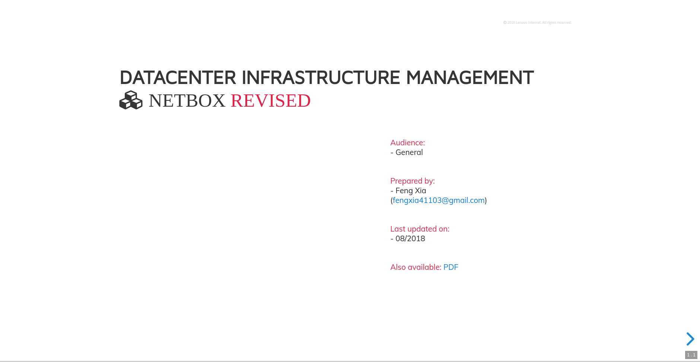
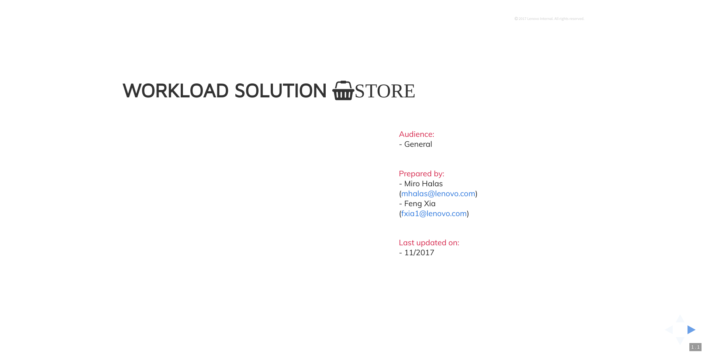

Title: Impression
Tags: thoughts
Slug: slides
Author: Feng Xia

  

    

      1236
      

        Album of photos taken between 2000 - 2017, memories
        I cherish and wish to re-live.
      

      <figure>
        
      </figure>
    

    

      <a href="https://fengxia41103.github.io/moment/1236/">
        <i class="fa fa-link"></i>slides
      </a>
    

  

  

    

      Netbox
      

      Datacenter Infrastructure Management using Netbox with added
      functions and new models.
      

      <figure>
        
      </figure>
    

    

      <a href="https://fengxia41103.github.io/moment/netbox/">
        <i class="fa fa-link"></i>slides
      </a>
    

  

  

    

      WSS
      

      Lenovo Workload Solution Store project based on Canonical Juju
      and Charms technology.
      

      <figure>
        
      </figure>
    

    

      <a href="https://fengxia41103.github.io/moment/wss/">
        <i class="fa fa-link"></i>slides
      </a>
    

  

<!-- 2. [workload solution store](/slides/wss/index.html) -->
