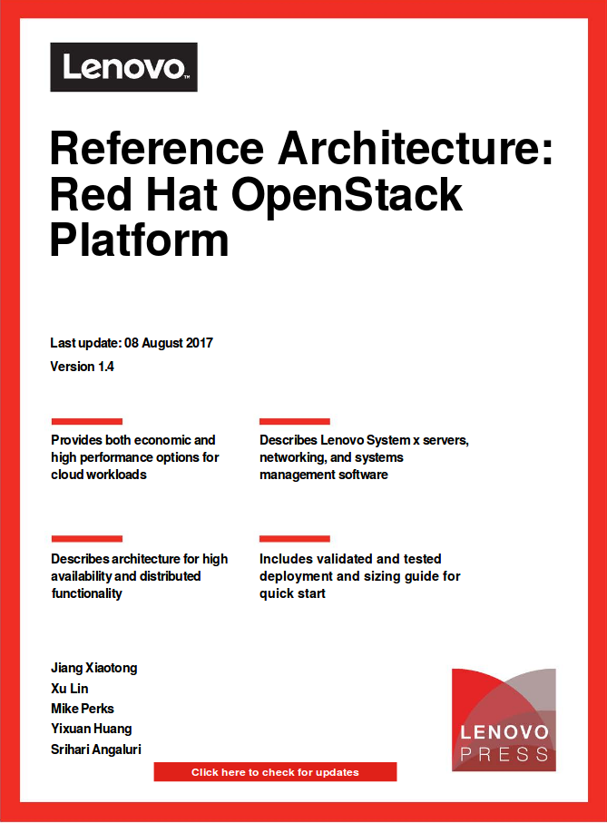

<h6>Redesign of Reference Architecture (RA)</h6>

1. Introduction
2. Reference Architecture POC
  1. user story
  1. WSS strategy
  3. WSS view of a UHM stack
  2. charm models
  3. dev
  4. testing
  4. build
  3. Demo
---
<h6>RA: **intro**</h6>

  

    <a href="https://lenovopress.com/lp0099.pdf">
      
      <i class="fa fa-external-link"></i>
    </a>
  

  

    
  

Note:
1. page 27: deployment example
---
Transform it in **three steps** <i class="fa fa-hand-o-right"></i>
---
<h6>
  1. Replace static HW & solution with **charms models <i class="fa fa-battery"></i>**
</h6>

  <iframe data-src="https://www3.lenovo.com/us/en/data-center/servers/racks/System-x3650-M5/p/77XS7HV7V64"
          class="col l7 m8 s12">
  </iframe>
  

    
  

**RA** = HW charms + platform charm + application charms

---
<h6>2. Replace manual deployment with **model-based** deployment</h6>

  <figure class="col s9">
    
  </figure>
  

    <ol>
      <li>
        Three primary types of charms:
        <ol>
          <li>HW (Lenovo innovation)</li>
          <li>software platform (existing)</li>
          <li>user application (existing)</li>
        </ol>
      </li><li>
        Support both baremetal and _clouds_ by implementing a **provider** &rarr; **give me a machine**
      </li>
    </ol>
  

---
<h6>3. Enable **BM management** integration</h6>
 
BM manager includes LXCA, MaaS, and others.
---
<h6>static model &rarr; charm model 101</h6>

1. **hierarchy** &rarr; abstract base model
2. **attributes** &rarr; configuration options
3. **data interface** &rarr; relations
4. **workflow** &rarr; states, hooks
5. **actions** &rarr; Ansible playbooks

---
<h6>
  Take server for example: 1. hierarchy
</h6>

  <iframe data-src="http://www.lenovofiles.com/3dtours/products/index.html">
  </iframe>

**Example**: server &rarr;  mainstream rack servers &rarr; SR630 
We can also design a base **charm-server**, then include it in _charm-sr630_
  to inherit base attributes and behaviors.

---
<h6>
  Take server for example: 2. configurations
</h6>

  

<pre class="brush:yaml">
options:
  # catalog attributes
  cpu_sockets:
    type: int
    default: 2
    description: ""
  max_25_disks:
    type: int
    default: 12
    description: ""
  max_25_disks:
    type: int
    default: 6
    description: ""

  # reference architecture attributes
  firmware_policy:
    type: string
    default: "policy ID 1231"
    description: ""
  config_pattern:
    type: string
    default: "config ID 367"
    description: ""

  # orchestration attributes
  uhm:
    type: string
    default: ""
    description: "Can be a YAML string"
</pre>
  

  

    Capture user-accessible configurations
    from each domain in our workflow so this becomes
    a gold copy of key-value pairs applicable
    to a specific HW & SW.
  

---
<h6>Take server for example: 3. relations</h6>

| from   | to     | data                       |
|--------|--------|----------------------------|
| server | rack   | announce server_id         |
| rack   | server | announce other servers' IP |
| server | switch | server_ip                  |
| switch | server | available ports            |

  

1. Define data interface between models independent from hierarchy.
2. Allow upstream-downstream data and status aggregation.
3. Make a service **reusable**.

---
<h6>Take server for example: 4. workflow</h6>

  

    
  

  

    <pre class="brush:python">
@when_not('endpoint.ready', 'endpoint.error')
def check_endpoint():
    """Check whether endpoint is ready.
    """
    set_state('endpoint.details.valid')

@when_not('endpoint.ready', 'endpoint.error')
@when('endpoint.details.valid')
def check_compliance():
    """Check firmware compliance.
    """
    run_uhm(playbook='check_compliance',
            tags='',
            current_state='endpoint.details.valid',
            next_state='endpoint.config.valid',
            error_state='endpoint.config.invalid')
    </pre>
  

---
<h6>Take server for example: 5. actions in Ansible playbook</h6>

  

    
  

  Define actions in playbook that can be independently executed
  from orchestrator technology.

---
<h6>**example**: reference architecture definition</h6>

---
<h6>**example**: Reference architecture manifest</h6>
<pre class="brush:js">
      {
    "solution": {
        "lxca": {
            "lxcaPatchUpdateFieldName": "update.tgz",
            "version": "2.4"
        },
        "compliancepolicies": {
            "name": "compliance",
            "rule": []
        },
        "manifestversion": "1.1",
        "hosts": [
            "bm",
            "esxi"
        ],
        "name": "Lenovo Converged HX Series Nutanix Appliances",
        "firmwareRepository": {
            "packFileName": "fixpack.tgz",
            "updateAccess": "m",
            "fixId": "fixpack"
        },
        "hardware": {
            "switches": {
                "machine_type": [
                    "ThinkSystem NE1072T RackSwitch"
                ]
            },
            "pdus": {
                "machine_type": [
                    "00YE443 Universal Rack PDU",
                    "39Y8941 DPI C13 Enterprise PDU "
                ]
            },
            "racks": {
                "machine_type": [
                    "Lenovo 42U 1200mm Deep Rack"
                ]
            },
            "servers": {
                "machine_type": [
                    "System x3650 M5 Rack Server",
                    "System x3550 M5 Rack Server"
                ]
            }
        },
        "workloads": [
            "ThinkCloud Openstack",
            "SAP HANA"
        ]
    }
}
</pre>
---
<h6>**example**: Reference architecture deployment</h6>

---
<h6>**Example**: a new solution manifest</h6>
<pre class="brush:js">
      {
    "solution": {
        "lxca": {
            "lxcaPatchUpdateFieldName": "update.tgz",
            "version": "2.4"
        },
        "compliancepolicies": {
            "name": "compliance",
            "rule": []
        },
        "manifestversion": "1.1",
        "hosts": [
            "bm",
            "esxi"
        ],
        "name": "Lenovo Converged HX Series Nutanix Appliances",
        "firmwareRepository": {
            "packFileName": "fixpack.tgz",
            "updateAccess": "m",
            "fixId": "fixpack"
        },
        "hardware": {
            "switches": {
                "machine_type": [
                    "ThinkSystem NE1072T RackSwitch"
                ]
            },
            "pdus": {
                "machine_type": [
                    "00YE443 Universal Rack PDU",
                    "39Y8941 DPI C13 Enterprise PDU "
                ]
            },
            "racks": {
                "machine_type": [
                    "Lenovo 42U 1200mm Deep Rack"
                ]
            },
            "servers": {
                "machine_type": [
                    "System x3650 M5 Rack Server",
                    "System x3550 M5 Rack Server"
                ]
            }
        },
        "workloads": [
            "ThinkCloud Openstack",
            "SAP HANA"
        ]
    }
}
</pre>
