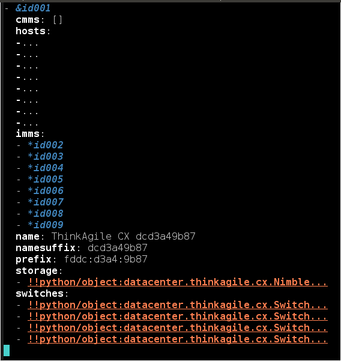

<!-- Section 1: challenges and project background -->

<section data-background="https://drscdn.500px.org/photo/155532687/q%3D80_m%3D2000/v2?webp=true&sig=4122d59c34dde5e01b0a8fd3b10e0330c3b053c27918e55a68464a1937237a34" class="row">
  
  

    Today's Vendor & Customer
    <h2>
      Challenges to Tackle
    </h2>
  

</section>
---
This is how it is being done today...
---
<h6>Lenovo hardware catalog</h6>

  

    <figure class="center-align">
      
    </figure>
  

  

    

      Hardware and solution in brochure is a **static**
      model.
    

    

      The intelligence of its configuration, management,
      and application are capture in documents and codes that are
      designed, developed, and maintained by **different principles
      that are not transparent to each other**.
    

    

      This makes it challenging for prospective user
      to perceive our HW beyond a "brick & mortar" stereotype.
    

  

---
<h6>Lenovo reference architecture</h6>

  

    <figure class="center-align">
      
    </figure>
  

  

    

      Reference architecture is defined in **Excel** and **PDF**.
    

    

      Instructions in such format are meant to be consumed by human
      operator in downstream operations, which introduce chance
      of variations in term of interpretation and operator error,
    

    

      Further, design criteria, such as **"4-16" of HX3310 of Nutanix
      appliances for HX PRC offering**, is difficult to enforce.
    

  

---
<h6>Lenovo sales configurator</h6>

  

    <figure class="center-align">
      
    </figure>
  

  

    XML:
    <pre class="brush:xml">
<ProductLineItem>
    <ProductLineNumber>1000</ProductLineNumber>
    <TransactionType>NEW</TransactionType>
    <CPUSIUvalue>1</CPUSIUvalue>
    <ProprietaryGroupIdentifier>1000</ProprietaryGroupIdentifier>
    <Quantity>3</Quantity>
    <ProductIdentification>
        <PartnerProductIdentification>
            <OrderedProductIdentifier>000000000</OrderedProductIdentifier>
            <ProprietaryProductIdentifier>8695-AC1</ProprietaryProductIdentifier>
            <ProductDescription><![CDATA[ Lenovo Converged HX Series 2U ]]></ProductDescription>
            <ProductTypeCode>Hardware</ProductTypeCode>
            <ProductIdentifierTypeCode>MTM-FC</ProductIdentifierTypeCode>
            <ProductName><![CDATA[ Server1 ]]></ProductName>
        </PartnerProductIdentification>
    </ProductIdentification>
</ProductLineItem>
    </pre>
  

  Sales/user configurations are saved in format of XML & CSV (xConfigurator) as shown above on the right. 

---
<h6>Lenovo MFG</h6>

  

    <figure class="center-align">
      
    </figure>
  

  

    

      Rubber meets the road.
    

    <ol>
      <li>Picklisting BOM to fullfill order &rarr; HW serial #, uuid, ...</li>
      <li>Instructions for wiring and configuration are **hidden** in reference architecture PDF, sales configurator XML & CSV..</li>
      <li>Configuring HW, installing OS and SW are largely based on paperware
        helped by scripts.</li>
    </ol>
  

---
<h6>Lenovo challenges</h6>

In our review of the current Lenovo processes,
we have identified **five** challenges
that WSS aims to bring user an improved
experience.

  

    1. Lack of visible _model_ to keep **consistency** from client's
    design board to delivered solution rack.

    Difficult to **validate** configuration vs. expectation.
  

  

    2. **Mixed** tools, scripts and manifests hidden in internal processes.

    Domain knowledge is maintained in mixed forms and is **implicit**,
    putting the business at risk.
  

  

    3. Cycle of solution deployment is executed in _weeks_. HW
    misconfiguration is not discovered until late in the game, making the
    process **inefficient** and **unreliable**.
  

  

    4. No orchestration capability from _HW to SW_ covering "full" stack.

    **End-to-end** is a not only a differentiator, but an **enabler** in
    product designs that Lenovo can leverage its strength in HW to
    support wide range of SW with confidence.
  

  

    5. Customers desire solutions across multiple **open** and **proprietary**
    platforms on premise or across clouds.
  

---
<h6>Question</h6>

Can we build a model-based tool to make these processes
more consistent and more automated?

**Yes, and read on.**
