# Components

## mwc.notification

### mwc-new-notification-bar {#mwc-new-notification-bar}

- class: `NewNotificationBar`
- used by:
  - [`mwc-notification`](#mwc-notification)

#### Sample screenshot

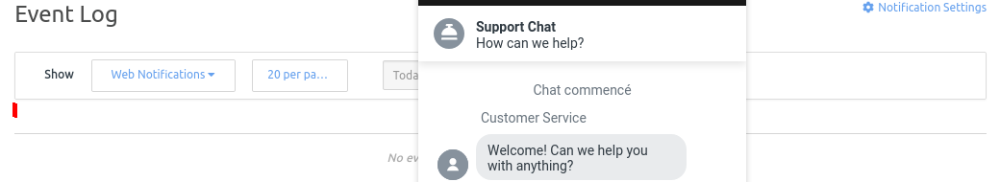{#fig:mwc-new-notification-bar}

-----

### mwc-notification {#mwc-notification}

- class: `NotificationComponent`
- using:
  - [`mwc-new-notification-bar`](#mwc-new-notification-bar)
  - [`mwc-notification-filter`](#mwc-notification-filter)
  - [`mwc-notification-top-button`](#mwc-notification-top-button)
  - [`mwc-notification-load-more`](#mwc-notification-load-more)
  - [`mwc-notification-list`](#mwc-notification-list)
- source file: `/home/fengxia/workspace/lenovo/olympia_ignite/mwc/src/main/webapp/app/notification/components/notifications/notification.component.ts`

#### Sample screenshot

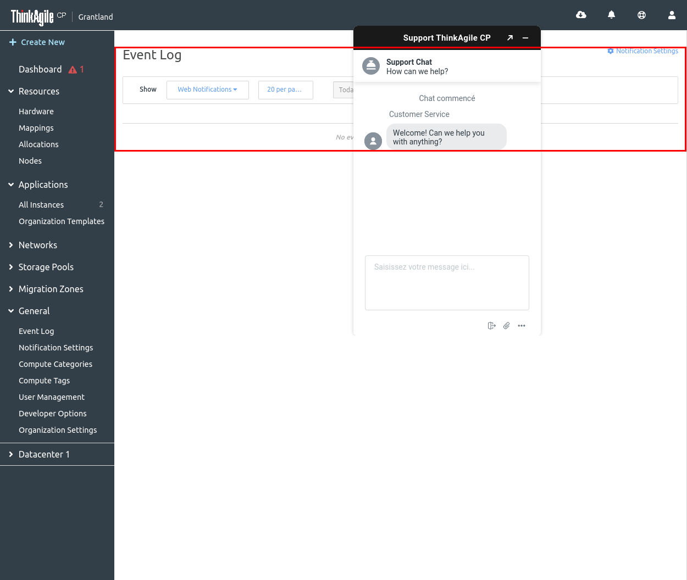{#fig:mwc-notification}

-----

### mwc-notification-actions-button {#mwc-notification-actions-button}

- class: `MwcNotificationActionsButtonComponent`
- used by:
  - [`mwc-notification-list`](#mwc-notification-list)

#### Sample screenshot

{#fig:mwc-notification-actions-button}

-----

### mwc-notification-filter {#mwc-notification-filter}

- class: `NotificationFilterComponent`
- using:
  - [`mwc-dropdown-menu`](#mwc-dropdown-menu)
  - [`mwc-dropdown-menu-default`](#mwc-dropdown-menu-default)
- used by:
  - [`mwc-notification`](#mwc-notification)
- source file: `/home/fengxia/workspace/lenovo/olympia_ignite/mwc/src/main/webapp/app/notification/components/notification-filter/notification-filter.component.ts`

#### Sample screenshot

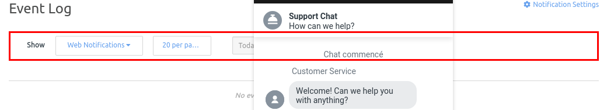{#fig:mwc-notification-filter}

-----

### mwc-notification-list {#mwc-notification-list}

- class: `NotificationListComponent`
- using:
  - [`mwc-notification-actions-button`](#mwc-notification-actions-button)
  - [`mwc-date-time`](#mwc-date-time)
- used by:
  - [`mwc-notification`](#mwc-notification)
- source file: `/home/fengxia/workspace/lenovo/olympia_ignite/mwc/src/main/webapp/app/notification/components/notification-list/notification-list.component.ts`

#### Sample screenshot

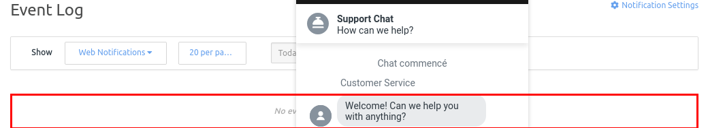{#fig:mwc-notification-list}

-----

### mwc-notification-load-more {#mwc-notification-load-more}

- class: `NotificationLoadMoreComponent`
- used by:
  - [`mwc-notification`](#mwc-notification)

#### Sample screenshot

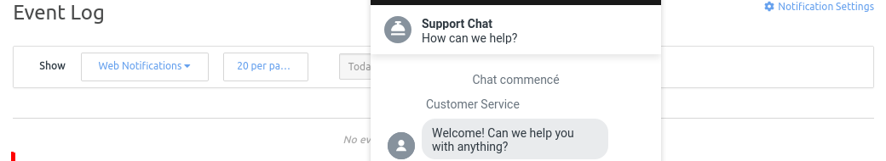{#fig:mwc-notification-load-more}

-----

### mwc-notification-top-button {#mwc-notification-top-button}

- class: `MwcNotificationTopButtonComponent`
- used by:
  - [`mwc-notification`](#mwc-notification)

#### Sample screenshot

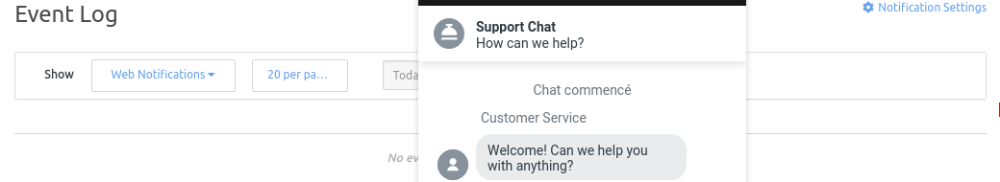{#fig:mwc-notification-top-button}

-----

## mwc.directives

### mwc-recaptcha-box {#mwc-recaptcha-box}

- class: `RecaptchaBoxController`
- used by:
  - [`mwc-login`](#mwc-login)
  - [`mwc-create-account`](#mwc-create-account)
  - [`mwc-forgot-password`](#mwc-forgot-password)
  - [`mwc-detect-network-router-modal`](#mwc-detect-network-router-modal)

#### Sample screenshot

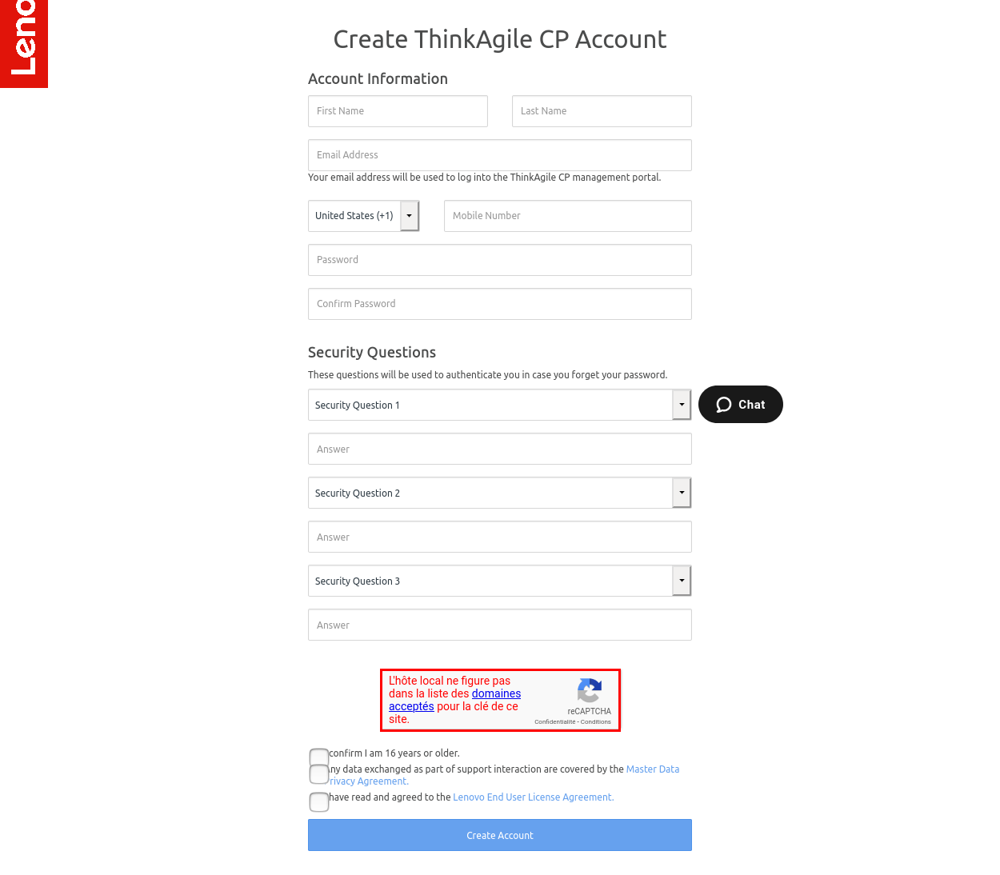{#fig:mwc-recaptcha-box}

-----

## mwc.network

### mwc-create-vlan-component {#mwc-create-vlan-component}

- class: `CreateVlanComponent`

#### Sample screenshot

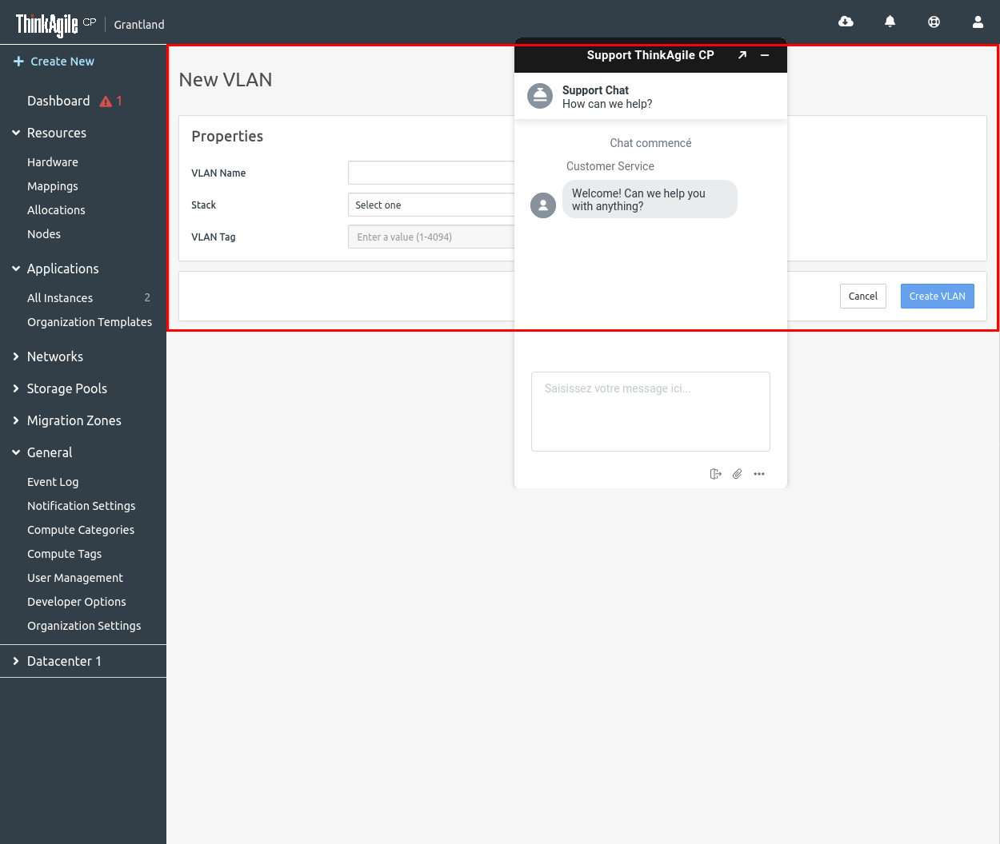{#fig:mwc-create-vlan-component}

-----

### mwc-create-vnet-form {#mwc-create-vnet-form}

- class: `CreateVnetFormComponent`
- using:
  - [`mwc-network-nfv-form`](#mwc-network-nfv-form)
  - [`mwc-network-services-form`](#mwc-network-services-form)
  - [`mwc-network-vnet-properties-form`](#mwc-network-vnet-properties-form)
  - [`mwc-network-firewall-settings-container`](#mwc-network-firewall-settings-container)
  - [`mwc-dhcp-service-form-container`](#mwc-dhcp-service-form-container)
- source file: `/home/fengxia/workspace/lenovo/olympia_ignite/mwc/src/main/webapp/app/network/components/create-vnet/create-vnet-form.component.ts`

#### Sample screenshot

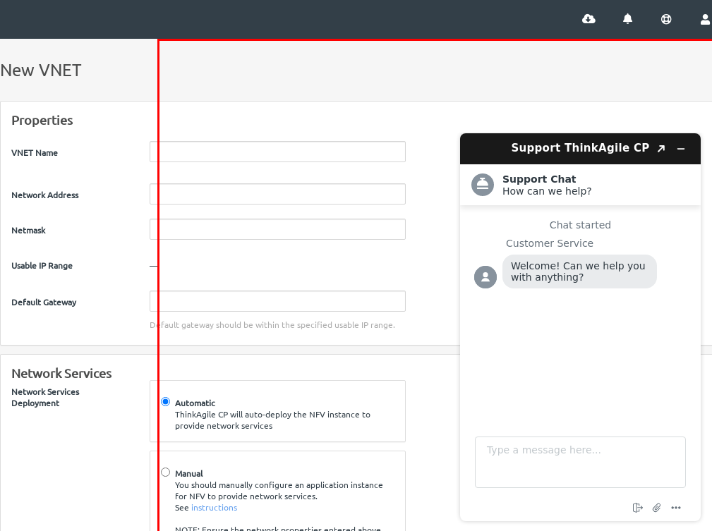{#fig:mwc-create-vnet-form}

-----

### mwc-delete-network-with-applications-modal {#mwc-delete-network-with-applications-modal}

- class: `DeleteNetworkWithApplicationsModalComponent`
- using:
  - [`mwc-application-action-plan-table`](#mwc-application-action-plan-table)
- source file: `/home/fengxia/workspace/lenovo/olympia_ignite/mwc/src/main/webapp/app/network/components/delete-network-with-applications-modal/delete-network-with-applications-modal.component.ts`

#### Sample screenshot

{#fig:mwc-delete-network-with-applications-modal}

-----

### mwc-deploy-nfv-instance-modal {#mwc-deploy-nfv-instance-modal}

- class: `DeployNfvInstanceModalComponent`
- using:
  - [`mwc-nfv-deployment-options-form`](#mwc-nfv-deployment-options-form)
  - [`mwc-network-outside-interface`](#mwc-network-outside-interface)
  - [`mwc-network-firewall-settings`](#mwc-network-firewall-settings)
- source file: `/home/fengxia/workspace/lenovo/olympia_ignite/mwc/src/main/webapp/app/network/components/edit-vnet/deploy-nfv-instance-modal/deploy-nfv-instance-modal.component.ts`

#### Sample screenshot

-----

### mwc-dhcp-service-form {#mwc-dhcp-service-form}

- class: `DhcpServicesFormComponent`
- using:
  - [`mwc-static-binding-rules-table`](#mwc-static-binding-rules-table)
- used by:
  - [`mwc-edit-vnet-properties`](#mwc-edit-vnet-properties)
  - [`mwc-dhcp-service-form-container`](#mwc-dhcp-service-form-container)
- source file: `/home/fengxia/workspace/lenovo/olympia_ignite/mwc/src/main/webapp/app/network/components/create-vnet/dhcp-service-form/dhcp-service-form.component.ts`

#### Sample screenshot

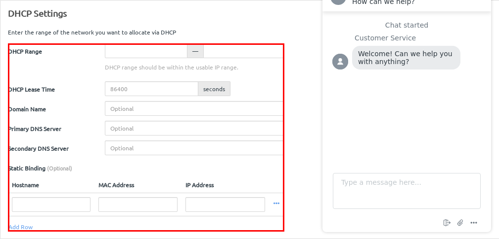{#fig:mwc-dhcp-service-form}

-----

### mwc-dhcp-service-form-container {#mwc-dhcp-service-form-container}

- class: `DhcpServicesFormContainerComponent`
- using:
  - [`mwc-dhcp-service-form`](#mwc-dhcp-service-form)
- used by:
  - [`mwc-create-vnet-form`](#mwc-create-vnet-form)
- source file: `/home/fengxia/workspace/lenovo/olympia_ignite/mwc/src/main/webapp/app/network/components/create-vnet/dhcp-service-form-container/dhcp-service-form-container.component.ts`

#### Sample screenshot

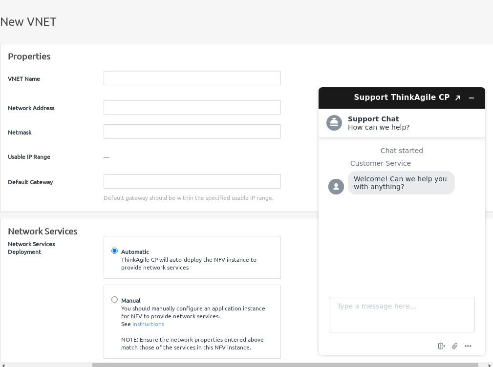{#fig:mwc-dhcp-service-form-container}

-----

### mwc-edit-network-firewall-profile-modal {#mwc-edit-network-firewall-profile-modal}

- class: `EditNetworkFirewallProfileModalComponent`

#### Sample screenshot

{#fig:mwc-edit-network-firewall-profile-modal}

-----

### mwc-edit-vnet-properties {#mwc-edit-vnet-properties}

- class: `EditNetworkBasicPropertiesModalComponent`
- using:
  - [`mwc-network-usable-ip-range-form`](#mwc-network-usable-ip-range-form)
  - [`mwc-dhcp-service-form`](#mwc-dhcp-service-form)
- source file: `/home/fengxia/workspace/lenovo/olympia_ignite/mwc/src/main/webapp/app/network/components/edit-vnet/edit-vnet-properties/edit-vnet-properties.component.ts`

#### Sample screenshot

{#fig:mwc-edit-vnet-properties}

-----

### mwc-link-nfv-instance-modal {#mwc-link-nfv-instance-modal}

- class: `LinkNfvInstanceModalComponent`

#### Sample screenshot

-----

### mwc-network {#mwc-network}

- class: `NetworkComponent`
- using:
  - [`mwc-network-table`](#mwc-network-table)
- source file: `/home/fengxia/workspace/lenovo/olympia_ignite/mwc/src/main/webapp/app/network/components/network/network.component.ts`

#### Sample screenshot

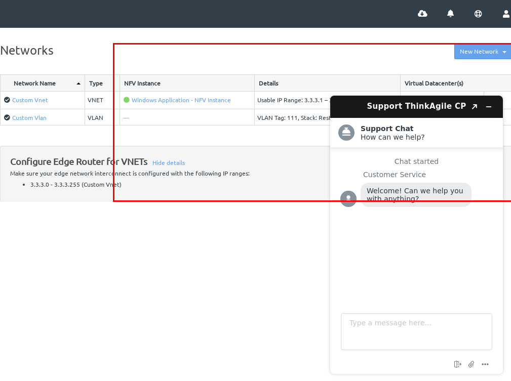{#fig:mwc-network}

-----

### mwc-network-actions-button {#mwc-network-actions-button}

- class: `MwcNetworkActionsButtonComponent`
- using:
  - [`mwc-network-vlan-action-button-items`](#mwc-network-vlan-action-button-items)
  - [`mwc-network-vnet-action-button-items`](#mwc-network-vnet-action-button-items)
- used by:
  - [`mwc-network-properties`](#mwc-network-properties)
  - [`mwc-network-table`](#mwc-network-table)
- source file: `/home/fengxia/workspace/lenovo/olympia_ignite/mwc/src/main/webapp/app/network/components/network-actions-button/network-actions-button.component.ts`

#### Sample screenshot

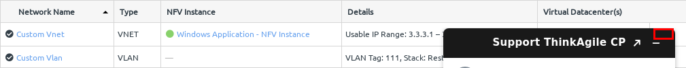{#fig:mwc-network-actions-button}

-----

### mwc-network-assign-datacenters {#mwc-network-assign-datacenters}

- class: `NetworkAssignDatacentersComponent`

#### Sample screenshot

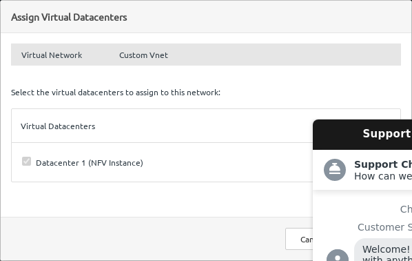{#fig:mwc-network-assign-datacenters}

-----

### mwc-network-assigned-datacenters {#mwc-network-assigned-datacenters}

- class: `NetworkAssignedDatacentersComponent`

#### Sample screenshot

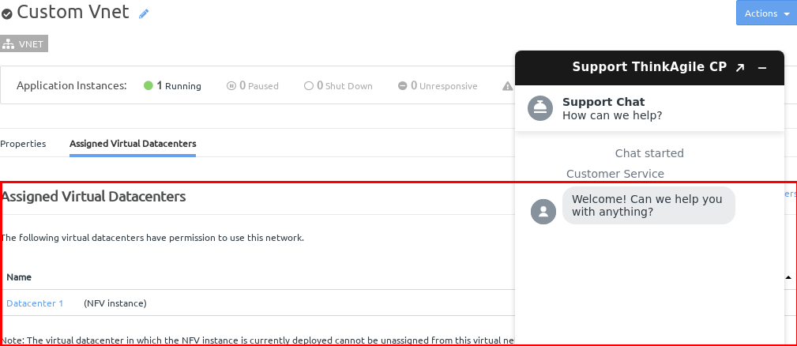{#fig:mwc-network-assigned-datacenters}

-----

### mwc-network-firewall-settings {#mwc-network-firewall-settings}

- class: `NetworkFirewallSettingsComponent`
- using:
  - [`mwc-dropdown-menu`](#mwc-dropdown-menu)
  - [`mwc-dropdown-menu-default`](#mwc-dropdown-menu-default)
- used by:
  - [`mwc-deploy-nfv-instance-modal`](#mwc-deploy-nfv-instance-modal)
  - [`mwc-network-firewall-settings-container`](#mwc-network-firewall-settings-container)
- source file: `/home/fengxia/workspace/lenovo/olympia_ignite/mwc/src/main/webapp/app/network/components/create-vnet/network-firewall-settings/network-firewall-settings.component.ts`

#### Sample screenshot

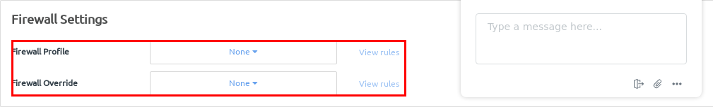{#fig:mwc-network-firewall-settings}

-----

### mwc-network-firewall-settings-container {#mwc-network-firewall-settings-container}

- class: `NetworkFirewallSettingsContainerComponent`
- using:
  - [`mwc-network-firewall-settings`](#mwc-network-firewall-settings)
- used by:
  - [`mwc-create-vnet-form`](#mwc-create-vnet-form)
- source file: `/home/fengxia/workspace/lenovo/olympia_ignite/mwc/src/main/webapp/app/network/components/create-vnet/network-firewall-settings-container/network-firewall-settings-container.component.ts`

#### Sample screenshot

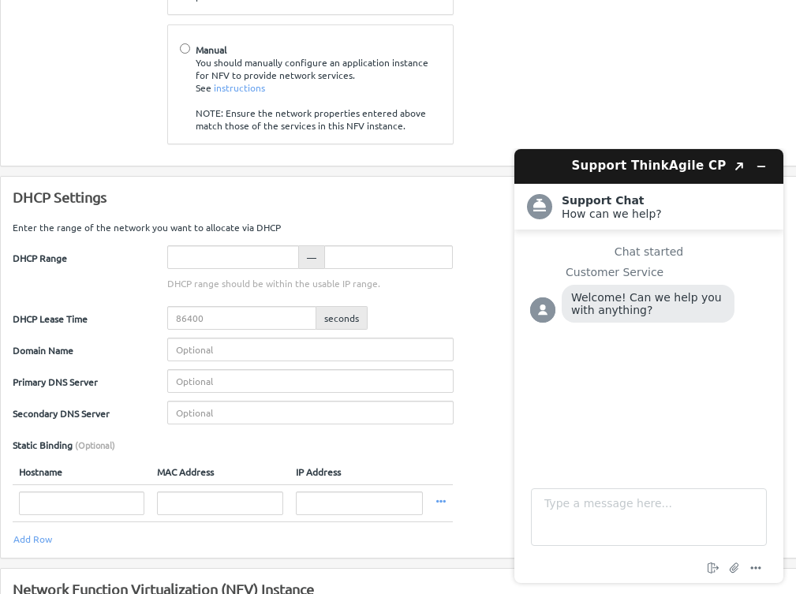{#fig:mwc-network-firewall-settings-container}

-----

### mwc-network-function-virtualization-form {#mwc-network-function-virtualization-form}

- class: `NetworkFunctionVirtualizationFormComponent`
- using:
  - [`mwc-nfv-deployment-options-form`](#mwc-nfv-deployment-options-form)
- used by:
  - [`mwc-network-nfv-form`](#mwc-network-nfv-form)
- source file: `/home/fengxia/workspace/lenovo/olympia_ignite/mwc/src/main/webapp/app/network/components/create-vnet/network-function-virtualization-form/network-function-virtualization-form.component.ts`

#### Sample screenshot

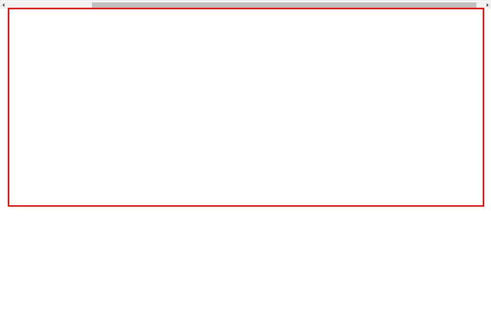{#fig:mwc-network-function-virtualization-form}

-----

### mwc-network-nfv-form {#mwc-network-nfv-form}

- class: `NetworkNfvFormComponent`
- using:
  - [`mwc-network-function-virtualization-form`](#mwc-network-function-virtualization-form)
  - [`mwc-network-outside-interface`](#mwc-network-outside-interface)
- used by:
  - [`mwc-create-vnet-form`](#mwc-create-vnet-form)
- source file: `/home/fengxia/workspace/lenovo/olympia_ignite/mwc/src/main/webapp/app/network/components/create-vnet/network-nfv-form/network-nfv-form.component.ts`

#### Sample screenshot

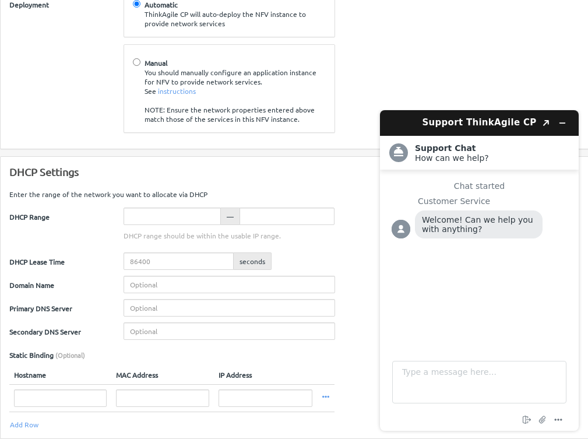{#fig:mwc-network-nfv-form}

-----

### mwc-network-outside-interface {#mwc-network-outside-interface}

- class: `NetworkOutsideInterfaceComponent`
- using:
  - [`mwc-dropdown-menu`](#mwc-dropdown-menu)
  - [`mwc-dropdown-menu-default`](#mwc-dropdown-menu-default)
- used by:
  - [`mwc-network-nfv-form`](#mwc-network-nfv-form)
  - [`mwc-edit-vnic-outside-interface-modal`](#mwc-edit-vnic-outside-interface-modal)
  - [`mwc-deploy-nfv-instance-modal`](#mwc-deploy-nfv-instance-modal)
- source file: `/home/fengxia/workspace/lenovo/olympia_ignite/mwc/src/main/webapp/app/network/components/create-vnet/network-services-form/network-outside-interface/network-outside-interface.component.ts`

#### Sample screenshot

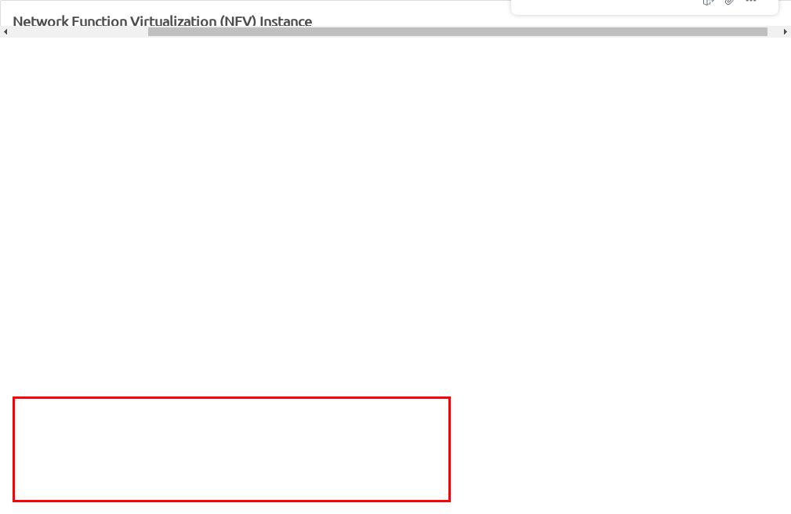{#fig:mwc-network-outside-interface}

-----

### mwc-network-properties {#mwc-network-properties}

- class: `NetworkPropertiesComponent`
- using:
  - [`mwc-network-actions-button`](#mwc-network-actions-button)
  - [`mwc-application-summary-panel`](#mwc-application-summary-panel)
  - [`mwc-network-status-icon`](#mwc-network-status-icon)
- source file: `/home/fengxia/workspace/lenovo/olympia_ignite/mwc/src/main/webapp/app/network/components/network-properties/network-properties.component.ts`

#### Sample screenshot

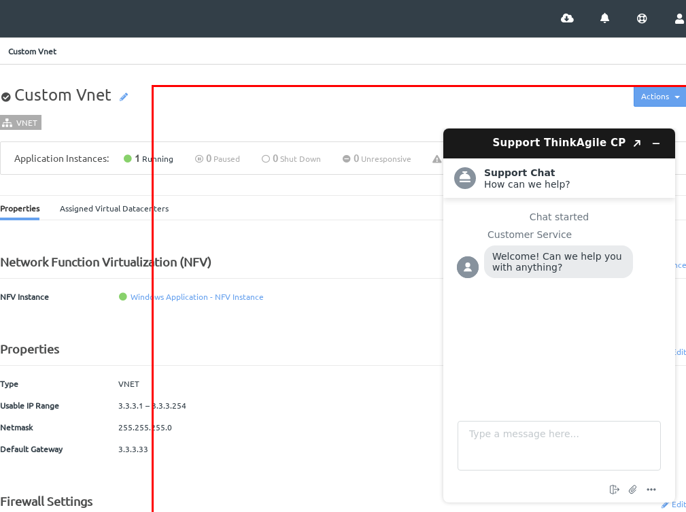{#fig:mwc-network-properties}

-----

### mwc-network-services-form {#mwc-network-services-form}

- class: `NetworkServicesFormComponent`
- used by:
  - [`mwc-create-vnet-form`](#mwc-create-vnet-form)

#### Sample screenshot

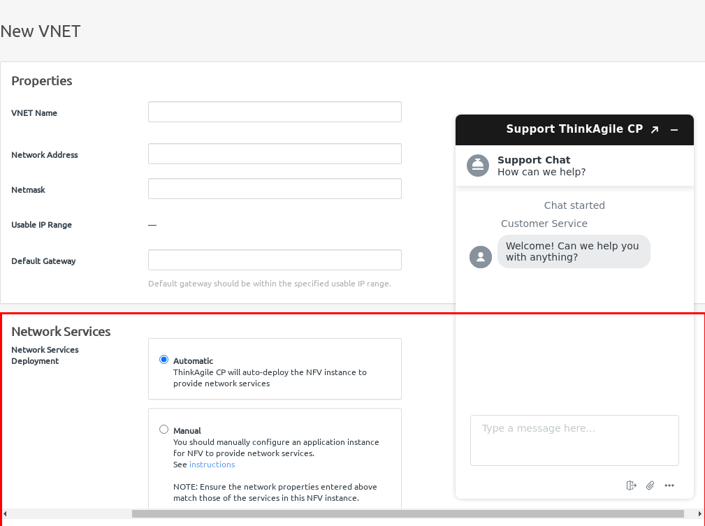{#fig:mwc-network-services-form}

-----

### mwc-network-status-icon {#mwc-network-status-icon}

- class: `NetworkStatusIconComponent`
- used by:
  - [`mwc-network-properties`](#mwc-network-properties)
  - [`mwc-network-table`](#mwc-network-table)

#### Sample screenshot

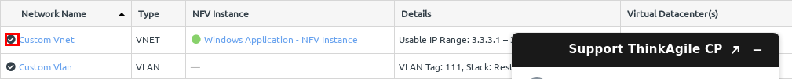{#fig:mwc-network-status-icon}

-----

### mwc-network-table {#mwc-network-table}

- class: `NetworkTableComponent`
- using:
  - [`mwc-network-actions-button`](#mwc-network-actions-button)
  - [`mwc-application-status-icons`](#mwc-application-status-icons)
  - [`mwc-network-status-icon`](#mwc-network-status-icon)
- used by:
  - [`mwc-firewall-profile-properties`](#mwc-firewall-profile-properties)
  - [`mwc-datacenter-resources-page`](#mwc-datacenter-resources-page)
  - [`mwc-network`](#mwc-network)
- source file: `/home/fengxia/workspace/lenovo/olympia_ignite/mwc/src/main/webapp/app/network/components/network-table/network-table.component.ts`

#### Sample screenshot

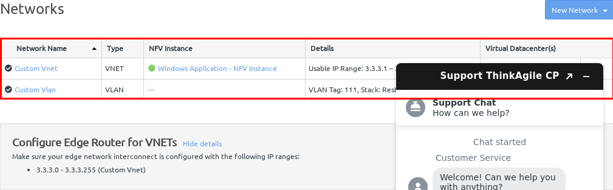{#fig:mwc-network-table}

-----

### mwc-network-usable-ip-range-form {#mwc-network-usable-ip-range-form}

- class: `NetworkUsableIpRangeFormComponent`
- used by:
  - [`mwc-edit-vnet-properties`](#mwc-edit-vnet-properties)
  - [`mwc-network-vnet-properties-form`](#mwc-network-vnet-properties-form)

#### Sample screenshot

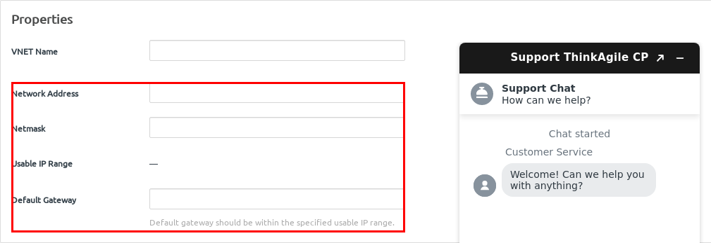{#fig:mwc-network-usable-ip-range-form}

-----

### mwc-network-vlan-action-button-items {#mwc-network-vlan-action-button-items}

- class: `MwcNetworkVlanActionsComponent`
- used by:
  - [`mwc-network-actions-button`](#mwc-network-actions-button)

#### Sample screenshot

{#fig:mwc-network-vlan-action-button-items}

-----

### mwc-network-vnet-action-button-items {#mwc-network-vnet-action-button-items}

- class: `MwcNetworkVnetActionsComponent`
- using:
  - [`mwc-network-service-application-action-items`](#mwc-network-service-application-action-items)
- used by:
  - [`mwc-network-actions-button`](#mwc-network-actions-button)
- source file: `/home/fengxia/workspace/lenovo/olympia_ignite/mwc/src/main/webapp/app/network/components/network-actions-button/network-vnet-actions/network-vnet-actions.component.ts`

#### Sample screenshot

{#fig:mwc-network-vnet-action-button-items}

-----

### mwc-network-vnet-properties-form {#mwc-network-vnet-properties-form}

- class: `NetworkVnetPropertiesFormComponent`
- using:
  - [`mwc-network-usable-ip-range-form`](#mwc-network-usable-ip-range-form)
- used by:
  - [`mwc-create-vnet-form`](#mwc-create-vnet-form)
- source file: `/home/fengxia/workspace/lenovo/olympia_ignite/mwc/src/main/webapp/app/network/components/create-vnet/network-vnet-properties-form/network-vnet-properties-form.component.ts`

#### Sample screenshot

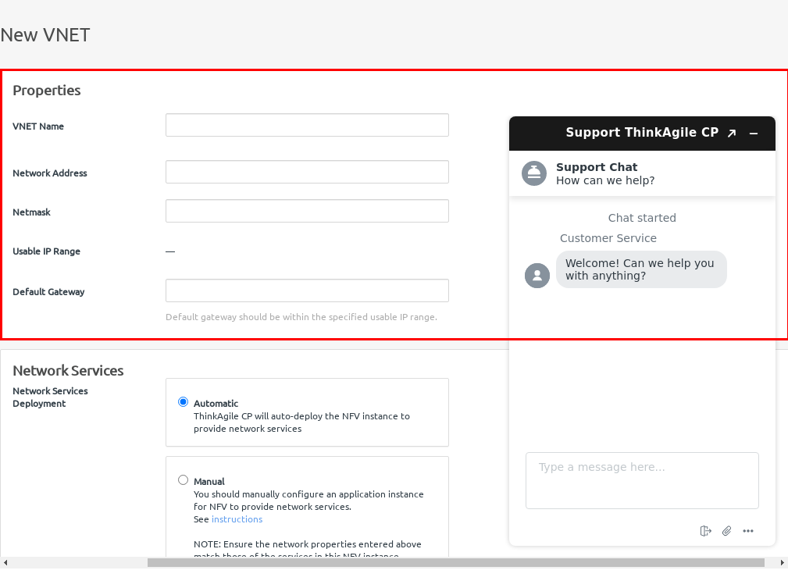{#fig:mwc-network-vnet-properties-form}

-----

### mwc-nfv-deployment-options-form {#mwc-nfv-deployment-options-form}

- class: `NfvDeploymentOptionsFormComponent`
- using:
  - [`mwc-dropdown-menu`](#mwc-dropdown-menu)
  - [`mwc-dropdown-menu-default`](#mwc-dropdown-menu-default)
- used by:
  - [`mwc-network-function-virtualization-form`](#mwc-network-function-virtualization-form)
  - [`mwc-deploy-nfv-instance-modal`](#mwc-deploy-nfv-instance-modal)
- source file: `/home/fengxia/workspace/lenovo/olympia_ignite/mwc/src/main/webapp/app/network/components/nfv-deployment-options-form/nfv-deployment-options-form.component.ts`

#### Sample screenshot

{#fig:mwc-nfv-deployment-options-form}

-----

### mwc-remove-nfv-instance-modal {#mwc-remove-nfv-instance-modal}

- class: `RemoveNfvInstanceModalComponent`

#### Sample screenshot

{#fig:mwc-remove-nfv-instance-modal}

-----

### mwc-static-binding-rules-table {#mwc-static-binding-rules-table}

- class: `NetworkStaticBindingRulesTableComponent`
- used by:
  - [`mwc-dhcp-service-form`](#mwc-dhcp-service-form)

#### Sample screenshot

-----

### mwc-unassign-vdc-modal {#mwc-unassign-vdc-modal}

- class: `UnassignVdcModal`
- using:
  - [`mwc-action-plan-table`](#mwc-action-plan-table)
- source file: `/home/fengxia/workspace/lenovo/olympia_ignite/mwc/src/main/webapp/app/network/components/unassign-vdc-modal/unassign-vdc-modal.component.ts`

#### Sample screenshot

{#fig:mwc-unassign-vdc-modal}

-----

### mwc-unlink-nfv-instance-modal {#mwc-unlink-nfv-instance-modal}

- class: `UnlinkNfvInstanceModalComponent`

#### Sample screenshot

{#fig:mwc-unlink-nfv-instance-modal}

-----

### mwc-vnet-dhcp-service-properties {#mwc-vnet-dhcp-service-properties}

- class: `VnetDhcpServiceProperties`

#### Sample screenshot

{#fig:mwc-vnet-dhcp-service-properties}

-----

### mwc-vnet-firewall-profile {#mwc-vnet-firewall-profile}

- class: `VnetFirewallProfileComponent`

#### Sample screenshot

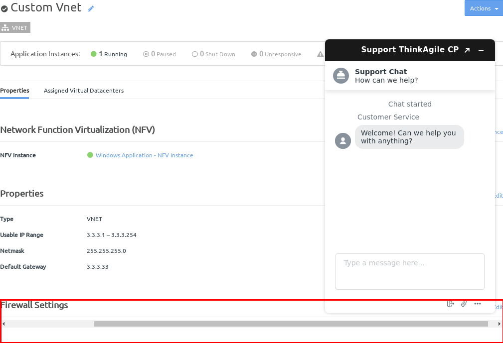{#fig:mwc-vnet-firewall-profile}

-----

### mwc-vnet-inside-interface-properties {#mwc-vnet-inside-interface-properties}

- class: `VnetInsideInterfacePropertiesComponent`

#### Sample screenshot

{#fig:mwc-vnet-inside-interface-properties}

-----

### mwc-vnet-routing-service-properties {#mwc-vnet-routing-service-properties}

- class: `VnetRoutingServiceComponent`

#### Sample screenshot

{#fig:mwc-vnet-routing-service-properties}

-----

## mwc.host.category

### mwc-compute-categories {#mwc-compute-categories}

- class: `ComputeCategories`

#### Sample screenshot

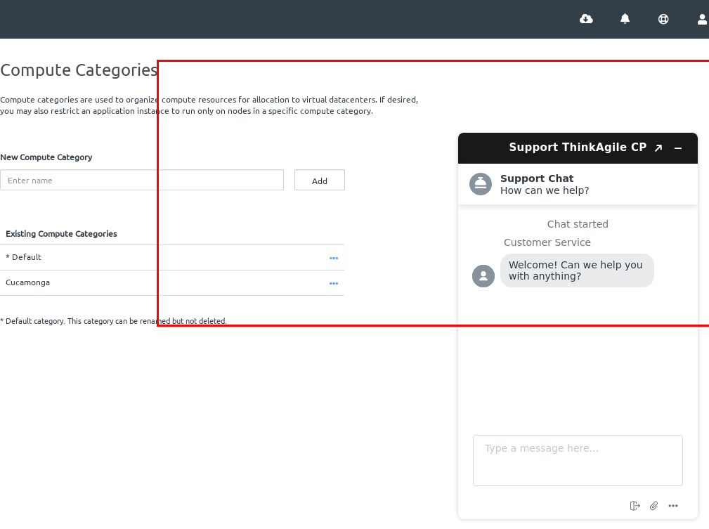{#fig:mwc-compute-categories}

-----

### mwc-delete-host-category-modal {#mwc-delete-host-category-modal}

- class: `DeleteHostCategoryModal`

#### Sample screenshot

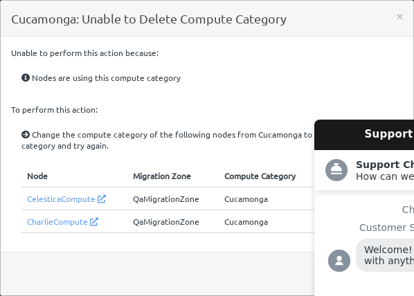{#fig:mwc-delete-host-category-modal}

-----

### mwc-rename-compute-category-modal {#mwc-rename-compute-category-modal}

- class: `RenameComputeCategoryModal`

#### Sample screenshot

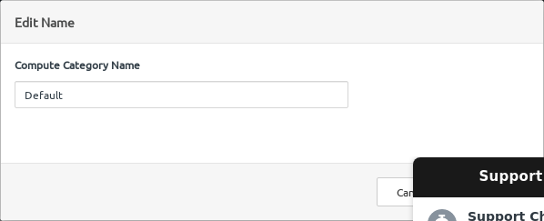{#fig:mwc-rename-compute-category-modal}

-----

## mwc.notification-settings

### mwc-notification-settings {#mwc-notification-settings}

- class: `NotificationSettingsComponent`
- using:
  - [`mwc-notification-settings-table`](#mwc-notification-settings-table)
- source file: `/home/fengxia/workspace/lenovo/olympia_ignite/mwc/src/main/webapp/app/notification-settings/components/notification-settings/notification-settings.component.ts`

#### Sample screenshot

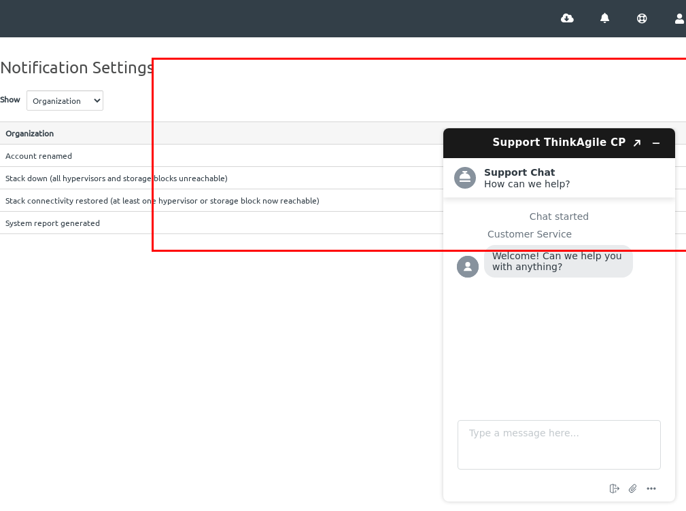{#fig:mwc-notification-settings}

-----

### mwc-notification-settings-table {#mwc-notification-settings-table}

- class: `NotificationSettingsTableComponent`
- used by:
  - [`mwc-notification-settings`](#mwc-notification-settings)

#### Sample screenshot

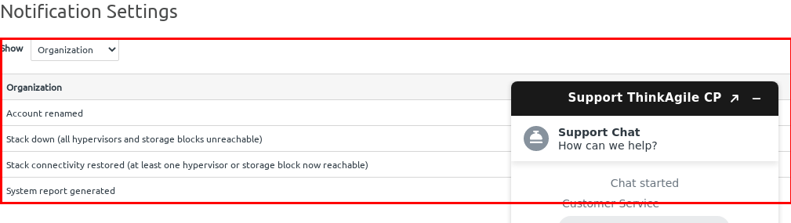{#fig:mwc-notification-settings-table}

-----

## mwc.datacenter

### application-usage-table {#application-usage-table}

- class: `ApplicationUsageTableComponent`

#### Sample screenshot

{#fig:application-usage-table}

-----

### mwc-compute-storage-resources-table {#mwc-compute-storage-resources-table}

- class: `ComputeStorageResourcesTableComponent`
- used by:
  - [`mwc-datacenter-resources-page`](#mwc-datacenter-resources-page)

#### Sample screenshot

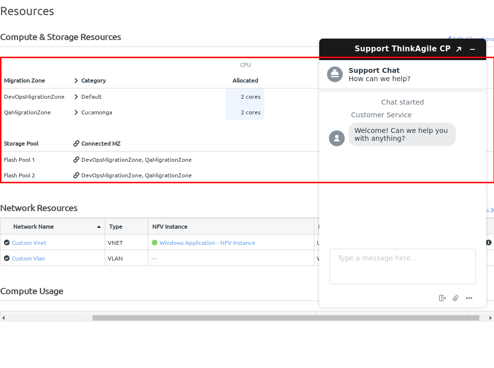{#fig:mwc-compute-storage-resources-table}

-----

### mwc-create-datacenter {#mwc-create-datacenter}

- class: `CreateDatacenterComponent`
- using:
  - [`mwc-disaster-recovery-panel`](#mwc-disaster-recovery-panel)
  - [`mwc-disaster-recovery-badge`](#mwc-disaster-recovery-badge)
  - [`mwc-available-resources-table`](#mwc-available-resources-table)
- source file: `/home/fengxia/workspace/lenovo/olympia_ignite/mwc/src/main/webapp/app/datacenter/components/create/create-datacenter.component.ts`

#### Sample screenshot

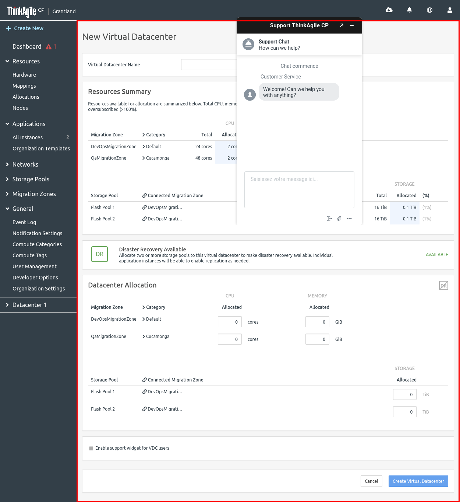{#fig:mwc-create-datacenter}

-----

### mwc-datacenter-snapshot-tab {#mwc-datacenter-snapshot-tab}

- class: `DatacenterSnapshotTabComponent`
- used by:
  - [`mwc-disaster-recovery`](#mwc-disaster-recovery)

#### Sample screenshot

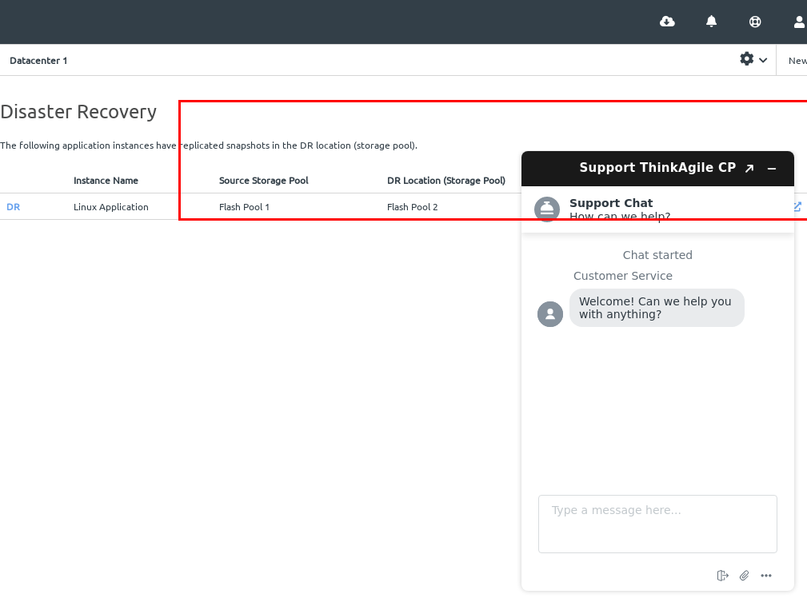{#fig:mwc-datacenter-snapshot-tab}

-----

### mwc-incomplete-datacenter-modal {#mwc-incomplete-datacenter-modal}

- class: `MwcIncompleteDatacenterModalComponent`

#### Sample screenshot

{#fig:mwc-incomplete-datacenter-modal}

-----

### mwc-vdc-activity {#mwc-vdc-activity}

- class: `DatacenterActivityComponent`
- used by:
  - [`mwc-vdc-properties`](#mwc-vdc-properties)

#### Sample screenshot

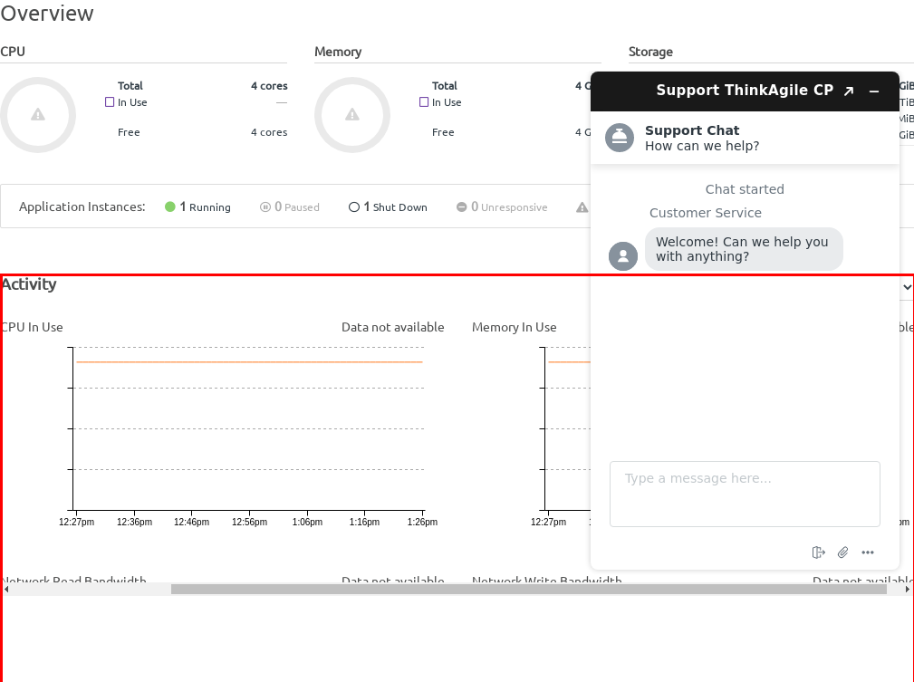{#fig:mwc-vdc-activity}

-----

### mwc-datacenter-applications {#mwc-datacenter-applications}

- class: `DatacenterApplicationsComponent`
- using:
  - [`mwc-application-instructions`](#mwc-application-instructions)
  - [`mwc-application-stats-table`](#mwc-application-stats-table)
  - [`mwc-filter-by-dropdown`](#mwc-filter-by-dropdown)
  - [`mwc-application-bulk-action-panel`](#mwc-application-bulk-action-panel)
- source file: `/home/fengxia/workspace/lenovo/olympia_ignite/mwc/src/main/webapp/app/datacenter/components/vdc-instances/vdc-instances.component.ts`

#### Sample screenshot

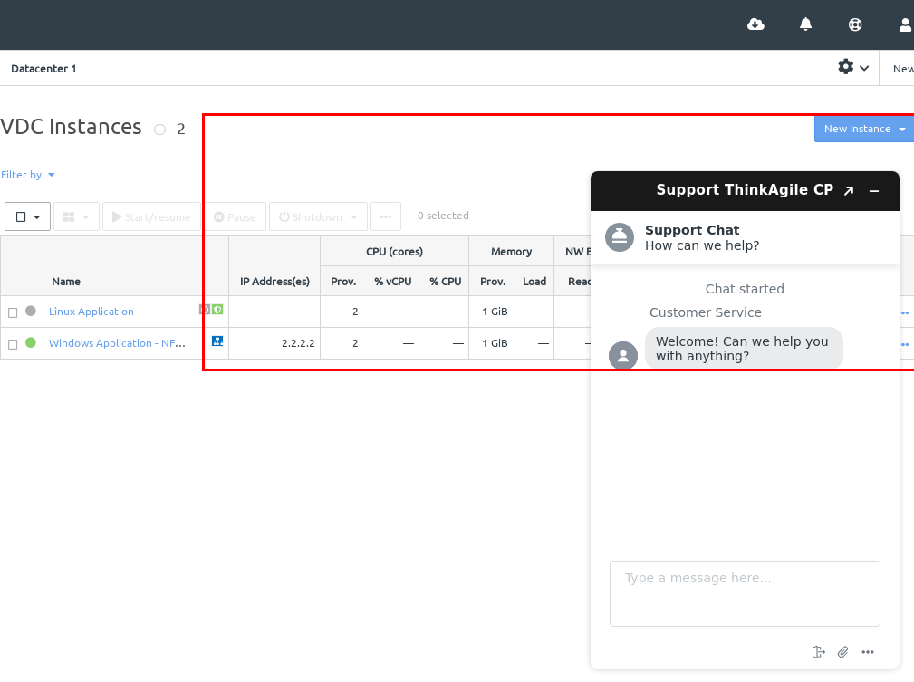{#fig:mwc-datacenter-applications}

-----

### mwc-vdc-properties {#mwc-vdc-properties}

- class: `DatacenterPropertiesComponent`
- using:
  - [`mwc-vdc-activity`](#mwc-vdc-activity)
  - [`mwc-application-summary-panel`](#mwc-application-summary-panel)
- source file: `/home/fengxia/workspace/lenovo/olympia_ignite/mwc/src/main/webapp/app/datacenter/components/vdc-properties/vdc-properties.component.ts`

#### Sample screenshot

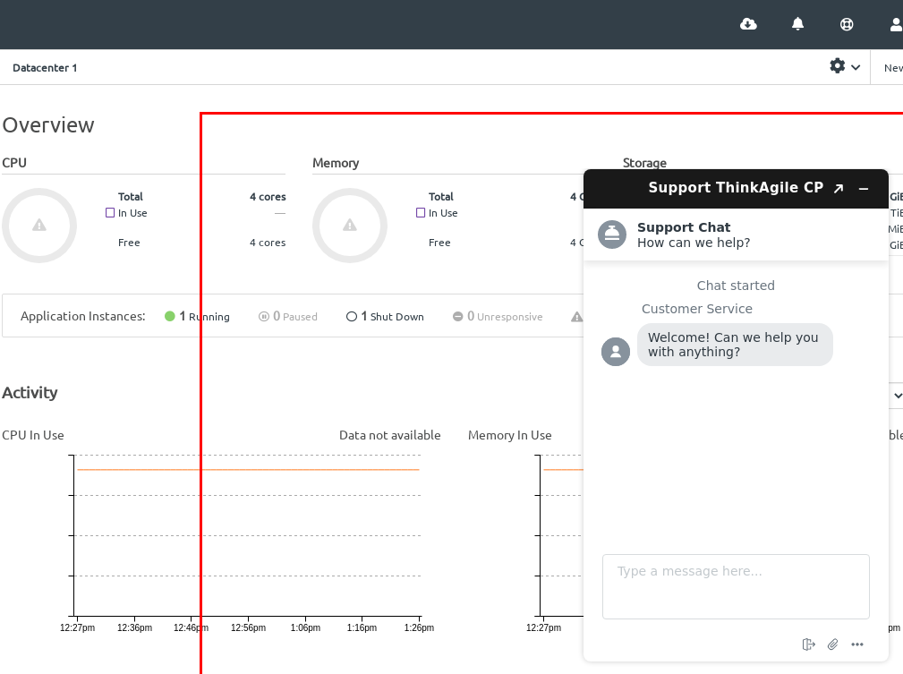{#fig:mwc-vdc-properties}

-----

### mwc-datacenter-resources-page {#mwc-datacenter-resources-page}

- class: `VdcResourcesPageComponent`
- using:
  - [`mwc-compute-storage-resources-table`](#mwc-compute-storage-resources-table)
  - [`mwc-network-table`](#mwc-network-table)
- source file: `/home/fengxia/workspace/lenovo/olympia_ignite/mwc/src/main/webapp/app/datacenter/components/vdc-resources/vdc-resources.component.ts`

#### Sample screenshot

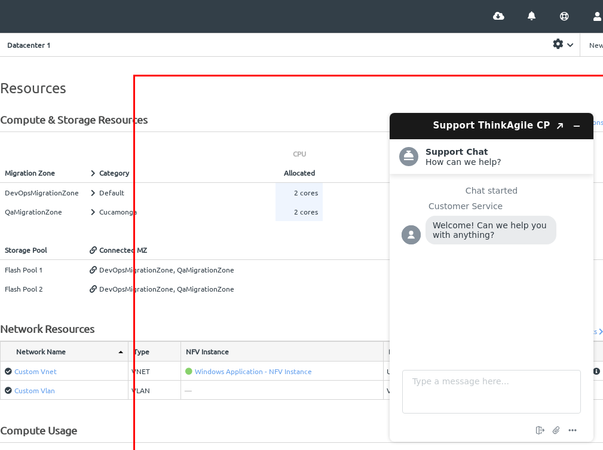{#fig:mwc-datacenter-resources-page}

-----

### mwc-vdc-templates {#mwc-vdc-templates}

- class: `DatacenterTemplatesComponent`
- using:
  - [`mwc-date-time`](#mwc-date-time)
- source file: `/home/fengxia/workspace/lenovo/olympia_ignite/mwc/src/main/webapp/app/datacenter/components/vdc-templates/vdc-templates.component.ts`

#### Sample screenshot

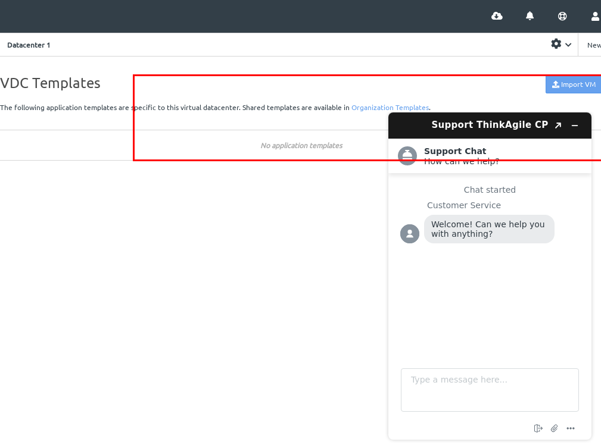{#fig:mwc-vdc-templates}

-----

### mwc-firewall-override-properties {#mwc-firewall-override-properties}

- class: `FirewallOverridePropertiesComponent`
- using:
  - [`mwc-view-firewall-rules-table`](#mwc-view-firewall-rules-table)
  - [`mwc-firewall-actions-button`](#mwc-firewall-actions-button)
- source file: `/home/fengxia/workspace/lenovo/olympia_ignite/mwc/src/main/webapp/app/datacenter/components/firewall-overrides/firewall-override-properties/firewall-override-properties.component.ts`

#### Sample screenshot

{#fig:mwc-firewall-override-properties}

-----

### mwc-firewall-override-table {#mwc-firewall-override-table}

- class: `MwcFirewallOverrideTableComponent`
- using:
  - [`mwc-firewall-actions-button`](#mwc-firewall-actions-button)
- used by:
  - [`mwc-firewall-override-list`](#mwc-firewall-override-list)
- source file: `/home/fengxia/workspace/lenovo/olympia_ignite/mwc/src/main/webapp/app/datacenter/components/firewall-overrides/firewall-override-table/firewall-override-table.component.ts`

#### Sample screenshot

{#fig:mwc-firewall-override-table}

-----

### mwc-firewall-override-list {#mwc-firewall-override-list}

- class: `FirewallOverrideListComponent`
- using:
  - [`mwc-firewall-override-table`](#mwc-firewall-override-table)
- source file: `/home/fengxia/workspace/lenovo/olympia_ignite/mwc/src/main/webapp/app/datacenter/components/firewall-overrides/list/firewall-override-list.component.ts`

#### Sample screenshot

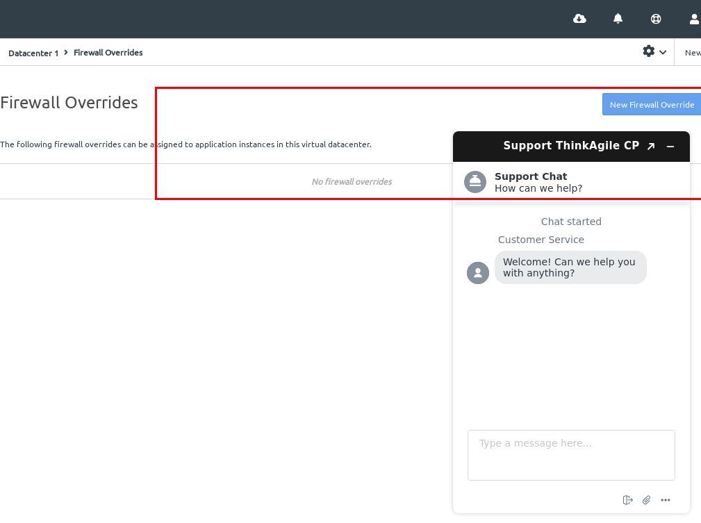{#fig:mwc-firewall-override-list}

-----

## mwc.allocation

### mwc-allocation {#mwc-allocation}

- class: `AllocationComponent`
- using:
  - [`mwc-disaster-recovery-badge`](#mwc-disaster-recovery-badge)
  - [`mwc-available-resources-table`](#mwc-available-resources-table)
- source file: `/home/fengxia/workspace/lenovo/olympia_ignite/mwc/src/main/webapp/app/allocation/components/allocation/allocation.component.ts`

#### Sample screenshot

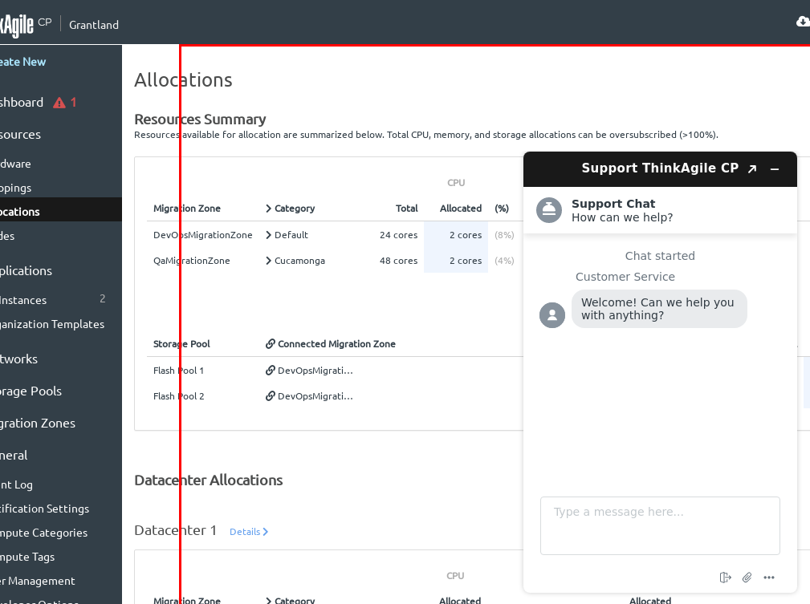{#fig:mwc-allocation}

-----

### mwc-available-resources-table {#mwc-available-resources-table}

- class: `AvailableResourcesTableComponent`
- used by:
  - [`mwc-edit-allocation`](#mwc-edit-allocation)
  - [`mwc-allocation`](#mwc-allocation)
  - [`mwc-create-datacenter`](#mwc-create-datacenter)

#### Sample screenshot

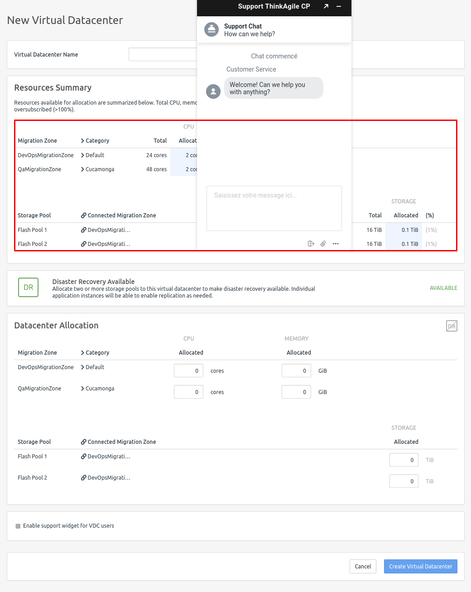{#fig:mwc-available-resources-table}

-----

### mwc-disaster-recovery-badge {#mwc-disaster-recovery-badge}

- class: `DisasterRecoveryBadgeComponent`
- used by:
  - [`mwc-edit-allocation`](#mwc-edit-allocation)
  - [`mwc-allocation`](#mwc-allocation)
  - [`mwc-create-datacenter`](#mwc-create-datacenter)

#### Sample screenshot

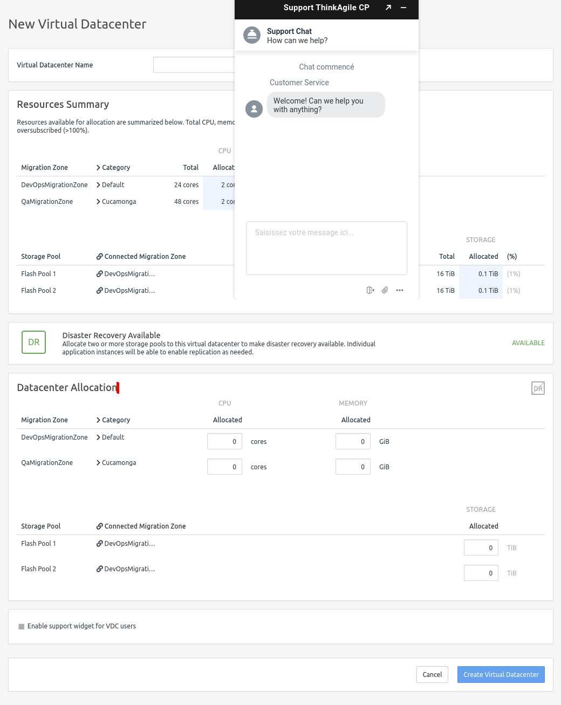{#fig:mwc-disaster-recovery-badge}

-----

### mwc-disaster-recovery-panel {#mwc-disaster-recovery-panel}

- class: `DisasterRecoveryPanelComponent`
- used by:
  - [`mwc-edit-allocation`](#mwc-edit-allocation)
  - [`mwc-create-datacenter`](#mwc-create-datacenter)

#### Sample screenshot

{#fig:mwc-disaster-recovery-panel}

-----

### mwc-edit-allocation {#mwc-edit-allocation}

- class: `EditAllocationComponent`
- using:
  - [`mwc-disaster-recovery-panel`](#mwc-disaster-recovery-panel)
  - [`mwc-disaster-recovery-badge`](#mwc-disaster-recovery-badge)
  - [`mwc-available-resources-table`](#mwc-available-resources-table)
- source file: `/home/fengxia/workspace/lenovo/olympia_ignite/mwc/src/main/webapp/app/allocation/components/edit-allocation/edit-allocation.component.ts`

#### Sample screenshot

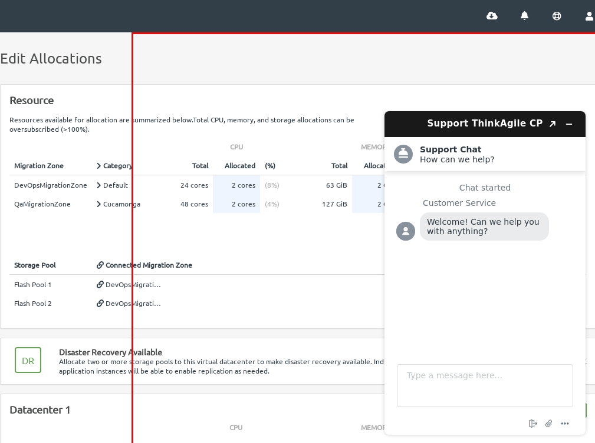{#fig:mwc-edit-allocation}

-----

## mwc.settings

### mwc-configure-ldap-server-modal-controller {#mwc-configure-ldap-server-modal-controller}

- class: `ConfigureLdapServerModalComponent`
- using:
  - [`mwc-disable-password-autocomplete`](#mwc-disable-password-autocomplete)
- source file: `/home/fengxia/workspace/lenovo/olympia_ignite/mwc/src/main/webapp/app/settings/components/configure-ldap-server-modal/configure-ldap-server-modal.component.ts`

#### Sample screenshot

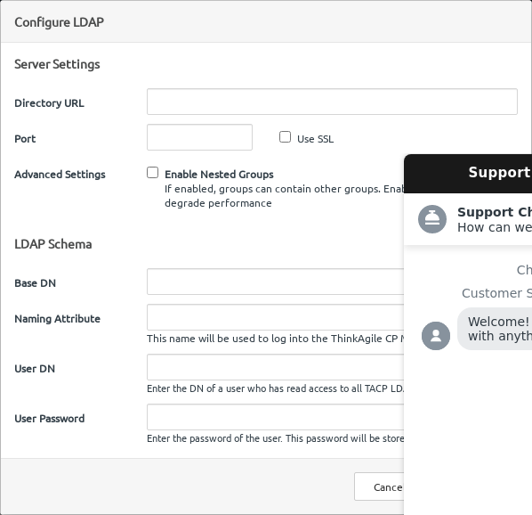{#fig:mwc-configure-ldap-server-modal-controller}

-----

### mwc-datacenter-selection-panel {#mwc-datacenter-selection-panel}

- class: `MwcDatacenterSelectionPanel`
- used by:
  - [`mwc-user-access-level`](#mwc-user-access-level)

#### Sample screenshot

-----

### mwc-developer-options {#mwc-developer-options}

- class: `MwcDeveloperOptionsComponent`
- using:
  - [`mwc-date-time`](#mwc-date-time)
- source file: `/home/fengxia/workspace/lenovo/olympia_ignite/mwc/src/main/webapp/app/settings/components/developer-options/developer-options.component.ts`

#### Sample screenshot

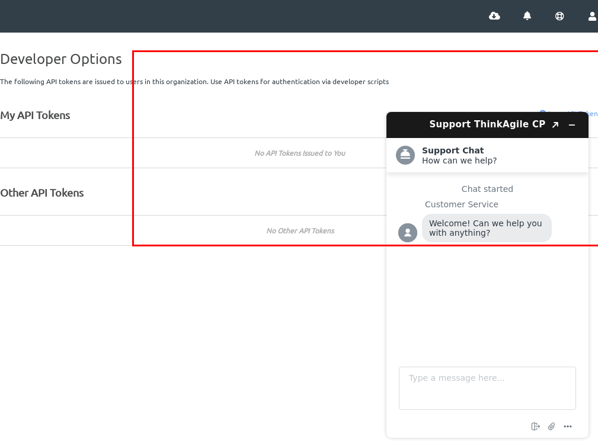{#fig:mwc-developer-options}

-----

### mwc-disaster-recovery {#mwc-disaster-recovery}

- class: `MwcDisasterRecoveryComponent`
- using:
  - [`mwc-datacenter-snapshot-tab`](#mwc-datacenter-snapshot-tab)
- source file: `/home/fengxia/workspace/lenovo/olympia_ignite/mwc/src/main/webapp/app/settings/components/disaster-recovery/disaster-recovery.component.ts`

#### Sample screenshot

-----

### mwc-edit-access-level-modal {#mwc-edit-access-level-modal}

- class: `MwcEditAccessLevelModal`
- using:
  - [`mwc-user-access-level`](#mwc-user-access-level)
- source file: `/home/fengxia/workspace/lenovo/olympia_ignite/mwc/src/main/webapp/app/settings/components/edit-access-level-modal/edit-access-level-modal.component.ts`

#### Sample screenshot

-----

### mwc-new-user-invitation-link-modal {#mwc-new-user-invitation-link-modal}

- class: `MwcNewUserInvitationLinkModalComponent`

#### Sample screenshot

-----

### mwc-organization-settings {#mwc-organization-settings}

- class: `MwcOrganizationSettingsComponent`
- using:
  - [`mwc-site-settings`](#mwc-site-settings)
- source file: `/home/fengxia/workspace/lenovo/olympia_ignite/mwc/src/main/webapp/app/settings/components/organization-settings/organization-settings.component.ts`

#### Sample screenshot

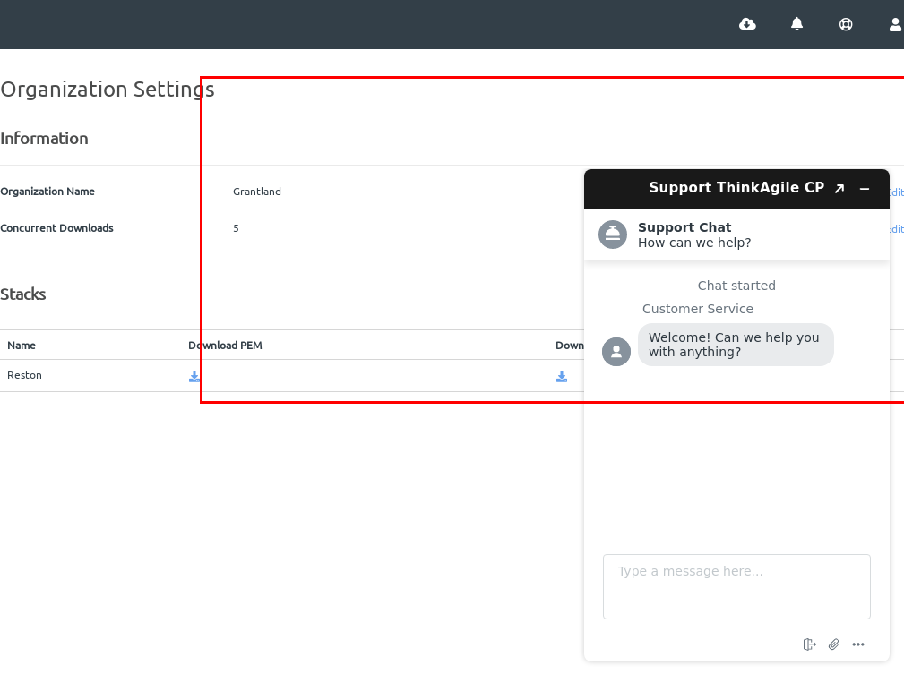{#fig:mwc-organization-settings}

-----

### mwc-site-settings {#mwc-site-settings}

- class: `SiteSettingsComponent`
- used by:
  - [`mwc-organization-settings`](#mwc-organization-settings)

#### Sample screenshot

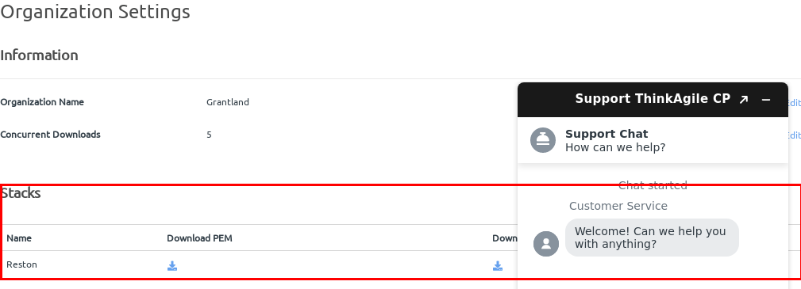{#fig:mwc-site-settings}

-----

### mwc-unable-delete-user-account-modal {#mwc-unable-delete-user-account-modal}

- class: `MwcUnableDeleteUserAccountModalComponent`

#### Sample screenshot

-----

### mwc-update-email-modal {#mwc-update-email-modal}

- class: `MwcUpdateEmailModalComponent`
- using:
  - [`mwc-disable-password-autocomplete`](#mwc-disable-password-autocomplete)
- source file: `/home/fengxia/workspace/lenovo/olympia_ignite/mwc/src/main/webapp/app/settings/components/modals/update-email-modal/update-email-modal.component.ts`

#### Sample screenshot

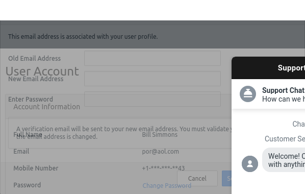{#fig:mwc-update-email-modal}

-----

### mwc-update-max-concurrent-downloads-modal {#mwc-update-max-concurrent-downloads-modal}

- class: `MwcUpdateMaxConcurrentDownloadsModalComponent`

#### Sample screenshot

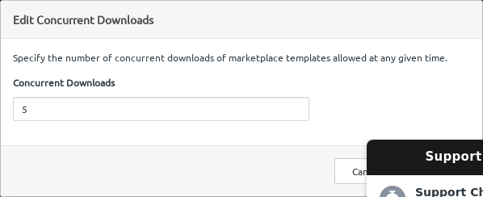{#fig:mwc-update-max-concurrent-downloads-modal}

-----

### mwc-update-mobile-modal {#mwc-update-mobile-modal}

- class: `MwcUpdateMobileModalComponent`
- using:
  - [`mwc-disable-password-autocomplete`](#mwc-disable-password-autocomplete)
- source file: `/home/fengxia/workspace/lenovo/olympia_ignite/mwc/src/main/webapp/app/settings/components/modals/update-mobile-modal/update-mobile-modal.component.ts`

#### Sample screenshot

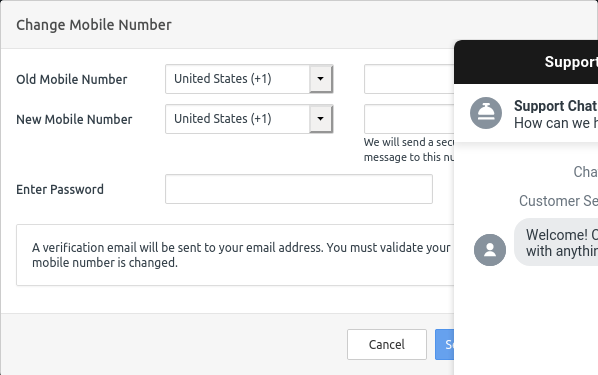{#fig:mwc-update-mobile-modal}

-----

### mwc-update-organization-name-modal {#mwc-update-organization-name-modal}

- class: `UpdateOrganizationNameModal`

#### Sample screenshot

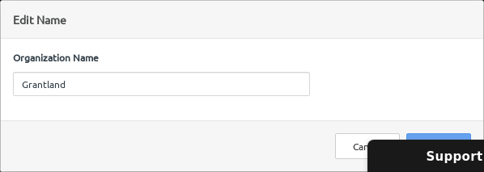{#fig:mwc-update-organization-name-modal}

-----

### mwc-update-password-modal {#mwc-update-password-modal}

- class: `MwcUpdatePasswordModalComponent`
- using:
  - [`mwc-disable-password-autocomplete`](#mwc-disable-password-autocomplete)
  - [`mwc-password-input-field`](#mwc-password-input-field)
- source file: `/home/fengxia/workspace/lenovo/olympia_ignite/mwc/src/main/webapp/app/settings/components/modals/update-password-modal/update-password-modal.component.ts`

#### Sample screenshot

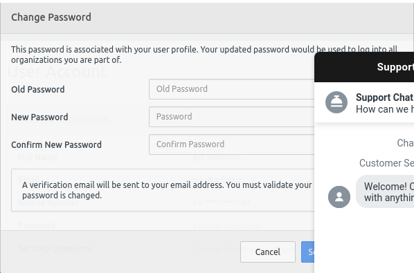{#fig:mwc-update-password-modal}

-----

### mwc-update-security-questions-modal {#mwc-update-security-questions-modal}

- class: `MwcUpdateSecurityQuestionsModalComponent`
- using:
  - [`mwc-disable-password-autocomplete`](#mwc-disable-password-autocomplete)
- source file: `/home/fengxia/workspace/lenovo/olympia_ignite/mwc/src/main/webapp/app/settings/components/modals/update-security-questions-modal/update-security-questions-modal.component.ts`

#### Sample screenshot

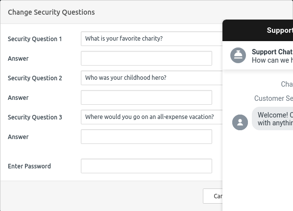{#fig:mwc-update-security-questions-modal}

-----

### mwc-update-site-name-modal {#mwc-update-site-name-modal}

- class: `MwcUpdateSiteNameModalComponent`

#### Sample screenshot

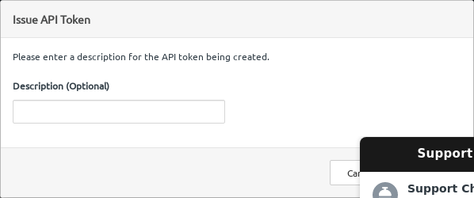{#fig:mwc-update-site-name-modal}

-----

### mwc-update-time-zone-modal {#mwc-update-time-zone-modal}

- class: `MwcUpdateTimeZoneModalComponent`

#### Sample screenshot

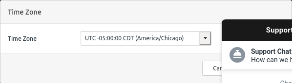{#fig:mwc-update-time-zone-modal}

-----

### mwc-update-user-full-name-modal {#mwc-update-user-full-name-modal}

- class: `MwcUpdateUserFullNameModalComponent`

#### Sample screenshot

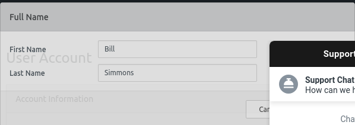{#fig:mwc-update-user-full-name-modal}

-----

### mwc-user-access-level {#mwc-user-access-level}

- class: `MwcUserAccessLevelComponent`
- using:
  - [`mwc-datacenter-selection-panel`](#mwc-datacenter-selection-panel)
- used by:
  - [`mwc-user-invitation-modal`](#mwc-user-invitation-modal)
  - [`mwc-edit-access-level-modal`](#mwc-edit-access-level-modal)
- source file: `/home/fengxia/workspace/lenovo/olympia_ignite/mwc/src/main/webapp/app/settings/components/user-access-level/user-access-level.component.ts`

#### Sample screenshot

{#fig:mwc-user-access-level}

-----

### mwc-user-access-page {#mwc-user-access-page}

- class: `MwcUserAccessPageComponent`

#### Sample screenshot

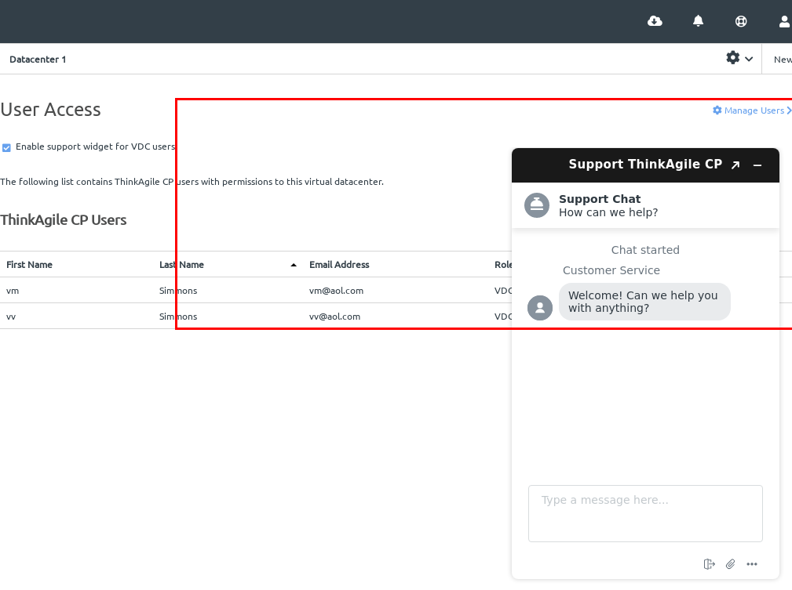{#fig:mwc-user-access-page}

-----

### mwc-user-invitation-modal {#mwc-user-invitation-modal}

- class: `MwcUserInvitationModalComponent`
- using:
  - [`mwc-user-access-level`](#mwc-user-access-level)
- source file: `/home/fengxia/workspace/lenovo/olympia_ignite/mwc/src/main/webapp/app/settings/components/user-invitation-modal/user-invitation-modal.component.ts`

#### Sample screenshot

{#fig:mwc-user-invitation-modal}

-----

### mwc-user-management {#mwc-user-management}

- class: `UserManagementComponent`

#### Sample screenshot

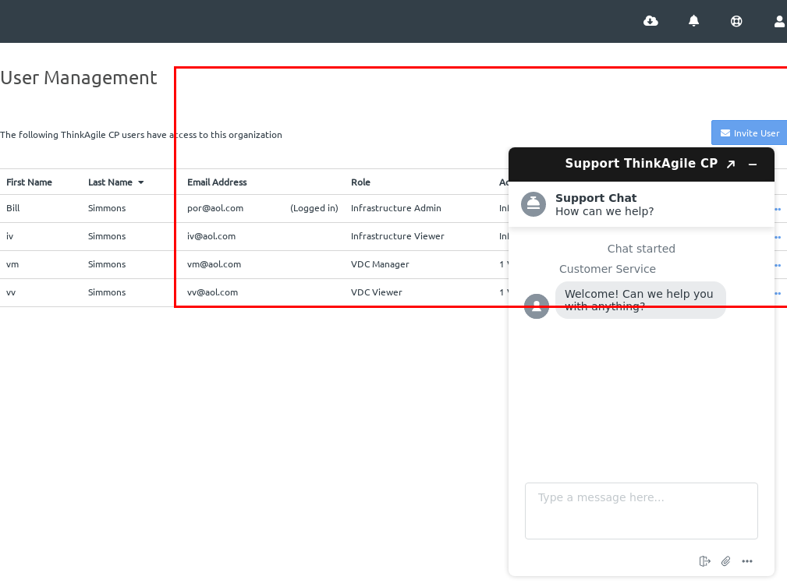{#fig:mwc-user-management}

-----

### mwc-user-profile {#mwc-user-profile}

- class: `MwcUserProfileComponent`
- using:
  - [`mwc-disable-password-autocomplete`](#mwc-disable-password-autocomplete)
  - [`mwc-date-time`](#mwc-date-time)
- source file: `/home/fengxia/workspace/lenovo/olympia_ignite/mwc/src/main/webapp/app/settings/components/user-profile/user-profile.component.ts`

#### Sample screenshot

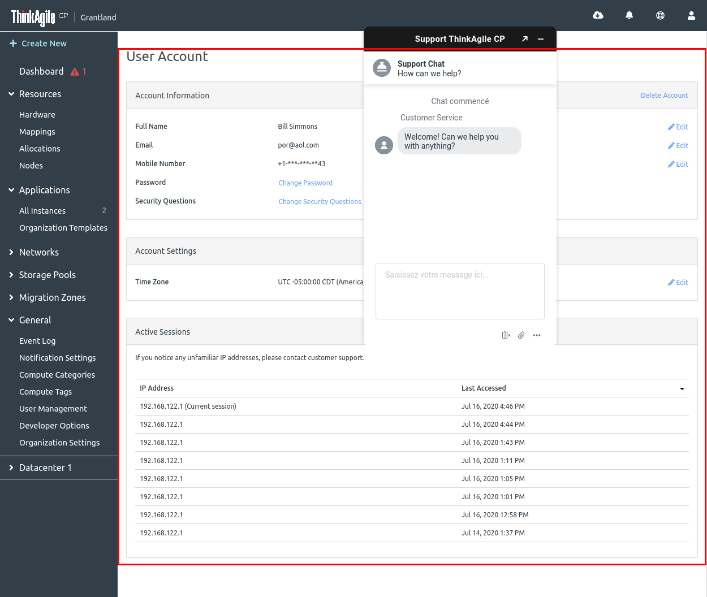{#fig:mwc-user-profile}

-----

### view-users-modal {#view-users-modal}

- class: `ViewUsersModalComponent`

#### Sample screenshot

-----

## mwc.shared

### mwc-cpu-memory-provision-form {#mwc-cpu-memory-provision-form}

- class: `MwcCpuMemoryProvisionForm`
- used by:
  - [`mwc-download-market-template-modal`](#mwc-download-market-template-modal)
  - [`mwc-edit-application-template-modal`](#mwc-edit-application-template-modal)
  - [`mwc-create-application-template`](#mwc-create-application-template)

#### Sample screenshot

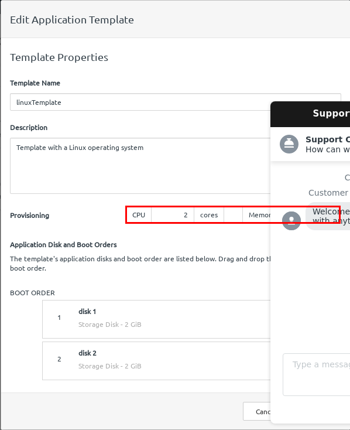{#fig:mwc-cpu-memory-provision-form}

-----

### mwc-disable-password-autocomplete {#mwc-disable-password-autocomplete}

- class: `MwcDisablePasswordAutocompleteComponent`
- used by:
  - [`mwc-configure-host`](#mwc-configure-host)
  - [`mwc-configure-ldap-server-modal-controller`](#mwc-configure-ldap-server-modal-controller)
  - [`mwc-update-security-questions-modal`](#mwc-update-security-questions-modal)
  - [`mwc-register-storage-block`](#mwc-register-storage-block)
  - [`mwc-update-password-modal`](#mwc-update-password-modal)
  - [`mwc-user-profile`](#mwc-user-profile)
  - [`mwc-update-mobile-modal`](#mwc-update-mobile-modal)
  - [`mwc-update-email-modal`](#mwc-update-email-modal)

#### Sample screenshot

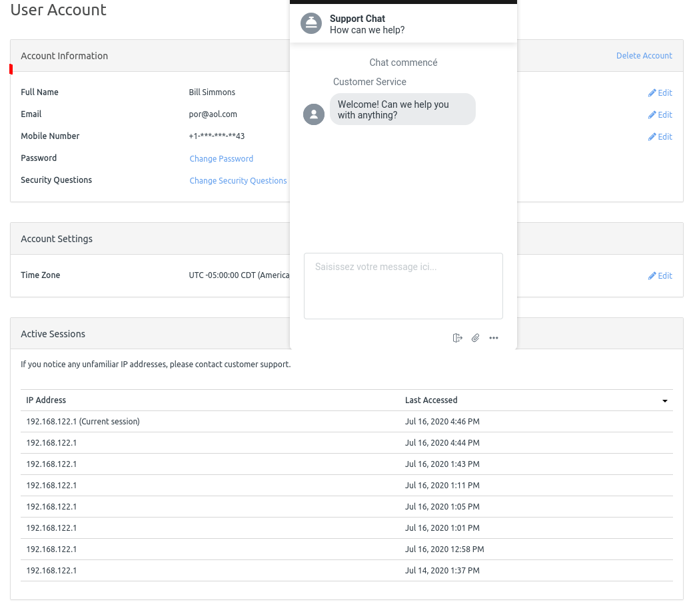{#fig:mwc-disable-password-autocomplete}

-----

### mwc-dropdown-menu {#mwc-dropdown-menu}

- class: `MwcDropdownMenuComponent`
- used by:
  - [`mwc-notification-filter`](#mwc-notification-filter)
  - [`mwc-network-firewall-settings`](#mwc-network-firewall-settings)
  - [`mwc-application-form`](#mwc-application-form)
  - [`mwc-application-vnic-form`](#mwc-application-vnic-form)
  - [`mwc-nfv-deployment-options-form`](#mwc-nfv-deployment-options-form)
  - [`mwc-network-outside-interface`](#mwc-network-outside-interface)

#### Sample screenshot

{#fig:mwc-dropdown-menu}

-----

### mwc-edit-text-property-modal {#mwc-edit-text-property-modal}

- class: `MwcEditTextPropertyModalComponent`

#### Sample screenshot

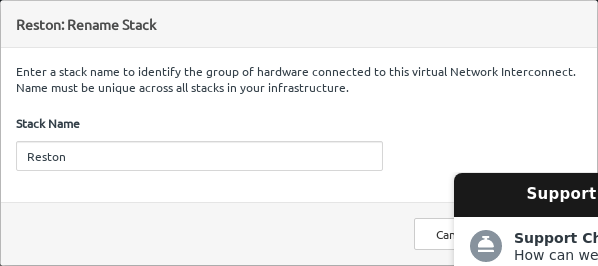{#fig:mwc-edit-text-property-modal}

-----

### mwc-logo {#mwc-logo}

- class: `MwcLogoComponent`
- used by:
  - [`mwc-navigation-banner`](#mwc-navigation-banner)

#### Sample screenshot

{#fig:mwc-logo}

-----

### mwc-navigation-banner {#mwc-navigation-banner}

- class: `MwcNavigationBannerComponent`
- using:
  - [`mwc-notification-icon`](#mwc-notification-icon)
  - [`mwc-logo`](#mwc-logo)
- used by:
  - [`mwc-app-main`](#mwc-app-main)
  - [`mwc-application-marketplace`](#mwc-application-marketplace)
  - [`mwc-admin-main`](#mwc-admin-main)
- source file: `/home/fengxia/workspace/lenovo/olympia_ignite/mwc/src/main/webapp/app/shared/components/navigation-banner/navigation-banner.component.ts`

#### Sample screenshot

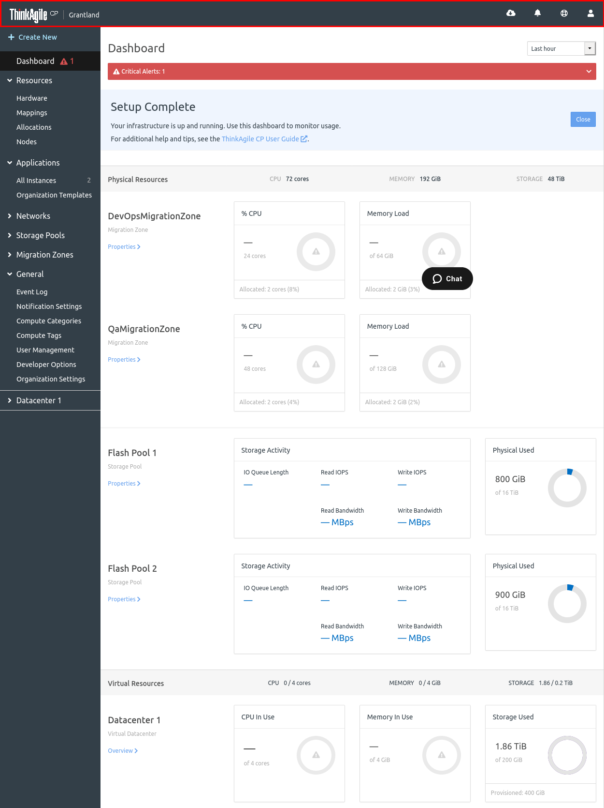{#fig:mwc-navigation-banner}

-----

### mwc-password-input-field {#mwc-password-input-field}

- class: `MwcPasswordInputFieldComponent`
- used by:
  - [`mwc-update-password-modal`](#mwc-update-password-modal)
  - [`mwc-router-manager-password`](#mwc-router-manager-password)

#### Sample screenshot

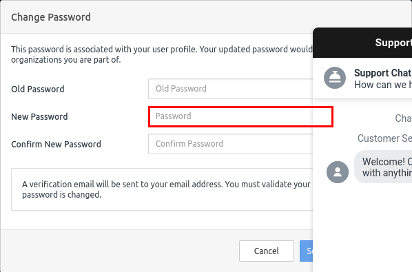{#fig:mwc-password-input-field}

-----

### mwc-password-input-with-validation {#mwc-password-input-with-validation}

- class: `MwcPasswordInputFieldWithValidationComponent`
- used by:
  - [`mwc-phone-authentication`](#mwc-phone-authentication)
  - [`mwc-forgot-password-for-on-premise`](#mwc-forgot-password-for-on-premise)
  - [`mwc-account-form`](#mwc-account-form)

#### Sample screenshot

-----

### mwc-send-system-report-modal {#mwc-send-system-report-modal}

- class: `MwcSendSystemReportModalComponent`

#### Sample screenshot

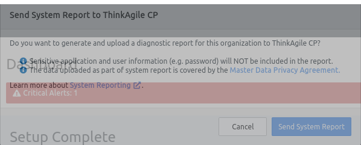{#fig:mwc-send-system-report-modal}

-----

### mwc-template-destination-dropdown {#mwc-template-destination-dropdown}

- class: `MwcTemplateDestinationDropdownComponent`
- used by:
  - [`mwc-download-market-template-modal`](#mwc-download-market-template-modal)
  - [`mwc-import-application-template-from-vmdk`](#mwc-import-application-template-from-vmdk)
  - [`mwc-create-application-template`](#mwc-create-application-template)

#### Sample screenshot

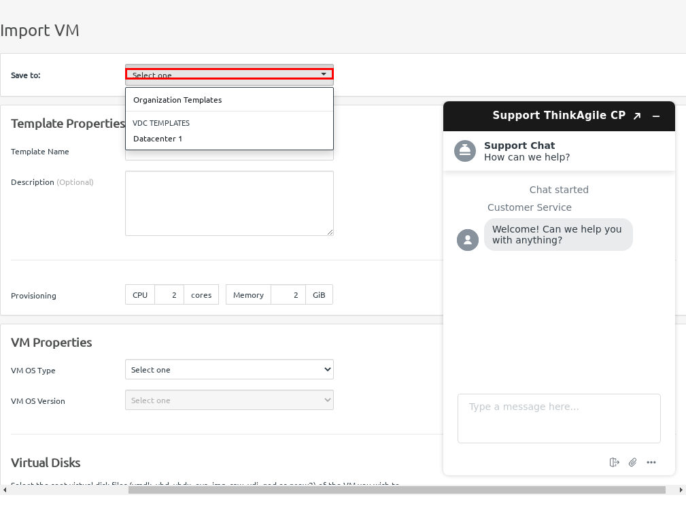{#fig:mwc-template-destination-dropdown}

-----

### mwc-text-area {#mwc-text-area}

- class: `MwcTextArea`
- used by:
  - [`mwc-download-market-template-modal`](#mwc-download-market-template-modal)
  - [`mwc-edit-application-template-modal`](#mwc-edit-application-template-modal)
  - [`mwc-create-application-template`](#mwc-create-application-template)

#### Sample screenshot

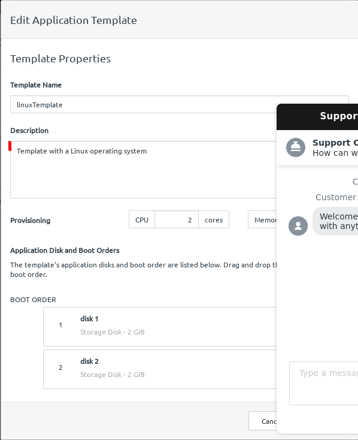{#fig:mwc-text-area}

-----

### mwc-timeout-modal {#mwc-timeout-modal}

- class: `MwcTimeoutModalComponent`

#### Sample screenshot

-----

### mwc-edit-textarea-property-modal {#mwc-edit-textarea-property-modal}

- class: `EditTextareaPropertyModalComponent`

#### Sample screenshot

{#fig:mwc-edit-textarea-property-modal}

-----

### mwc-firmware-versions {#mwc-firmware-versions}

- class: `FirmwareVersionsComponent`
- used by:
  - [`mwc-storage-controller-properties`](#mwc-storage-controller-properties)
  - [`mwc-host-properties-tab`](#mwc-host-properties-tab)

#### Sample screenshot

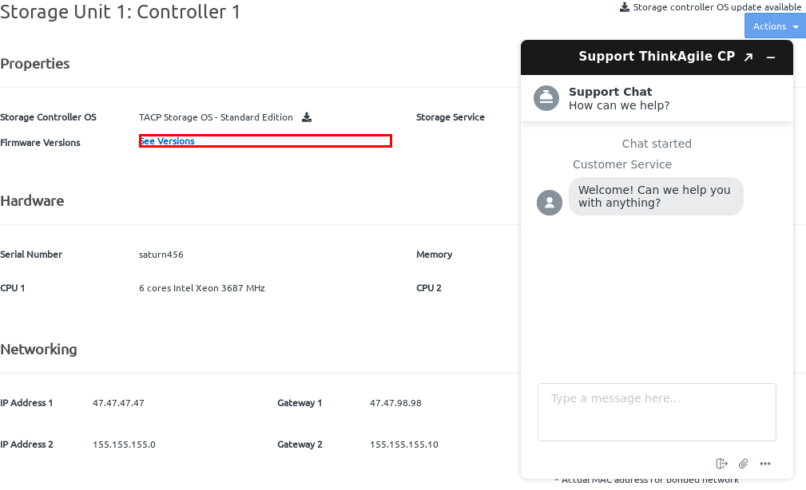{#fig:mwc-firmware-versions}

-----

### mwc-boot-order-table {#mwc-boot-order-table}

- class: `BootOrderTableController`
- used by:
  - [`mwc-edit-application-boot-order-modal`](#mwc-edit-application-boot-order-modal)
  - [`mwc-edit-boot-order-modal`](#mwc-edit-boot-order-modal)

#### Sample screenshot

-----

### mwc-unable-to-perform-action-modal {#mwc-unable-to-perform-action-modal}

- class: `MwcUnableToPerformActionModalComponent`
- using:
  - [`mwc-title-bar`](#mwc-title-bar)
- source file: `/home/fengxia/workspace/lenovo/olympia_ignite/mwc/src/main/webapp/app/shared/components/unable-perform-action-modal/unable-to-perform-action-modal.component.ts`

#### Sample screenshot

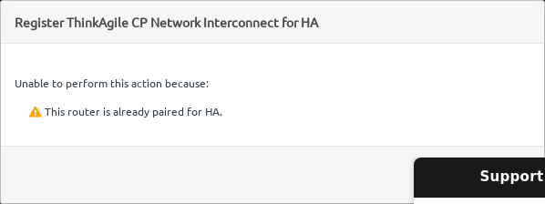{#fig:mwc-unable-to-perform-action-modal}

-----

### mwc-volume-form-inputs {#mwc-volume-form-inputs}

- class: `VolumeFormInputs`
- used by:
  - [`mwc-shared-storage-installer-modal`](#mwc-shared-storage-installer-modal)
  - [`mwc-shared-storage-vmdk-modal`](#mwc-shared-storage-vmdk-modal)

#### Sample screenshot

-----

### mwc-title-bar {#mwc-title-bar}

- class: `not defined`
- used by:
  - [`mwc-unable-to-perform-action-modal`](#mwc-unable-to-perform-action-modal)
  - [`mwc-internal-bridged-network-form`](#mwc-internal-bridged-network-form)

#### Sample screenshot

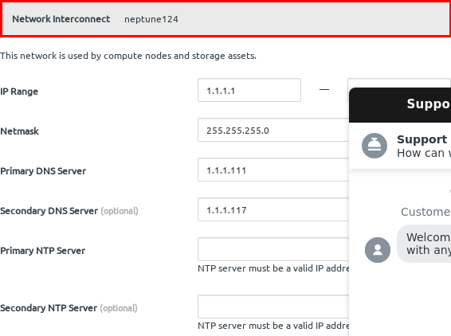{#fig:mwc-title-bar}

-----

### mwc-vdc-settings-menu {#mwc-vdc-settings-menu}

- class: `VdcSettingsMenuController`
- used by:
  - [`mwc-breadcrumbs`](#mwc-breadcrumbs)

#### Sample screenshot

{#fig:mwc-vdc-settings-menu}

-----

### mwc-version-update-available-icons {#mwc-version-update-available-icons}

- class: `VersionUpdateAvailableIconsComponent`
- used by:
  - [`mwc-host-properties`](#mwc-host-properties)
  - [`mwc-compute-slot`](#mwc-compute-slot)
  - [`mwc-host-properties-tab`](#mwc-host-properties-tab)
  - [`mwc-compute-hardware-panel`](#mwc-compute-hardware-panel)

#### Sample screenshot

{#fig:mwc-version-update-available-icons}

-----

### mwc-vdc-new-button {#mwc-vdc-new-button}

- class: `VdcNewButtonController`
- used by:
  - [`mwc-breadcrumbs`](#mwc-breadcrumbs)

#### Sample screenshot

{#fig:mwc-vdc-new-button}

-----

## mwc.host.tag

### mwc-add-host-tag-modal {#mwc-add-host-tag-modal}

- class: `AddHostTagModalComponent`

#### Sample screenshot

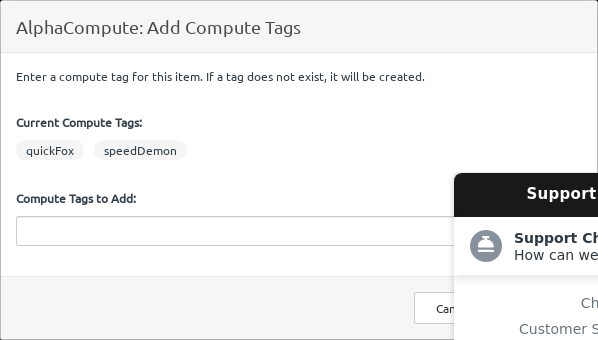{#fig:mwc-add-host-tag-modal}

-----

### mwc-compute-tags {#mwc-compute-tags}

- class: `ComputeTagsComponent`

#### Sample screenshot

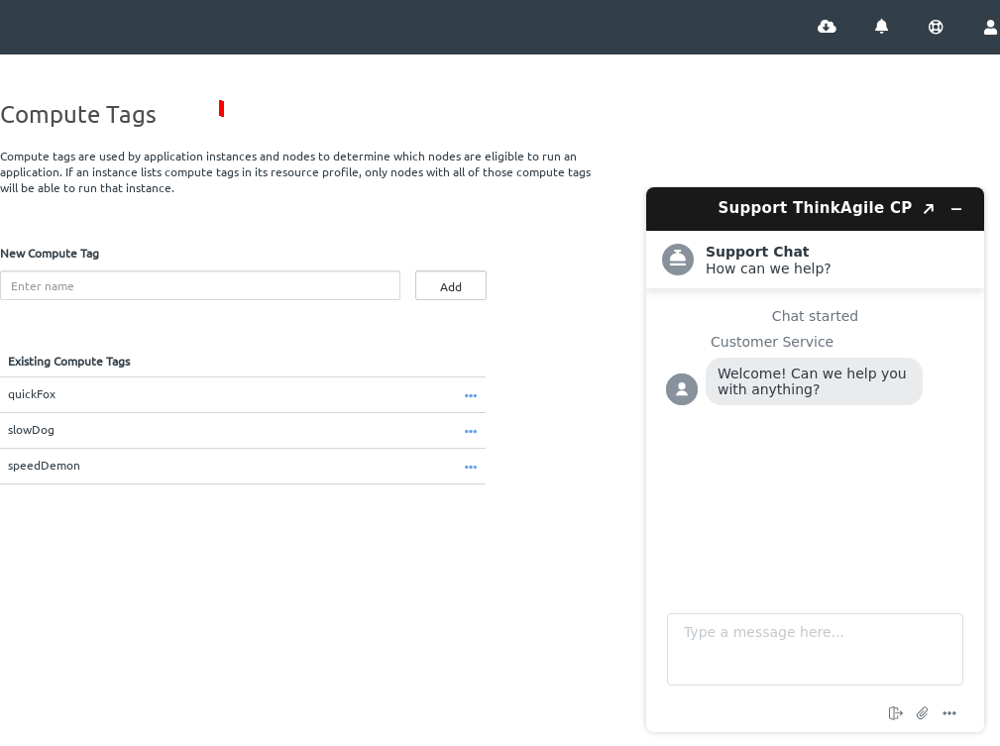{#fig:mwc-compute-tags}

-----

### mwc-delete-host-tag-modal {#mwc-delete-host-tag-modal}

- class: `DeleteHostTagModalComponent`
- using:
  - [`mwc-application-compute-constraints`](#mwc-application-compute-constraints)
- source file: `/home/fengxia/workspace/lenovo/olympia_ignite/mwc/src/main/webapp/app/host-tag/components/delete-compute-tags/delete-host-tag.component.ts`

#### Sample screenshot

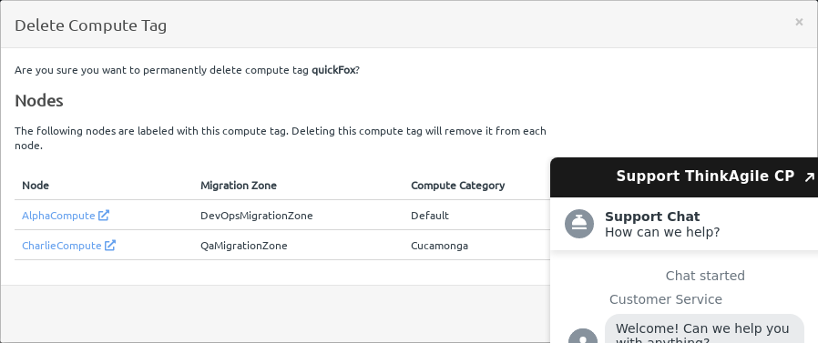{#fig:mwc-delete-host-tag-modal}

-----

### mwc-rename-compute-tag-modal {#mwc-rename-compute-tag-modal}

- class: `RenameComputeTagModalComponent`

#### Sample screenshot

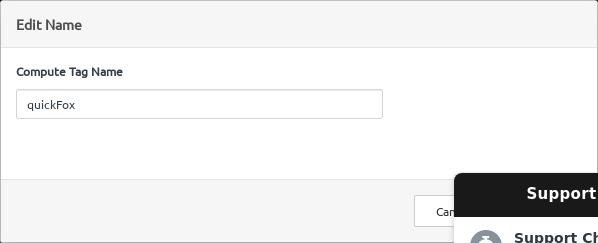{#fig:mwc-rename-compute-tag-modal}

-----

## mwc.flash-pool

### mwc-create-flash-pool-button {#mwc-create-flash-pool-button}

- class: `CreateFlashPoolButtonComponent`
- used by:
  - [`mwc-mappings`](#mwc-mappings)

#### Sample screenshot

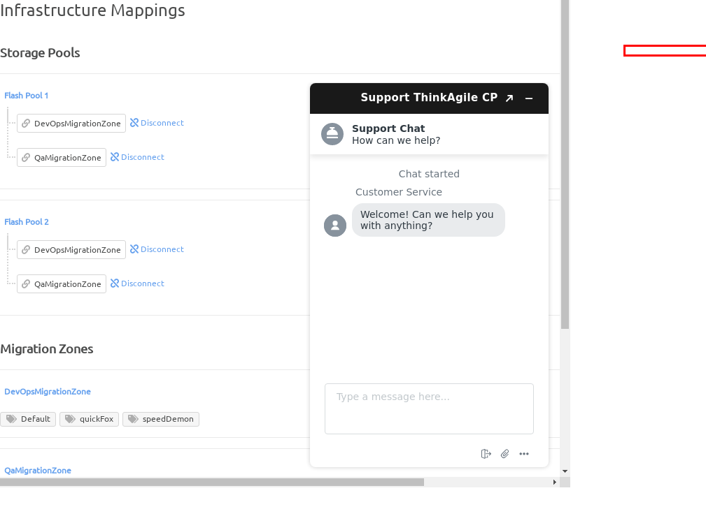{#fig:mwc-create-flash-pool-button}

-----

### mwc-disconnect-flash-pool-from-migration-zone-modal {#mwc-disconnect-flash-pool-from-migration-zone-modal}

- class: `MwcDisconnectFlashPoolFromMigrationZoneModalComponent`
- using:
  - [`mwc-application-action-plan-table-for-flash-pool`](#mwc-application-action-plan-table-for-flash-pool)
- source file: `/home/fengxia/workspace/lenovo/olympia_ignite/mwc/src/main/webapp/app/flash-pool/components/disconnect-from-migration-zone/disconnect-from-migration-zone.component.ts`

#### Sample screenshot

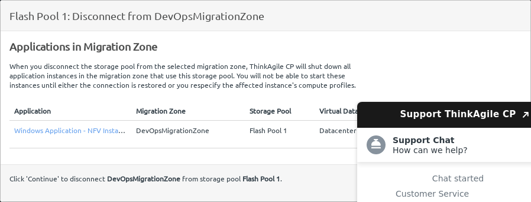{#fig:mwc-disconnect-flash-pool-from-migration-zone-modal}

-----

### mwc-flash-pool-actions-button {#mwc-flash-pool-actions-button}

- class: `FlashPoolActionsButton`
- used by:
  - [`mwc-flash-pool-properties`](#mwc-flash-pool-properties)
  - [`mwc-mappings`](#mwc-mappings)

#### Sample screenshot

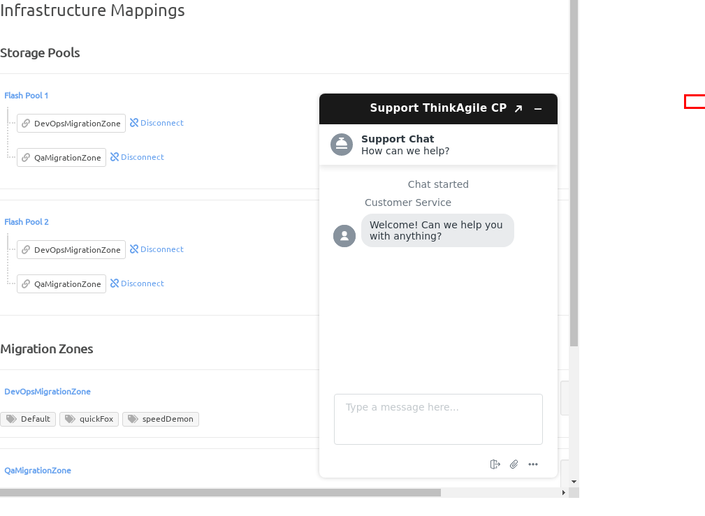{#fig:mwc-flash-pool-actions-button}

-----

### mwc-flash-pool-activity-tab {#mwc-flash-pool-activity-tab}

- class: `FlashPoolActivityTabComponent`

#### Sample screenshot

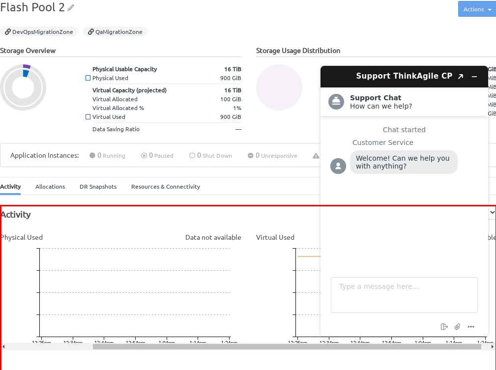{#fig:mwc-flash-pool-activity-tab}

-----

### mwc-flash-pool-add-storage-block-modal {#mwc-flash-pool-add-storage-block-modal}

- class: `FlashPoolAddStorageBlockModalComponent`

#### Sample screenshot

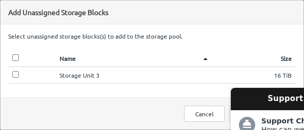{#fig:mwc-flash-pool-add-storage-block-modal}

-----

### mwc-flash-pool-allocation-tab {#mwc-flash-pool-allocation-tab}

- class: `MwcFlashPoolAllocationTabComponent`
- using:
  - [`mwc-flash-pool-allocation-table`](#mwc-flash-pool-allocation-table)
- source file: `/home/fengxia/workspace/lenovo/olympia_ignite/mwc/src/main/webapp/app/flash-pool/components/flash-pool-allocation-tab/flash-pool-allocation-tab.component.ts`

#### Sample screenshot

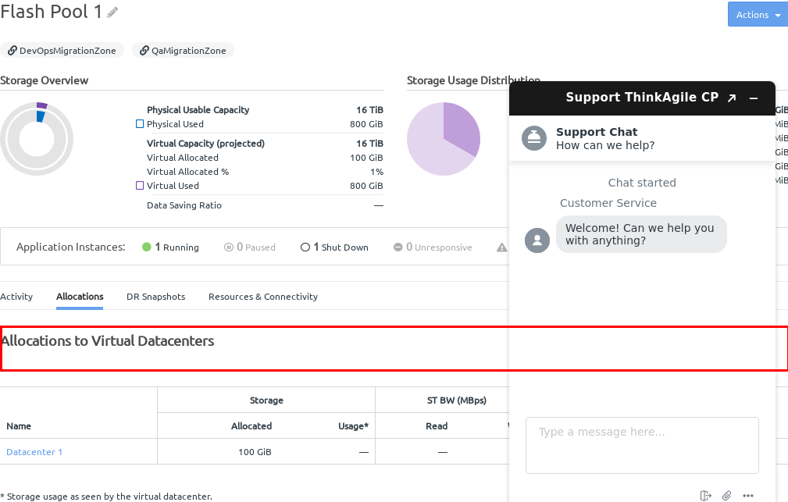{#fig:mwc-flash-pool-allocation-tab}

-----

### mwc-flash-pool-allocation-table {#mwc-flash-pool-allocation-table}

- class: `MwcFlashPoolAllocationTableComponent`
- used by:
  - [`mwc-flash-pool-allocation-tab`](#mwc-flash-pool-allocation-tab)

#### Sample screenshot

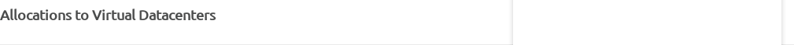{#fig:mwc-flash-pool-allocation-table}

-----

### mwc-flash-pool-attach-migration-zone-modal {#mwc-flash-pool-attach-migration-zone-modal}

- class: `FlashPoolAttachMigrationZoneModalComponent`

#### Sample screenshot

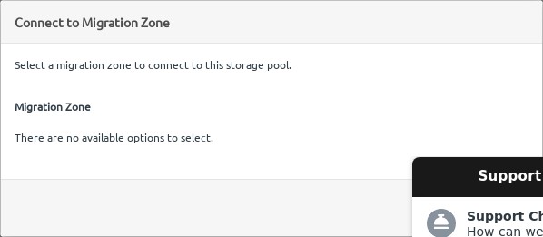{#fig:mwc-flash-pool-attach-migration-zone-modal}

-----

### mwc-flash-pool-properties {#mwc-flash-pool-properties}

- class: `FlashPoolPropertiesComponent`
- using:
  - [`mwc-flash-pool-actions-button`](#mwc-flash-pool-actions-button)
  - [`mwc-application-summary-panel`](#mwc-application-summary-panel)
- source file: `/home/fengxia/workspace/lenovo/olympia_ignite/mwc/src/main/webapp/app/flash-pool/components/flash-pool-properties/flash-pool-properties.component.ts`

#### Sample screenshot

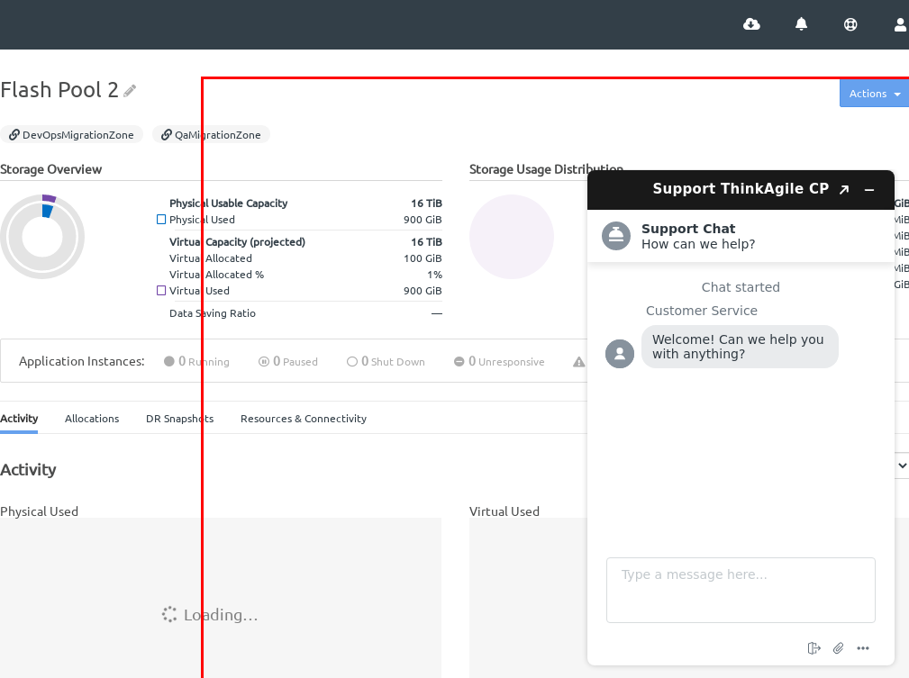{#fig:mwc-flash-pool-properties}

-----

### mwc-flash-pool-resources-tab {#mwc-flash-pool-resources-tab}

- class: `FlashPoolResourcesTabComponent`
- using:
  - [`mwc-storage-block-table`](#mwc-storage-block-table)
- source file: `/home/fengxia/workspace/lenovo/olympia_ignite/mwc/src/main/webapp/app/flash-pool/components/flash-pool-resources-tab/flash-pool-resources-tab.component.ts`

#### Sample screenshot

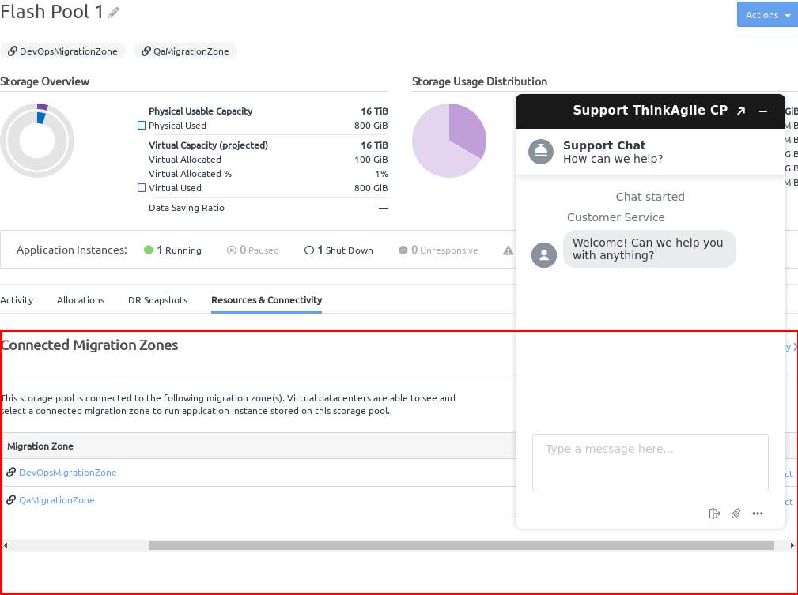{#fig:mwc-flash-pool-resources-tab}

-----

### mwc-flash-pool-snapshot-tab {#mwc-flash-pool-snapshot-tab}

- class: `FlashPoolSnapshotTabComponent`

#### Sample screenshot

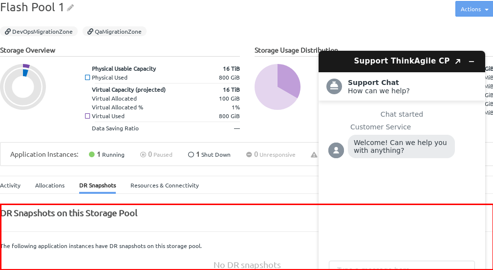{#fig:mwc-flash-pool-snapshot-tab}

-----

## mwc.authentication

### mwc-forgot-password-for-on-premise {#mwc-forgot-password-for-on-premise}

- class: `ForgotPasswordForOnPremiseComponent`
- using:
  - [`mwc-password-input-with-validation`](#mwc-password-input-with-validation)
- source file: `/home/fengxia/workspace/lenovo/olympia_ignite/mwc/src/main/webapp/auth/authentication/components/forgot-password-for-on-premise/forgot-password-for-on-premise.component.ts`

#### Sample screenshot

-----

### mwc-login {#mwc-login}

- class: `LoginController`
- using:
  - [`mwc-recaptcha-box`](#mwc-recaptcha-box)
- source file: `/home/fengxia/workspace/lenovo/olympia_ignite/mwc/src/main/webapp/auth/authentication/components/login/login.component.ts`

#### Sample screenshot

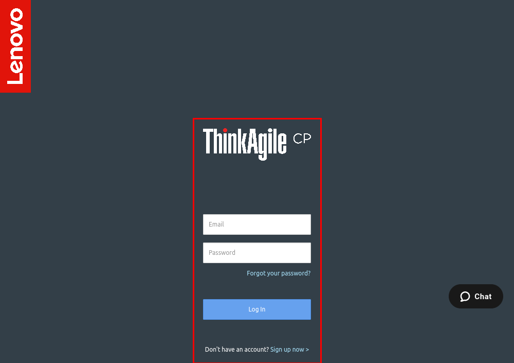{#fig:mwc-login}

-----

### mwc-forgot-password {#mwc-forgot-password}

- class: `ForgotPasswordController`
- using:
  - [`mwc-recaptcha-box`](#mwc-recaptcha-box)
- source file: `/home/fengxia/workspace/lenovo/olympia_ignite/mwc/src/main/webapp/auth/authentication/components/forgot-password/forgot-password.component.ts`

#### Sample screenshot

-----

### mwc-account-form {#mwc-account-form}

- class: `AccountFormController`
- using:
  - [`mwc-password-input-with-validation`](#mwc-password-input-with-validation)
- used by:
  - [`mwc-create-account`](#mwc-create-account)
- source file: `/home/fengxia/workspace/lenovo/olympia_ignite/mwc/src/main/webapp/auth/authentication/components/account-form/account-form.component.ts`

#### Sample screenshot

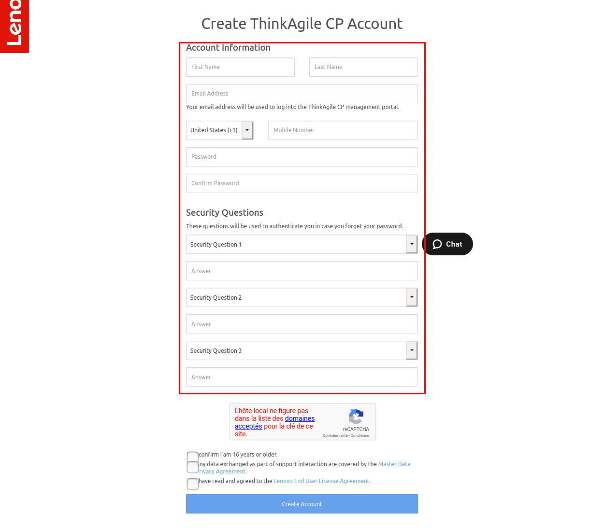{#fig:mwc-account-form}

-----

### mwc-create-account {#mwc-create-account}

- class: `CreateAccountController`
- using:
  - [`mwc-recaptcha-box`](#mwc-recaptcha-box)
  - [`mwc-account-form`](#mwc-account-form)
- source file: `/home/fengxia/workspace/lenovo/olympia_ignite/mwc/src/main/webapp/auth/authentication/components/create-account/create-account.component.ts`

#### Sample screenshot

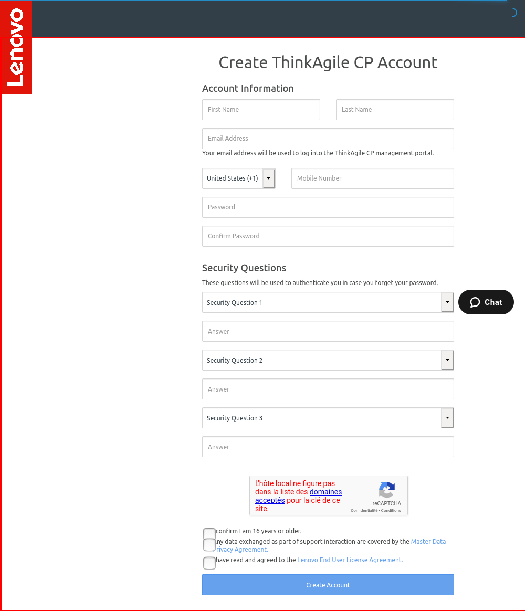{#fig:mwc-create-account}

-----

### mwc-verify-phone-number {#mwc-verify-phone-number}

- class: `VerifyPhoneNumberComponent`
- using:
  - [`mwc-phone-authentication`](#mwc-phone-authentication)
- source file: `/home/fengxia/workspace/lenovo/olympia_ignite/mwc/src/main/webapp/auth/authentication/components/verify-phone-number/verify-phone-number.component.ts`

#### Sample screenshot

-----

### mwc-reset-password {#mwc-reset-password}

- class: `ResetPasswordComponent`
- using:
  - [`mwc-phone-authentication`](#mwc-phone-authentication)
- source file: `/home/fengxia/workspace/lenovo/olympia_ignite/mwc/src/main/webapp/auth/authentication/components/reset-password/reset-password.component.ts`

#### Sample screenshot

-----

### mwc-verify-email {#mwc-verify-email}

- class: `VerifyEmailController`

#### Sample screenshot

-----

### mwc-phone-authentication {#mwc-phone-authentication}

- class: `MwcPhoneAuthenticationController`
- using:
  - [`mwc-password-input-with-validation`](#mwc-password-input-with-validation)
- used by:
  - [`mwc-verify-phone-number`](#mwc-verify-phone-number)
  - [`mwc-reset-password`](#mwc-reset-password)
- source file: `/home/fengxia/workspace/lenovo/olympia_ignite/mwc/src/main/webapp/auth/authentication/components/phone-authentication/phone-authentication.component.ts`

#### Sample screenshot

-----

## mwc.mappings

### mwc-mappings {#mwc-mappings}

- class: `MappingsComponent`
- using:
  - [`mwc-flash-pool-actions-button`](#mwc-flash-pool-actions-button)
  - [`mwc-create-migration-zone-button`](#mwc-create-migration-zone-button)
  - [`mwc-create-flash-pool-button`](#mwc-create-flash-pool-button)
  - [`mwc-migration-zone-actions-button`](#mwc-migration-zone-actions-button)
- source file: `/home/fengxia/workspace/lenovo/olympia_ignite/mwc/src/main/webapp/app/topology/components/mappings.component.ts`

#### Sample screenshot

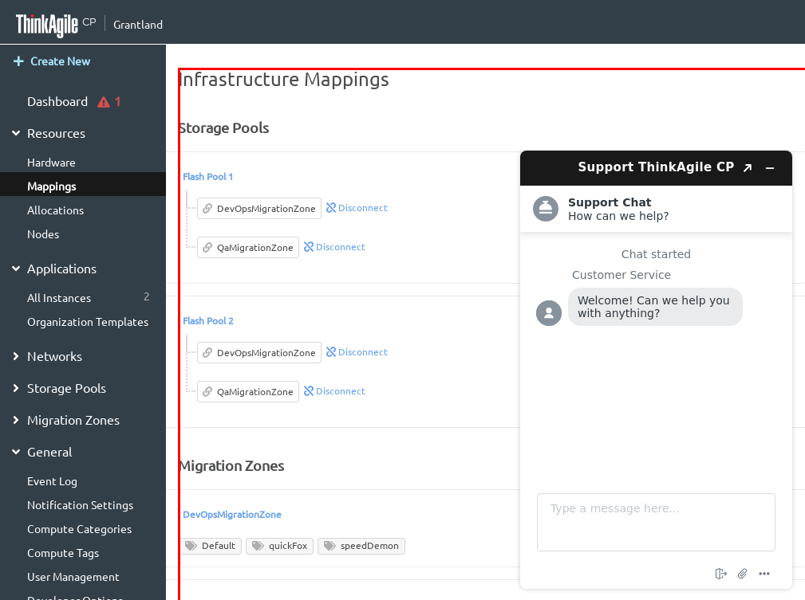{#fig:mwc-mappings}

-----

## mwc.hardware

### mwc-application-compute-constraints {#mwc-application-compute-constraints}

- class: `MwcApplicationComputeProfileComponent`
- used by:
  - [`mwc-delete-host-tag-modal`](#mwc-delete-host-tag-modal)
  - [`mwc-application-action-plan-table-for-hosts`](#mwc-application-action-plan-table-for-hosts)

#### Sample screenshot

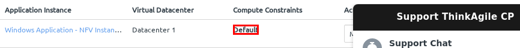{#fig:mwc-application-compute-constraints}

-----

### mwc-change-routing-properties-modal {#mwc-change-routing-properties-modal}

- class: `ChangeRoutingPropertiesModalComponent`
- using:
  - [`mwc-internal-bridged-network-form`](#mwc-internal-bridged-network-form)
- source file: `/home/fengxia/workspace/lenovo/olympia_ignite/mwc/src/main/webapp/app/hardware/components/network-controller/change-routing-properties-modal/change-routing-properties-modal.component.ts`

#### Sample screenshot

-----

### mwc-compute-block-status-icon {#mwc-compute-block-status-icon}

- class: `MwcComputeBlockStatusIconComponent`
- used by:
  - [`mwc-host-properties`](#mwc-host-properties)
  - [`mwc-compute-slot`](#mwc-compute-slot)
  - [`mwc-host-resource-table`](#mwc-host-resource-table)

#### Sample screenshot

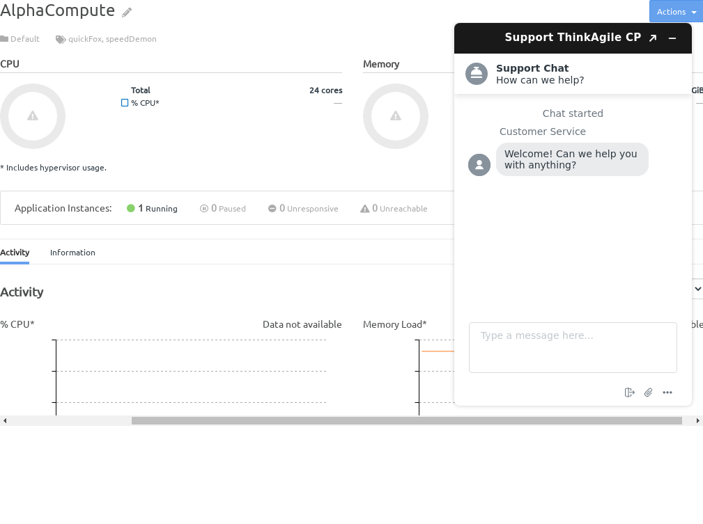{#fig:mwc-compute-block-status-icon}

-----

### mwc-compute-hardware-panel {#mwc-compute-hardware-panel}

- class: `ComputeHardwarePanelComponent`
- using:
  - [`mwc-version-update-available-icons`](#mwc-version-update-available-icons)
  - [`mwc-compute-slot`](#mwc-compute-slot)
- used by:
  - [`mwc-hardware-details`](#mwc-hardware-details)
- source file: `/home/fengxia/workspace/lenovo/olympia_ignite/mwc/src/main/webapp/app/hardware/components/compute-hardware-panel/compute-hardware-panel.component.ts`

#### Sample screenshot

{#fig:mwc-compute-hardware-panel}

-----

### mwc-compute-slot {#mwc-compute-slot}

- class: `mwcComputeSlotComponent`
- using:
  - [`mwc-compute-block-status-icon`](#mwc-compute-block-status-icon)
  - [`mwc-host-actions-button`](#mwc-host-actions-button)
  - [`mwc-version-update-available-icons`](#mwc-version-update-available-icons)
- used by:
  - [`mwc-compute-hardware-panel`](#mwc-compute-hardware-panel)
- source file: `/home/fengxia/workspace/lenovo/olympia_ignite/mwc/src/main/webapp/app/hardware/components/compute-slot/compute-slot.component.ts`

#### Sample screenshot

{#fig:mwc-compute-slot}

-----

### mwc-configure-host {#mwc-configure-host}

- class: `MwcConfigureHostComponent`
- using:
  - [`mwc-disable-password-autocomplete`](#mwc-disable-password-autocomplete)
  - [`mwc-router-manager-password`](#mwc-router-manager-password)
- source file: `/home/fengxia/workspace/lenovo/olympia_ignite/mwc/src/main/webapp/app/hardware/components/configure-host/configure-host.component.ts`

#### Sample screenshot

-----

### mwc-configure-network {#mwc-configure-network}

- class: `ConfigureNetworkComponent`
- using:
  - [`mwc-router-information`](#mwc-router-information)
  - [`mwc-internal-bridged-network-form`](#mwc-internal-bridged-network-form)
  - [`mwc-configure-network-site`](#mwc-configure-network-site)
  - [`mwc-router-properties`](#mwc-router-properties)
  - [`mwc-router-hardware-management-password`](#mwc-router-hardware-management-password)
- source file: `/home/fengxia/workspace/lenovo/olympia_ignite/mwc/src/main/webapp/app/hardware/components/configure-network/configure-network.component.ts`

#### Sample screenshot

-----

### mwc-configure-network-site {#mwc-configure-network-site}

- class: `ConfigureNetworkSiteComponent`
- used by:
  - [`mwc-configure-network`](#mwc-configure-network)

#### Sample screenshot

-----

### mwc-detect-network-router-modal {#mwc-detect-network-router-modal}

- class: `MwcDetectNetworkRouterModalComponent`
- using:
  - [`mwc-recaptcha-box`](#mwc-recaptcha-box)
- source file: `/home/fengxia/workspace/lenovo/olympia_ignite/mwc/src/main/webapp/app/hardware/components/detect-network-router-modal/detect-network-router-modal.component.ts`

#### Sample screenshot

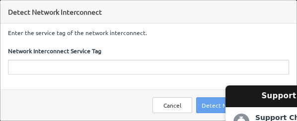{#fig:mwc-detect-network-router-modal}

-----

### mwc-reset-management-password-modal {#mwc-reset-management-password-modal}

- class: `MwcResetManagementPasswordModalComponent`
- using:
  - [`mwc-hardware-password-input`](#mwc-hardware-password-input)
- source file: `/home/fengxia/workspace/lenovo/olympia_ignite/mwc/src/main/webapp/app/hardware/components/reset-management-password-modal/reset-management-password-modal.component.ts`

#### Sample screenshot

-----

### mwc-hardware-details {#mwc-hardware-details}

- class: `HardwareDetailsComponent`
- using:
  - [`mwc-hardware-navigation-menu`](#mwc-hardware-navigation-menu)
  - [`mwc-location-actions-button`](#mwc-location-actions-button)
  - [`mwc-network-hardware-panel`](#mwc-network-hardware-panel)
  - [`mwc-storage-hardware-panel`](#mwc-storage-hardware-panel)
  - [`mwc-compute-hardware-panel`](#mwc-compute-hardware-panel)
- source file: `/home/fengxia/workspace/lenovo/olympia_ignite/mwc/src/main/webapp/app/hardware/components/hardware-details/hardware-details.component.ts`

#### Sample screenshot

{#fig:mwc-hardware-details}

-----

### mwc-hardware-navigation-menu {#mwc-hardware-navigation-menu}

- class: `HardwareNavigationMenu`
- used by:
  - [`mwc-hardware-details`](#mwc-hardware-details)

#### Sample screenshot

{#fig:mwc-hardware-navigation-menu}

-----

### mwc-internal-bridged-network-form {#mwc-internal-bridged-network-form}

- class: `MwcInternalBridgedNetworkFormComponent`
- using:
  - [`mwc-title-bar`](#mwc-title-bar)
- used by:
  - [`mwc-configure-network`](#mwc-configure-network)
  - [`mwc-change-routing-properties-modal`](#mwc-change-routing-properties-modal)
- source file: `/home/fengxia/workspace/lenovo/olympia_ignite/mwc/src/main/webapp/app/hardware/components/network-controller/internal-bridged-network-form/internal-bridged-network-form.component.ts`

#### Sample screenshot

-----

### mwc-internal-networks-table {#mwc-internal-networks-table}

- class: `InternalNetworksTableComponent`
- used by:
  - [`mwc-network-physical-settings`](#mwc-network-physical-settings)

#### Sample screenshot

{#fig:mwc-internal-networks-table}

-----

### mwc-location-actions-button {#mwc-location-actions-button}

- class: `LocationActionsButtonComponent`
- used by:
  - [`mwc-hardware-details`](#mwc-hardware-details)

#### Sample screenshot

-----

### mwc-multiple-ip-address-list {#mwc-multiple-ip-address-list}

- class: `MwcMultipleIpAddressListComponent`
- used by:
  - [`mwc-application-stats-table`](#mwc-application-stats-table)
  - [`mwc-register-storage-block`](#mwc-register-storage-block)
  - [`mwc-storage-block-table`](#mwc-storage-block-table)

#### Sample screenshot

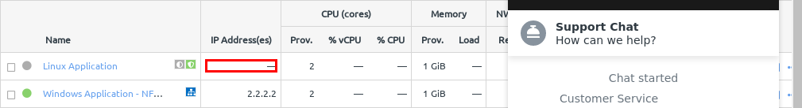{#fig:mwc-multiple-ip-address-list}

-----

### mwc-network-controller-actions-button {#mwc-network-controller-actions-button}

- class: `NetworkComponentActionsButtonComponent`
- used by:
  - [`mwc-network-hardware-panel`](#mwc-network-hardware-panel)

#### Sample screenshot

{#fig:mwc-network-controller-actions-button}

-----

### mwc-network-controller-error-status {#mwc-network-controller-error-status}

- class: `NetworkControllerErrorStatusComponent`
- used by:
  - [`mwc-network-hardware-panel`](#mwc-network-hardware-panel)

#### Sample screenshot

{#fig:mwc-network-controller-error-status}

-----

### mwc-network-hardware-panel {#mwc-network-hardware-panel}

- class: `MwcNetworkHardwarePanel`
- using:
  - [`mwc-network-physical-settings`](#mwc-network-physical-settings)
  - [`mwc-network-slot`](#mwc-network-slot)
  - [`mwc-network-hardware-status-icon`](#mwc-network-hardware-status-icon)
  - [`mwc-network-controller-error-status`](#mwc-network-controller-error-status)
  - [`mwc-network-controller-actions-button`](#mwc-network-controller-actions-button)
- used by:
  - [`mwc-hardware-details`](#mwc-hardware-details)
- source file: `/home/fengxia/workspace/lenovo/olympia_ignite/mwc/src/main/webapp/app/hardware/components/network-hardware-panel/network-hardware-panel.component.ts`

#### Sample screenshot

{#fig:mwc-network-hardware-panel}

-----

### mwc-network-hardware-status-icon {#mwc-network-hardware-status-icon}

- class: `NetworkHardwareStatusIconComponent`
- used by:
  - [`mwc-network-hardware-panel`](#mwc-network-hardware-panel)

#### Sample screenshot

{#fig:mwc-network-hardware-status-icon}

-----

### mwc-network-physical-settings {#mwc-network-physical-settings}

- class: `NetworkPhysicalSettingsComponent`
- using:
  - [`mwc-internal-networks-table`](#mwc-internal-networks-table)
- used by:
  - [`mwc-network-hardware-panel`](#mwc-network-hardware-panel)
- source file: `/home/fengxia/workspace/lenovo/olympia_ignite/mwc/src/main/webapp/app/hardware/components/network-physical/network-physical.component.ts`

#### Sample screenshot

{#fig:mwc-network-physical-settings}

-----

### mwc-network-slot {#mwc-network-slot}

- class: `MwcNetworkSlotComponent`
- used by:
  - [`mwc-network-hardware-panel`](#mwc-network-hardware-panel)

#### Sample screenshot

{#fig:mwc-network-slot}

-----

### mwc-register-router-pair {#mwc-register-router-pair}

- class: `MwcRegisterRouterPairComponent`
- using:
  - [`mwc-register-router-pair-information`](#mwc-register-router-pair-information)
  - [`mwc-register-router-pair-properties`](#mwc-register-router-pair-properties)
- source file: `/home/fengxia/workspace/lenovo/olympia_ignite/mwc/src/main/webapp/app/hardware/components/register-router-pair/register-router-pair.component.ts`

#### Sample screenshot

-----

### mwc-register-router-pair-information {#mwc-register-router-pair-information}

- class: `MwcRegisterRouterPairInformationComponent`
- used by:
  - [`mwc-register-router-pair`](#mwc-register-router-pair)

#### Sample screenshot

-----

### mwc-register-router-pair-properties {#mwc-register-router-pair-properties}

- class: `MwcRegisterRouterPairPropertiesComponent`
- using:
  - [`mwc-router-manager-password`](#mwc-router-manager-password)
- used by:
  - [`mwc-register-router-pair`](#mwc-register-router-pair)
- source file: `/home/fengxia/workspace/lenovo/olympia_ignite/mwc/src/main/webapp/app/hardware/components/register-router-pair-properties/register-router-pair-properties.component.ts`

#### Sample screenshot

-----

### mwc-register-storage-block {#mwc-register-storage-block}

- class: `RegisterStorageBlockComponent`
- using:
  - [`mwc-multiple-ip-address-list`](#mwc-multiple-ip-address-list)
  - [`mwc-disable-password-autocomplete`](#mwc-disable-password-autocomplete)
  - [`mwc-router-manager-password`](#mwc-router-manager-password)
- source file: `/home/fengxia/workspace/lenovo/olympia_ignite/mwc/src/main/webapp/app/hardware/components/register-storage-block/register-storage-block.component.ts`

#### Sample screenshot

-----

### mwc-router-information {#mwc-router-information}

- class: `RouterInformationComponent`
- used by:
  - [`mwc-configure-network`](#mwc-configure-network)

#### Sample screenshot

-----

### mwc-router-hardware-management-password {#mwc-router-hardware-management-password}

- class: `RouterHardwareManagementPasswordComponent`
- using:
  - [`mwc-hardware-password-input`](#mwc-hardware-password-input)
- used by:
  - [`mwc-configure-network`](#mwc-configure-network)
- source file: `/home/fengxia/workspace/lenovo/olympia_ignite/mwc/src/main/webapp/app/hardware/components/router-hardware-management-password/router-hardware-management-password.component.ts`

#### Sample screenshot

-----

### mwc-router-manager-password {#mwc-router-manager-password}

- class: `RouterManagerPasswordComponent`
- using:
  - [`mwc-password-input-field`](#mwc-password-input-field)
- used by:
  - [`mwc-configure-host`](#mwc-configure-host)
  - [`mwc-register-storage-block`](#mwc-register-storage-block)
  - [`mwc-router-properties`](#mwc-router-properties)
  - [`mwc-register-router-pair-properties`](#mwc-register-router-pair-properties)
- source file: `/home/fengxia/workspace/lenovo/olympia_ignite/mwc/src/main/webapp/app/hardware/components/router-manager-password/router-manager-password.component.ts`

#### Sample screenshot

-----

### mwc-hardware-password-input {#mwc-hardware-password-input}

- class: `ManagementPasswordInputComponent`
- used by:
  - [`mwc-reset-management-password-modal`](#mwc-reset-management-password-modal)
  - [`mwc-router-hardware-management-password`](#mwc-router-hardware-management-password)

#### Sample screenshot

-----

### mwc-router-properties {#mwc-router-properties}

- class: `RouterPropertiesComponent`
- using:
  - [`mwc-router-manager-password`](#mwc-router-manager-password)
- used by:
  - [`mwc-configure-network`](#mwc-configure-network)
- source file: `/home/fengxia/workspace/lenovo/olympia_ignite/mwc/src/main/webapp/app/hardware/components/router-properties/router-properties.component.ts`

#### Sample screenshot

-----

### mwc-storage-block-status-icon {#mwc-storage-block-status-icon}

- class: `MwcStorageBlockStatusIconComponent`
- used by:
  - [`mwc-storage-controller-properties`](#mwc-storage-controller-properties)
  - [`mwc-storage-slot`](#mwc-storage-slot)

#### Sample screenshot

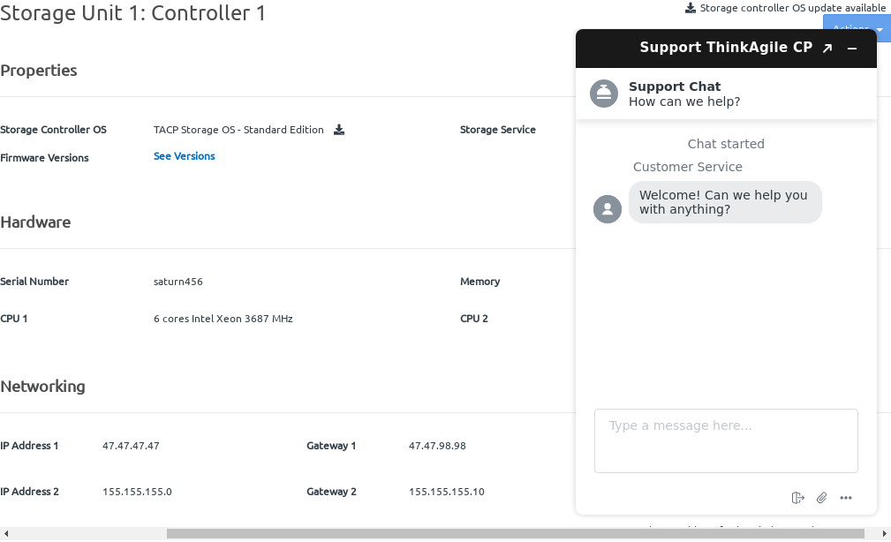{#fig:mwc-storage-block-status-icon}

-----

### mwc-storage-hardware-panel {#mwc-storage-hardware-panel}

- class: `StorageHardwarePanelComponent`
- using:
  - [`mwc-storage-block-actions-button`](#mwc-storage-block-actions-button)
  - [`mwc-storage-slot`](#mwc-storage-slot)
- used by:
  - [`mwc-hardware-details`](#mwc-hardware-details)
- source file: `/home/fengxia/workspace/lenovo/olympia_ignite/mwc/src/main/webapp/app/hardware/components/storage-hardware-panel/storage-hardware-panel.component.ts`

#### Sample screenshot

{#fig:mwc-storage-hardware-panel}

-----

### mwc-storage-slot {#mwc-storage-slot}

- class: `StorageSlotComponent`
- using:
  - [`mwc-storage-block-status-icon`](#mwc-storage-block-status-icon)
  - [`mwc-storage-controller-actions-button`](#mwc-storage-controller-actions-button)
- used by:
  - [`mwc-storage-hardware-panel`](#mwc-storage-hardware-panel)
- source file: `/home/fengxia/workspace/lenovo/olympia_ignite/mwc/src/main/webapp/app/hardware/components/storage-slot/storage-slot.component.ts`

#### Sample screenshot

{#fig:mwc-storage-slot}

-----

## mwc.application.group

### mwc-application-group-action-button {#mwc-application-group-action-button}

- class: `ApplicationGroupActionButtonComponent`
- used by:
  - [`mwc-application-bulk-action-panel`](#mwc-application-bulk-action-panel)

#### Sample screenshot

{#fig:mwc-application-group-action-button}

-----

### mwc-application-group-component {#mwc-application-group-component}

- class: `ApplicationGroup`
- using:
  - [`mwc-application-instructions`](#mwc-application-instructions)
  - [`mwc-application-stats-table`](#mwc-application-stats-table)
  - [`mwc-filter-by-dropdown`](#mwc-filter-by-dropdown)
  - [`mwc-application-bulk-action-panel`](#mwc-application-bulk-action-panel)
- source file: `/home/fengxia/workspace/lenovo/olympia_ignite/mwc/src/main/webapp/app/application-group/components/application-group/application-group.component.ts`

#### Sample screenshot

{#fig:mwc-application-group-component}

-----

### mwc-application-group-selection-box {#mwc-application-group-selection-box}

- class: `ApplicationGroupSelectionBoxComponent`
- used by:
  - [`mwc-application-form`](#mwc-application-form)
  - [`mwc-snapshot-form`](#mwc-snapshot-form)

#### Sample screenshot

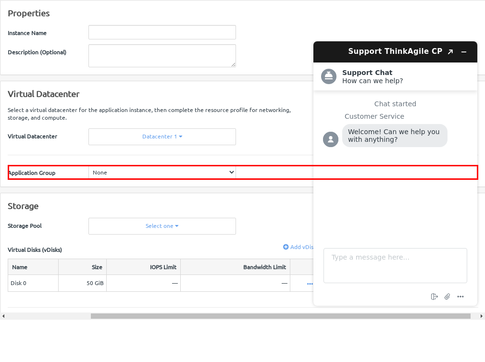{#fig:mwc-application-group-selection-box}

-----

## mwc.organization

### mwc-organization {#mwc-organization}

- class: `OrganizationComponent`

#### Sample screenshot

-----

### mwc-create-organization-modal {#mwc-create-organization-modal}

- class: `CreateOrganizationModalComponent`

#### Sample screenshot

-----

## mwc.storage-block

### mwc-storage-block-actions-button {#mwc-storage-block-actions-button}

- class: `MwcStorageBlockActionsButtonComponent`
- used by:
  - [`mwc-storage-block-table`](#mwc-storage-block-table)
  - [`mwc-storage-hardware-panel`](#mwc-storage-hardware-panel)

#### Sample screenshot

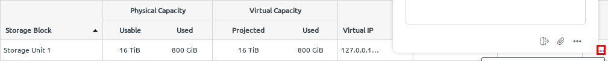{#fig:mwc-storage-block-actions-button}

-----

### mwc-restart-storage-block-modal {#mwc-restart-storage-block-modal}

- class: `MwcRestartStorageBlockModalComponent`
- using:
  - [`mwc-application-action-plan-table-for-flash-pool`](#mwc-application-action-plan-table-for-flash-pool)
- source file: `/home/fengxia/workspace/lenovo/olympia_ignite/mwc/src/main/webapp/app/storage-block/components/restart-storage-block-modal/restart-storage-block-modal.component.ts`

#### Sample screenshot

{#fig:mwc-restart-storage-block-modal}

-----

### mwc-add-storage-block-modal {#mwc-add-storage-block-modal}

- class: `MwcAddStorageBlockModalComponent`

#### Sample screenshot

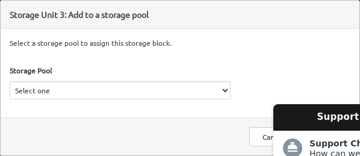{#fig:mwc-add-storage-block-modal}

-----

### mwc-power-off-storage-block-modal {#mwc-power-off-storage-block-modal}

- class: `MwcPowerOffStorageBlockModalComponent`
- using:
  - [`mwc-application-action-plan-table-for-flash-pool`](#mwc-application-action-plan-table-for-flash-pool)
- source file: `/home/fengxia/workspace/lenovo/olympia_ignite/mwc/src/main/webapp/app/storage-block/components/power-off-storage-block/power-off-storage-block-modal.component.ts`

#### Sample screenshot

{#fig:mwc-power-off-storage-block-modal}

-----

### mwc-storage-block-table {#mwc-storage-block-table}

- class: `StorageBlockTableComponent`
- using:
  - [`mwc-multiple-ip-address-list`](#mwc-multiple-ip-address-list)
  - [`mwc-storage-block-actions-button`](#mwc-storage-block-actions-button)
- used by:
  - [`mwc-flash-pool-resources-tab`](#mwc-flash-pool-resources-tab)
- source file: `/home/fengxia/workspace/lenovo/olympia_ignite/mwc/src/main/webapp/app/storage-block/components/storage-block-table/storage-block-table.component.ts`

#### Sample screenshot

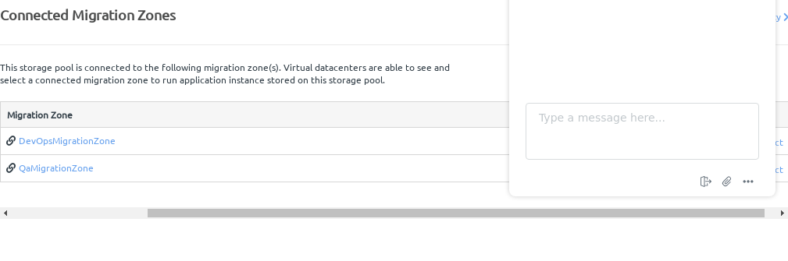{#fig:mwc-storage-block-table}

-----

## mwc.migration-zone

### mwc-add-host-modal {#mwc-add-host-modal}

- class: `MwcAddHostModalComponent`

#### Sample screenshot

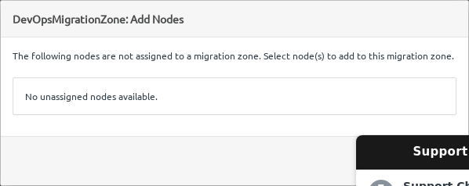{#fig:mwc-add-host-modal}

-----

### mwc-create-migration-zone-button {#mwc-create-migration-zone-button}

- class: `MwcCreateMigrationZoneButtonComponent`
- used by:
  - [`mwc-mappings`](#mwc-mappings)

#### Sample screenshot

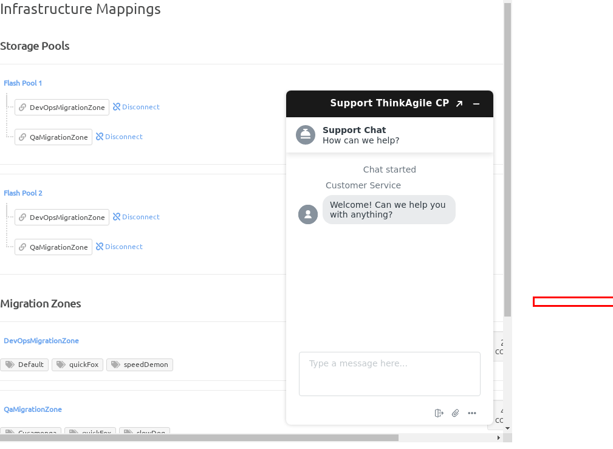{#fig:mwc-create-migration-zone-button}

-----

### mwc-datacenter-allocation-table {#mwc-datacenter-allocation-table}

- class: `DatacenterAllocationTableComponent`
- used by:
  - [`mwc-migration-zone-allocation-tab`](#mwc-migration-zone-allocation-tab)

#### Sample screenshot

{#fig:mwc-datacenter-allocation-table}

-----

### mwc-delete-app-connected-empty-migration-zone-modal {#mwc-delete-app-connected-empty-migration-zone-modal}

- class: `DeleteAppConnectedEmptyMigrationZoneModalComponent`

#### Sample screenshot

-----

### mwc-migration-zone-actions-button {#mwc-migration-zone-actions-button}

- class: `MwcMigrationZoneActionsButtonComponent`
- used by:
  - [`mwc-migration-zone-properties`](#mwc-migration-zone-properties)
  - [`mwc-mappings`](#mwc-mappings)

#### Sample screenshot

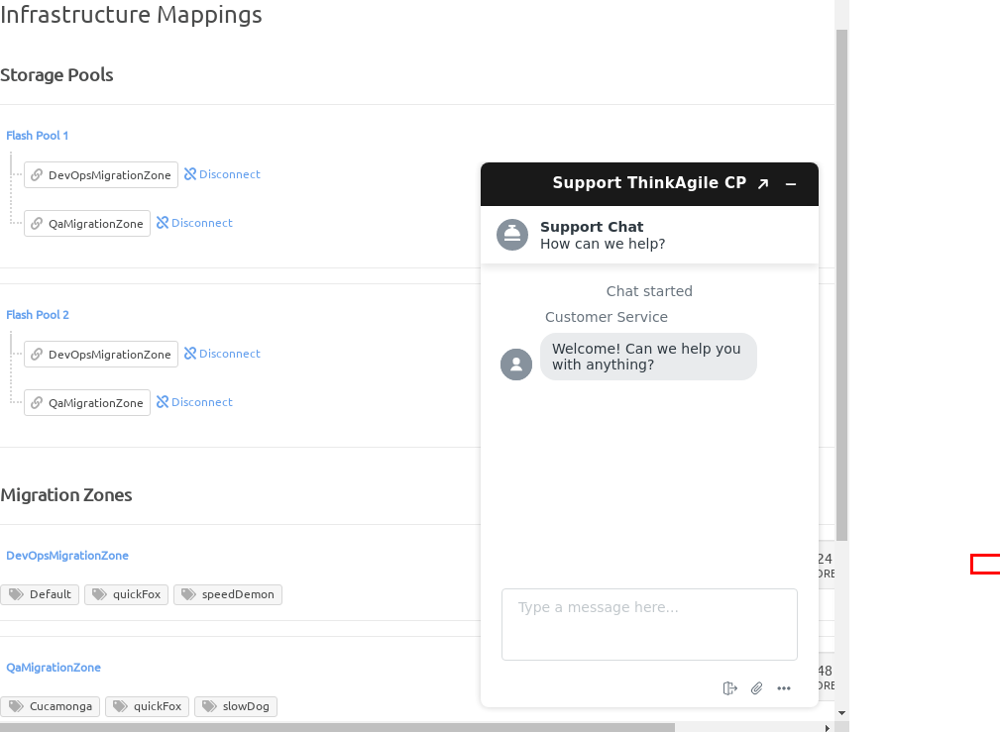{#fig:mwc-migration-zone-actions-button}

-----

### mwc-migration-zone-activity-tab {#mwc-migration-zone-activity-tab}

- class: `MigrationZoneActivityTabComponent`

#### Sample screenshot

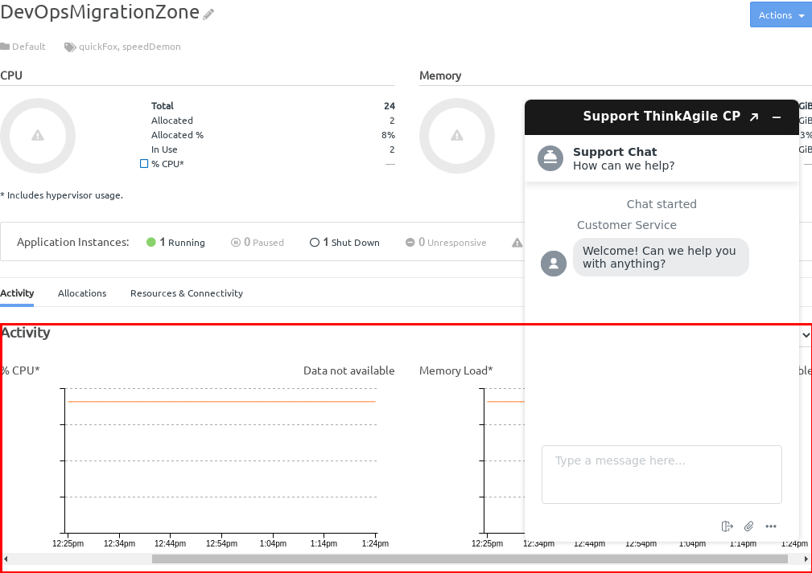{#fig:mwc-migration-zone-activity-tab}

-----

### mwc-migration-zone-allocation-tab {#mwc-migration-zone-allocation-tab}

- class: `MigrationZoneAllocationTabComponent`
- using:
  - [`mwc-migration-zone-compute-category-allocation-table`](#mwc-migration-zone-compute-category-allocation-table)
  - [`mwc-datacenter-allocation-table`](#mwc-datacenter-allocation-table)
- source file: `/home/fengxia/workspace/lenovo/olympia_ignite/mwc/src/main/webapp/app/migration-zone/components/migration-zone-allocation-tab/migration-zone-allocation-tab.component.ts`

#### Sample screenshot

{#fig:mwc-migration-zone-allocation-tab}

-----

### mwc-migration-zone-compute-category-allocation-table {#mwc-migration-zone-compute-category-allocation-table}

- class: `ComputeCategoryAllocationTableComponent`
- used by:
  - [`mwc-migration-zone-allocation-tab`](#mwc-migration-zone-allocation-tab)

#### Sample screenshot

{#fig:mwc-migration-zone-compute-category-allocation-table}

-----

### mwc-migration-zone-properties {#mwc-migration-zone-properties}

- class: `MigrationZonePropertiesComponent`
- using:
  - [`mwc-migration-zone-status-bar`](#mwc-migration-zone-status-bar)
  - [`mwc-application-summary-panel`](#mwc-application-summary-panel)
  - [`mwc-migration-zone-actions-button`](#mwc-migration-zone-actions-button)
- source file: `/home/fengxia/workspace/lenovo/olympia_ignite/mwc/src/main/webapp/app/migration-zone/components/migration-zone-properties/migration-zone-properties.component.ts`

#### Sample screenshot

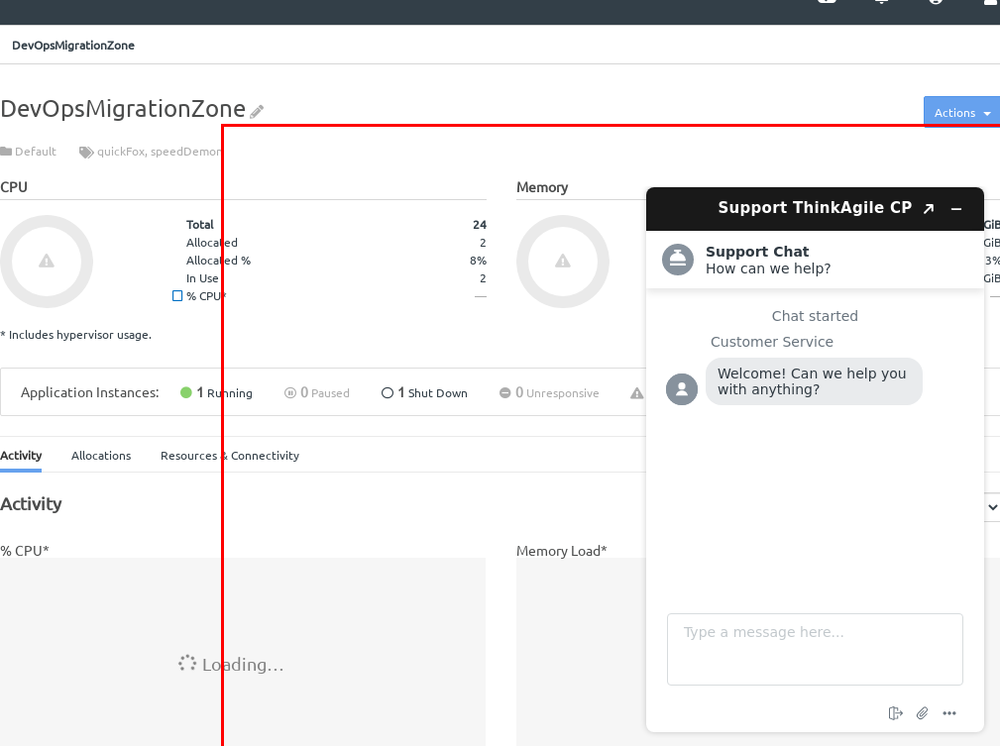{#fig:mwc-migration-zone-properties}

-----

### mwc-migration-zone-resource-tab {#mwc-migration-zone-resource-tab}

- class: `MigrationZoneResourceTabComponent`
- using:
  - [`mwc-host-resource-table`](#mwc-host-resource-table)
- source file: `/home/fengxia/workspace/lenovo/olympia_ignite/mwc/src/main/webapp/app/migration-zone/components/migration-zone-resource-tab/migration-zone-resource-tab.component.ts`

#### Sample screenshot

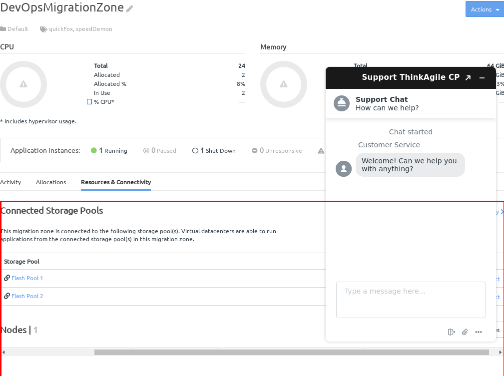{#fig:mwc-migration-zone-resource-tab}

-----

### mwc-migration-zone-status-bar {#mwc-migration-zone-status-bar}

- class: `MwcMigrationZoneStatusBarComponent`
- used by:
  - [`mwc-migration-zone-properties`](#mwc-migration-zone-properties)

#### Sample screenshot

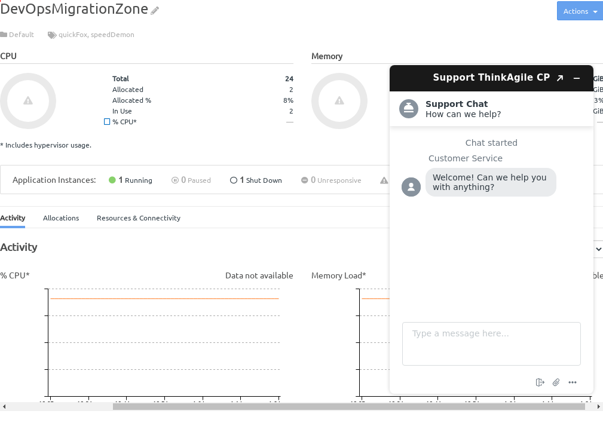{#fig:mwc-migration-zone-status-bar}

-----

## mwc.application

### mwc-action-plan-table {#mwc-action-plan-table}

- class: `ActionPlanTableComponent`
- using:
  - [`mwc-application-status-icons`](#mwc-application-status-icons)
- used by:
  - [`mwc-unassign-vdc-modal`](#mwc-unassign-vdc-modal)
- source file: `/home/fengxia/workspace/lenovo/olympia_ignite/mwc/src/main/webapp/app/application/components/action-plan-table/action-plan-table.component.ts`

#### Sample screenshot

-----

### mwc-add-application-v-nic {#mwc-add-application-v-nic}

- class: `AddApplicationVnicModalComponent`
- using:
  - [`mwc-edit-vnic-networking-mode`](#mwc-edit-vnic-networking-mode)
  - [`mwc-edit-application-property-info-panel`](#mwc-edit-application-property-info-panel)
- source file: `/home/fengxia/workspace/lenovo/olympia_ignite/mwc/src/main/webapp/app/application/components/modals/add-application-vnic-modal/add-application-vnic-modal.component.ts`

#### Sample screenshot

-----

### mwc-add-edit-application-disk-modal {#mwc-add-edit-application-disk-modal}

- class: `AddEditApplicationDiskModalComponent`

#### Sample screenshot

-----

### mwc-add-vdisk-clone-modal {#mwc-add-vdisk-clone-modal}

- class: `AddVDiskCloneModalComponent`

#### Sample screenshot

-----

### mwc-all-instances-filter-options {#mwc-all-instances-filter-options}

- class: `AllInstancesFilterComponent`
- using:
  - [`mwc-default-filter-options`](#mwc-default-filter-options)
- used by:
  - [`mwc-filter-by-dropdown`](#mwc-filter-by-dropdown)
- source file: `/home/fengxia/workspace/lenovo/olympia_ignite/mwc/src/main/webapp/app/application/components/application-filter-by-dropdown/all-instances-filter-options/all-instances-filter-options.component.ts`

#### Sample screenshot

{#fig:mwc-all-instances-filter-options}

-----

### mwc-answer-file-form {#mwc-answer-file-form}

- class: `AnswerFileFormComponent`
- used by:
  - [`mwc-windows-os-options`](#mwc-windows-os-options)
  - [`mwc-create-application-template`](#mwc-create-application-template)

#### Sample screenshot

-----

### mwc-application {#mwc-application}

- class: `ApplicationComponent`
- using:
  - [`mwc-application-instructions`](#mwc-application-instructions)
  - [`mwc-application-stats-table`](#mwc-application-stats-table)
  - [`mwc-filter-by-dropdown`](#mwc-filter-by-dropdown)
  - [`mwc-application-bulk-action-panel`](#mwc-application-bulk-action-panel)
- source file: `/home/fengxia/workspace/lenovo/olympia_ignite/mwc/src/main/webapp/app/application/components/application/application.component.ts`

#### Sample screenshot

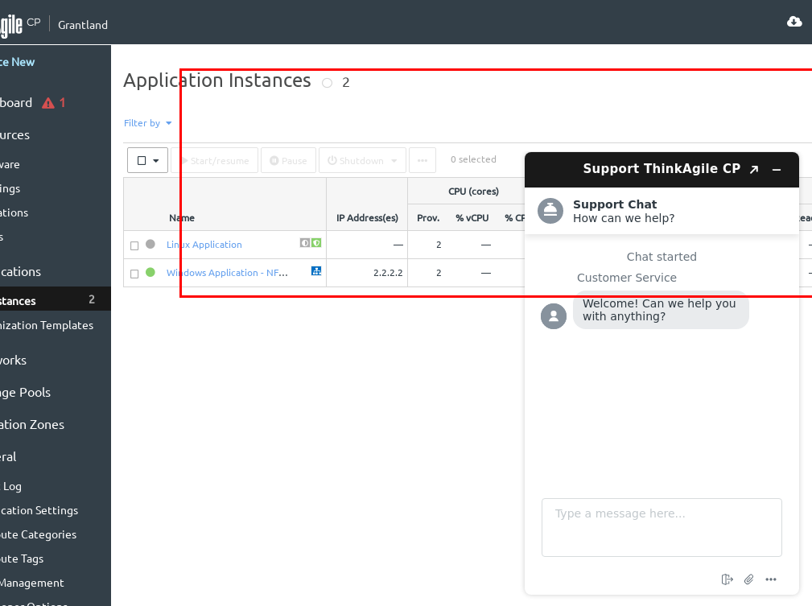{#fig:mwc-application}

-----

### mwc-application-action-button-items {#mwc-application-action-button-items}

- class: `ActionsItemsComponent`
- using:
  - [`mwc-application-start-button`](#mwc-application-start-button)
  - [`mwc-application-update-boot-order-button`](#mwc-application-update-boot-order-button)
  - [`mwc-application-delete-button`](#mwc-application-delete-button)
  - [`mwc-application-update-compute-constraints-button`](#mwc-application-update-compute-constraints-button)
  - [`mwc-application-update-cpu-button`](#mwc-application-update-cpu-button)
  - [`mwc-application-add-vnic-button`](#mwc-application-add-vnic-button)
  - [`mwc-application-force-shutdown-button`](#mwc-application-force-shutdown-button)
  - [`mwc-application-rename-button`](#mwc-application-rename-button)
  - [`mwc-application-toggle-hardware-assisted-virtualization-button`](#mwc-application-toggle-hardware-assisted-virtualization-button)
  - [`mwc-application-restart-button`](#mwc-application-restart-button)
  - [`mwc-application-toggle-automatic-recovery-button`](#mwc-application-toggle-automatic-recovery-button)
  - [`mwc-application-resume-button`](#mwc-application-resume-button)
  - [`mwc-application-add-vdisk-button`](#mwc-application-add-vdisk-button)
  - [`mwc-application-update-description-button`](#mwc-application-update-description-button)
  - [`mwc-application-update-vdc-button`](#mwc-application-update-vdc-button)
  - [`mwc-application-create-application-template-button`](#mwc-application-create-application-template-button)
  - [`mwc-application-shutdown-button`](#mwc-application-shutdown-button)
  - [`mwc-application-force-restart-button`](#mwc-application-force-restart-button)
  - [`mwc-application-update-memory-button`](#mwc-application-update-memory-button)
  - [`mwc-application-toggle-guest-tools-button`](#mwc-application-toggle-guest-tools-button)
  - [`mwc-application-create-snapshot-button`](#mwc-application-create-snapshot-button)
  - [`mwc-application-update-migration-zone-button`](#mwc-application-update-migration-zone-button)
  - [`mwc-application-update-time-zone-button`](#mwc-application-update-time-zone-button)
  - [`mwc-application-toggle-vm-mode-button`](#mwc-application-toggle-vm-mode-button)
  - [`mwc-application-pause-button`](#mwc-application-pause-button)
  - [`mwc-application-console-button`](#mwc-application-console-button)
- used by:
  - [`mwc-application-actions-button`](#mwc-application-actions-button)
- source file: `/home/fengxia/workspace/lenovo/olympia_ignite/mwc/src/main/webapp/app/application/components/application-actions-button/action-items/action-items.component.ts`

#### Sample screenshot

-----

### mwc-application-action-plan-table {#mwc-application-action-plan-table}

- class: `ApplicationActionPlanTableComponent`
- using:
  - [`mwc-application-status-icons`](#mwc-application-status-icons)
- used by:
  - [`mwc-delete-network-with-applications-modal`](#mwc-delete-network-with-applications-modal)
- source file: `/home/fengxia/workspace/lenovo/olympia_ignite/mwc/src/main/webapp/app/application/components/application-action-plan-table/application-action-plan-table.component.ts`

#### Sample screenshot

{#fig:mwc-application-action-plan-table}

-----

### mwc-application-action-plan-table-for-flash-pool {#mwc-application-action-plan-table-for-flash-pool}

- class: `ApplicationActionPlanTableForFlashPoolComponent`
- used by:
  - [`mwc-disconnect-flash-pool-from-migration-zone-modal`](#mwc-disconnect-flash-pool-from-migration-zone-modal)
  - [`mwc-power-off-storage-block-modal`](#mwc-power-off-storage-block-modal)
  - [`mwc-restart-storage-block-modal`](#mwc-restart-storage-block-modal)

#### Sample screenshot

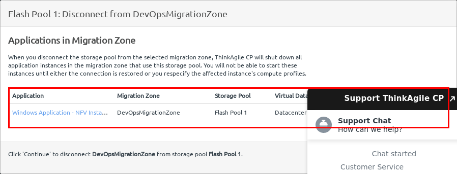{#fig:mwc-application-action-plan-table-for-flash-pool}

-----

### mwc-application-actions-button {#mwc-application-actions-button}

- class: `ApplicationActionsButtonComponent`
- using:
  - [`mwc-application-action-button-items`](#mwc-application-action-button-items)
- used by:
  - [`mwc-application-stats-table`](#mwc-application-stats-table)
  - [`mwc-application-properties-page`](#mwc-application-properties-page)
- source file: `/home/fengxia/workspace/lenovo/olympia_ignite/mwc/src/main/webapp/app/application/components/application-actions-button/application-actions-button.component.ts`

#### Sample screenshot

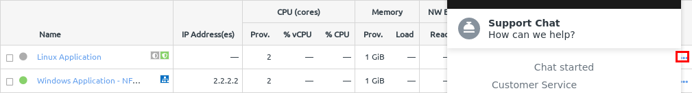{#fig:mwc-application-actions-button}

-----

### mwc-application-activity-tab {#mwc-application-activity-tab}

- class: `ApplicationActivityTabComponent`

#### Sample screenshot

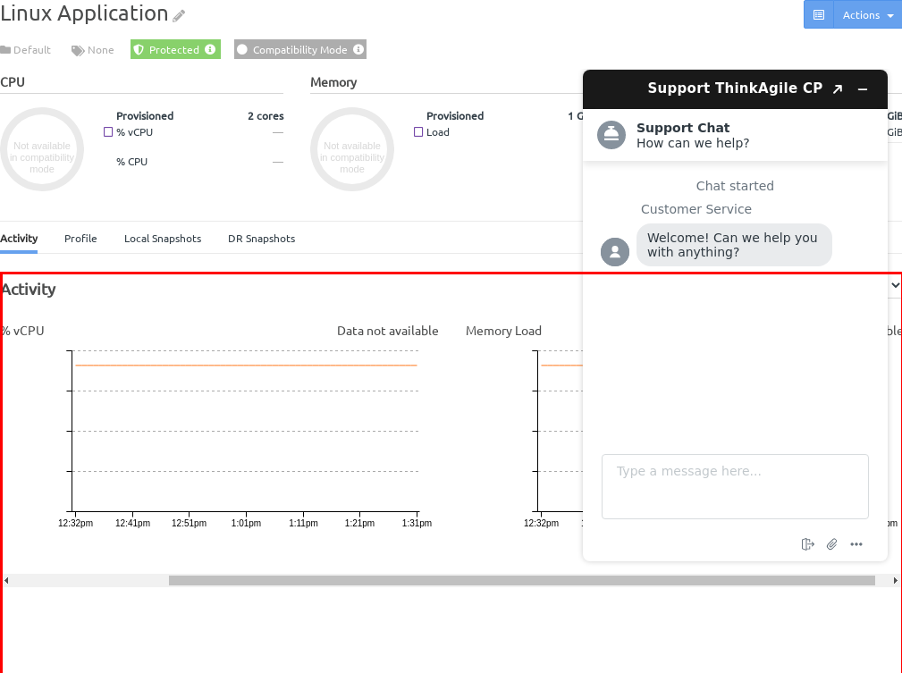{#fig:mwc-application-activity-tab}

-----

### mwc-application-add-vdisk-button {#mwc-application-add-vdisk-button}

- class: `AddVdiskButtonComponent`
- used by:
  - [`mwc-application-action-button-items`](#mwc-application-action-button-items)

#### Sample screenshot

-----

### mwc-application-add-vnic-button {#mwc-application-add-vnic-button}

- class: `AddVnicButtonComponent`
- used by:
  - [`mwc-application-action-button-items`](#mwc-application-action-button-items)

#### Sample screenshot

-----

### mwc-application-bulk-action-button-group {#mwc-application-bulk-action-button-group}

- class: `BulkActionButtonGroupComponent`
- used by:
  - [`mwc-application-bulk-action-panel`](#mwc-application-bulk-action-panel)

#### Sample screenshot

{#fig:mwc-application-bulk-action-button-group}

-----

### mwc-application-bulk-action-panel {#mwc-application-bulk-action-panel}

- class: `ApplicationBulkActionPanel`
- using:
  - [`mwc-application-group-action-button`](#mwc-application-group-action-button)
  - [`mwc-application-bulk-action-button-group`](#mwc-application-bulk-action-button-group)
  - [`mwc-application-table-top-check-button`](#mwc-application-table-top-check-button)
- used by:
  - [`mwc-application`](#mwc-application)
  - [`mwc-application-group-component`](#mwc-application-group-component)
  - [`mwc-datacenter-applications`](#mwc-datacenter-applications)
- source file: `/home/fengxia/workspace/lenovo/olympia_ignite/mwc/src/main/webapp/app/application/components/application-bulk-action-panel/application-bulk-action-panel.component.ts`

#### Sample screenshot

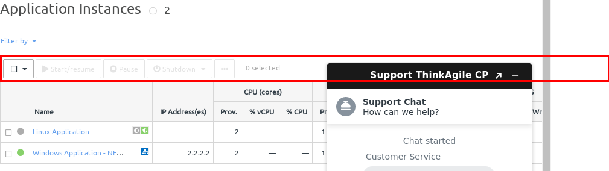{#fig:mwc-application-bulk-action-panel}

-----

### mwc-application-console-button {#mwc-application-console-button}

- class: `ConsoleButtonComponent`
- used by:
  - [`mwc-application-action-button-items`](#mwc-application-action-button-items)
  - [`mwc-application-stats-table`](#mwc-application-stats-table)
  - [`mwc-network-service-application-action-items`](#mwc-network-service-application-action-items)

#### Sample screenshot

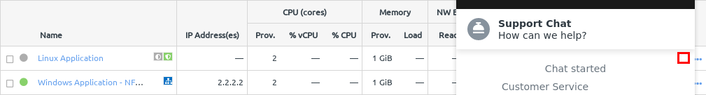{#fig:mwc-application-console-button}

-----

### mwc-application-create-application-template-button {#mwc-application-create-application-template-button}

- class: `CreateApplicationTemplateButtonComponent`
- used by:
  - [`mwc-application-action-button-items`](#mwc-application-action-button-items)

#### Sample screenshot

-----

### mwc-application-create-snapshot-button {#mwc-application-create-snapshot-button}

- class: `CreateSnapshotButtonComponent`
- used by:
  - [`mwc-application-action-button-items`](#mwc-application-action-button-items)

#### Sample screenshot

-----

### mwc-application-delete-button {#mwc-application-delete-button}

- class: `DeleteButtonComponent`
- used by:
  - [`mwc-application-action-button-items`](#mwc-application-action-button-items)

#### Sample screenshot

-----

### mwc-application-disaster-recovery-button {#mwc-application-disaster-recovery-button}

- class: `MwcApplicationDisasterRecoveryButtonComponent`
- used by:
  - [`mwc-application-disaster-recovery-tab`](#mwc-application-disaster-recovery-tab)

#### Sample screenshot

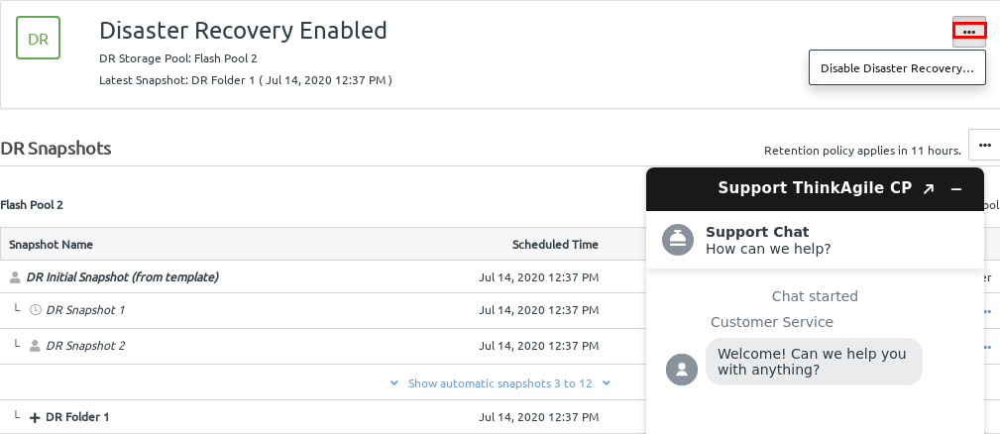{#fig:mwc-application-disaster-recovery-button}

-----

### mwc-application-disaster-recovery-snapshots-table {#mwc-application-disaster-recovery-snapshots-table}

- class: `ApplicationDisasterRecoverySnapshotsTableComponent`
- used by:
  - [`mwc-application-disaster-recovery-tab`](#mwc-application-disaster-recovery-tab)
  - [`mwc-deleted-application-properties`](#mwc-deleted-application-properties)

#### Sample screenshot

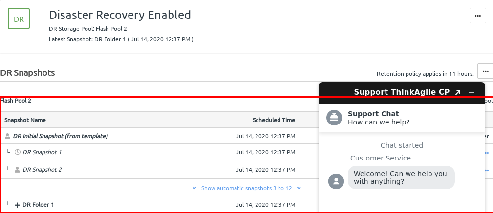{#fig:mwc-application-disaster-recovery-snapshots-table}

-----

### mwc-application-disaster-recovery-tab {#mwc-application-disaster-recovery-tab}

- class: `ApplicationDisasterRecoveryTabComponent`
- using:
  - [`mwc-application-dr-retention-policy-actions-button`](#mwc-application-dr-retention-policy-actions-button)
  - [`mwc-application-disaster-recovery-snapshots-table`](#mwc-application-disaster-recovery-snapshots-table)
  - [`mwc-application-disaster-recovery-button`](#mwc-application-disaster-recovery-button)
  - [`mwc-dr-policy-status-bar`](#mwc-dr-policy-status-bar)
  - [`mwc-date-time`](#mwc-date-time)
- source file: `/home/fengxia/workspace/lenovo/olympia_ignite/mwc/src/main/webapp/app/application/components/tabs/disaster-recovery-tab.component.ts`

#### Sample screenshot

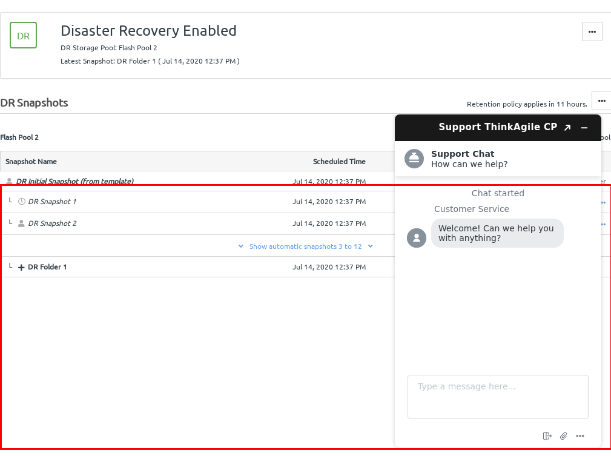{#fig:mwc-application-disaster-recovery-tab}

-----

### mwc-application-disk-table {#mwc-application-disk-table}

- class: `ApplicationDiskTableComponent`
- used by:
  - [`mwc-application-form`](#mwc-application-form)
  - [`mwc-profile-tab-storage-properties`](#mwc-profile-tab-storage-properties)
  - [`mwc-snapshot-form`](#mwc-snapshot-form)

#### Sample screenshot

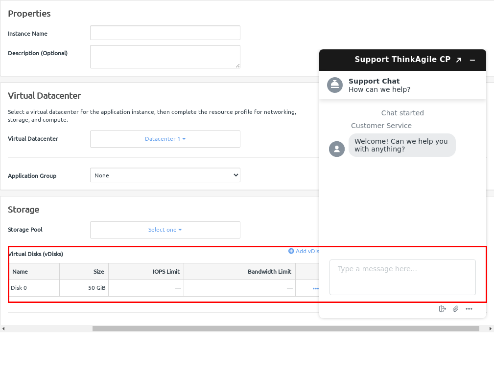{#fig:mwc-application-disk-table}

-----

### mwc-application-dr-retention-policy-actions-button {#mwc-application-dr-retention-policy-actions-button}

- class: `ApplicationDrRetentionPolicyActionsComponent`
- used by:
  - [`mwc-application-disaster-recovery-tab`](#mwc-application-disaster-recovery-tab)
  - [`mwc-deleted-application-properties`](#mwc-deleted-application-properties)

#### Sample screenshot

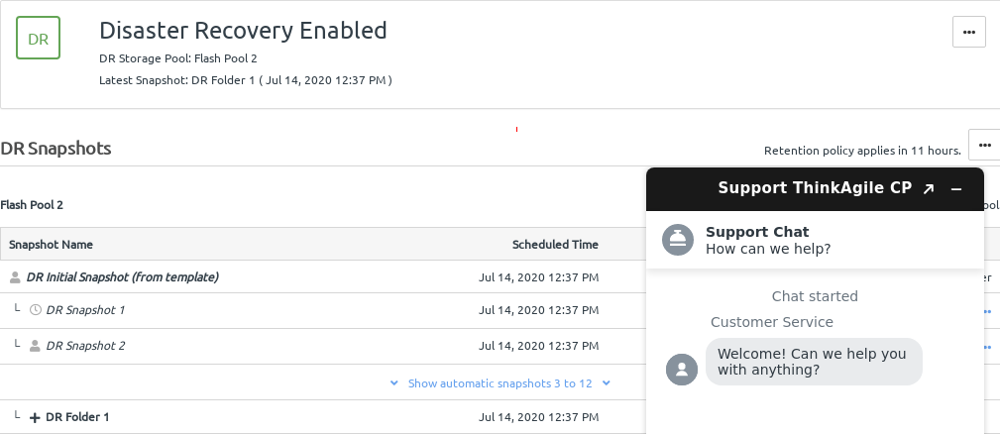{#fig:mwc-application-dr-retention-policy-actions-button}

-----

### mwc-application-force-restart-button {#mwc-application-force-restart-button}

- class: `ForceRestartButtonComponent`
- used by:
  - [`mwc-application-action-button-items`](#mwc-application-action-button-items)
  - [`mwc-network-service-application-action-items`](#mwc-network-service-application-action-items)

#### Sample screenshot

-----

### mwc-application-force-shutdown-button {#mwc-application-force-shutdown-button}

- class: `ForceShutdownButtonComponent`
- used by:
  - [`mwc-application-action-button-items`](#mwc-application-action-button-items)
  - [`mwc-network-service-application-action-items`](#mwc-network-service-application-action-items)

#### Sample screenshot

-----

### mwc-application-form {#mwc-application-form}

- class: `ApplicationFormComponent`
- using:
  - [`mwc-dropdown-menu`](#mwc-dropdown-menu)
  - [`mwc-dropdown-menu-default`](#mwc-dropdown-menu-default)
  - [`mwc-instance-settings-form`](#mwc-instance-settings-form)
  - [`mwc-installer-form`](#mwc-installer-form)
  - [`mwc-application-vnic-form`](#mwc-application-vnic-form)
  - [`mwc-application-disk-table`](#mwc-application-disk-table)
  - [`mwc-application-group-selection-box`](#mwc-application-group-selection-box)
  - [`mwc-windows-os-options`](#mwc-windows-os-options)
- used by:
  - [`mwc-create-application`](#mwc-create-application)
- source file: `/home/fengxia/workspace/lenovo/olympia_ignite/mwc/src/main/webapp/app/application/components/application-form/application-form.component.ts`

#### Sample screenshot

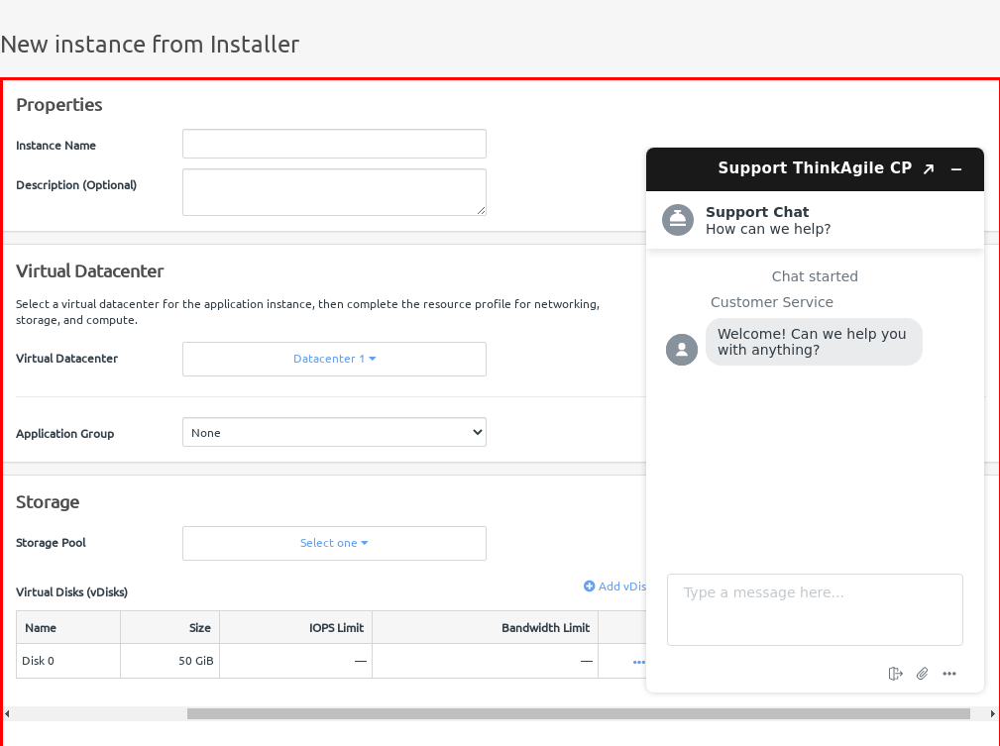{#fig:mwc-application-form}

-----

### mwc-application-instructions {#mwc-application-instructions}

- class: `ApplicationInstructionsComponent`
- used by:
  - [`mwc-application`](#mwc-application)
  - [`mwc-application-group-component`](#mwc-application-group-component)
  - [`mwc-datacenter-applications`](#mwc-datacenter-applications)

#### Sample screenshot

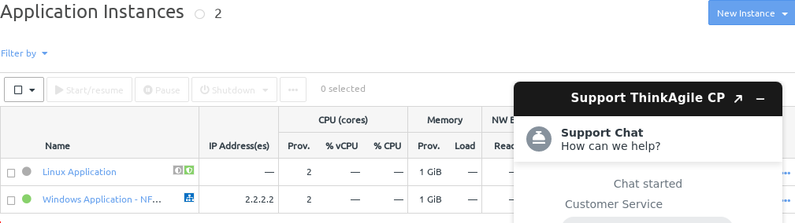{#fig:mwc-application-instructions}

-----

### mwc-application-pause-button {#mwc-application-pause-button}

- class: `PauseButtonComponent`
- used by:
  - [`mwc-application-action-button-items`](#mwc-application-action-button-items)
  - [`mwc-network-service-application-action-items`](#mwc-network-service-application-action-items)

#### Sample screenshot

-----

### mwc-application-profile-tab {#mwc-application-profile-tab}

- class: `ApplicationProfileTabComponent`
- using:
  - [`mwc-profile-tab-networking-properties`](#mwc-profile-tab-networking-properties)
  - [`mwc-profile-tab-compute-properties`](#mwc-profile-tab-compute-properties)
  - [`mwc-profile-tab-nfv-instance-properties`](#mwc-profile-tab-nfv-instance-properties)
  - [`mwc-profile-tab-general-properties`](#mwc-profile-tab-general-properties)
  - [`mwc-profile-tab-settings-properties`](#mwc-profile-tab-settings-properties)
  - [`mwc-profile-tab-storage-properties`](#mwc-profile-tab-storage-properties)
- used by:
  - [`mwc-deleted-application-properties`](#mwc-deleted-application-properties)
- source file: `/home/fengxia/workspace/lenovo/olympia_ignite/mwc/src/main/webapp/app/application/components/application-profile-tab/application-profile-tab.component.ts`

#### Sample screenshot

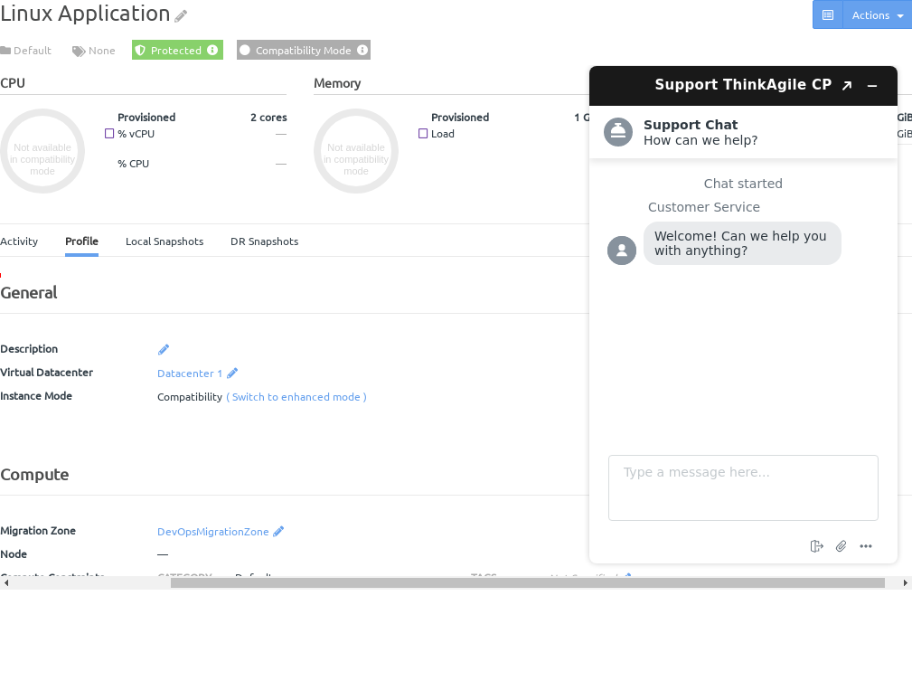{#fig:mwc-application-profile-tab}

-----

### mwc-application-properties-page {#mwc-application-properties-page}

- class: `ApplicationPropertiesPageComponent`
- using:
  - [`mwc-date-time`](#mwc-date-time)
  - [`mwc-dr-status-section`](#mwc-dr-status-section)
  - [`mwc-application-actions-button`](#mwc-application-actions-button)
  - [`mwc-temporary-reverted-to-snapshot-status-bar`](#mwc-temporary-reverted-to-snapshot-status-bar)
  - [`mwc-application-status-bar`](#mwc-application-status-bar)
- source file: `/home/fengxia/workspace/lenovo/olympia_ignite/mwc/src/main/webapp/app/application/components/application-properties-page/application-properties-page.component.ts`

#### Sample screenshot

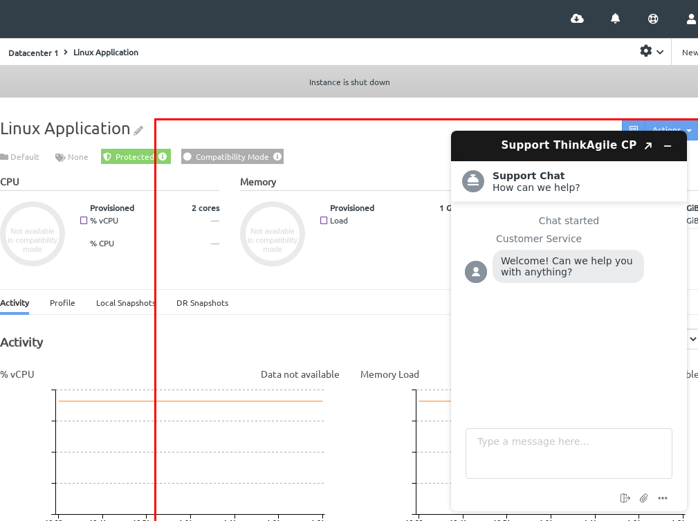{#fig:mwc-application-properties-page}

-----

### mwc-application-rename-button {#mwc-application-rename-button}

- class: `RenameButtonComponent`
- used by:
  - [`mwc-application-action-button-items`](#mwc-application-action-button-items)

#### Sample screenshot

-----

### mwc-application-restart-button {#mwc-application-restart-button}

- class: `RestartButtonComponent`
- used by:
  - [`mwc-application-action-button-items`](#mwc-application-action-button-items)
  - [`mwc-network-service-application-action-items`](#mwc-network-service-application-action-items)

#### Sample screenshot

-----

### mwc-application-resume-button {#mwc-application-resume-button}

- class: `ResumeButtonComponent`
- used by:
  - [`mwc-application-action-button-items`](#mwc-application-action-button-items)
  - [`mwc-network-service-application-action-items`](#mwc-network-service-application-action-items)

#### Sample screenshot

-----

### mwc-application-shutdown-button {#mwc-application-shutdown-button}

- class: `ShutdownButtonComponent`
- used by:
  - [`mwc-application-action-button-items`](#mwc-application-action-button-items)
  - [`mwc-network-service-application-action-items`](#mwc-network-service-application-action-items)

#### Sample screenshot

-----

### mwc-application-snapshot-button {#mwc-application-snapshot-button}

- class: `ApplicationSnapshotButtonComponent`
- used by:
  - [`mwc-application-snapshot-tab`](#mwc-application-snapshot-tab)

#### Sample screenshot

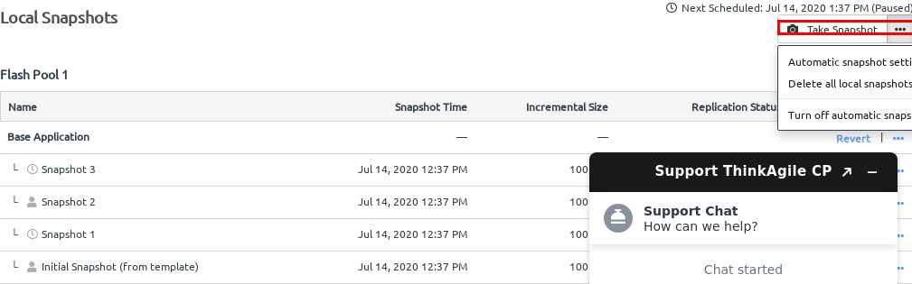{#fig:mwc-application-snapshot-button}

-----

### mwc-application-snapshot-tab {#mwc-application-snapshot-tab}

- class: `ApplicationSnapshotTabComponent`
- using:
  - [`mwc-application-snapshot-button`](#mwc-application-snapshot-button)
  - [`mwc-date-time`](#mwc-date-time)
- source file: `/home/fengxia/workspace/lenovo/olympia_ignite/mwc/src/main/webapp/app/application/components/application-snapshot-tab/application-snapshot-tab.component.ts`

#### Sample screenshot

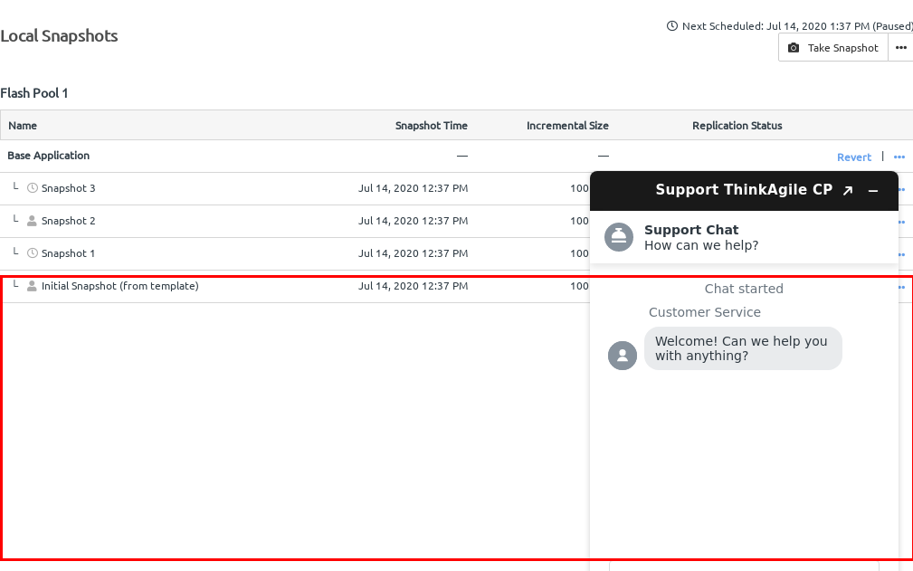{#fig:mwc-application-snapshot-tab}

-----

### mwc-application-start-button {#mwc-application-start-button}

- class: `StartButtonComponent`
- used by:
  - [`mwc-application-action-button-items`](#mwc-application-action-button-items)
  - [`mwc-network-service-application-action-items`](#mwc-network-service-application-action-items)

#### Sample screenshot

-----

### mwc-application-stats-table {#mwc-application-stats-table}

- class: `ApplicationStatsTableComponent`
- using:
  - [`mwc-multiple-ip-address-list`](#mwc-multiple-ip-address-list)
  - [`mwc-application-actions-button`](#mwc-application-actions-button)
  - [`mwc-application-status-icons`](#mwc-application-status-icons)
  - [`mwc-application-console-button`](#mwc-application-console-button)
  - [`mwc-application-stats-table-info-icons`](#mwc-application-stats-table-info-icons)
- used by:
  - [`mwc-application`](#mwc-application)
  - [`mwc-application-group-component`](#mwc-application-group-component)
  - [`mwc-datacenter-applications`](#mwc-datacenter-applications)
- source file: `/home/fengxia/workspace/lenovo/olympia_ignite/mwc/src/main/webapp/app/application/components/application-stats-table/application-stats-table.component.ts`

#### Sample screenshot

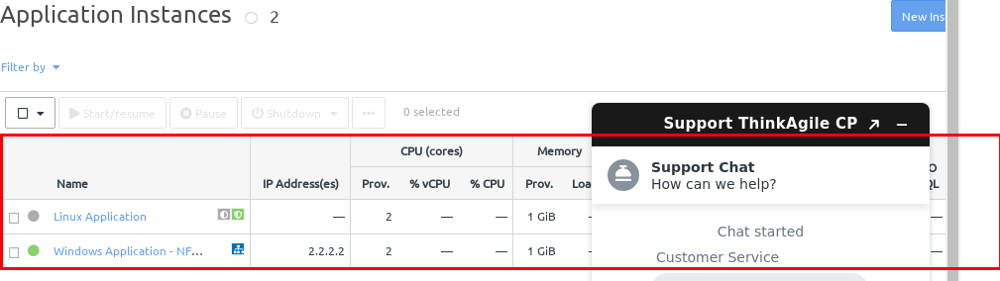{#fig:mwc-application-stats-table}

-----

### mwc-application-stats-table-info-icons {#mwc-application-stats-table-info-icons}

- class: `ApplicationStatsTableInfoIconsComponent`
- used by:
  - [`mwc-application-stats-table`](#mwc-application-stats-table)

#### Sample screenshot

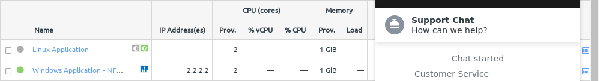{#fig:mwc-application-stats-table-info-icons}

-----

### mwc-application-status-bar {#mwc-application-status-bar}

- class: `MwcApplicationStatusBarComponent`
- used by:
  - [`mwc-application-properties-page`](#mwc-application-properties-page)

#### Sample screenshot

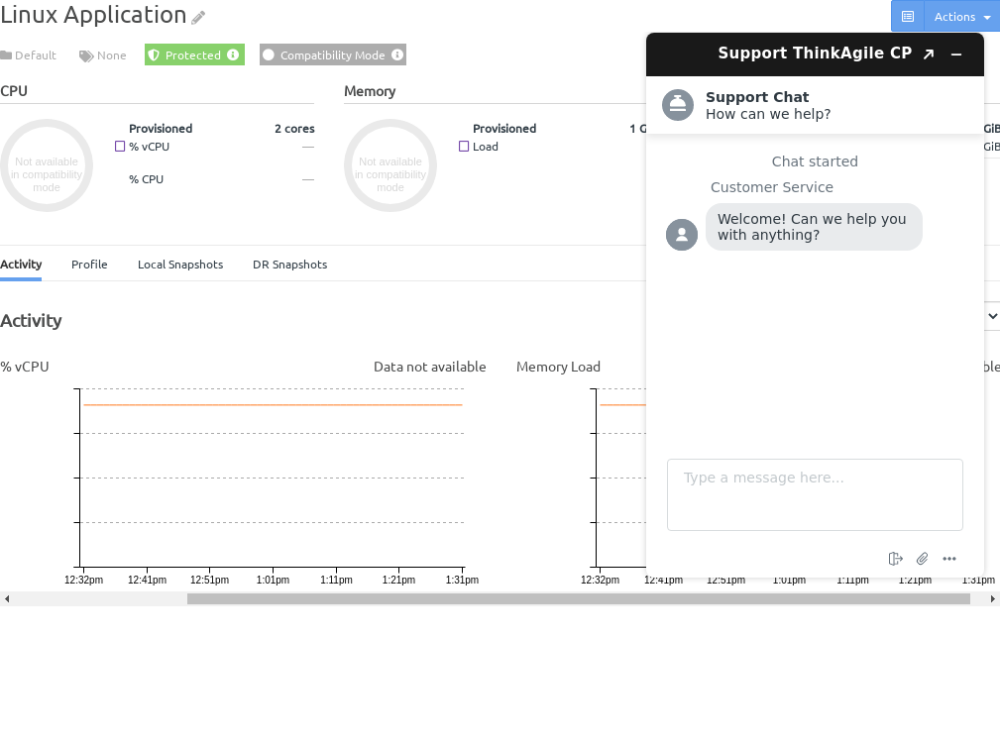{#fig:mwc-application-status-bar}

-----

### mwc-application-status-icons {#mwc-application-status-icons}

- class: `ApplicationStatusIconsComponent`
- used by:
  - [`mwc-application-stats-table`](#mwc-application-stats-table)
  - [`mwc-network-table`](#mwc-network-table)
  - [`mwc-action-plan-table`](#mwc-action-plan-table)
  - [`mwc-bulk-action-warning-modal-component`](#mwc-bulk-action-warning-modal-component)
  - [`mwc-application-action-plan-table`](#mwc-application-action-plan-table)

#### Sample screenshot

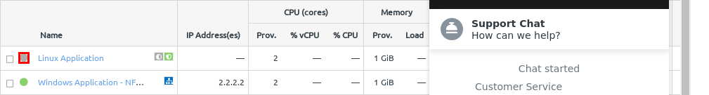{#fig:mwc-application-status-icons}

-----

### mwc-application-summary-panel {#mwc-application-summary-panel}

- class: `ApplicationSummaryPanelComponent`
- used by:
  - [`mwc-flash-pool-properties`](#mwc-flash-pool-properties)
  - [`mwc-network-properties`](#mwc-network-properties)
  - [`mwc-vdc-properties`](#mwc-vdc-properties)
  - [`mwc-host-properties`](#mwc-host-properties)
  - [`mwc-migration-zone-properties`](#mwc-migration-zone-properties)

#### Sample screenshot

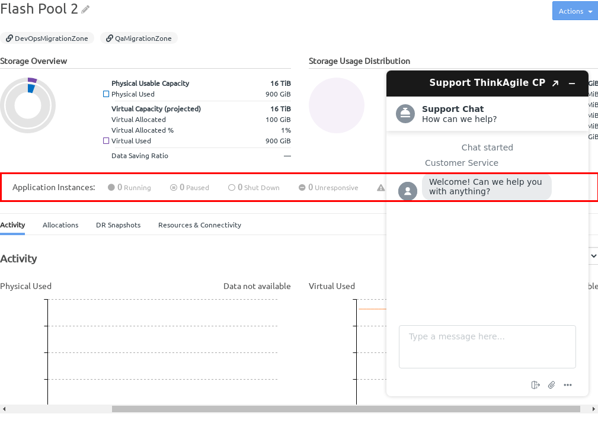{#fig:mwc-application-summary-panel}

-----

### mwc-application-table-top-check-button {#mwc-application-table-top-check-button}

- class: `TopCheckButtonComponent`
- used by:
  - [`mwc-bulk-action-warning-modal-component`](#mwc-bulk-action-warning-modal-component)
  - [`mwc-application-bulk-action-panel`](#mwc-application-bulk-action-panel)

#### Sample screenshot

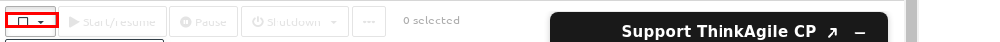{#fig:mwc-application-table-top-check-button}

-----

### mwc-application-toggle-automatic-recovery-button {#mwc-application-toggle-automatic-recovery-button}

- class: `ToggleAutomaticRecoveryButtonComponent`
- used by:
  - [`mwc-application-action-button-items`](#mwc-application-action-button-items)

#### Sample screenshot

-----

### mwc-application-toggle-guest-tools-button {#mwc-application-toggle-guest-tools-button}

- class: `ToggleGuestToolsButtonComponent`
- used by:
  - [`mwc-application-action-button-items`](#mwc-application-action-button-items)

#### Sample screenshot

-----

### mwc-application-toggle-hardware-assisted-virtualization-button {#mwc-application-toggle-hardware-assisted-virtualization-button}

- class: `ToggleHardwareAssistedVirtualizationButtonComponent`
- used by:
  - [`mwc-application-action-button-items`](#mwc-application-action-button-items)

#### Sample screenshot

-----

### mwc-application-toggle-vm-mode-button {#mwc-application-toggle-vm-mode-button}

- class: `ToggleVmModeButtonComponent`
- used by:
  - [`mwc-application-action-button-items`](#mwc-application-action-button-items)

#### Sample screenshot

-----

### mwc-application-update-boot-order-button {#mwc-application-update-boot-order-button}

- class: `UpdateBootOrderButtonComponent`
- used by:
  - [`mwc-application-action-button-items`](#mwc-application-action-button-items)

#### Sample screenshot

-----

### mwc-application-update-compute-constraints-button {#mwc-application-update-compute-constraints-button}

- class: `UpdateComputeConstraintsButtonComponent`
- used by:
  - [`mwc-application-action-button-items`](#mwc-application-action-button-items)

#### Sample screenshot

-----

### mwc-application-update-cpu-button {#mwc-application-update-cpu-button}

- class: `UpdateCpuButtonComponent`
- used by:
  - [`mwc-application-action-button-items`](#mwc-application-action-button-items)

#### Sample screenshot

-----

### mwc-application-update-description-button {#mwc-application-update-description-button}

- class: `UpdateDescriptionButtonComponent`
- used by:
  - [`mwc-application-action-button-items`](#mwc-application-action-button-items)

#### Sample screenshot

-----

### mwc-application-update-memory-button {#mwc-application-update-memory-button}

- class: `UpdateMemoryButtonComponent`
- used by:
  - [`mwc-application-action-button-items`](#mwc-application-action-button-items)

#### Sample screenshot

-----

### mwc-application-update-migration-zone-button {#mwc-application-update-migration-zone-button}

- class: `UpdateMigrationZoneButtonComponent`
- used by:
  - [`mwc-application-action-button-items`](#mwc-application-action-button-items)

#### Sample screenshot

-----

### mwc-application-update-time-zone-button {#mwc-application-update-time-zone-button}

- class: `UpdateTimeZoneButtonComponent`
- used by:
  - [`mwc-application-action-button-items`](#mwc-application-action-button-items)

#### Sample screenshot

-----

### mwc-application-update-vdc-button {#mwc-application-update-vdc-button}

- class: `UpdateVdcButtonComponent`
- used by:
  - [`mwc-application-action-button-items`](#mwc-application-action-button-items)

#### Sample screenshot

-----

### mwc-application-vnic-form {#mwc-application-vnic-form}

- class: `ApplicationVNicFormComponent`
- using:
  - [`mwc-dropdown-menu`](#mwc-dropdown-menu)
  - [`mwc-dropdown-menu-default`](#mwc-dropdown-menu-default)
- used by:
  - [`mwc-application-form`](#mwc-application-form)
  - [`mwc-snapshot-form`](#mwc-snapshot-form)
- source file: `/home/fengxia/workspace/lenovo/olympia_ignite/mwc/src/main/webapp/app/application/components/application-vnic-form/application-vnic-form.component.ts`

#### Sample screenshot

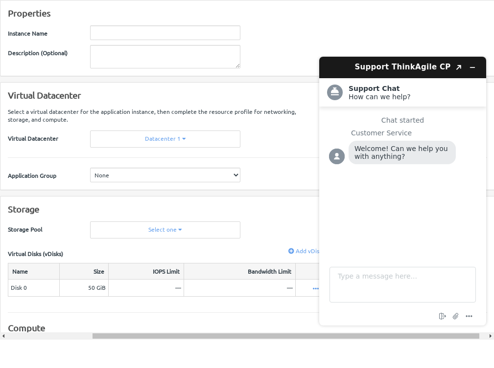{#fig:mwc-application-vnic-form}

-----

### mwc-application-vnic-table {#mwc-application-vnic-table}

- class: `MwcApplicationVnicTableComponent`
- using:
  - [`mwc-application-vnic-table-actions`](#mwc-application-vnic-table-actions)
- used by:
  - [`mwc-profile-tab-networking-properties`](#mwc-profile-tab-networking-properties)
- source file: `/home/fengxia/workspace/lenovo/olympia_ignite/mwc/src/main/webapp/app/application/components/application-vnic-table/application-vnic-table.component.ts`

#### Sample screenshot

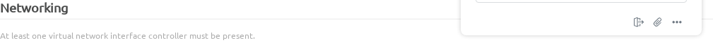{#fig:mwc-application-vnic-table}

-----

### mwc-application-vnic-table-actions {#mwc-application-vnic-table-actions}

- class: `MwcApplicationVnicTableActionsComponent`
- used by:
  - [`mwc-application-vnic-table`](#mwc-application-vnic-table)

#### Sample screenshot

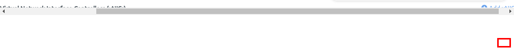{#fig:mwc-application-vnic-table-actions}

-----

### mwc-automatic-snapshot-form {#mwc-automatic-snapshot-form}

- class: `AutomaticSnapshotsSettingsFormComponent`
- used by:
  - [`mwc-enable-disaster-recovery-modal`](#mwc-enable-disaster-recovery-modal)
  - [`mwc-update-automatic-snapshot-settings-modal`](#mwc-update-automatic-snapshot-settings-modal)
  - [`mwc-enable-automatic-snapshots-modal`](#mwc-enable-automatic-snapshots-modal)

#### Sample screenshot

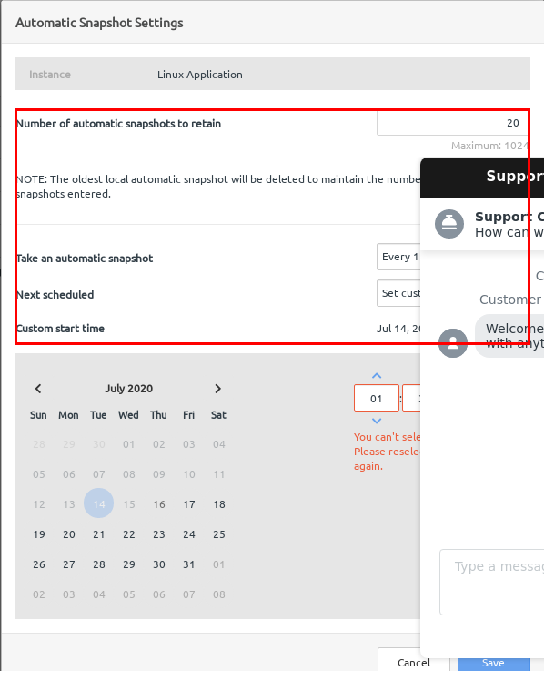{#fig:mwc-automatic-snapshot-form}

-----

### mwc-bulk-delete-application-with-dr-enabled-modal {#mwc-bulk-delete-application-with-dr-enabled-modal}

- class: `BulkDeleteApplicationWithDisasterRecoveryEnabledModalComponent`
- using:
  - [`mwc-delete-dr-snapshots-radio-button-form`](#mwc-delete-dr-snapshots-radio-button-form)
- source file: `/home/fengxia/workspace/lenovo/olympia_ignite/mwc/src/main/webapp/app/application/components/modals/bulk-delete-application-with-dr-enabled-modal/bulk-delete-application-with-dr-enabled-modal.component.ts`

#### Sample screenshot

-----

### mwc-change-dr-location-modal {#mwc-change-dr-location-modal}

- class: `ChangeDisasterRecoveryLocationModalComponent`

#### Sample screenshot

-----

### mwc-create-application {#mwc-create-application}

- class: `CreateApplicationComponent`
- using:
  - [`mwc-application-form`](#mwc-application-form)
- source file: `/home/fengxia/workspace/lenovo/olympia_ignite/mwc/src/main/webapp/app/application/components/create-application/create-application.component.ts`

#### Sample screenshot

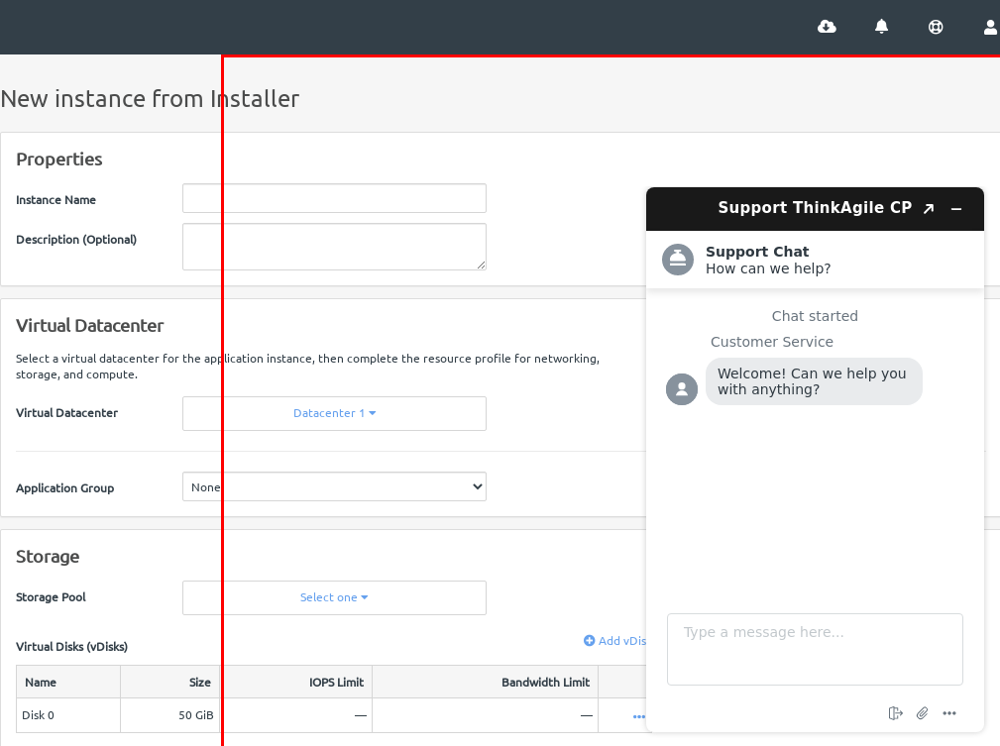{#fig:mwc-create-application}

-----

### mwc-create-application-from-snapshot {#mwc-create-application-from-snapshot}

- class: `CreateApplicationFromSnapshotComponent`
- using:
  - [`mwc-snapshot-form`](#mwc-snapshot-form)
- source file: `/home/fengxia/workspace/lenovo/olympia_ignite/mwc/src/main/webapp/app/application/components/create-application-from-snapshot/create-application-from-snapshot.component.ts`

#### Sample screenshot

{#fig:mwc-create-application-from-snapshot}

-----

### mwc-create-snapshot-modal {#mwc-create-snapshot-modal}

- class: `CreateSnapshotModalComponent`
- using:
  - [`mwc-edit-application-property-info-panel`](#mwc-edit-application-property-info-panel)
- source file: `/home/fengxia/workspace/lenovo/olympia_ignite/mwc/src/main/webapp/app/application/components/application-create-snaphot-modal/create-snapshot-modal.component.ts`

#### Sample screenshot

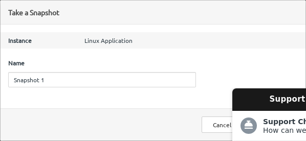{#fig:mwc-create-snapshot-modal}

-----

### mwc-default-filter-options {#mwc-default-filter-options}

- class: `DefaultInstancesFilterComponent`
- used by:
  - [`mwc-all-instances-filter-options`](#mwc-all-instances-filter-options)
  - [`mwc-filter-by-dropdown`](#mwc-filter-by-dropdown)

#### Sample screenshot

{#fig:mwc-default-filter-options}

-----

### mwc-delete-all-local-snapshots-modal {#mwc-delete-all-local-snapshots-modal}

- class: `DeleteAllLocalSnapshotsModalComponent`

#### Sample screenshot

-----

### mwc-delete-application-with-dr-enabled-modal {#mwc-delete-application-with-dr-enabled-modal}

- class: `DeleteApplicationWithDisasterRecoveryEnabledModalComponent`
- using:
  - [`mwc-delete-dr-snapshots-radio-button-form`](#mwc-delete-dr-snapshots-radio-button-form)
- source file: `/home/fengxia/workspace/lenovo/olympia_ignite/mwc/src/main/webapp/app/application/components/modals/delete-application-with-dr-enabled-modal/delete-application-with-dr-enabled-modal.component.ts`

#### Sample screenshot

-----

### mwc-deleted-application-properties {#mwc-deleted-application-properties}

- class: `DeletedApplicationPropertiesComponent`
- using:
  - [`mwc-application-dr-retention-policy-actions-button`](#mwc-application-dr-retention-policy-actions-button)
  - [`mwc-application-disaster-recovery-snapshots-table`](#mwc-application-disaster-recovery-snapshots-table)
  - [`mwc-application-profile-tab`](#mwc-application-profile-tab)
  - [`mwc-dr-policy-status-bar`](#mwc-dr-policy-status-bar)
- source file: `/home/fengxia/workspace/lenovo/olympia_ignite/mwc/src/main/webapp/app/application/components/deleted-applications-properties/deleted-applications-properties.component.ts`

#### Sample screenshot

-----

### mwc-delete-dr-snapshots-radio-button-form {#mwc-delete-dr-snapshots-radio-button-form}

- class: `DeleteDrSnapshotsRadioButtonFormComponent`
- used by:
  - [`mwc-delete-application-with-dr-enabled-modal`](#mwc-delete-application-with-dr-enabled-modal)
  - [`mwc-bulk-delete-application-with-dr-enabled-modal`](#mwc-bulk-delete-application-with-dr-enabled-modal)

#### Sample screenshot

-----

### mwc-delete-snapshot-node-modal {#mwc-delete-snapshot-node-modal}

- class: `DeleteSnapshotNodeModalComponent`
- using:
  - [`mwc-date-time`](#mwc-date-time)
- source file: `/home/fengxia/workspace/lenovo/olympia_ignite/mwc/src/main/webapp/app/application/components/modals/delete-snapshot-node-modal/delete-snapshot-node-modal.component.ts`

#### Sample screenshot

-----

### mwc-disable-automatic-snapshots-modal {#mwc-disable-automatic-snapshots-modal}

- class: `MwcDisableAutomaticSnapshotsModalComponent`
- using:
  - [`mwc-snapshot-retention-policy-form`](#mwc-snapshot-retention-policy-form)
- source file: `/home/fengxia/workspace/lenovo/olympia_ignite/mwc/src/main/webapp/app/application/components/modals/disable-automatic-snapshots-modal/disable-automatic-snapshots-modal.component.ts`

#### Sample screenshot

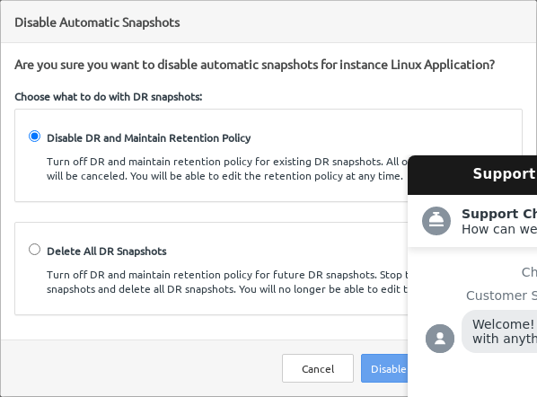{#fig:mwc-disable-automatic-snapshots-modal}

-----

### mwc-disable-disaster-recovery-modal {#mwc-disable-disaster-recovery-modal}

- class: `MwcDisableDisasterRecoveryModalComponent`
- using:
  - [`mwc-snapshot-retention-policy-form`](#mwc-snapshot-retention-policy-form)
- source file: `/home/fengxia/workspace/lenovo/olympia_ignite/mwc/src/main/webapp/app/application/components/modals/disable-disaster-recovery-modal/disable-disaster-recovery-modal.component.ts`

#### Sample screenshot

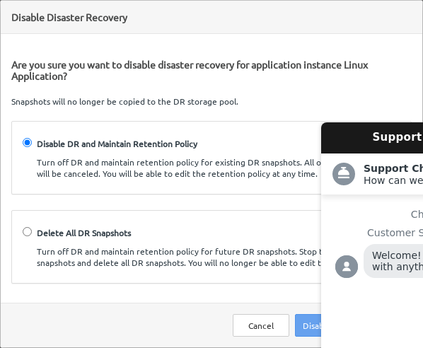{#fig:mwc-disable-disaster-recovery-modal}

-----

### mwc-disaster-recovery-policy-form {#mwc-disaster-recovery-policy-form}

- class: `DisasterRecoveryPolicyFormComponent`
- used by:
  - [`mwc-edit-disaster-retention-policy-modal`](#mwc-edit-disaster-retention-policy-modal)
  - [`mwc-enable-disaster-recovery-modal`](#mwc-enable-disaster-recovery-modal)

#### Sample screenshot

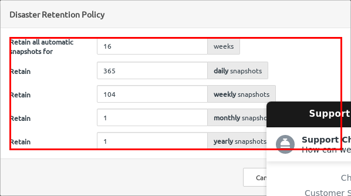{#fig:mwc-disaster-recovery-policy-form}

-----

### mwc-disaster-recovery-snapshot-actions-button {#mwc-disaster-recovery-snapshot-actions-button}

- class: `MwcDisasterRecoverySnapshotActionsButtonComponent`

#### Sample screenshot

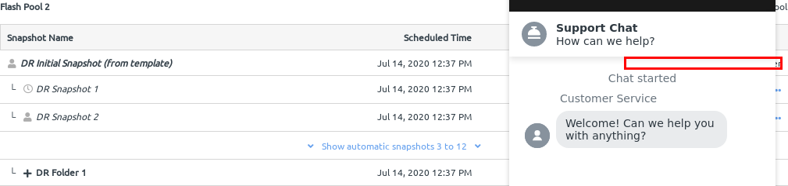{#fig:mwc-disaster-recovery-snapshot-actions-button}

-----

### mwc-dr-policy-status-bar {#mwc-dr-policy-status-bar}

- class: `DisasterRecoveryRetentionPolicyStatusBarComponent`
- used by:
  - [`mwc-application-disaster-recovery-tab`](#mwc-application-disaster-recovery-tab)
  - [`mwc-deleted-application-properties`](#mwc-deleted-application-properties)

#### Sample screenshot

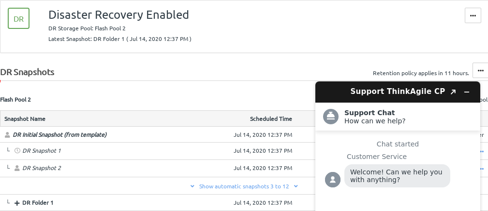{#fig:mwc-dr-policy-status-bar}

-----

### mwc-dr-status-section {#mwc-dr-status-section}

- class: `DrStatusSectionComponent`
- used by:
  - [`mwc-application-properties-page`](#mwc-application-properties-page)

#### Sample screenshot

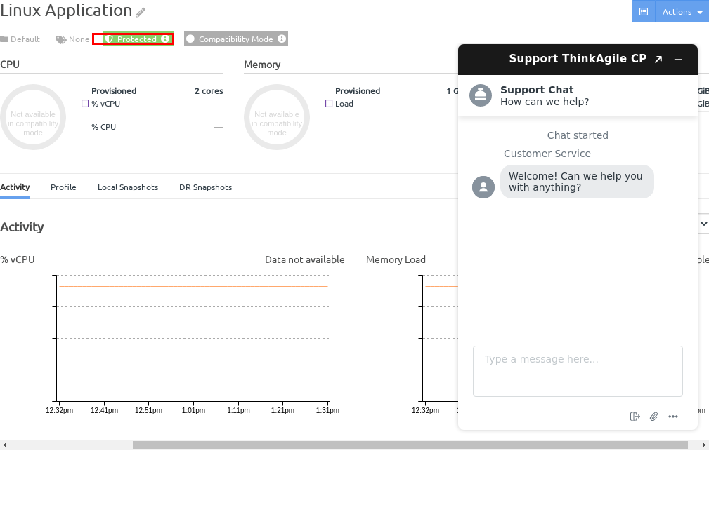{#fig:mwc-dr-status-section}

-----

### mwc-edit-application-boot-order-modal {#mwc-edit-application-boot-order-modal}

- class: `EditApplicationBootOrderModalComponent`
- using:
  - [`mwc-boot-order-table`](#mwc-boot-order-table)
  - [`mwc-edit-application-property-info-panel`](#mwc-edit-application-property-info-panel)
- source file: `/home/fengxia/workspace/lenovo/olympia_ignite/mwc/src/main/webapp/app/application/components/modals/edit-application-boot-order-modal/edit-application-boot-order-modal.component.ts`

#### Sample screenshot

-----

### mwc-edit-application-disk-limits-modal-component {#mwc-edit-application-disk-limits-modal-component}

- class: `EditApplicationDiskLimitsModalComponent`

#### Sample screenshot

-----

### mwc-edit-application-disk-size {#mwc-edit-application-disk-size}

- class: `EditApplicationDiskSizeModalComponent`

#### Sample screenshot

-----

### mwc-edit-application-property-info-panel {#mwc-edit-application-property-info-panel}

- class: `EditApplicationPropertyInfoPanelComponent`
- used by:
  - [`mwc-edit-application-boot-order-modal`](#mwc-edit-application-boot-order-modal)
  - [`mwc-update-application-memory-modal`](#mwc-update-application-memory-modal)
  - [`mwc-start-application-modal`](#mwc-start-application-modal)
  - [`mwc-create-snapshot-modal`](#mwc-create-snapshot-modal)
  - [`mwc-edit-time-zone-configuration-modal`](#mwc-edit-time-zone-configuration-modal)
  - [`mwc-update-application-datacenter-modal`](#mwc-update-application-datacenter-modal)
  - [`mwc-add-application-v-nic`](#mwc-add-application-v-nic)
  - [`mwc-update-application-cpu-modal`](#mwc-update-application-cpu-modal)
  - [`mwc-update-migration-zone-modal`](#mwc-update-migration-zone-modal)
  - [`mwc-update-compute-constraints-modal`](#mwc-update-compute-constraints-modal)

#### Sample screenshot

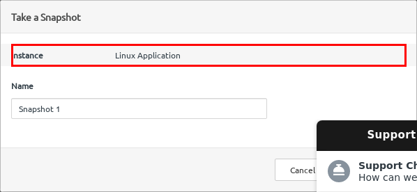{#fig:mwc-edit-application-property-info-panel}

-----

### mwc-edit-disaster-retention-policy-modal {#mwc-edit-disaster-retention-policy-modal}

- class: `EditDisasterRetentionPolicyModalComponent`
- using:
  - [`mwc-disaster-recovery-policy-form`](#mwc-disaster-recovery-policy-form)
- source file: `/home/fengxia/workspace/lenovo/olympia_ignite/mwc/src/main/webapp/app/application/components/modals/edit-disaster-retention-policy-modal/edit-disaster-retention-policy-modal.component.ts`

#### Sample screenshot

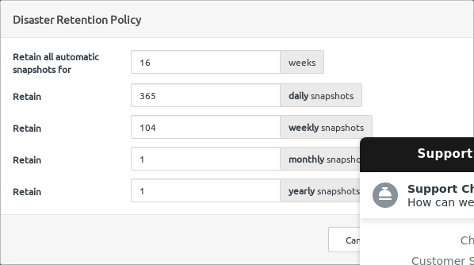{#fig:mwc-edit-disaster-retention-policy-modal}

-----

### mwc-edit-time-zone-configuration-modal {#mwc-edit-time-zone-configuration-modal}

- class: `MwcEditTimeZoneConfigurationModalComponent`
- using:
  - [`mwc-time-zone-configuration`](#mwc-time-zone-configuration)
  - [`mwc-edit-application-property-info-panel`](#mwc-edit-application-property-info-panel)
- source file: `/home/fengxia/workspace/lenovo/olympia_ignite/mwc/src/main/webapp/app/application/components/modals/edit-time-zone-configuration-modal/edit-time-zone-configuration-modal.component.ts`

#### Sample screenshot

-----

### mwc-edit-v-nic-firewall-override-modal {#mwc-edit-v-nic-firewall-override-modal}

- class: `EditVNicFirewallOverrideModalComponent`

#### Sample screenshot

-----

### mwc-edit-v-nic-mac-address-modal {#mwc-edit-v-nic-mac-address-modal}

- class: `EditVNicMacAddressComponent`

#### Sample screenshot

-----

### mwc-edit-v-nic-name-modal {#mwc-edit-v-nic-name-modal}

- class: `EditVnicNameModalComponent`

#### Sample screenshot

-----

### mwc-edit-v-nic-networking-modal {#mwc-edit-v-nic-networking-modal}

- class: `EditVNicNetworkingModalComponent`
- using:
  - [`mwc-edit-vnic-networking-mode`](#mwc-edit-vnic-networking-mode)
- source file: `/home/fengxia/workspace/lenovo/olympia_ignite/mwc/src/main/webapp/app/application/components/edit-vnic-networking-mode-modal/edit-vnic-networking-mode-modal.component.ts`

#### Sample screenshot

{#fig:mwc-edit-v-nic-networking-modal}

-----

### mwc-edit-vnic-networking-mode {#mwc-edit-vnic-networking-mode}

- class: `EditVnicNetworkingModeComponent`
- used by:
  - [`mwc-add-application-v-nic`](#mwc-add-application-v-nic)
  - [`mwc-edit-v-nic-networking-modal`](#mwc-edit-v-nic-networking-modal)

#### Sample screenshot

{#fig:mwc-edit-vnic-networking-mode}

-----

### mwc-edit-vnic-outside-interface-modal {#mwc-edit-vnic-outside-interface-modal}

- class: `EditVnicOutsideInterfaceModalComponent`
- using:
  - [`mwc-network-outside-interface`](#mwc-network-outside-interface)
- source file: `/home/fengxia/workspace/lenovo/olympia_ignite/mwc/src/main/webapp/app/application/components/edit-vnic-outside-interface-modal/edit-vnic-outside-interface-modal.component.ts`

#### Sample screenshot

-----

### mwc-enable-automatic-snapshots-modal {#mwc-enable-automatic-snapshots-modal}

- class: `MwcEnableAutomaticSnapshotsModalComponent`
- using:
  - [`mwc-automatic-snapshot-form`](#mwc-automatic-snapshot-form)
- source file: `/home/fengxia/workspace/lenovo/olympia_ignite/mwc/src/main/webapp/app/application/components/modals/enable-automatic-snapshots-modal/enable-automatic-snapshots-modal.component.ts`

#### Sample screenshot

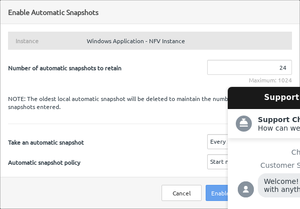{#fig:mwc-enable-automatic-snapshots-modal}

-----

### mwc-enable-disaster-recovery-modal {#mwc-enable-disaster-recovery-modal}

- class: `MwcEnableDisasterRecoveryModalComponent`
- using:
  - [`mwc-automatic-snapshot-form`](#mwc-automatic-snapshot-form)
  - [`mwc-disaster-recovery-policy-form`](#mwc-disaster-recovery-policy-form)
- source file: `/home/fengxia/workspace/lenovo/olympia_ignite/mwc/src/main/webapp/app/application/components/modals/enable-disaster-recovery-modal/enable-disaster-recovery-modal.component.ts`

#### Sample screenshot

-----

### mwc-filter-by-dropdown {#mwc-filter-by-dropdown}

- class: `FilterByComponent`
- using:
  - [`mwc-default-filter-options`](#mwc-default-filter-options)
  - [`mwc-all-instances-filter-options`](#mwc-all-instances-filter-options)
- used by:
  - [`mwc-application`](#mwc-application)
  - [`mwc-application-group-component`](#mwc-application-group-component)
  - [`mwc-datacenter-applications`](#mwc-datacenter-applications)
- source file: `/home/fengxia/workspace/lenovo/olympia_ignite/mwc/src/main/webapp/app/application/components/application-filter-by-dropdown/application-filter-by-dropdown.component.ts`

#### Sample screenshot

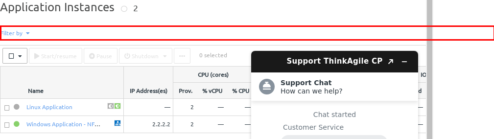{#fig:mwc-filter-by-dropdown}

-----

### mwc-installer-form {#mwc-installer-form}

- class: `InstallerFormComponent`
- used by:
  - [`mwc-application-form`](#mwc-application-form)

#### Sample screenshot

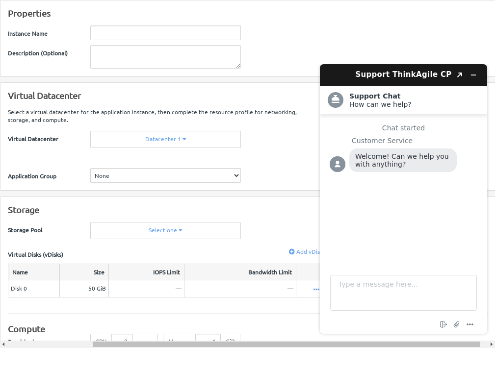{#fig:mwc-installer-form}

-----

### mwc-instance-settings-form {#mwc-instance-settings-form}

- class: `MwcInstanceSettingsFormComponent`
- using:
  - [`mwc-time-zone-configuration`](#mwc-time-zone-configuration)
  - [`mwc-vm-mode-configuration`](#mwc-vm-mode-configuration)
- used by:
  - [`mwc-application-form`](#mwc-application-form)
  - [`mwc-snapshot-form`](#mwc-snapshot-form)
- source file: `/home/fengxia/workspace/lenovo/olympia_ignite/mwc/src/main/webapp/app/application/components/forms/instance-settings-form/instance-settings-form.component.ts`

#### Sample screenshot

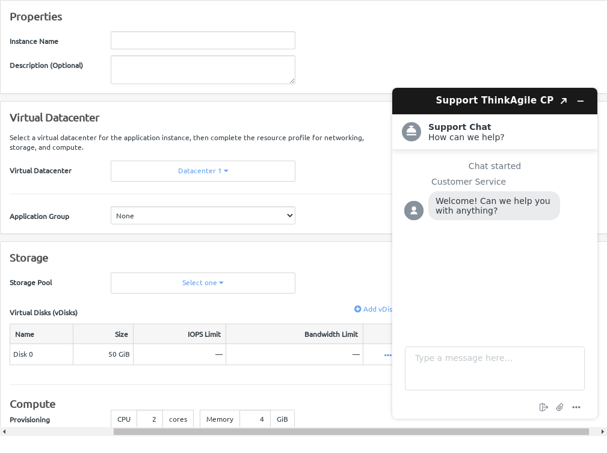{#fig:mwc-instance-settings-form}

-----

### mwc-local-snapshots-status-icons {#mwc-local-snapshots-status-icons}

- class: `LocalSnapshotsStatusIcons`

#### Sample screenshot

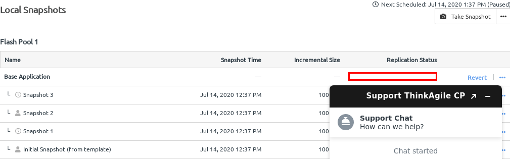{#fig:mwc-local-snapshots-status-icons}

-----

### mwc-network-service-application-action-items {#mwc-network-service-application-action-items}

- class: `NetworkServiceApplicationActionItemsComponent`
- using:
  - [`mwc-application-start-button`](#mwc-application-start-button)
  - [`mwc-application-force-shutdown-button`](#mwc-application-force-shutdown-button)
  - [`mwc-application-resume-button`](#mwc-application-resume-button)
  - [`mwc-application-force-restart-button`](#mwc-application-force-restart-button)
  - [`mwc-application-pause-button`](#mwc-application-pause-button)
  - [`mwc-application-shutdown-button`](#mwc-application-shutdown-button)
  - [`mwc-application-console-button`](#mwc-application-console-button)
  - [`mwc-application-restart-button`](#mwc-application-restart-button)
- used by:
  - [`mwc-network-vnet-action-button-items`](#mwc-network-vnet-action-button-items)
- source file: `/home/fengxia/workspace/lenovo/olympia_ignite/mwc/src/main/webapp/app/application/components/network-service-application-action-items/network-service-application-action-items.component.ts`

#### Sample screenshot

-----

### mwc-network-sysprep-configuration {#mwc-network-sysprep-configuration}

- class: `NetworkSysprepConfiguration`
- used by:
  - [`mwc-snapshot-form`](#mwc-snapshot-form)

#### Sample screenshot

{#fig:mwc-network-sysprep-configuration}

-----

### mwc-profile-tab-compute-properties {#mwc-profile-tab-compute-properties}

- class: `ProfileTabComputePropertiesComponent`
- used by:
  - [`mwc-application-profile-tab`](#mwc-application-profile-tab)

#### Sample screenshot

{#fig:mwc-profile-tab-compute-properties}

-----

### mwc-profile-tab-general-properties {#mwc-profile-tab-general-properties}

- class: `ProfileTabGeneralPropertiesContollerComponent`
- used by:
  - [`mwc-application-profile-tab`](#mwc-application-profile-tab)

#### Sample screenshot

{#fig:mwc-profile-tab-general-properties}

-----

### mwc-profile-tab-networking-properties {#mwc-profile-tab-networking-properties}

- class: `ProfileTabNetworkingPropertiesContollerComponent`
- using:
  - [`mwc-application-vnic-table`](#mwc-application-vnic-table)
- used by:
  - [`mwc-application-profile-tab`](#mwc-application-profile-tab)
- source file: `/home/fengxia/workspace/lenovo/olympia_ignite/mwc/src/main/webapp/app/application/components/profile-tab-networking-properties/profile-tab-networking-properties.component.ts`

#### Sample screenshot

{#fig:mwc-profile-tab-networking-properties}

-----

### mwc-profile-tab-nfv-instance-properties {#mwc-profile-tab-nfv-instance-properties}

- class: `ProfileTabNfvInstancePropertiesComponent`
- used by:
  - [`mwc-application-profile-tab`](#mwc-application-profile-tab)

#### Sample screenshot

{#fig:mwc-profile-tab-nfv-instance-properties}

-----

### mwc-profile-tab-settings-properties {#mwc-profile-tab-settings-properties}

- class: `ProfileTabSettingsPropertiesContollerComponent`
- used by:
  - [`mwc-application-profile-tab`](#mwc-application-profile-tab)

#### Sample screenshot

{#fig:mwc-profile-tab-settings-properties}

-----

### mwc-profile-tab-storage-properties {#mwc-profile-tab-storage-properties}

- class: `ProfileTabStoragePropertiesComponent`
- using:
  - [`mwc-application-disk-table`](#mwc-application-disk-table)
- used by:
  - [`mwc-application-profile-tab`](#mwc-application-profile-tab)
- source file: `/home/fengxia/workspace/lenovo/olympia_ignite/mwc/src/main/webapp/app/application/components/profile-tab-storage-properties/profile-tab-storage-properties.component.ts`

#### Sample screenshot

{#fig:mwc-profile-tab-storage-properties}

-----

### mwc-rename-application-disk-modal {#mwc-rename-application-disk-modal}

- class: `RenameApplicationDiskModalComponent`

#### Sample screenshot

-----

### mwc-rename-snapshot-modal {#mwc-rename-snapshot-modal}

- class: `RenameSnapshotModalComponent`
- using:
  - [`mwc-date-time`](#mwc-date-time)
- source file: `/home/fengxia/workspace/lenovo/olympia_ignite/mwc/src/main/webapp/app/application/components/modals/rename-snapshot-modal/rename-snapshot-modal.component.ts`

#### Sample screenshot

-----

### mwc-revert-snapshot-modal {#mwc-revert-snapshot-modal}

- class: `RevertSnapshotModalComponent`

#### Sample screenshot

-----

### mwc-select-disk-to-clone-and-attach-modal {#mwc-select-disk-to-clone-and-attach-modal}

- class: `SelectDiskToCloneAndAttachModalComponent`
- using:
  - [`mwc-date-time`](#mwc-date-time)
- source file: `/home/fengxia/workspace/lenovo/olympia_ignite/mwc/src/main/webapp/app/application/components/modals/select-disk-to-clone-and-attach-modal/select-disk-to-clone-and-attach-modal.component.ts`

#### Sample screenshot

-----

### mwc-shared-storage-installer-modal {#mwc-shared-storage-installer-modal}

- class: `SharedStorageInstallerModalComponent`
- using:
  - [`mwc-volume-form-inputs`](#mwc-volume-form-inputs)
- source file: `/home/fengxia/workspace/lenovo/olympia_ignite/mwc/src/main/webapp/app/application/components/shared-storage-installer-modal/shared-storage-installer-modal.component.ts`

#### Sample screenshot

-----

### mwc-snapshot-actions-button {#mwc-snapshot-actions-button}

- class: `MwcSnapshotActionsButtonComponent`

#### Sample screenshot

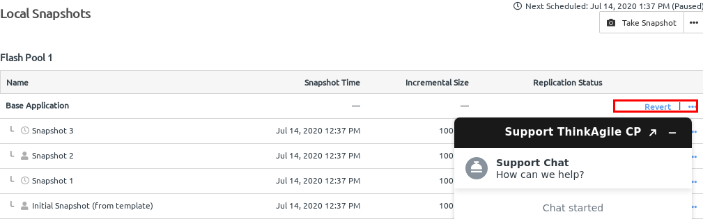{#fig:mwc-snapshot-actions-button}

-----

### mwc-snapshot-form {#mwc-snapshot-form}

- class: `CreateApplicationFromSnapshotFormController`
- using:
  - [`mwc-application-group-selection-box`](#mwc-application-group-selection-box)
  - [`mwc-application-vnic-form`](#mwc-application-vnic-form)
  - [`mwc-application-disk-table`](#mwc-application-disk-table)
  - [`mwc-instance-settings-form`](#mwc-instance-settings-form)
  - [`mwc-network-sysprep-configuration`](#mwc-network-sysprep-configuration)
- used by:
  - [`mwc-create-application-from-snapshot`](#mwc-create-application-from-snapshot)
- source file: `/home/fengxia/workspace/lenovo/olympia_ignite/mwc/src/main/webapp/app/application/components/create-application-from-snapshot/snapshot-form/snapshot-form.component.ts`

#### Sample screenshot

-----

### mwc-snapshot-retention-policy-form {#mwc-snapshot-retention-policy-form}

- class: `SnapshotRetentionPolicyFormComponent`
- used by:
  - [`mwc-disable-disaster-recovery-modal`](#mwc-disable-disaster-recovery-modal)
  - [`mwc-disable-automatic-snapshots-modal`](#mwc-disable-automatic-snapshots-modal)

#### Sample screenshot

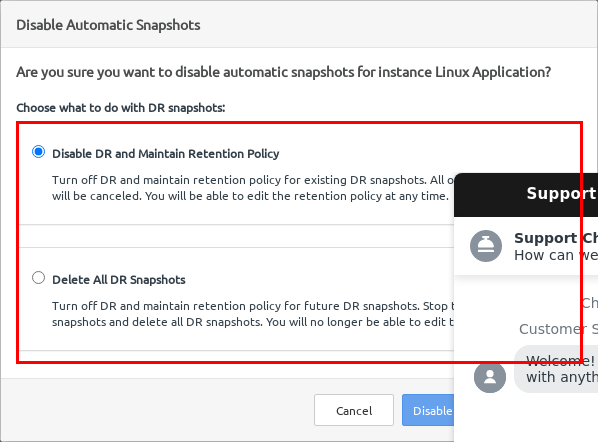{#fig:mwc-snapshot-retention-policy-form}

-----

### mwc-start-application-modal {#mwc-start-application-modal}

- class: `StartApplicationModalComponent`
- using:
  - [`mwc-edit-application-property-info-panel`](#mwc-edit-application-property-info-panel)
- source file: `/home/fengxia/workspace/lenovo/olympia_ignite/mwc/src/main/webapp/app/application/components/start-application-modal/start-application-modal.component.ts`

#### Sample screenshot

-----

### mwc-temporary-reverted-to-snapshot-status-bar {#mwc-temporary-reverted-to-snapshot-status-bar}

- class: `TemporaryRevertedToSnapshotStatusBarComponent`
- used by:
  - [`mwc-application-properties-page`](#mwc-application-properties-page)

#### Sample screenshot

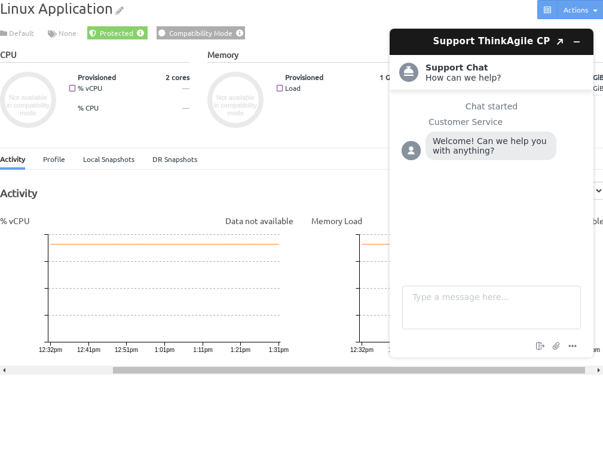{#fig:mwc-temporary-reverted-to-snapshot-status-bar}

-----

### mwc-update-application-cpu-modal {#mwc-update-application-cpu-modal}

- class: `UpdateApplicationCpuModalComponent`
- using:
  - [`mwc-edit-application-property-info-panel`](#mwc-edit-application-property-info-panel)
- source file: `/home/fengxia/workspace/lenovo/olympia_ignite/mwc/src/main/webapp/app/application/components/modals/update-application-cpu-modal/update-application-cpu-modal.component.ts`

#### Sample screenshot

-----

### mwc-update-application-datacenter-modal {#mwc-update-application-datacenter-modal}

- class: `UpdateApplicationDatacenterModalComponent`
- using:
  - [`mwc-edit-application-property-info-panel`](#mwc-edit-application-property-info-panel)
- source file: `/home/fengxia/workspace/lenovo/olympia_ignite/mwc/src/main/webapp/app/application/components/modals/update-application-datacenters-modal/update-application-datacenter-modal.component.ts`

#### Sample screenshot

-----

### mwc-update-application-memory-modal {#mwc-update-application-memory-modal}

- class: `UpdateApplicationMemoryModalComponent`
- using:
  - [`mwc-edit-application-property-info-panel`](#mwc-edit-application-property-info-panel)
- source file: `/home/fengxia/workspace/lenovo/olympia_ignite/mwc/src/main/webapp/app/application/components/modals/update-application-memory-modal/update-application-memory-modal.component.ts`

#### Sample screenshot

-----

### mwc-update-automatic-snapshot-settings-modal {#mwc-update-automatic-snapshot-settings-modal}

- class: `MwcUpdateAutomaticSnapshotSettingsModalComponent`
- using:
  - [`mwc-automatic-snapshot-form`](#mwc-automatic-snapshot-form)
- source file: `/home/fengxia/workspace/lenovo/olympia_ignite/mwc/src/main/webapp/app/application/components/update-automatic-snapshot-settings-modal/update-automatic-snapshot-settings-modal.component.ts`

#### Sample screenshot

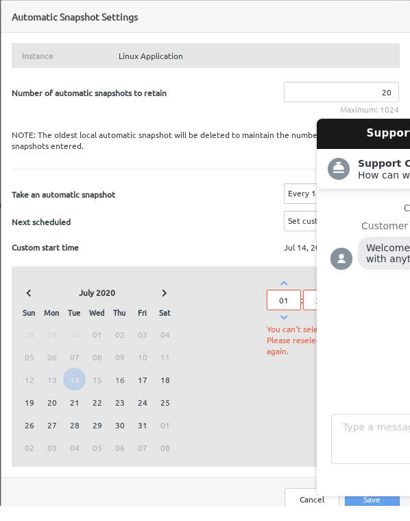{#fig:mwc-update-automatic-snapshot-settings-modal}

-----

### mwc-update-compute-constraints-modal {#mwc-update-compute-constraints-modal}

- class: `UpdateApplicationComputeContraintsModalComponent`
- using:
  - [`mwc-edit-application-property-info-panel`](#mwc-edit-application-property-info-panel)
- source file: `/home/fengxia/workspace/lenovo/olympia_ignite/mwc/src/main/webapp/app/application/components/modals/update-application-compute-constraints-modal/update-application-compute-constraints-modal.component.ts`

#### Sample screenshot

-----

### mwc-update-migration-zone-modal {#mwc-update-migration-zone-modal}

- class: `UpdateApplicationMigrationZoneModalComponent`
- using:
  - [`mwc-edit-application-property-info-panel`](#mwc-edit-application-property-info-panel)
- source file: `/home/fengxia/workspace/lenovo/olympia_ignite/mwc/src/main/webapp/app/application/components/modals/update-application-migration-zone-modal/update-application-migration-zone-modal.component.ts`

#### Sample screenshot

-----

### mwc-view-snapshot-disks-modal {#mwc-view-snapshot-disks-modal}

- class: `ViewSnapshotDisksModalComponent`

#### Sample screenshot

-----

### mwc-virtio-drivers-configuration {#mwc-virtio-drivers-configuration}

- class: `VirtioDriversConfigurationComponent`
- used by:
  - [`mwc-import-application-template-from-vmdk`](#mwc-import-application-template-from-vmdk)

#### Sample screenshot

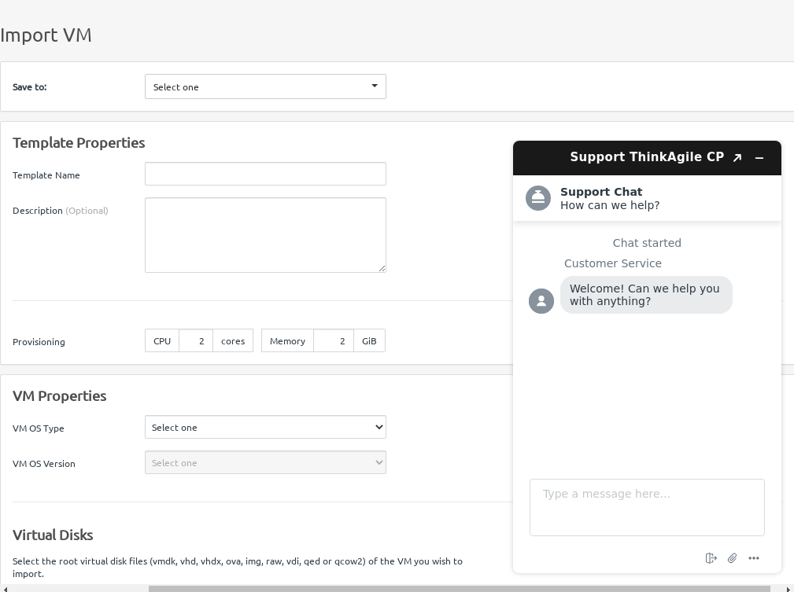{#fig:mwc-virtio-drivers-configuration}

-----

### mwc-vm-mode-configuration {#mwc-vm-mode-configuration}

- class: `VmModeConfigurationComponent`
- used by:
  - [`mwc-instance-settings-form`](#mwc-instance-settings-form)
  - [`mwc-create-application-template`](#mwc-create-application-template)

#### Sample screenshot

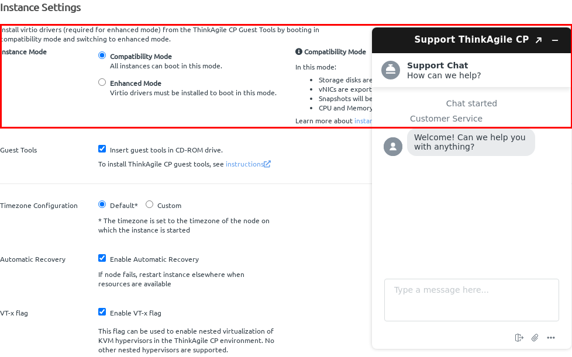{#fig:mwc-vm-mode-configuration}

-----

### mwc-windows-os-options {#mwc-windows-os-options}

- class: `WindowsOsOptionsComponent`
- using:
  - [`mwc-answer-file-form`](#mwc-answer-file-form)
- used by:
  - [`mwc-application-form`](#mwc-application-form)
- source file: `/home/fengxia/workspace/lenovo/olympia_ignite/mwc/src/main/webapp/app/application/components/windows-os-options/windows-os-options.component.ts`

#### Sample screenshot

-----

## mwc.controllers

### mwc-tag-form {#mwc-tag-form}

- class: `TagFormController`

#### Sample screenshot

-----

### mwc-breadcrumbs {#mwc-breadcrumbs}

- class: `BreadcrumbsController`
- using:
  - [`mwc-vdc-settings-menu`](#mwc-vdc-settings-menu)
  - [`mwc-vdc-new-button`](#mwc-vdc-new-button)
- used by:
  - [`mwc-app-main`](#mwc-app-main)
- source file: `/home/fengxia/workspace/lenovo/olympia_ignite/mwc/src/main/webapp/app/shared/components/breadcrumbs/breadcrumbs.component.ts`

#### Sample screenshot

{#fig:mwc-breadcrumbs}

-----

### mwc-offline-modal {#mwc-offline-modal}

- class: `MwcOfflineModalController`

#### Sample screenshot

-----

### mwc-bulk-action-warning-modal-component {#mwc-bulk-action-warning-modal-component}

- class: `BulkActionWarningModalComponent`
- using:
  - [`mwc-application-status-icons`](#mwc-application-status-icons)
  - [`mwc-application-table-top-check-button`](#mwc-application-table-top-check-button)
- source file: `/home/fengxia/workspace/lenovo/olympia_ignite/mwc/src/main/webapp/app/shared/components/bulk-action-warning-modal/bulk-action-warning-modal.component.ts`

#### Sample screenshot

-----

### mwc-time-zone-configuration {#mwc-time-zone-configuration}

- class: `TimeZoneConfigurationController`
- used by:
  - [`mwc-instance-settings-form`](#mwc-instance-settings-form)
  - [`mwc-edit-time-zone-configuration-modal`](#mwc-edit-time-zone-configuration-modal)

#### Sample screenshot

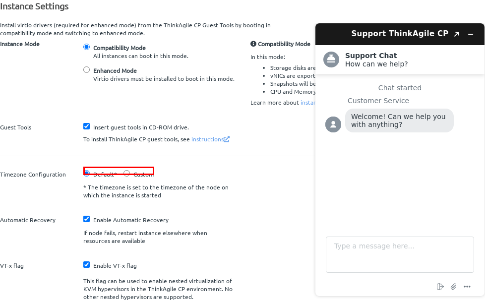{#fig:mwc-time-zone-configuration}

-----

### mwc-copy-template-modal {#mwc-copy-template-modal}

- class: `CopyTemplateModal`

#### Sample screenshot

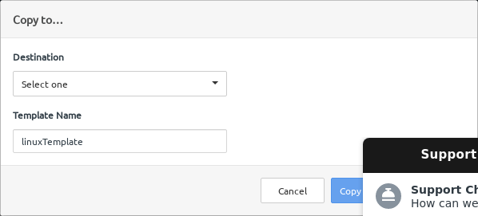{#fig:mwc-copy-template-modal}

-----

### mwc-firmware-versions-modal {#mwc-firmware-versions-modal}

- class: `FirmwareVersionsModalComponent`

#### Sample screenshot

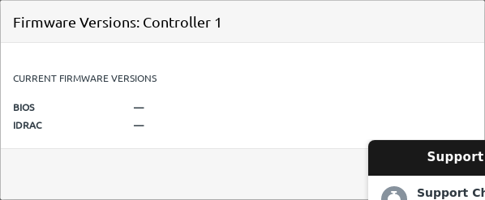{#fig:mwc-firmware-versions-modal}

-----

### mwc-date-time {#mwc-date-time}

- class: `MwcDateTimeComponent`
- used by:
  - [`mwc-application-disaster-recovery-tab`](#mwc-application-disaster-recovery-tab)
  - [`mwc-vdc-templates`](#mwc-vdc-templates)
  - [`mwc-select-disk-to-clone-and-attach-modal`](#mwc-select-disk-to-clone-and-attach-modal)
  - [`mwc-rename-snapshot-modal`](#mwc-rename-snapshot-modal)
  - [`mwc-template-info-modal`](#mwc-template-info-modal)
  - [`mwc-notification-list`](#mwc-notification-list)
  - [`mwc-developer-options`](#mwc-developer-options)
  - [`mwc-critical-alerts-table`](#mwc-critical-alerts-table)
  - [`mwc-application-snapshot-tab`](#mwc-application-snapshot-tab)
  - [`mwc-delete-snapshot-node-modal`](#mwc-delete-snapshot-node-modal)
  - [`mwc-application-template`](#mwc-application-template)
  - [`mwc-user-profile`](#mwc-user-profile)
  - [`mwc-application-properties-page`](#mwc-application-properties-page)
  - [`mwc-host-properties-tab`](#mwc-host-properties-tab)

#### Sample screenshot

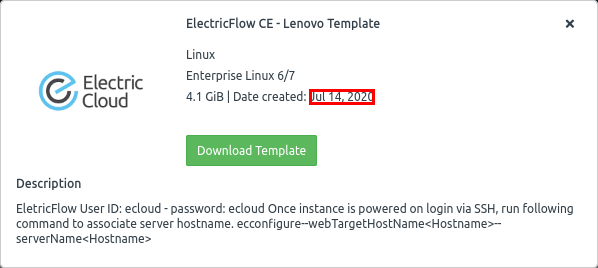{#fig:mwc-date-time}

-----

### mwc-info-modal {#mwc-info-modal}

- class: `MwcInfoModalController`

#### Sample screenshot

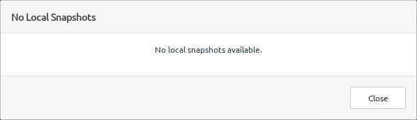{#fig:mwc-info-modal}

-----

### mwc-side-nav {#mwc-side-nav}

- class: `SideNavController`
- using:
  - [`mwc-admin-plus-button`](#mwc-admin-plus-button)
- used by:
  - [`mwc-app-main`](#mwc-app-main)
- source file: `/home/fengxia/workspace/lenovo/olympia_ignite/mwc/src/main/webapp/app/shared/components/side-nav/side-nav.component.ts`

#### Sample screenshot

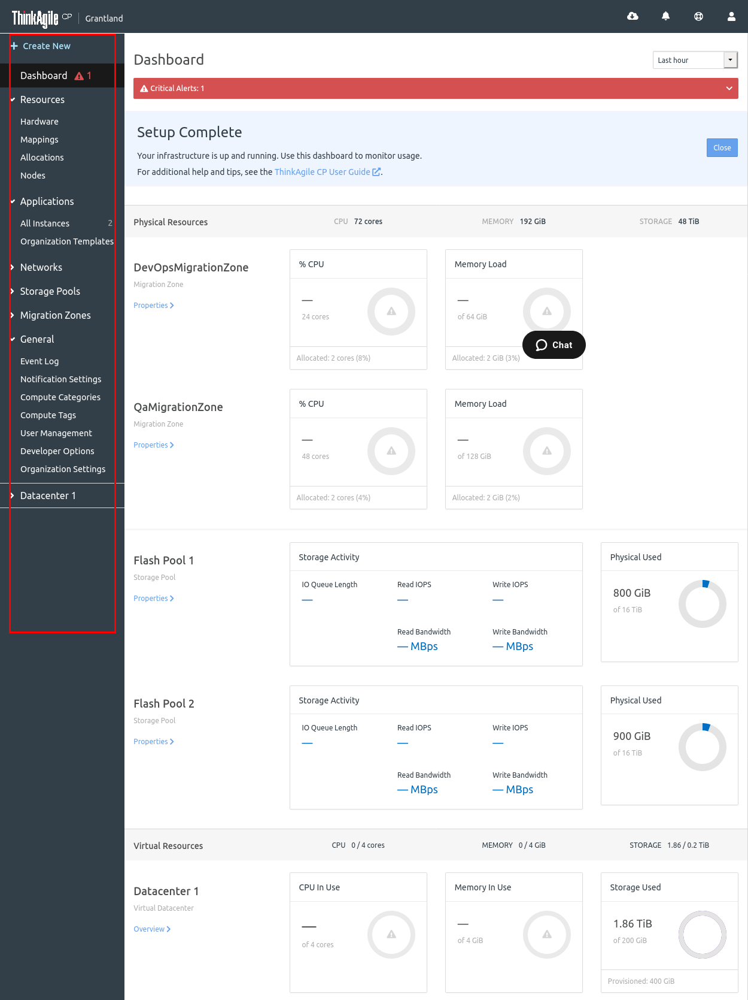{#fig:mwc-side-nav}

-----

### mwc-support-mode-modal {#mwc-support-mode-modal}

- class: `MwcSupportModeModalController`

#### Sample screenshot

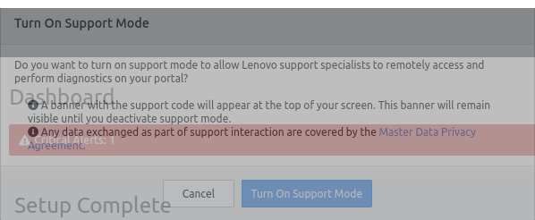{#fig:mwc-support-mode-modal}

-----

### mwc-admin-plus-button {#mwc-admin-plus-button}

- class: `AdminPlusButton`
- used by:
  - [`mwc-side-nav`](#mwc-side-nav)

#### Sample screenshot

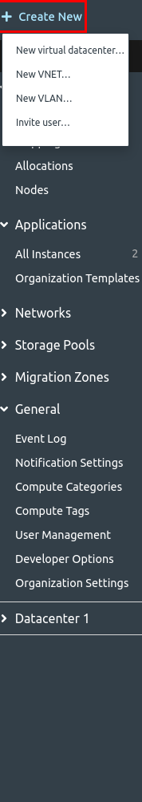{#fig:mwc-admin-plus-button}

-----

## mwc

### mwc-admin-main {#mwc-admin-main}

- class: `AdminMainComponent`
- using:
  - [`mwc-navigation-banner`](#mwc-navigation-banner)
- source file: `/home/fengxia/workspace/lenovo/olympia_ignite/mwc/src/main/webapp/admin/components/admin-main/admin-main.component.ts`

#### Sample screenshot

-----

### mwc-support-mode-alert {#mwc-support-mode-alert}

- class: `SupportModeAlertController`
- used by:
  - [`mwc-app-main`](#mwc-app-main)

#### Sample screenshot

{#fig:mwc-support-mode-alert}

-----

### mwc-app-main {#mwc-app-main}

- class: `AppController`
- using:
  - [`mwc-support-mode-alert`](#mwc-support-mode-alert)
  - [`mwc-side-nav`](#mwc-side-nav)
  - [`mwc-no-access`](#mwc-no-access)
  - [`mwc-navigation-banner`](#mwc-navigation-banner)
  - [`mwc-breadcrumbs`](#mwc-breadcrumbs)
- source file: `/home/fengxia/workspace/lenovo/olympia_ignite/mwc/src/main/webapp/app/components/app-main/app-main.component.ts`

#### Sample screenshot

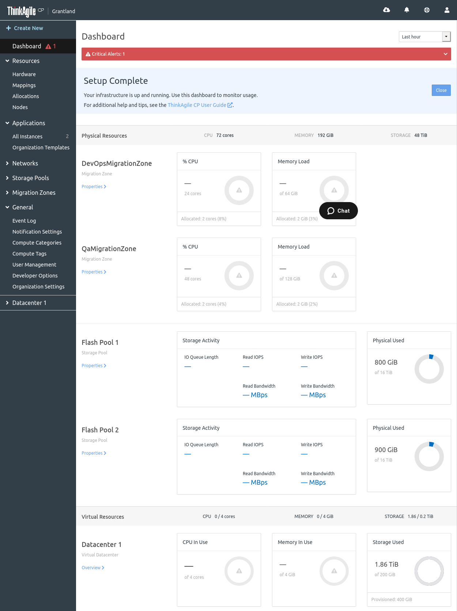{#fig:mwc-app-main}

-----

### mwc-auth-main {#mwc-auth-main}

- class: `AuthMainController`

#### Sample screenshot

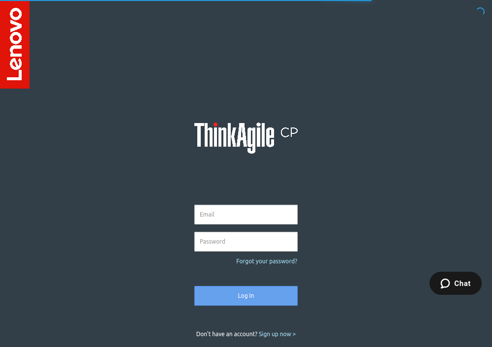{#fig:mwc-auth-main}

-----

## mwc.storage-controller

### mwc-storage-controller-actions-button {#mwc-storage-controller-actions-button}

- class: `StorageControllerActionsButtonComponent`
- used by:
  - [`mwc-storage-controller-properties`](#mwc-storage-controller-properties)
  - [`mwc-storage-slot`](#mwc-storage-slot)

#### Sample screenshot

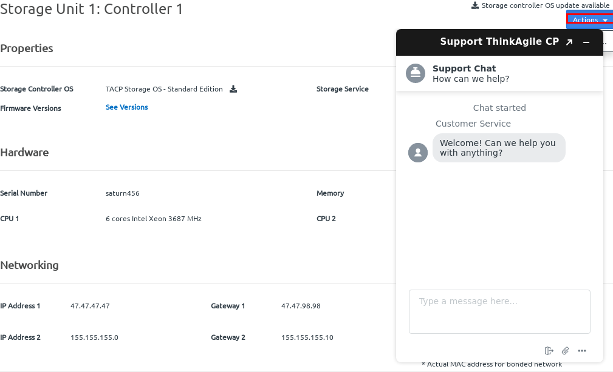{#fig:mwc-storage-controller-actions-button}

-----

### mwc-storage-controller-properties {#mwc-storage-controller-properties}

- class: `StorageControllerPropertiesComponent`
- using:
  - [`mwc-storage-block-status-icon`](#mwc-storage-block-status-icon)
  - [`mwc-firmware-versions`](#mwc-firmware-versions)
  - [`mwc-storage-controller-actions-button`](#mwc-storage-controller-actions-button)
- source file: `/home/fengxia/workspace/lenovo/olympia_ignite/mwc/src/main/webapp/app/storage-controller/components/storage-controller-properties/storage-controller-properties.component.ts`

#### Sample screenshot

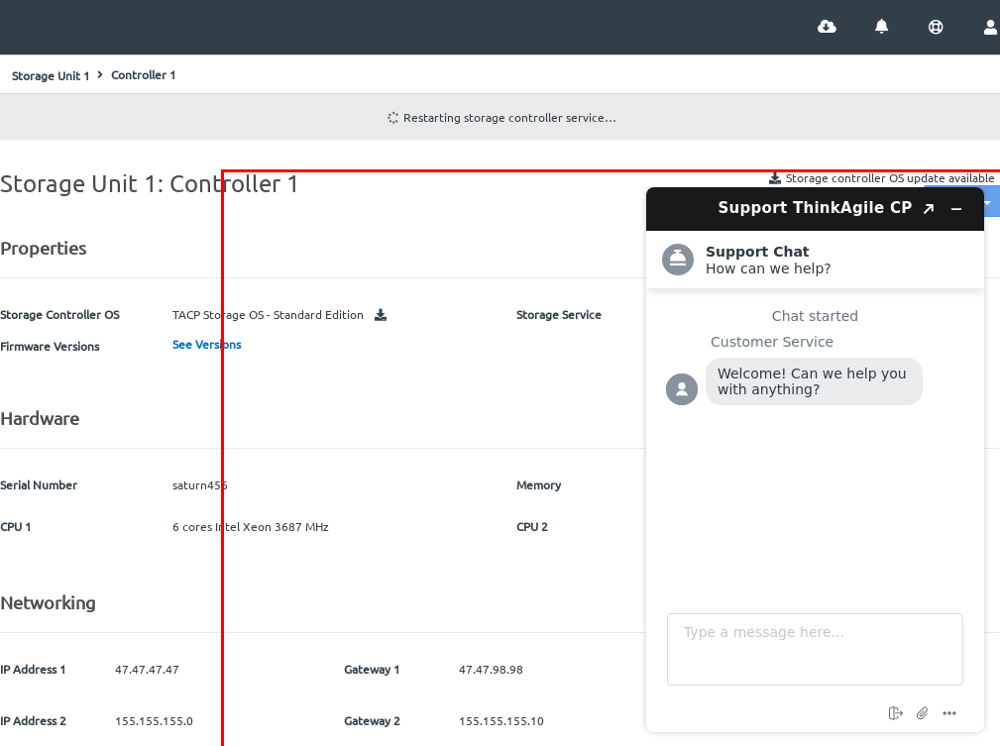{#fig:mwc-storage-controller-properties}

-----

## mwc.application.template

### mwc-application-template {#mwc-application-template}

- class: `ApplicationTemplateComponent`
- using:
  - [`mwc-date-time`](#mwc-date-time)
- source file: `/home/fengxia/workspace/lenovo/olympia_ignite/mwc/src/main/webapp/app/application-template/components/application-template/application-template.component.ts`

#### Sample screenshot

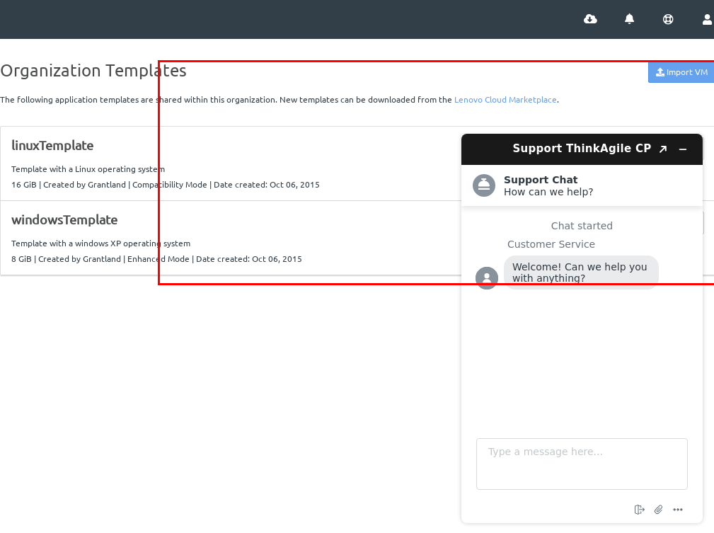{#fig:mwc-application-template}

-----

### mwc-application-template-boot-order-table {#mwc-application-template-boot-order-table}

- class: `MwcApplicationTemplateBootOrderTableComponent`
- used by:
  - [`mwc-edit-application-template-modal`](#mwc-edit-application-template-modal)

#### Sample screenshot

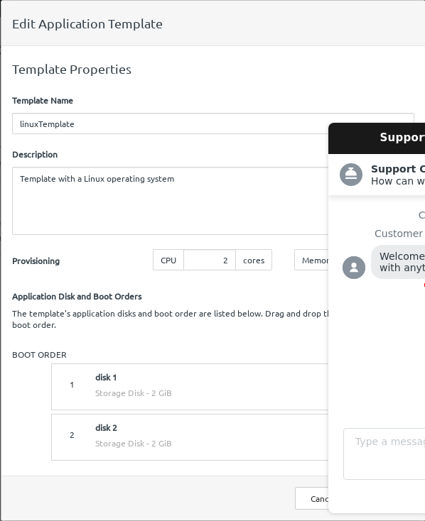{#fig:mwc-application-template-boot-order-table}

-----

### mwc-create-application-template {#mwc-create-application-template}

- class: `CreateApplicationTemplateComponent`
- using:
  - [`mwc-text-area`](#mwc-text-area)
  - [`mwc-answer-file-form`](#mwc-answer-file-form)
  - [`mwc-template-name-input`](#mwc-template-name-input)
  - [`mwc-template-destination-dropdown`](#mwc-template-destination-dropdown)
  - [`mwc-cpu-memory-provision-form`](#mwc-cpu-memory-provision-form)
  - [`mwc-sysprep-configuration`](#mwc-sysprep-configuration)
  - [`mwc-vm-mode-configuration`](#mwc-vm-mode-configuration)
- source file: `/home/fengxia/workspace/lenovo/olympia_ignite/mwc/src/main/webapp/app/application-template/components/create-application-template/create-application-template.component.ts`

#### Sample screenshot

{#fig:mwc-create-application-template}

-----

### mwc-edit-application-template-modal {#mwc-edit-application-template-modal}

- class: `EditApplicationTemplateModalComponent`
- using:
  - [`mwc-text-area`](#mwc-text-area)
  - [`mwc-cpu-memory-provision-form`](#mwc-cpu-memory-provision-form)
  - [`mwc-application-template-boot-order-table`](#mwc-application-template-boot-order-table)
  - [`mwc-template-name-input`](#mwc-template-name-input)
- source file: `/home/fengxia/workspace/lenovo/olympia_ignite/mwc/src/main/webapp/app/application-template/components/edit-application-template-modal/edit-application-template-modal.component.ts`

#### Sample screenshot

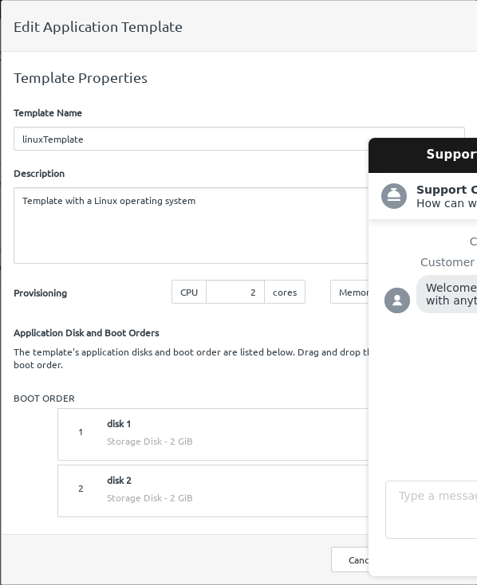{#fig:mwc-edit-application-template-modal}

-----

### mwc-edit-boot-order-modal {#mwc-edit-boot-order-modal}

- class: `EditBootOrderComponent`
- using:
  - [`mwc-boot-order-table`](#mwc-boot-order-table)
- source file: `/home/fengxia/workspace/lenovo/olympia_ignite/mwc/src/main/webapp/app/application-template/components/edit-template-boot-order-modal/edit-template-boot-order-modal.component.ts`

#### Sample screenshot

{#fig:mwc-edit-boot-order-modal}

-----

### mwc-import-application-template-from-vmdk {#mwc-import-application-template-from-vmdk}

- class: `ImportApplicationTemplateFromVmdkComponent`
- using:
  - [`mwc-template-destination-dropdown`](#mwc-template-destination-dropdown)
  - [`mwc-vm-properties`](#mwc-vm-properties)
  - [`mwc-sysprep-configuration`](#mwc-sysprep-configuration)
  - [`mwc-virtio-drivers-configuration`](#mwc-virtio-drivers-configuration)
- source file: `/home/fengxia/workspace/lenovo/olympia_ignite/mwc/src/main/webapp/app/application-template/components/import-application-template-from-vmdk/import-application-template-from-vmdk.component.ts`

#### Sample screenshot

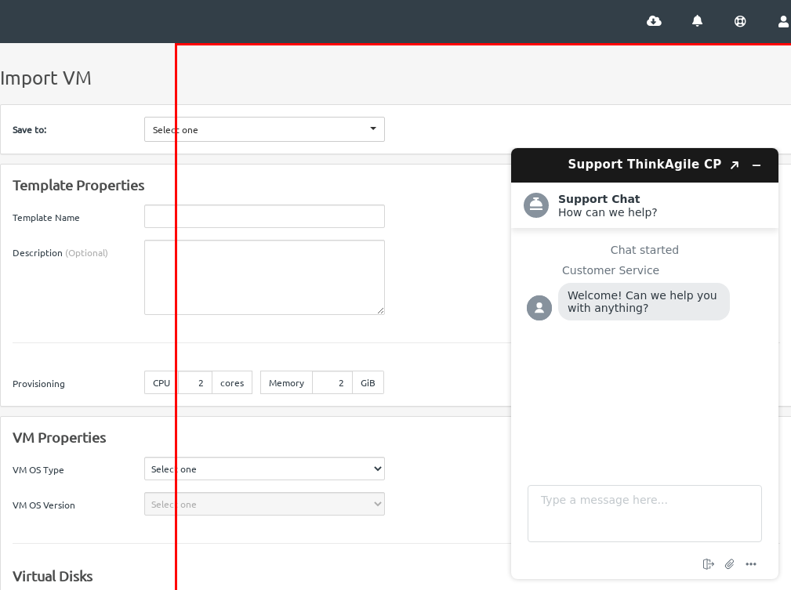{#fig:mwc-import-application-template-from-vmdk}

-----

### mwc-import-application-template-from-vmdk-disk-table {#mwc-import-application-template-from-vmdk-disk-table}

- class: `MwcImportApplicationTemplateFromVmdkDiskTableComponent`
- using:
  - [`mwc-vmdk-examples`](#mwc-vmdk-examples)
- used by:
  - [`mwc-vm-properties`](#mwc-vm-properties)
- source file: `/home/fengxia/workspace/lenovo/olympia_ignite/mwc/src/main/webapp/app/application-template/components/import-application-template-from-vmdk-disk-table/import-application-template-from-vmdk-disk-table.component.ts`

#### Sample screenshot

{#fig:mwc-import-application-template-from-vmdk-disk-table}

-----

### mwc-shared-storage-vmdk-modal {#mwc-shared-storage-vmdk-modal}

- class: `SharedStorageVmdkModalComponent`
- using:
  - [`mwc-volume-form-inputs`](#mwc-volume-form-inputs)
- source file: `/home/fengxia/workspace/lenovo/olympia_ignite/mwc/src/main/webapp/app/application-template/components/shared-storage-vmdk-modal/_shared-storage-vmdk-modal.component.ts`

#### Sample screenshot

{#fig:mwc-shared-storage-vmdk-modal}

-----

### mwc-sysprep-configuration {#mwc-sysprep-configuration}

- class: `MwcApplicationTemplateSysprepConfiguration`
- used by:
  - [`mwc-import-application-template-from-vmdk`](#mwc-import-application-template-from-vmdk)
  - [`mwc-create-application-template`](#mwc-create-application-template)

#### Sample screenshot

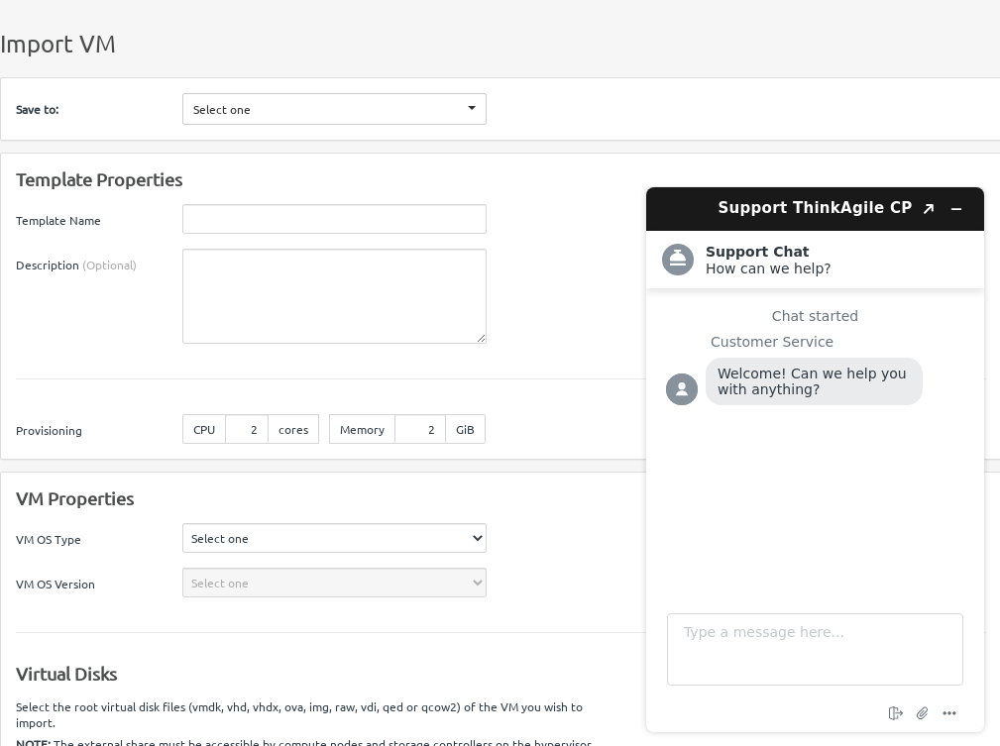{#fig:mwc-sysprep-configuration}

-----

### mwc-template-name-input {#mwc-template-name-input}

- class: `NameInputInboxComponent`
- used by:
  - [`mwc-download-market-template-modal`](#mwc-download-market-template-modal)
  - [`mwc-edit-application-template-modal`](#mwc-edit-application-template-modal)
  - [`mwc-create-application-template`](#mwc-create-application-template)

#### Sample screenshot

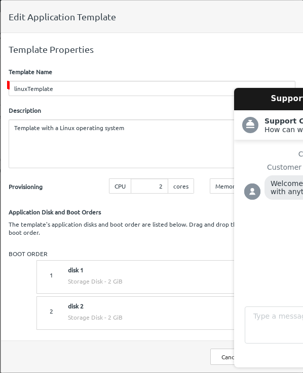{#fig:mwc-template-name-input}

-----

### mwc-vmdk-examples {#mwc-vmdk-examples}

- class: `VmdkExamplesComponent`
- used by:
  - [`mwc-import-application-template-from-vmdk-disk-table`](#mwc-import-application-template-from-vmdk-disk-table)

#### Sample screenshot

{#fig:mwc-vmdk-examples}

-----

### mwc-vm-properties {#mwc-vm-properties}

- class: `VmPropertiesComponent`
- using:
  - [`mwc-import-application-template-from-vmdk-disk-table`](#mwc-import-application-template-from-vmdk-disk-table)
- used by:
  - [`mwc-import-application-template-from-vmdk`](#mwc-import-application-template-from-vmdk)
- source file: `/home/fengxia/workspace/lenovo/olympia_ignite/mwc/src/main/webapp/app/application-template/components/vm-properties/vm-properties.component.ts`

#### Sample screenshot

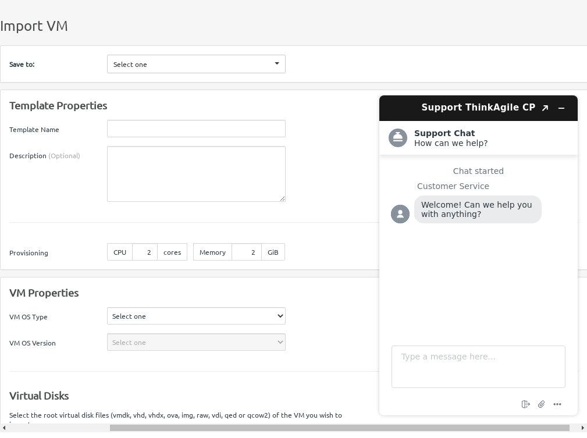{#fig:mwc-vm-properties}

-----

## mwc.dashboard

### mwc-critical-alerts-table {#mwc-critical-alerts-table}

- class: `CriticalAlertsTableComponent`
- using:
  - [`mwc-date-time`](#mwc-date-time)
- used by:
  - [`mwc-dashboard`](#mwc-dashboard)
- source file: `/home/fengxia/workspace/lenovo/olympia_ignite/mwc/src/main/webapp/app/dashboard/components/critical-alerts-table/critical-alerts-table.component.ts`

#### Sample screenshot

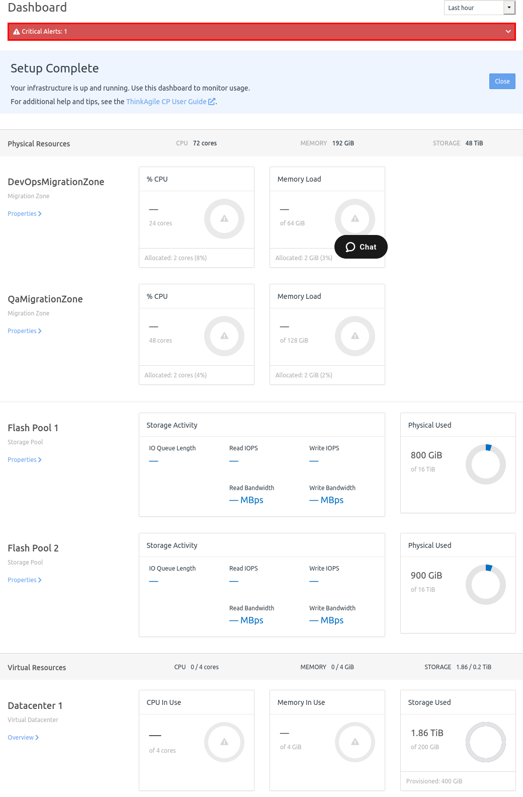{#fig:mwc-critical-alerts-table}

-----

### mwc-flash-pool-activity-details {#mwc-flash-pool-activity-details}

- class: `FlashPoolActivityDetailsComponent`
- used by:
  - [`mwc-dashboard-storage-panels`](#mwc-dashboard-storage-panels)

#### Sample screenshot

{#fig:mwc-flash-pool-activity-details}

-----

### mwc-flash-pool-usage-details {#mwc-flash-pool-usage-details}

- class: `FlashPoolUsageDetailsComponent`
- used by:
  - [`mwc-dashboard-storage-panels`](#mwc-dashboard-storage-panels)

#### Sample screenshot

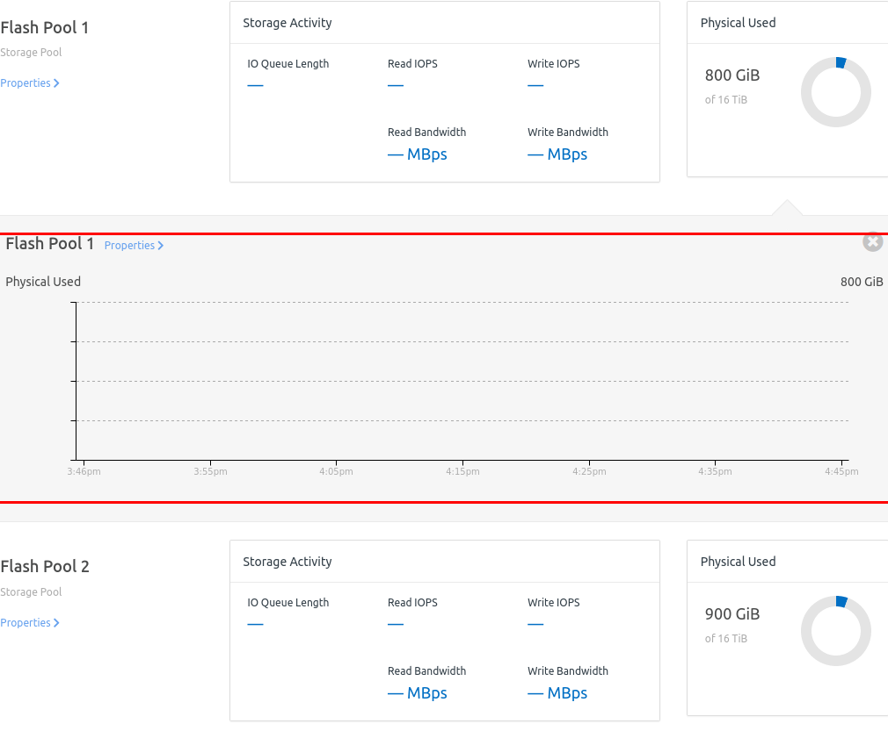{#fig:mwc-flash-pool-usage-details}

-----

### mwc-dashboard-storage-panels {#mwc-dashboard-storage-panels}

- class: `DashboardStoragePanelsComponent`
- using:
  - [`mwc-flash-pool-usage-details`](#mwc-flash-pool-usage-details)
  - [`mwc-flash-pool-activity-details`](#mwc-flash-pool-activity-details)
- used by:
  - [`mwc-dashboard`](#mwc-dashboard)
- source file: `/home/fengxia/workspace/lenovo/olympia_ignite/mwc/src/main/webapp/app/dashboard/components/flash-pool/storage-panels/storage-panels.component.ts`

#### Sample screenshot

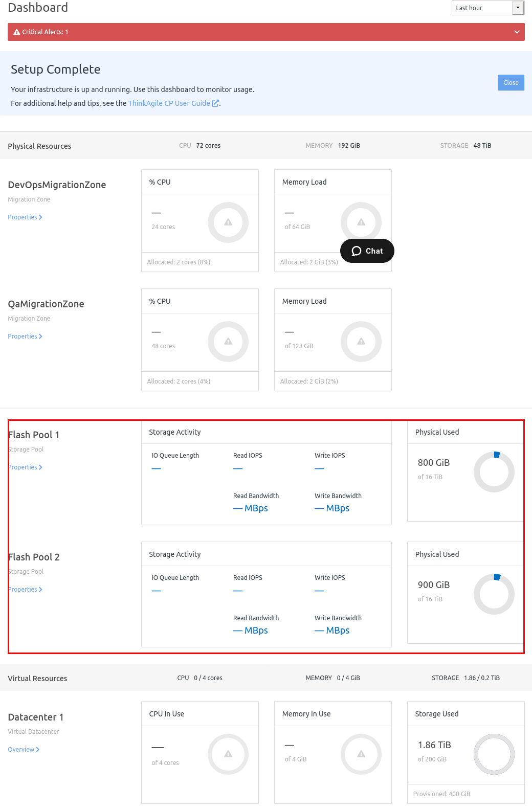{#fig:mwc-dashboard-storage-panels}

-----

### mwc-migration-zone-panel {#mwc-migration-zone-panel}

- class: `MigrationZonePanelComponent`
- using:
  - [`mwc-migration-zone-details`](#mwc-migration-zone-details)
- used by:
  - [`mwc-dashboard`](#mwc-dashboard)
- source file: `/home/fengxia/workspace/lenovo/olympia_ignite/mwc/src/main/webapp/app/dashboard/components/migration-zone-panel/migration-zone-panel.component.ts`

#### Sample screenshot

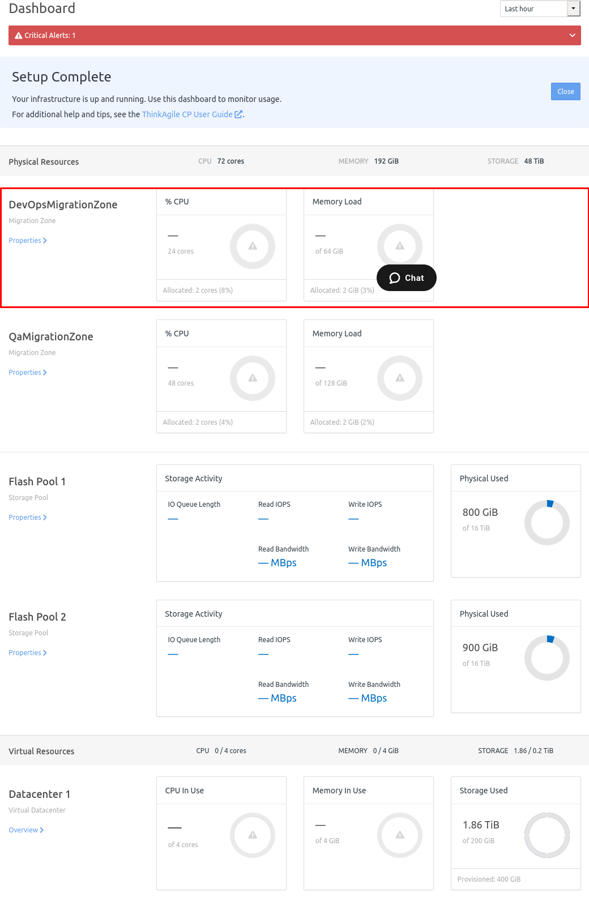{#fig:mwc-migration-zone-panel}

-----

### mwc-migration-zone-details {#mwc-migration-zone-details}

- class: `MigrationZoneDetailsComponent`
- used by:
  - [`mwc-migration-zone-panel`](#mwc-migration-zone-panel)

#### Sample screenshot

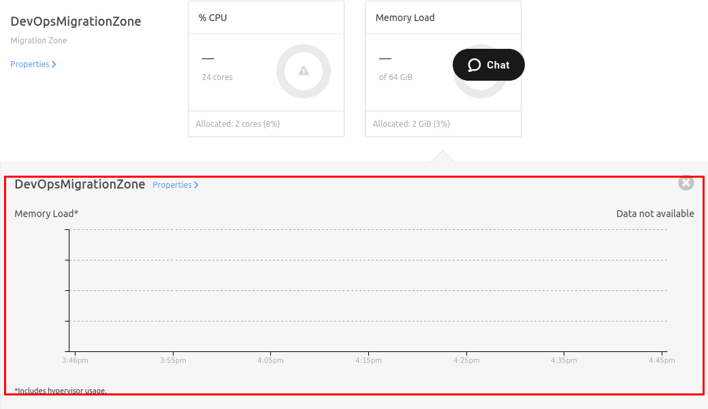{#fig:mwc-migration-zone-details}

-----

### mwc-dashboard {#mwc-dashboard}

- class: `DashboardComponent`
- using:
  - [`mwc-onboarding-stage-panel`](#mwc-onboarding-stage-panel)
  - [`mwc-migration-zone-panel`](#mwc-migration-zone-panel)
  - [`mwc-dashboard-storage-panels`](#mwc-dashboard-storage-panels)
  - [`mwc-datacenter-panel`](#mwc-datacenter-panel)
  - [`mwc-critical-alerts-table`](#mwc-critical-alerts-table)
- source file: `/home/fengxia/workspace/lenovo/olympia_ignite/mwc/src/main/webapp/app/dashboard/components/dashboard/dashboard.component.ts`

#### Sample screenshot

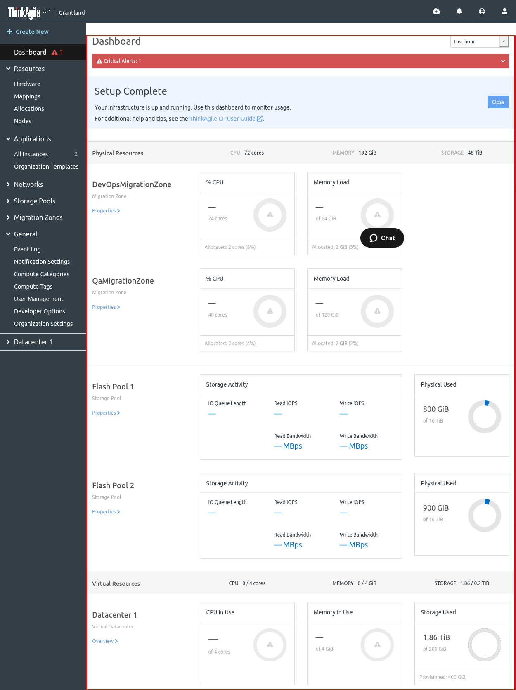{#fig:mwc-dashboard}

-----

### mwc-datacenter-panel {#mwc-datacenter-panel}

- class: `DatacenterPanelComponent`
- using:
  - [`mwc-datacenter-details`](#mwc-datacenter-details)
- used by:
  - [`mwc-dashboard`](#mwc-dashboard)
- source file: `/home/fengxia/workspace/lenovo/olympia_ignite/mwc/src/main/webapp/app/dashboard/components/datacenter-panel/datacenter-panel.component.ts`

#### Sample screenshot

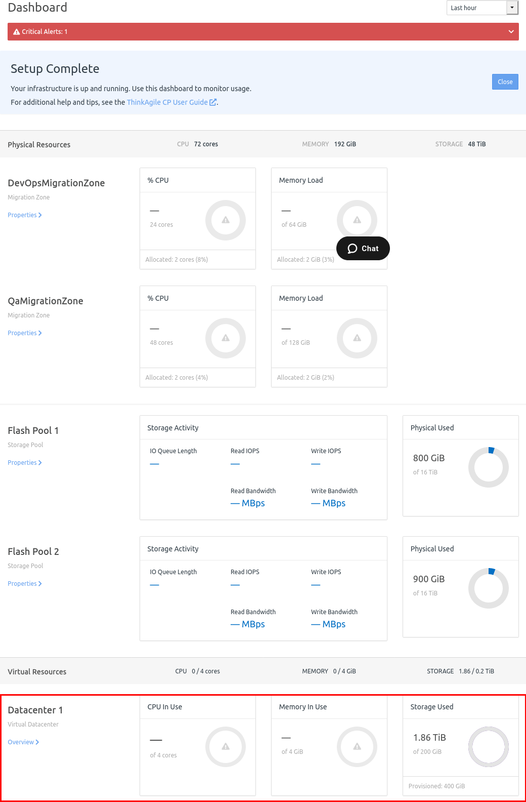{#fig:mwc-datacenter-panel}

-----

### mwc-datacenter-details {#mwc-datacenter-details}

- class: `DatacenterDetailsComponent`
- used by:
  - [`mwc-datacenter-panel`](#mwc-datacenter-panel)

#### Sample screenshot

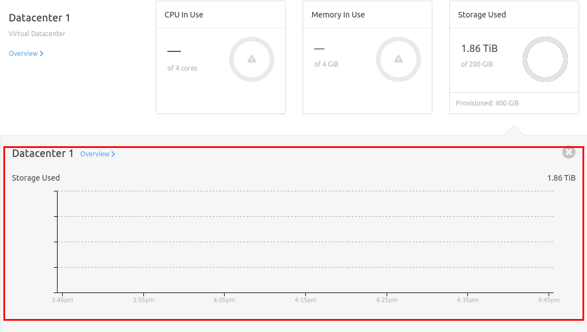{#fig:mwc-datacenter-details}

-----

### mwc-onboarding-stage-panel {#mwc-onboarding-stage-panel}

- class: `OnboardingStagePanelComponent`
- used by:
  - [`mwc-dashboard`](#mwc-dashboard)

#### Sample screenshot

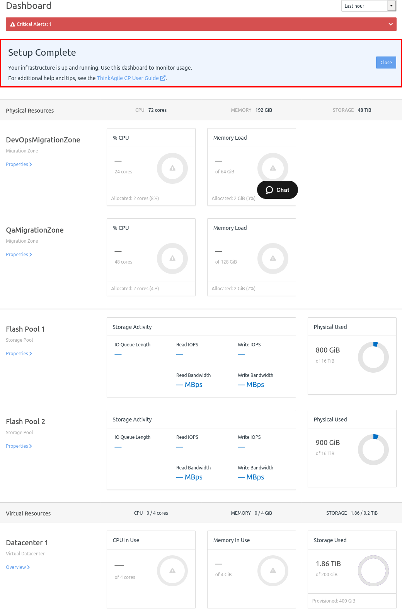{#fig:mwc-onboarding-stage-panel}

-----

## mwc.firewall-profile

### mwc-create-firewall {#mwc-create-firewall}

- class: `CreateFirewallComponent`
- using:
  - [`mwc-edit-firewall-rules-table`](#mwc-edit-firewall-rules-table)
- source file: `/home/fengxia/workspace/lenovo/olympia_ignite/mwc/src/main/webapp/app/firewall-profile/components/create/create-firewall.component.ts`

#### Sample screenshot

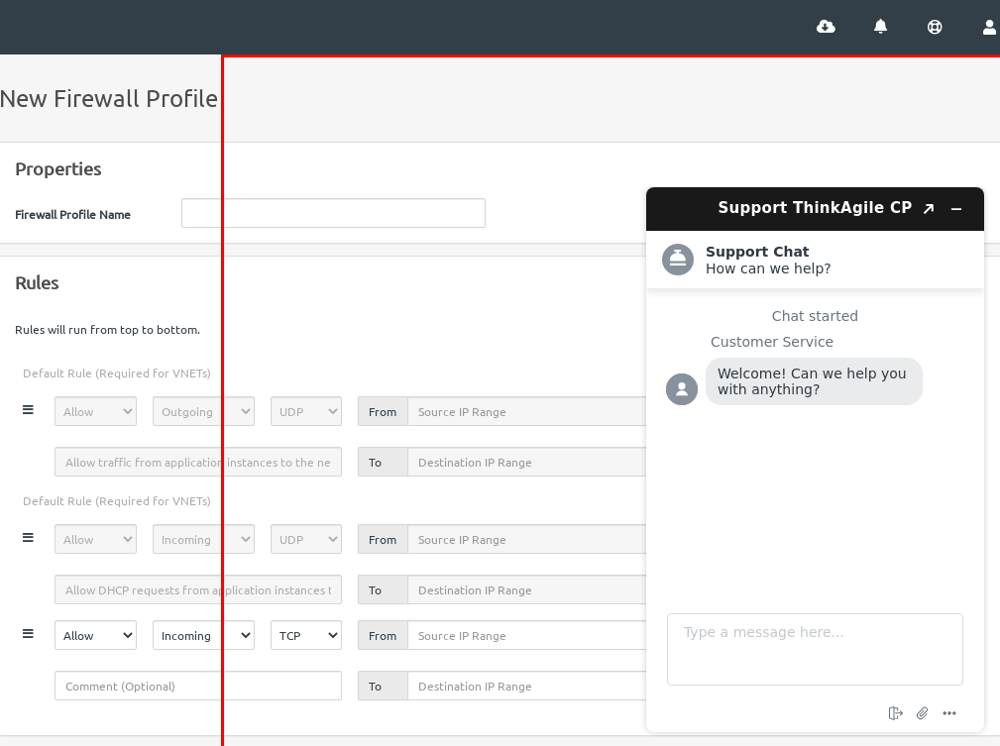{#fig:mwc-create-firewall}

-----

### mwc-edit-firewall-profile {#mwc-edit-firewall-profile}

- class: `EditFirewallProfileComponent`
- using:
  - [`mwc-edit-firewall-rules-table`](#mwc-edit-firewall-rules-table)
- source file: `/home/fengxia/workspace/lenovo/olympia_ignite/mwc/src/main/webapp/app/firewall-profile/components/edit/edit-firewall-profile.component.ts`

#### Sample screenshot

-----

### mwc-edit-firewall-rules-table {#mwc-edit-firewall-rules-table}

- class: `EditRulesTableComponent`
- used by:
  - [`mwc-edit-firewall-profile`](#mwc-edit-firewall-profile)
  - [`mwc-create-firewall`](#mwc-create-firewall)

#### Sample screenshot

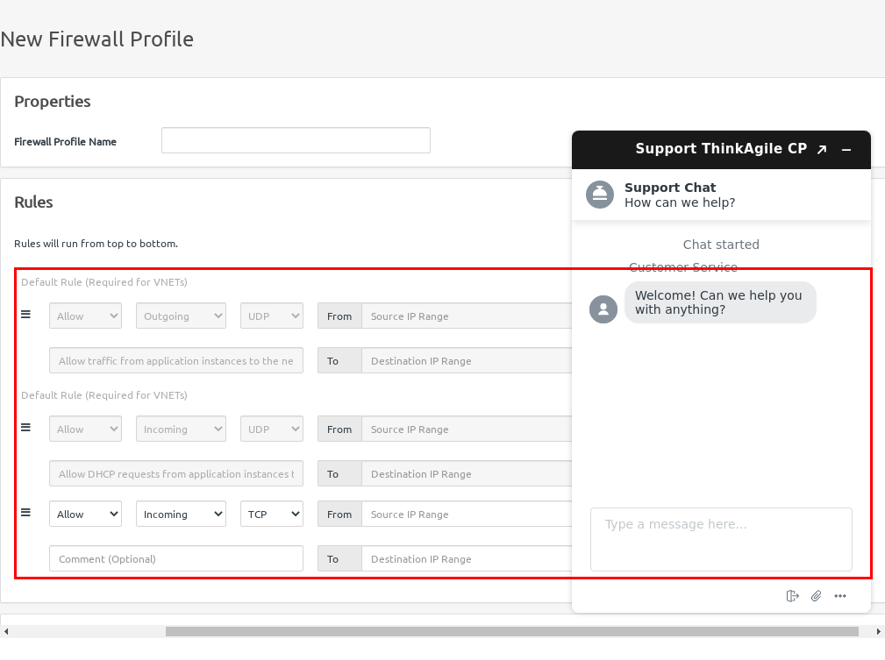{#fig:mwc-edit-firewall-rules-table}

-----

### mwc-firewall-actions-button {#mwc-firewall-actions-button}

- class: `ActionsButtonComponent`
- used by:
  - [`mwc-firewall-profile-properties`](#mwc-firewall-profile-properties)
  - [`mwc-firewall-override-table`](#mwc-firewall-override-table)
  - [`mwc-firewall-override-properties`](#mwc-firewall-override-properties)
  - [`mwc-firewall-profile-table`](#mwc-firewall-profile-table)

#### Sample screenshot

-----

### mwc-firewall-confirmation-modal {#mwc-firewall-confirmation-modal}

- class: `FirewallConfirmationModalComponent`

#### Sample screenshot

-----

### mwc-firewall-profile-list {#mwc-firewall-profile-list}

- class: `FirewallProfileListComponent`
- using:
  - [`mwc-firewall-profile-table`](#mwc-firewall-profile-table)
- source file: `/home/fengxia/workspace/lenovo/olympia_ignite/mwc/src/main/webapp/app/firewall-profile/components/firewall-profiles/list/firewall-profile-list.component.ts`

#### Sample screenshot

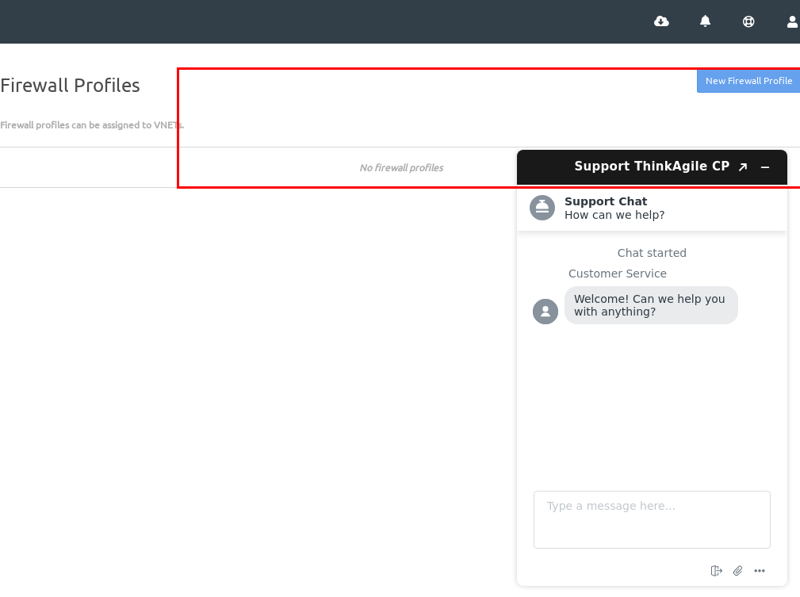{#fig:mwc-firewall-profile-list}

-----

### mwc-firewall-profile-properties {#mwc-firewall-profile-properties}

- class: `FirewallPropertiesComponent`
- using:
  - [`mwc-view-firewall-rules-table`](#mwc-view-firewall-rules-table)
  - [`mwc-network-table`](#mwc-network-table)
  - [`mwc-firewall-actions-button`](#mwc-firewall-actions-button)
- source file: `/home/fengxia/workspace/lenovo/olympia_ignite/mwc/src/main/webapp/app/firewall-profile/components/firewall-profiles/firewall-profile-properties/firewall-profile-properties.component.ts`

#### Sample screenshot

-----

### mwc-firewall-profile-table {#mwc-firewall-profile-table}

- class: `FirewallProfileTableComponent`
- using:
  - [`mwc-firewall-actions-button`](#mwc-firewall-actions-button)
- used by:
  - [`mwc-firewall-profile-list`](#mwc-firewall-profile-list)
- source file: `/home/fengxia/workspace/lenovo/olympia_ignite/mwc/src/main/webapp/app/firewall-profile/components/firewall-profiles/firewall-profile-table/firewall-profile-table.component.ts`

#### Sample screenshot

-----

### mwc-firewall-view-rules-modal {#mwc-firewall-view-rules-modal}

- class: `ViewRulesModalComponent`
- using:
  - [`mwc-view-firewall-rules-table`](#mwc-view-firewall-rules-table)
- source file: `/home/fengxia/workspace/lenovo/olympia_ignite/mwc/src/main/webapp/app/firewall-profile/components/view-rules-modal/firewall-rules-modal.component.ts`

#### Sample screenshot

-----

### mwc-view-firewall-rules-table {#mwc-view-firewall-rules-table}

- class: `ViewRulesTableComponent`
- used by:
  - [`mwc-firewall-profile-properties`](#mwc-firewall-profile-properties)
  - [`mwc-firewall-override-properties`](#mwc-firewall-override-properties)
  - [`mwc-firewall-view-rules-modal`](#mwc-firewall-view-rules-modal)

#### Sample screenshot

-----

## mwc.host

### mwc-application-action-plan-table-for-hosts {#mwc-application-action-plan-table-for-hosts}

- class: `MwcApplicationActionPlanTableForHostsComponent`
- using:
  - [`mwc-application-compute-constraints`](#mwc-application-compute-constraints)
- used by:
  - [`mwc-remove-host-tag-modal`](#mwc-remove-host-tag-modal)
  - [`mwc-power-off-host-modal`](#mwc-power-off-host-modal)
  - [`mwc-host-restart-modal`](#mwc-host-restart-modal)
  - [`mwc-host-enable-maintenance-mode-modal`](#mwc-host-enable-maintenance-mode-modal)
- source file: `/home/fengxia/workspace/lenovo/olympia_ignite/mwc/src/main/webapp/app/host/components/application-action-plan-table-for-hosts/application-action-plan-table-for-hosts.component.ts`

#### Sample screenshot

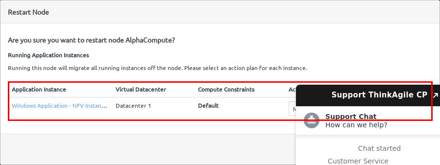{#fig:mwc-application-action-plan-table-for-hosts}

-----

### mwc-edit-host-category-modal {#mwc-edit-host-category-modal}

- class: `EditHostCategoryModalComponentComponent`

#### Sample screenshot

-----

### mwc-host {#mwc-host}

- class: `HostComponent`
- using:
  - [`mwc-host-resource-table`](#mwc-host-resource-table)
- source file: `/home/fengxia/workspace/lenovo/olympia_ignite/mwc/src/main/webapp/app/host/components/host/host.component.ts`

#### Sample screenshot

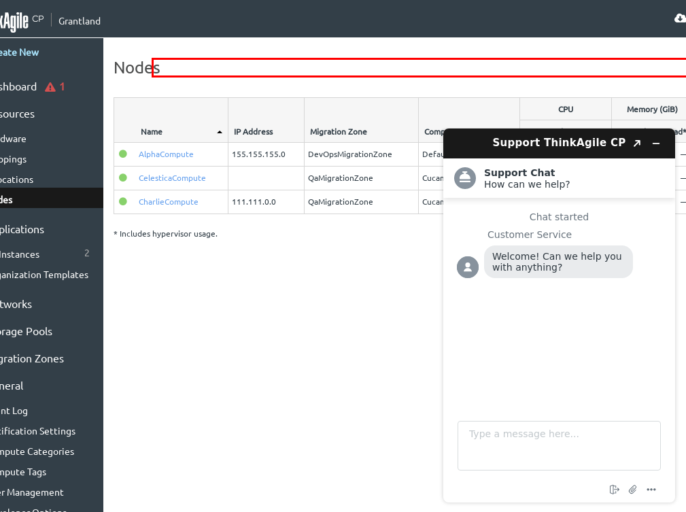{#fig:mwc-host}

-----

### mwc-host-actions-button {#mwc-host-actions-button}

- class: `HostActionsButtonComponent`
- used by:
  - [`mwc-host-properties`](#mwc-host-properties)
  - [`mwc-compute-slot`](#mwc-compute-slot)
  - [`mwc-host-resource-table`](#mwc-host-resource-table)

#### Sample screenshot

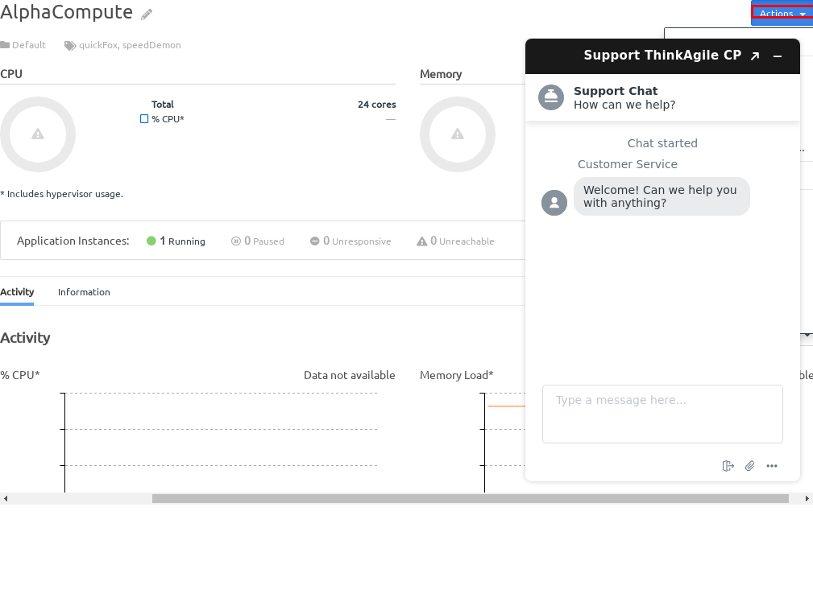{#fig:mwc-host-actions-button}

-----

### mwc-host-activity-tab {#mwc-host-activity-tab}

- class: `HostActivityTabComponent`

#### Sample screenshot

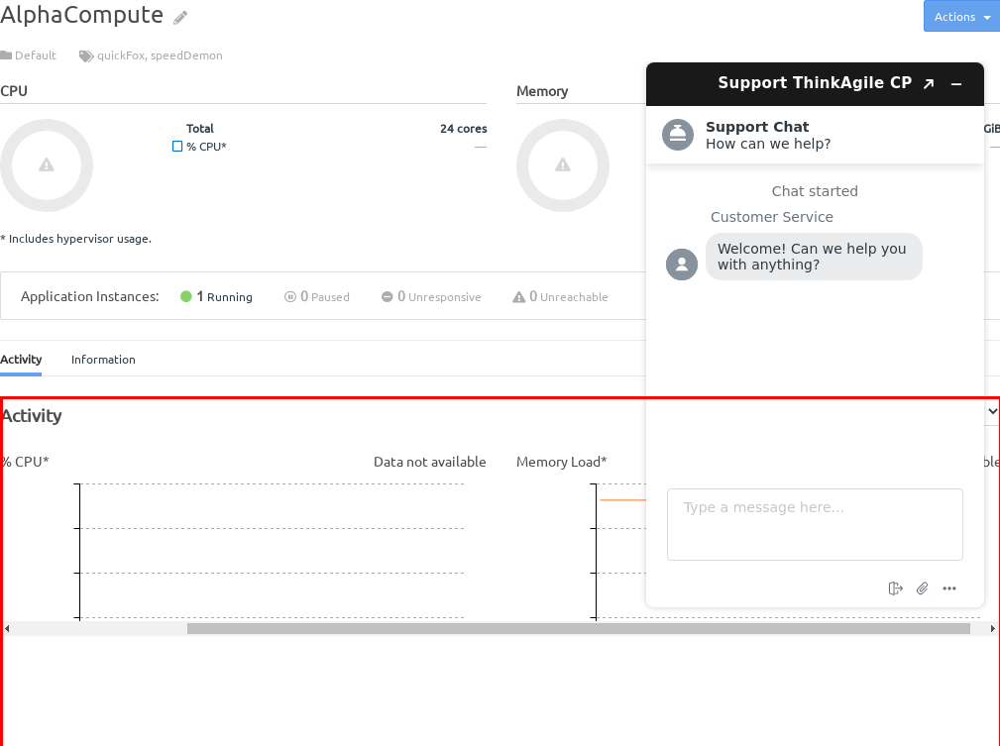{#fig:mwc-host-activity-tab}

-----

### mwc-host-console-button {#mwc-host-console-button}

- class: `HostConsoleButtonComponent`

#### Sample screenshot

{#fig:mwc-host-console-button}

-----

### mwc-host-disable-maintenance-mode-modal {#mwc-host-disable-maintenance-mode-modal}

- class: `HostDisableMaintenanceModeModalComponent`

#### Sample screenshot

{#fig:mwc-host-disable-maintenance-mode-modal}

-----

### mwc-host-enable-maintenance-mode-modal {#mwc-host-enable-maintenance-mode-modal}

- class: `HostEnableMaintenanceModeModalComponent`
- using:
  - [`mwc-application-action-plan-table-for-hosts`](#mwc-application-action-plan-table-for-hosts)
- source file: `/home/fengxia/workspace/lenovo/olympia_ignite/mwc/src/main/webapp/app/host/components/host-enable-maintance-mode-modal/host-enable-maintenance-mode-modal.component.ts`

#### Sample screenshot

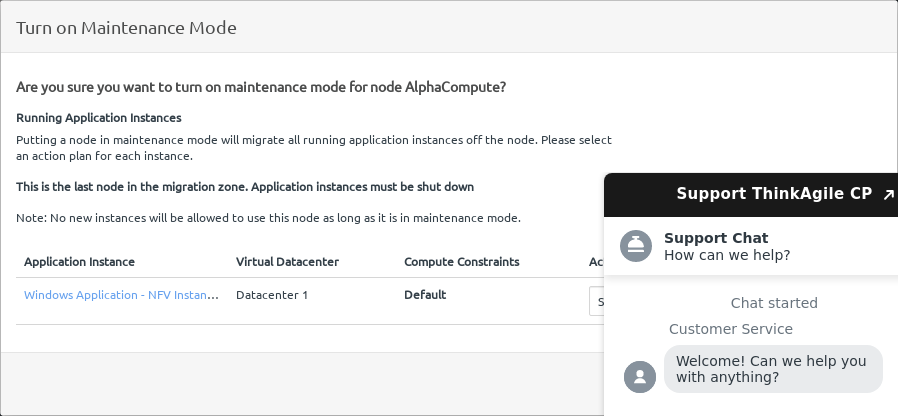{#fig:mwc-host-enable-maintenance-mode-modal}

-----

### mwc-host-properties {#mwc-host-properties}

- class: `HostPropertiesComponent`
- using:
  - [`mwc-compute-block-status-icon`](#mwc-compute-block-status-icon)
  - [`mwc-host-actions-button`](#mwc-host-actions-button)
  - [`mwc-version-update-available-icons`](#mwc-version-update-available-icons)
  - [`mwc-application-summary-panel`](#mwc-application-summary-panel)
- source file: `/home/fengxia/workspace/lenovo/olympia_ignite/mwc/src/main/webapp/app/host/components/host-properties/host-properties.component.ts`

#### Sample screenshot

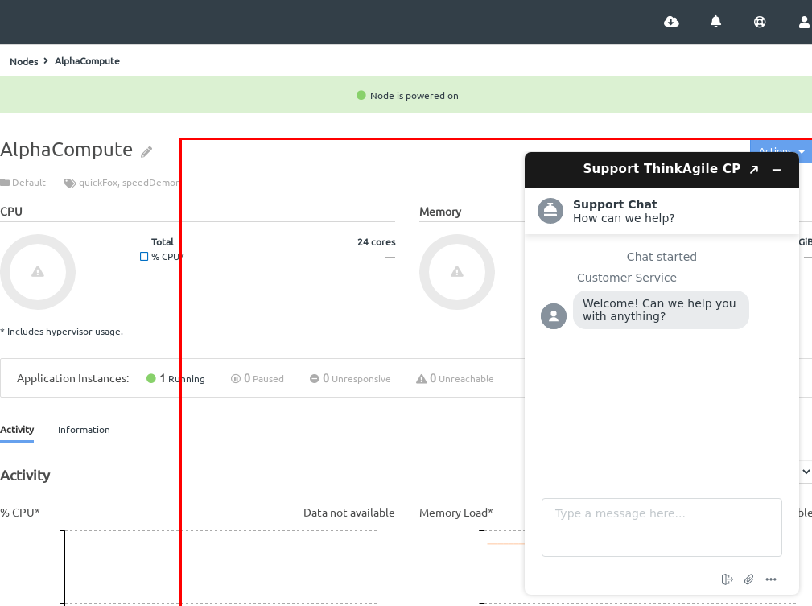{#fig:mwc-host-properties}

-----

### mwc-host-properties-tab {#mwc-host-properties-tab}

- class: `HostPropertiesTabComponent`
- using:
  - [`mwc-firmware-versions`](#mwc-firmware-versions)
  - [`mwc-version-update-available-icons`](#mwc-version-update-available-icons)
  - [`mwc-date-time`](#mwc-date-time)
- source file: `/home/fengxia/workspace/lenovo/olympia_ignite/mwc/src/main/webapp/app/host/components/host-properties-tab/host-properties-tab.component.ts`

#### Sample screenshot

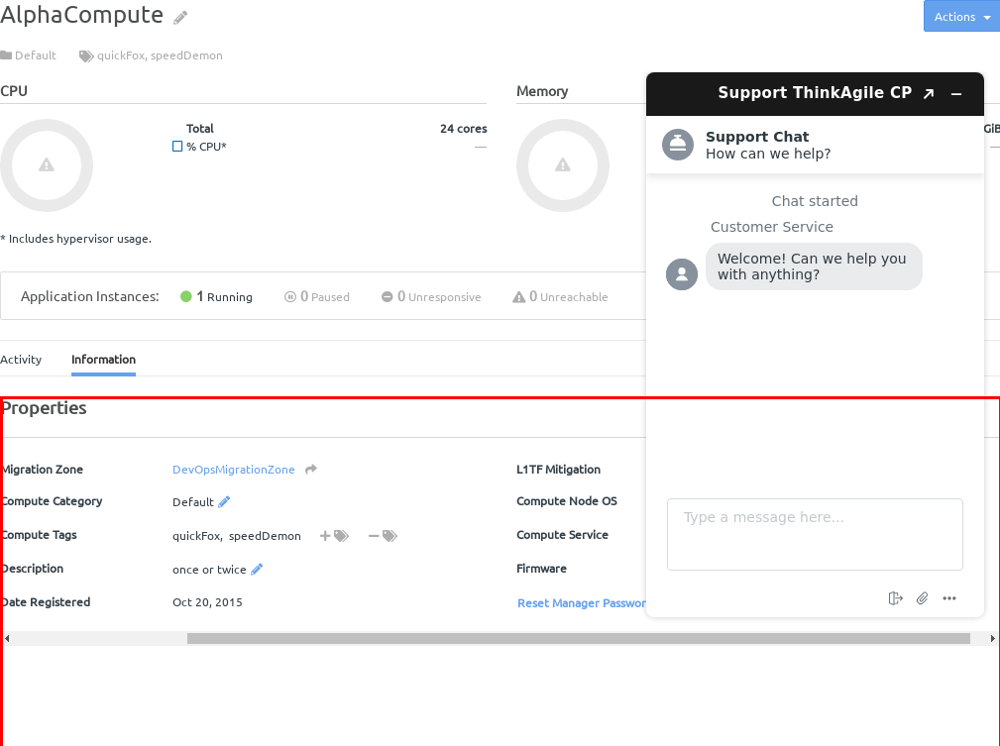{#fig:mwc-host-properties-tab}

-----

### mwc-host-resource-table {#mwc-host-resource-table}

- class: `HostResourceTableComponent`
- using:
  - [`mwc-compute-block-status-icon`](#mwc-compute-block-status-icon)
  - [`mwc-host-actions-button`](#mwc-host-actions-button)
- used by:
  - [`mwc-migration-zone-resource-tab`](#mwc-migration-zone-resource-tab)
  - [`mwc-host`](#mwc-host)
- source file: `/home/fengxia/workspace/lenovo/olympia_ignite/mwc/src/main/webapp/app/host/components/host-resource-table/host-resource-table.component.ts`

#### Sample screenshot

{#fig:mwc-host-resource-table}

-----

### mwc-host-restart-modal {#mwc-host-restart-modal}

- class: `HostRestartModalComponent`
- using:
  - [`mwc-application-action-plan-table-for-hosts`](#mwc-application-action-plan-table-for-hosts)
- source file: `/home/fengxia/workspace/lenovo/olympia_ignite/mwc/src/main/webapp/app/host/components/host-restart-modal/host-restart-modal.component.ts`

#### Sample screenshot

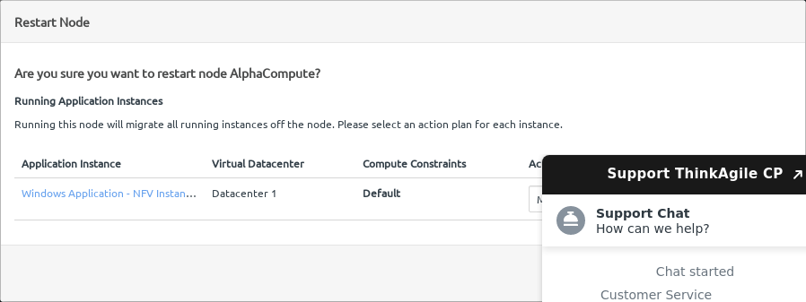{#fig:mwc-host-restart-modal}

-----

### mwc-move-host-modal-component {#mwc-move-host-modal-component}

- class: `MoveHostModalComponent`

#### Sample screenshot

-----

### mwc-power-off-host-modal {#mwc-power-off-host-modal}

- class: `MwcPowerOffHostModalComponent`
- using:
  - [`mwc-application-action-plan-table-for-hosts`](#mwc-application-action-plan-table-for-hosts)
- source file: `/home/fengxia/workspace/lenovo/olympia_ignite/mwc/src/main/webapp/app/host/components/power-off-host-modal/power-off-host-modal.component.ts`

#### Sample screenshot

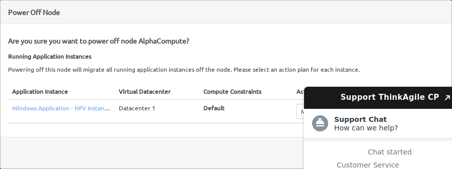{#fig:mwc-power-off-host-modal}

-----

### mwc-remove-host-tag-modal {#mwc-remove-host-tag-modal}

- class: `MwcRemoveHostTagModalComponent`
- using:
  - [`mwc-application-action-plan-table-for-hosts`](#mwc-application-action-plan-table-for-hosts)
- source file: `/home/fengxia/workspace/lenovo/olympia_ignite/mwc/src/main/webapp/app/host/components/remove-host-tag-modal/remove-host-tag-modal.component.ts`

#### Sample screenshot

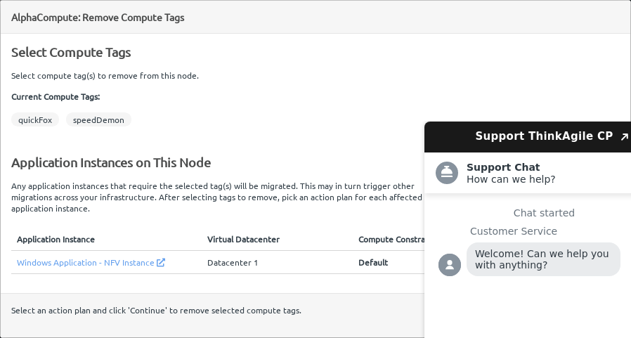{#fig:mwc-remove-host-tag-modal}

-----

## mwc.application.marketplace

### mwc-add-application-templates-modal {#mwc-add-application-templates-modal}

- class: `AddApplicationTemplatesModalComponent`

#### Sample screenshot

-----

### mwc-application-marketplace {#mwc-application-marketplace}

- class: `ApplicationMarketplaceComponent`
- using:
  - [`mwc-marketplace-sidebar-component`](#mwc-marketplace-sidebar-component)
  - [`mwc-marketplace-filter-list-component`](#mwc-marketplace-filter-list-component)
  - [`mwc-application-marketplace-templates`](#mwc-application-marketplace-templates)
  - [`mwc-navigation-banner`](#mwc-navigation-banner)
  - [`mwc-no-access`](#mwc-no-access)
- source file: `/home/fengxia/workspace/lenovo/olympia_ignite/mwc/src/main/webapp/app/application-marketplace/components/application-marketplace/application-marketplace.ts`

#### Sample screenshot

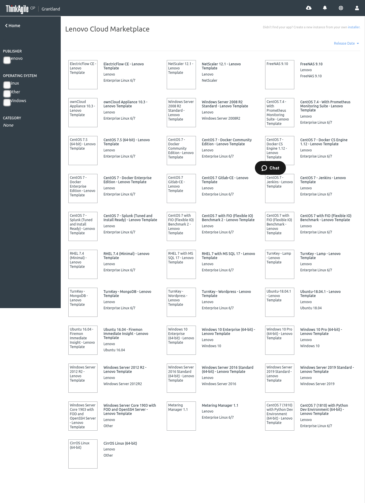{#fig:mwc-application-marketplace}

-----

### mwc-application-marketplace-templates {#mwc-application-marketplace-templates}

- class: `MwcApplicationMarketplaceTemplatesComponent`
- used by:
  - [`mwc-application-marketplace`](#mwc-application-marketplace)

#### Sample screenshot

{#fig:mwc-application-marketplace-templates}

-----

### mwc-download-market-template-modal {#mwc-download-market-template-modal}

- class: `DownloadMarketplaceTemplateModalComponent`
- using:
  - [`mwc-template-destination-dropdown`](#mwc-template-destination-dropdown)
  - [`mwc-text-area`](#mwc-text-area)
  - [`mwc-cpu-memory-provision-form`](#mwc-cpu-memory-provision-form)
  - [`mwc-template-name-input`](#mwc-template-name-input)
- source file: `/home/fengxia/workspace/lenovo/olympia_ignite/mwc/src/main/webapp/app/application-marketplace/components/download-marketplace-template-modal/download-marketplace-template-modal.component.ts`

#### Sample screenshot

{#fig:mwc-download-market-template-modal}

-----

### mwc-marketplace-filter-list-component {#mwc-marketplace-filter-list-component}

- class: `MwcMarketplaceFilterListComponent`
- used by:
  - [`mwc-application-marketplace`](#mwc-application-marketplace)

#### Sample screenshot

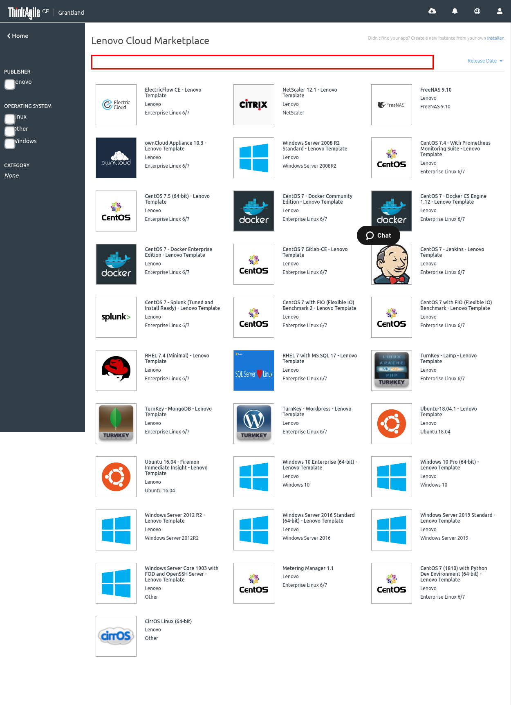{#fig:mwc-marketplace-filter-list-component}

-----

### mwc-marketplace-sidebar-component {#mwc-marketplace-sidebar-component}

- class: `MwcMarketplaceSidebarComponent`
- used by:
  - [`mwc-application-marketplace`](#mwc-application-marketplace)

#### Sample screenshot

{#fig:mwc-marketplace-sidebar-component}

-----

### mwc-template-info-modal {#mwc-template-info-modal}

- class: `TemplateInfoModalComponent`
- using:
  - [`mwc-date-time`](#mwc-date-time)
- source file: `/home/fengxia/workspace/lenovo/olympia_ignite/mwc/src/main/webapp/app/application-marketplace/components/template-info-modal/template-info-modal.component.ts`

#### Sample screenshot

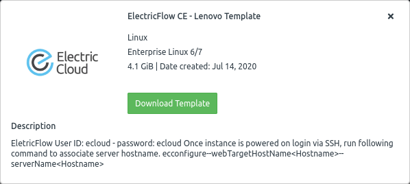{#fig:mwc-template-info-modal}

-----
